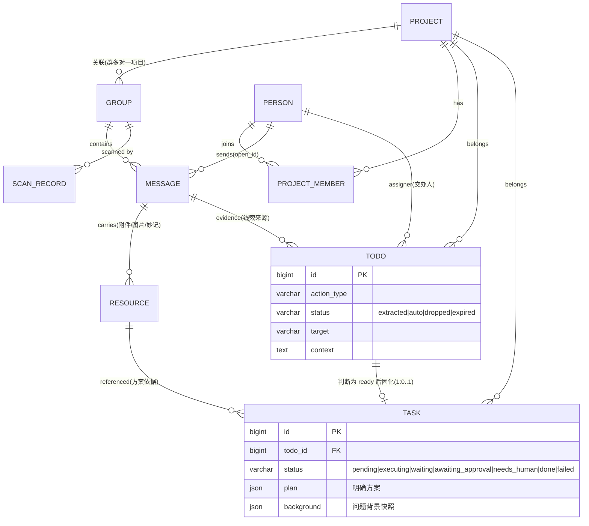

# Jarvis · 基于飞书的本地个人 AI 管家 · 技术方案总纲

> 本文是全系统的**顶层设计与跨模块契约**。各模块细化文档见 `docs/modules/01~05`。
> 定位：字节研发工程师 `chujiejie.1` 在本地 Mac 可信环境运行的私人 AI 管家——自动从飞书消息识别 leader 交办 / 项目讨论，提取行动线索，判断值不值得做后固化为明确任务并执行。

---

## 0. 设计原则（全局，所有模块遵守）

1. **本地可信环境**：全部数据（消息、open_id、密钥）明文存储，不加密、不脱敏。操作明文密钥时仅提示风险。
2. **fail-fast**：暴露问题，不静默降级、不掩盖，尤其单测。
3. **不乱兼容历史数据 / 不乱加 fallback**：涉及历史数据处理、降级、护栏的地方，一律标注 **【需与用户确认】**，不擅自实现。
4. **模块化 + 高维视角**：先按模块和边界拆清楚，从更高维度判断合理性，再进实现细节。
5. **优先用官方能力**：飞书用 `lark-cli`；Go 侧用字节已有基建（bytedgorm 等）；不自造轮子。
6. **复杂度红线（MVP 优先，先简单）**：本系统是**单用户、几十个群、低频触发**的个人助手，规模很小。**任何为"大规模 / 高并发 / 智能记忆"提前引入的重型设施，价值未被验证前一律不做**——能用一条 SQL / 一次 LLM 调用 / 一个内存结构解决的，就不要上向量库、独立进程、多级调度。具体"简单做 / 暂缓上"的清单见 §12，属**硬约束**，各模块不得擅自加重。

---

## 1. 技术栈（本次调整已定稿）

| 层 | 选型 | 说明 |
|---|---|---|
| 后端语言 | **Go 1.26** | 本机 `go1.26.4` |
| Web 框架 | **Hertz**（CloudWeGo，`v0.10.5`） | 管理后台 REST API + 内部接口 |
| ORM | **GORM**（`gorm.io/gorm` + MySQL driver） | MySQL 访问；不引入 bytedgorm，保持本地纯净 |
| 定时调度 | **robfig/cron v3** | 分层扫描、离线事实抽取、过期扫描（替代原 APScheduler） |
| 结构化存储 | **MySQL 8**（InnoDB / utf8mb4） | 7 实体 + 消息明文，source of truth |
| 事实层 | **离线事实引擎**（Go，`internal/factengine`）+ `fact` 表 | 见 §5 |
| 向量库 | **Qdrant v1.18.2**（Apple Silicon 原生二进制 + launchd，HTTP 6333 / gRPC 6334） | 只服务 M3 的 `todo_semantic` 去重；不使用嵌入式 local mode |
| LLM 抽取（M3） | **codex CLI**（`extract.engine=codex`，主）/ model API（可配置，备用） | 【2026-07 变更，见 `docs/design-context-pipeline.md`】M3 改用 codex 以便自跑 lark-cli/bytedcli/git 推算项目归属；model API 保留备用。离线事实抽取用 traex/DeepSeek-V4-Flash，embedding 只用于 Todo 去重。 |
| LLM 判断（M5 判断环节） | **codex CLI**（`codex exec` 子进程） | 判断线索值不值得做，见 §6 |
| 代码执行后端（M5） | **codex CLI** / cursor-agent | `code_change` executor 后端 |
| 前端 | React + Vite + Ant Design | 管理后台 |
| 进程托管 | macOS **launchd** | 常驻，参考本机 `llm-agent-core` 做法 |

> **明确不用 Eino**：Jarvis 是独立本地单体，LLM 调用只有两种形态——① 高频抽取直接调 model API（HTTP）；② 复杂决策/代码执行走 codex CLI 子进程。不引入 Eino/Kitex 等编排框架，保持轻量。
> **与已有仓库的关系**：`llm_agent_core` / `llm_backstage_agent`（Kitex+Eino 线上 runtime）仅作环境参考，Jarvis 不复用其框架栈。

### 1.1 进程拓扑

```
┌──────────────────────────────────────────────────────────────┐
│  React 管理后台 (M0, Vite)                                      │
└───────────────────────────┬──────────────────────────────────┘
                            │ HTTP/JSON
┌───────────────────────────▼──────────────────────────────────┐
│  jarvis-server (Go / Hertz)  —— 单体进程，launchd 托管           │
│  ┌────────────┬────────────┬────────────┬───────────────────┐ │
│  │ REST API   │ cron 调度  │ 流水线编排  │ 领域服务(7 实体)    │ │
│  │ (M0/各模块) │(scan/fact) │(M2→M3→M5)   │                   │ │
│  └────────────┴────────────┴────────────┴───────────────────┘ │
└──┬──────────┬───────────┬──────────┬──────────┬───────────────┘
   │ 子进程    │ 子进程     │ 子进程    │ HTTP      │ TCP
┌──▼──────┐ ┌─▼─────────┐ ┌▼────────┐ ┌▼────────┐ ┌▼────────┐
│lark-cli │ │traex(事实)│ │codex CLI│ │model API│ │ MySQL 8 │
│user+bot │ │离线蒸馏   │ │决策/代码│ │(抽取,可 │ │ (明文)  │
│飞书读写 │ │→ fact 表  │ │执行     │ │ 配置)   │ └─────────┘
└─────────┘ └────────────┘ └─────────┘ └─────────┘
```

外部依赖：
- **lark-cli**：`--as user` 读全量消息、`--as bot` 收发消息 / 事件 / 交互卡片。
- **traex（离线事实抽取）**：非交互子进程，用便宜快的 `DeepSeek-V4-Flash` 把原料蒸馏成 `fact`，见 §5。
- **codex CLI**：`codex exec` 非交互子进程，用于 M5 判断环节与 M5 代码执行。
- **model API**：可配置 OpenAI 兼容端点，供 M2/M3 高频抽取（Go 直接 HTTP 调用，不经 Eino）。

---

## 2. 核心实体模型（7 实体，全局唯一权威定义）

本次定稿 **7 个核心实体**：`Project` / `Group` / `Person` / `Todo` / `Task` / `Resource` / `ScanRecord`。
外加若干**支撑表**（消息明文、关联表、审计表），不算核心实体但一并列出。

> `ScanRecord`（扫描记录）：记录每一轮/每一次会话扫描的执行情况（扫了哪个群、时间窗、拉了多少条、成功/失败、错误），是运维可观测与排障的一等实体，独立于「扫描游标 checkpoint」（checkpoint 是断点续扫的状态，scan_record 是历史流水）。

### 2.1 实体关系图



### 2.2 七实体职责一览

| 实体 | 一句话定义 | 拥有模块 | 生命周期 |
|---|---|---|---|
| **Project** | 我负责/参与的项目背景 | M1 | 手动维护，长期 |
| **Group** | 飞书群/单聊会话（原 `jarvis_chat` 升为一等实体） | M2（建模）/M1（关联项目） | 自动发现 + 手动标注 |
| **Person** | 重点人员（leader/关键人/同事），leader 最高优先级 | M1 | 手动维护 |
| **Todo** | 从消息提取的**行动线索/候选**（可能模糊、信息不足） | M3 产出，M5 判断环节流转 | 短：extracted→auto/dropped |
| **Task** | 线索判断为值得做后固化的**明确可执行任务**（含背景+明确方案） | M5 判断环节生成，M5 执行环节执行 | 长：pending→executing→waiting（定时恢复）/awaiting_approval/needs_human/done/failed |
| **Resource** | 消息/任务涉及的资源（图片/文件/妙记/文档/链接） | M2 沉淀，M3/M5 引用 | 随消息 |
| **ScanRecord** | 每次扫描的执行流水（群/时间窗/条数/结果/错误） | M2 写入 | 每次扫描一条，可保留期清理 |

### 2.3 Todo 与 Task 拆分（本次核心调整）

**为什么拆**：原单一 `Task` 实体既要承载"疑似要做的模糊线索"又要承载"明确可执行的任务"，生命周期混在一起。拆开后职责清晰：

```
消息(Message)
  │  M3 提取
  ▼
┌─────────────────────────────────────────────┐
│ Todo（线索/候选）                              │
│  - action_type + target + context（可能不全）   │
│  - 可能 info 不足、可能是 tentative 软建议      │
│  - 生命周期：extracted → (M5 判断环节)          │
│      → auto（值得做，已建 Task）                │
│      | dropped（不值得做，终结）                 │
└───────────────┬─────────────────────────────┘
                │ M5 判断环节：ready 则建 Task
                │ （固化背景快照、判断方向、原始线索）
                ▼
┌─────────────────────────────────────────────┐
│ Task（明确可执行任务）                          │
│  - todo_id 外键指向来源 Todo                    │
│  - background：问题背景快照（关联 project/消息） │
│  - plan：明确方案                               │
│  - 生命周期：pending → executing ↔ waiting → done/failed │
│                         └→ awaiting_approval / needs_human │
└───────────────┬─────────────────────────────┘
                │ M5 执行环节
                ▼
           执行结果回写 M0
```

**关键契约**：
- **一个 Todo 最多生成一个 Task**（1:0..1）。Todo 被 `dropped` 则永不产生 Task。
- **线索永远不停下来等人**。判断环节只有 `ready`（建 Task）和 `drop`（终结）两种出路，没有"挂起等用户补信息/拍板"这一档。该问的问题带着完整调查结果跟着 Task 一起走到执行环节再问。
- **背景是 Task 的一等字段**，不是引用：`background`（问题背景）在固化时刻**快照固化**进 Task，保证执行时上下文完整、可复现，不受源数据后续变化影响。`plan` / `background` / `decision_payload` 是模型语义，执行期发现情况变了可由 M5 直接修改并 bump `version` + 写 `task_event`。
- M2 只记录外部事实和采集结果；采集失败也是证据，不是 M2 的行动决策。M2 不创建 Todo，也不申请权限、联系人员或执行其他外部动作。
- M3 只写 Todo；M5 判断环节是 Todo→Task 的**唯一转化闸门**；M5 执行环节只读 Task 并回写执行结果。职责不交叉。

### 2.4 各实体 MySQL DDL

> 本地可信明文存储，不加密字段。charset `utf8mb4`，引擎 InnoDB。飞书时间戳裸存毫秒 `BIGINT`。
> Go 侧用 GORM model 映射；此处给 SQL 权威定义，各模块文档不再重复完整 DDL，只补模块私有字段。

#### Project

```sql
CREATE TABLE project (
  id             BIGINT UNSIGNED NOT NULL AUTO_INCREMENT,
  code           VARCHAR(64)  NULL COMMENT '人类可读 slug，唯一',
  name           VARCHAR(255) NOT NULL,
  role           ENUM('owner','participant') NOT NULL COMMENT '我的角色',
  status         ENUM('planning','active','paused','archived','done') NOT NULL DEFAULT 'active',
  priority       TINYINT UNSIGNED NOT NULL DEFAULT 3 COMMENT '重要度 1-5',
  description    TEXT NULL COMMENT '项目背景/目标',
  repos          JSON NULL COMMENT '[{name,url,local_path}]',
  tech_stack     JSON NULL,
  key_decisions  JSON NULL COMMENT '[{date,title,detail}]',
  timeline       JSON NULL,
  notes          TEXT NULL,
  created_at     TIMESTAMP NOT NULL DEFAULT CURRENT_TIMESTAMP,
  updated_at     TIMESTAMP NOT NULL DEFAULT CURRENT_TIMESTAMP ON UPDATE CURRENT_TIMESTAMP,
  PRIMARY KEY (id),
  UNIQUE KEY uk_project_code (code),
  KEY idx_project_role (role),
  KEY idx_project_status (status)
) ENGINE=InnoDB DEFAULT CHARSET=utf8mb4;
```

#### Group（飞书群/会话，一等实体，表名 `feishu_group`）

```sql
CREATE TABLE feishu_group (
  id                BIGINT UNSIGNED NOT NULL AUTO_INCREMENT,
  chat_id           VARCHAR(64)  NOT NULL COMMENT '飞书 oc_ 会话ID',
  chat_mode         VARCHAR(16)  NOT NULL COMMENT 'group | p2p | topic（lark-cli 实测）',
  name              VARCHAR(512) NULL COMMENT '群名；p2p 可空',
  description       TEXT NULL,
  owner_open_id     VARCHAR(64)  NULL,
  external          TINYINT(1)   NOT NULL DEFAULT 0 COMMENT '是否外部会话',
  tenant_key        VARCHAR(64)  NULL,
  project_id        BIGINT UNSIGNED NULL COMMENT '关联项目(群多对一项目)',
  related_group     TINYINT(1)   NOT NULL DEFAULT 0 COMMENT '是否属于本人工作相关扫描范围',
  tier              VARCHAR(8)   NOT NULL DEFAULT 'cold' COMMENT 'hot|warm|cold 扫描分层',
  pinned            TINYINT(1)   NOT NULL DEFAULT 0 COMMENT '强制 hot 白名单',
  include_in_memory TINYINT(1)   NOT NULL DEFAULT 1 COMMENT '是否纳入事实沉淀(报警群置0)',
  is_key_group      TINYINT(1)   NOT NULL DEFAULT 0 COMMENT '关键群(leader/核心项目)',
  last_active_at    BIGINT       NULL COMMENT '最新消息 create_time(ms)',
  created_at        TIMESTAMP    NOT NULL DEFAULT CURRENT_TIMESTAMP,
  updated_at        TIMESTAMP    NOT NULL DEFAULT CURRENT_TIMESTAMP ON UPDATE CURRENT_TIMESTAMP,
  PRIMARY KEY (id),
  UNIQUE KEY uk_group_chat_id (chat_id),
  KEY idx_group_related_tier (related_group, tier, last_active_at),
  KEY idx_group_tier_active (tier, last_active_at),
  KEY idx_group_project (project_id),
  CONSTRAINT fk_group_project FOREIGN KEY (project_id) REFERENCES project(id) ON DELETE SET NULL
) ENGINE=InnoDB DEFAULT CHARSET=utf8mb4;
```

> **表名 `feishu_group`（已定）**：避开 SQL 保留字 `group`，GORM 侧无需反引号转义。Go model struct 保留业务简称 `Group`，用 `func (Group) TableName() string { return "feishu_group" }` 固定物理表名。下文实体名一律简称 `Group`，物理表名一律 `feishu_group`。

> **扫描范围（已定）**：会话发现只同步元数据，不拉取历史消息；定时扫描和单群扫描均只允许 `related_group=1`。当前数据库先选了 20 个本人发过言且工作相关的候选群，名单是可动态增删的运行数据，不在代码或配置里写死数量。

#### Person

```sql
CREATE TABLE person (
  id               BIGINT UNSIGNED NOT NULL AUTO_INCREMENT,
  open_id          VARCHAR(64)  NOT NULL COMMENT '飞书 open_id，绑定键',
  union_id         VARCHAR(64)  NULL,
  feishu_user_id   VARCHAR(64)  NULL,
  name             VARCHAR(128) NOT NULL COMMENT '姓名(缓存)',
  en_name          VARCHAR(128) NULL,
  avatar_url       VARCHAR(512) NULL,
  department       VARCHAR(255) NULL,
  title            VARCHAR(128) NULL,
  role             ENUM('leader','key','colleague','other') NOT NULL COMMENT '关系角色',
  priority_weight  DECIMAL(3,2) NOT NULL COMMENT '优先级权重 0-1，leader=1.0',
  relation         VARCHAR(255) NULL,
  comm_style       TEXT NULL COMMENT '沟通风格，辅助识别隐含交办',
  p2p_chat_id      VARCHAR(64)  NULL COMMENT '单聊 chat_id，供确认/通知',
  notes            TEXT NULL,
  is_active        TINYINT(1)   NOT NULL DEFAULT 1,
  created_at       TIMESTAMP NOT NULL DEFAULT CURRENT_TIMESTAMP,
  updated_at       TIMESTAMP NOT NULL DEFAULT CURRENT_TIMESTAMP ON UPDATE CURRENT_TIMESTAMP,
  PRIMARY KEY (id),
  UNIQUE KEY uk_person_open_id (open_id),
  KEY idx_person_role (role)
) ENGINE=InnoDB DEFAULT CHARSET=utf8mb4;
```

#### Todo（行动线索/候选）

```sql
CREATE TABLE todo (
  id                  BIGINT UNSIGNED NOT NULL AUTO_INCREMENT,
  title               VARCHAR(512) NOT NULL COMMENT '一句话线索(动宾)',
  description         TEXT NOT NULL,
  action_type         VARCHAR(32)  NOT NULL COMMENT 'code_change|summary_post|investigate|schedule_meeting|...',
  slots               JSON NOT NULL COMMENT '结构化参数(可能不全)',
  commitment_strength VARCHAR(16)  NOT NULL COMMENT 'firm|tentative|mentioned',

  -- 来源与背景关联
  source_message_ids  JSON NOT NULL COMMENT '证据消息 om_ 数组',
  source_quote        TEXT NOT NULL COMMENT '逐字证据(防幻觉)',
  group_id            BIGINT UNSIGNED NULL COMMENT '来源会话',
  project_id          BIGINT UNSIGNED NULL,
  assigner_open_id    VARCHAR(64) NULL COMMENT '交办人',
  is_leader_assigned  TINYINT(1)  NOT NULL DEFAULT 0,
  due_at              DATETIME NULL,

  -- 判断环节路由（值与 status 同名：auto 已建 Task / dropped 终结）
  status              VARCHAR(24) NOT NULL DEFAULT 'extracted'
                      COMMENT 'extracted|auto|dropped|expired',

  -- 去重与追溯
  dedup_fingerprint   CHAR(64) NOT NULL,
  extraction_model    VARCHAR(64) NOT NULL,
  prompt_version      VARCHAR(32) NOT NULL,
  revision            INT NOT NULL DEFAULT 1,
  ttl_at              DATETIME NULL COMMENT '线索过期时间',
  version             INT NOT NULL DEFAULT 0 COMMENT '乐观锁',
  first_seen_at       DATETIME NOT NULL,
  last_evidence_at    DATETIME NOT NULL,
  created_at          TIMESTAMP NOT NULL DEFAULT CURRENT_TIMESTAMP,
  updated_at          TIMESTAMP NOT NULL DEFAULT CURRENT_TIMESTAMP ON UPDATE CURRENT_TIMESTAMP,
  PRIMARY KEY (id),
  UNIQUE KEY uk_todo_fingerprint (dedup_fingerprint),
  KEY idx_todo_status (status),
  KEY idx_todo_leader_status (is_leader_assigned, status),
  KEY idx_todo_project (project_id),
  KEY idx_todo_group (group_id),
  CONSTRAINT fk_todo_project FOREIGN KEY (project_id) REFERENCES project(id) ON DELETE SET NULL,
  CONSTRAINT fk_todo_group   FOREIGN KEY (group_id)   REFERENCES feishu_group(id) ON DELETE SET NULL
) ENGINE=InnoDB DEFAULT CHARSET=utf8mb4;
```

#### Task（明确可执行任务）

```sql
CREATE TABLE task (
  id                 BIGINT UNSIGNED NOT NULL AUTO_INCREMENT,
  todo_id            BIGINT UNSIGNED NOT NULL COMMENT '来源 Todo(1:0..1)',
  title              VARCHAR(512) NOT NULL,
  action_type        VARCHAR(32)  NOT NULL,

  -- Task 的一等字段：固化时刻快照，保证执行时上下文完整、可复现
  background         JSON NOT NULL COMMENT '问题背景快照:{project, 关键消息, 相关记忆, 交办人}',
  plan               JSON NOT NULL COMMENT '明确方案:{steps, params, 依据}',
  slots              JSON NOT NULL COMMENT '执行所需结构化参数(已补齐)',
  confirmed_by       VARCHAR(16)  NOT NULL COMMENT '固化来源: system(判断环节) | user(后台手建)',
  confirmed_at       DATETIME NOT NULL,

  -- 执行生命周期(独立于 Todo)
  status             VARCHAR(24) NOT NULL DEFAULT 'pending'
                     COMMENT 'pending|executing|waiting|awaiting_approval|needs_human|done|failed',
  execution_result   JSON NULL COMMENT '{summary, artifacts, error}',
  autonomy_mode      VARCHAR(16) NOT NULL DEFAULT 'copilot',
  project_id         BIGINT UNSIGNED NULL,
  version            INT NOT NULL DEFAULT 0,
  created_at         TIMESTAMP NOT NULL DEFAULT CURRENT_TIMESTAMP,
  updated_at         TIMESTAMP NOT NULL DEFAULT CURRENT_TIMESTAMP ON UPDATE CURRENT_TIMESTAMP,
  PRIMARY KEY (id),
  UNIQUE KEY uk_task_todo (todo_id) COMMENT '一个 Todo 最多一个 Task',
  KEY idx_task_status (status),
  KEY idx_task_project (project_id),
  CONSTRAINT fk_task_todo    FOREIGN KEY (todo_id)    REFERENCES todo(id),
  CONSTRAINT fk_task_project FOREIGN KEY (project_id) REFERENCES project(id) ON DELETE SET NULL
) ENGINE=InnoDB DEFAULT CHARSET=utf8mb4;
```

#### Resource（资源实体）

```sql
CREATE TABLE resource (
  id             BIGINT UNSIGNED NOT NULL AUTO_INCREMENT,
  resource_type  VARCHAR(24) NOT NULL COMMENT 'image|file|audio|video|minutes|doc|link|card',
  -- 飞书侧标识(按类型二选一或都填)
  file_key       VARCHAR(128) NULL COMMENT 'im 资源 key',
  minute_token   VARCHAR(64)  NULL COMMENT '妙记 token',
  doc_token      VARCHAR(64)  NULL COMMENT '云文档 token',
  url            VARCHAR(1024) NULL COMMENT '外链',
  name           VARCHAR(512) NULL,
  mime_type      VARCHAR(128) NULL,
  size_bytes     BIGINT NULL,
  -- 来源与本地化
  source_message_id VARCHAR(64) NULL COMMENT '来自哪条消息 om_',
  group_id       BIGINT UNSIGNED NULL,
  local_path     VARCHAR(1024) NULL COMMENT '若已下载,本地路径(同 content_hash 复用一份)',
  downloaded     TINYINT(1) NOT NULL DEFAULT 0,
  content_hash   CHAR(64) NULL COMMENT '内容 SHA256,下载后回填,跨消息去重键',
  extracted_text MEDIUMTEXT NULL COMMENT '按需解析后的文本(本期仅妙记逐字稿)',
  created_at     TIMESTAMP NOT NULL DEFAULT CURRENT_TIMESTAMP,
  updated_at     TIMESTAMP NOT NULL DEFAULT CURRENT_TIMESTAMP ON UPDATE CURRENT_TIMESTAMP,
  PRIMARY KEY (id),
  UNIQUE KEY uk_resource_msg_key (source_message_id, file_key) COMMENT '同一消息同一资源幂等',
  KEY idx_resource_type (resource_type),
  KEY idx_resource_msg (source_message_id),
  KEY idx_resource_group (group_id),
  KEY idx_resource_content (content_hash) COMMENT '跨消息按内容去重/复用本地文件'
) ENGINE=InnoDB DEFAULT CHARSET=utf8mb4;
```

> **Resource 定位**：原来散在 `message.resources_json` 里的附件信息升为一等实体，好处：① 妙记/文档可被 Todo/Task 直接引用为"方案依据"；② 支持按需下载与解析（`downloaded`/`extracted_text`）；③ 可作为 Task 的方案依据被引用。
> **两层去重键（已定）**：
> - **同消息幂等**：`uk_resource_msg_key (source_message_id, file_key)`——同一条消息重扫不重复插（飞书 `file_key` 与消息绑定，同一文件在不同消息里 key 不同）。
> - **跨消息内容去重**：`content_hash`（内容 SHA256），**下载后回填**。同一文件多次转发/引用时，DB 仍按来源消息各记一行（保留证据），但相同 `content_hash` 复用同一 `local_path`（只存一份本地文件）。未下载前 `content_hash` 为空，去重仅在下载后生效。
> **下载 / 解析范围（已定）**：采集期只沉淀元数据、不下载；**按需下载/解析、且本期仅妙记**（`resource_type=minutes`，用 `lark-cli minutes` 拿逐字稿写入 `extracted_text`）。图片 OCR、飞书文档/表格、附件解析本期不做（见 §11.4）。

#### ScanRecord（扫描记录，一等实体）

```sql
CREATE TABLE scan_record (
  id             BIGINT UNSIGNED NOT NULL AUTO_INCREMENT,
  scan_type      VARCHAR(24) NOT NULL COMMENT 'discover|scan_hot|scan_warm|scan_cold|backfill|event',
  group_id       BIGINT UNSIGNED NULL COMMENT '本次扫描的会话(discover 类可空)',
  chat_id        VARCHAR(64) NULL COMMENT '冗余,便于直接检索',
  window_start   BIGINT NULL COMMENT '扫描时间窗起(ms, create_time)',
  window_end     BIGINT NULL COMMENT '扫描时间窗止(ms)',
  fetched_count  INT NOT NULL DEFAULT 0 COMMENT '本次拉取消息数',
  inserted_count INT NOT NULL DEFAULT 0 COMMENT '实际新增(去重后)',
  page_count     INT NOT NULL DEFAULT 0 COMMENT '分页次数(API 调用次数)',
  status         VARCHAR(16) NOT NULL COMMENT 'ok|partial|error',
  error_type     VARCHAR(64) NULL,
  error_message  TEXT NULL,
  high_water_before BIGINT NULL COMMENT '扫描前高水位',
  high_water_after  BIGINT NULL COMMENT '扫描后高水位',
  started_at     DATETIME NOT NULL,
  finished_at    DATETIME NULL,
  duration_ms    INT NULL,
  created_at     TIMESTAMP NOT NULL DEFAULT CURRENT_TIMESTAMP,
  PRIMARY KEY (id),
  KEY idx_scan_group_time (group_id, started_at),
  KEY idx_scan_type_time (scan_type, started_at),
  KEY idx_scan_status (status)
) ENGINE=InnoDB DEFAULT CHARSET=utf8mb4;
```

> **ScanRecord vs chat_checkpoint（支撑表）**：两者职责分离——
> - `chat_checkpoint`：**状态**表，每会话一行，只存"扫到哪了"（高水位游标），用于断点续扫（幂等前提）。
> - `scan_record`：**流水**表，每次扫描一行（追加），存"这次扫描发生了什么"（时间窗/条数/成败/错误/前后高水位）。用于后台展示扫描历史、排障、监控"某群多久没扫到新消息""哪次扫描报错"。
> 关系：一次成功扫描 = 更新 checkpoint 高水位 + 追加一条 scan_record。

### 2.5 支撑表（非核心实体）

| 表 | 用途 | 拥有模块 |
|---|---|---|
| `message` | 飞书消息明文（source of truth） | M2 |
| `chat_checkpoint` | 每会话扫描高水位游标（状态，断点续扫） | M2 |
| `project_member` | Project↔Person 多对多 | M1 |
| `todo_event` / `task_event` | 状态迁移审计 | M3/M5 |
| `decision_audit` | 判断环节路由与结论留痕（append-only） | M5 |
| `execution_run` / `execution_step` / `execution_artifact` | M5 执行留痕 | M5 |

---

## 3. 端到端流水线（消息扫描触发 + 实时串行 + cron 补偿）

```
                         ┌────────────── cron (robfig) ────────────────┐
                         │ discover/scan 发起 M2；memorize 独立运行      │
                         │ extract/execute schedule 仅补偿遗漏          │
                         └───────────────────┬──────────────────────────┘
                                            │
  M2 采集 ──────────────────────────────────▼──────────────────────────
    lark-cli --as user 采集群消息、会议与妙记产物
    → message(明文) + group + resource + 中立采集结果
    扫描提交新消息后通知进程内 Coordinator，按 chat 定向唤醒 M3
                                            │
  离线事实引擎（不在关键路径上）─────────────▼──────────────────────────
    按水位取未消费消息 → 切窗 → traex/DeepSeek 蒸馏 → fact 表
                                            │
  M3 提取 Todo ──────────────────────────────▼──────────────────────────
    新消息 + 背景(Project/Person/Group) + 群与项目的已沉淀事实
    → agent/LLM 结构化抽取 → 创建/合并/忽略 Todo → 按 Todo ID/version 唤醒 M5
                                            │
  M5 判断环节(Todo→Task 闸门, read-only) ─────▼──────────────────────────
    codex/traex agent 读线索 + 背景快照，给出 disposition:
    ├─ ready: 值得做 → Todo=auto → 固化 background/plan/decision_payload 建 Task
    └─ drop : 不值得做 → Todo=dropped，终结，不建 Task
    线索不停下来等人；要问的问题写进 Task，随 Task 走到执行环节
                                            │
  M5 执行环节(Task) ─────────────────────────▼──────────────────────────
    工具全开的 agent 执行；与判断环节共用同一工作队列和 worker 池
    code_change(codex exec) / summary_post(lark-cli) /
    investigate(rg+codex+web) / schedule_meeting(lark-cli calendar)
    调查后判断需要 principal 批准高风险副作用 → awaiting_approval
    调查后判断只有 principal 能回答某个问题 → needs_human
    → execution_result 回写 → task.status=done/failed → M0
```

### 3.1 采集事实与行动决策的职责边界

| 模块 | 输入与产出 | 边界 |
|---|---|---|
| **M2 采集** | 读取外部系统，落原始内容和客观采集结果，如 `success`、`permission_denied`、`temporarily_unavailable` | 只负责“发生了什么”。可以安排采集重试，但不决定“接下来做什么” |
| **M3 Todo** | 读取采集证据和完整上下文，创建、合并或忽略 Todo | 负责判断是否值得行动、采取什么动作、找谁处理；允许产出零个 Todo |
| **M5 判断环节** | read-only 判断线索值不值得做：`ready` 建 Task / `drop` 终结 | `auto` 只代表自动流转到 Task，不授予任何外部写权限；不挂起线索等人 |
| **M5 执行环节** | 执行 Task 并记录结果 | 由模型结合上下文判断哪些动作需要先请示 principal，需要时停在 `awaiting_approval` / `needs_human` |

以妙记无权限为例：

```text
M2：记录会议信息 + minute_token + permission_denied + 原始错误，并继续独立重试
  ↓
M3：结合主持人、参会人和项目上下文，决定是否创建或合并 Todo
  ↓
M5 判断环节：判断这条线索值不值得做，值得就固化为 Task
  ↓
M5 执行环节：调查清楚后再决定要不要请示 principal，需要就停在 awaiting_approval
```

因此，**采集重试和 Todo 判断是两条独立责任**：重试间隔只影响下一次采集，不得阻止本次失败证据进入 M3，也不得替 M3 提前决定行动。

---

## 4. 飞书接入统一约定（lark-cli）

| 用途 | 身份 | 命令 | 覆盖 |
|---|---|---|---|
| 读全量消息 | `--as user` | `im +chat-list` / `+chat-messages-list` | ✅ 全部群+单聊 |
| 收发消息 | `--as bot` | `im +messages-send` / `+messages-reply` | bot 所在会话 |
| 低延迟事件 | `--as bot` | `event consume im.message.receive_v1` | ⚠️ 仅 bot 所在会话 |
| 交互卡片确认 | `--as bot` | 发卡片 + `event consume card.action.trigger` | 私聊本人 |
| 解析 open_id | `--as user` | `contact +search-user` | — |
| 约会议 | `--as user` | `calendar +create` / `+freebusy` / `+room-find` | — |

**已实测的硬约束**：所有 `im.*` 事件仅 `bot` 授权（scope `im:message.p2p_msg:readonly`），事件流无法覆盖全部会话 → **全量捕获必须靠 user 轮询**，事件仅作关键群增强。Go 侧统一封装 `larkcli` 子进程调用层（`--format json` 解析、fail-fast、令牌桶限流）。

---

## 5. 离线事实引擎（事实怎么沉淀下来）

事实沉淀不挂在关键路径上：它是一条独立的离线流水线，消费流水线**已经产出的原料**，蒸馏成长期可读的自然语言事实。

```
message（原料，先接这一种）
   │  按 fact_source_cursor 的水位取未消费行
   ▼
切窗（同一会话、间隔不超过 window_gap_minutes、条数不超过 window_max_messages）
   │
   ▼
traex + DeepSeek-V4-Flash：一窗一次调用，输出若干条事实
   │  只允许绑到本窗提供的主体（群 / 项目 / 说话人）上
   ▼
fact 表（自然语言描述 + subject_type/subject_id + occurred_at）
   │
   ▼
M3 抽取时按群和它所属项目注入作背景；日报和 contextsnap 同样直接读
```

- **模型**：抽取量大、单条价值低，所以用便宜快的 `DeepSeek-V4-Flash`，不与判断（`gpt-5.5`）或执行（`gpt-5.6-sol`）共用模型。
- **水位**：`fact_source_cursor` 一行一个 source，只记 `last_id`。一轮中途挂掉就从上次提交处重放，不整表重扫也不跳批。首次启动时水位直接落在当前最大 message id 上，避免意外全量回灌历史。
- **不在关键路径上**：一轮失败只是这一轮没沉淀，不影响采集、抽取和执行。
- **agent 不再手工记事实**：M3/M5 的提示词里没有"记一条事实"这件事，它们只读。要不要记、记什么、绑到谁身上，全由离线引擎的模型判断（正文见 `conf/prompts/fact-extract-system-prompt.md`）。
- **接新原料 = 加一个 source**：往 `fact_source_cursor` 加一行、给它写一个原料投影，不新增表也不改协议。

### 5.1 事实的形状

| 约定 | 值 | 说明 |
|---|---|---|
| 描述 | 完整自然语言句子 | 不依赖当前上下文的指代，读它的人手上没有原始会话 |
| 主体 | `(subject_type, subject_id)` | `subject_type` 不枚举；只能绑到抽取时明确提供给模型的主体上，防止模型编 ID |
| 时间 | `occurred_at` | 事情发生的时间，不是写入时间 |
| 取代关系 | `superseded_by_id` | 新事实推翻旧事实时指过去，旧事实不删 |

## 6. LLM 分工：抽取用 API，判断与执行用 codex（本次调整）

| 环节 | 用什么 | 为什么 |
|---|---|---|
| 离线事实抽取 | traex + `DeepSeek-V4-Flash` | 量大、单条价值低，要便宜快；跑在关键路径之外 |
| M3 提取 Todo | model API（structured output / JSON schema） | 高频、要稳定的结构化抽取 |
| **M5 判断环节** | **codex exec 子进程（read-only）** | 复杂推理：结合项目背景+已沉淀事实+代码，判断这条线索值不值得做。codex 有代码库上下文能力，判断质量高 |
| M5 code_change | codex exec 子进程 | 真正改代码 |
| M5 investigate | rg + codex exec `-s read-only` + web | 代码检索+调研 |

**判断环节用 codex 的形态**：
- Go 侧把 Todo + 背景快照 + 记忆 + 相关代码线索组装成 prompt，调 `codex exec -s read-only "<判断 prompt>"`，要求输出结构化 JSON（disposition + 理由 + 交给执行环节的方向）。
- codex `-s read-only` 保证判断环节**不写盘、无副作用**。
- fail-fast：codex 退出码非 0 / 输出非法 JSON → 本轮判断失败、Todo 留在 `extracted` 等下轮重判，绝不猜一个 disposition 落库。
- 判断留痕入 `decision_audit`（含 codex 会话 id、prompt version）。

> 这样分工的好处：判断环节是"要不要固化成 Task"的关键闸门，用带代码上下文的 codex 最合适；M2/M3 是高频流水线，用轻量 LLM API 保证吞吐与结构稳定。

---

## 7. 模块索引

| 模块 | 文档 | 职责 | 产出/消费 |
|---|---|---|---|
| M0 | （本总纲 + 前端） | 管理后台 + 编排 + cron | — |
| M1 | `modules/01-background.md` | Project/Person/Group 背景 | 产出背景 |
| M2 | `modules/02-message.md` | 群消息与线索采集 + Group/Resource 沉淀 | 产出原始内容、中立采集结果、group/resource |
| 离线事实 | 总纲 §5 + `internal/factengine` | 原料蒸馏为 `fact` | 消费 message → 产出 fact（M3/M5 只读） |
| M3 | `modules/03-task-extract.md` | 提取 **Todo** | 消费消息+背景+已沉淀事实 → 产出 Todo |
| M5 判断环节 | `modules/04-decision.md` | **Todo→Task 转化闸门**（codex read-only 判断） | 消费 Todo → 产出 Task |
| M5 执行环节 | `modules/05-execution.md` | 执行 **Task** | 消费 Task → 执行结果 |

---

## 8. 目录结构（建议）

```
jarvis/
├── docs/                      # 本方案
│   ├── 00-overview.md
│   └── modules/01~05.md      # 04 = M5 判断环节，05 = M5 执行环节
├── cmd/jarvis-server/main.go  # Go 主入口
├── internal/
│   ├── api/          # Hertz 路由(REST)
│   ├── domain/       # 7 实体领域模型 + service
│   ├── pipeline/     # M2→M3→M5 编排
│   ├── capture/      # M2 采集(lark-cli 封装)
│   ├── factengine/   # 离线事实引擎（切窗/蒸馏/水位）
│   ├── extract/      # M3 Todo 提取(LLM API)
│   ├── execute/      # M5：decision_*.go 判断环节(codex read-only) + executor 注册表
│   ├── larkcli/      # lark-cli 子进程统一封装
│   ├── codex/        # codex exec 子进程封装
│   └── store/        # GORM/bytedgorm + DDL 迁移
├── web/              # React 管理后台
└── deploy/           # launchd plist 等
```

---

## 9. 里程碑（建议）

| 阶段 | 交付 | 依赖 |
|---|---|---|
| M0.1 骨架 | Go/Hertz 工程 + 7 实体 DDL/GORM + MySQL 迁移 + launchd | — |
| M0.2 飞书打通 | larkcli 封装 + 采集 message/group/resource 落库 | M0.1 |
| M0.3 事实 | 离线事实引擎 + `fact` 表 | M0.2 |
| M0.4 提取 | M3 Todo 提取(LLM API) + 后台 Todo 看板 | M0.3 |
| M0.5 判断 | M5 判断环节 codex 判断 + Todo→Task 固化 | M0.4 |
| M0.6 执行 | M5 executor(先 investigate/summary_post) + 回写 | M0.5 |
| M0.7 代码执行 | code_change(codex) + schedule_meeting | M0.6 |

---

## 10. 与全局设计原则的对齐检查

- **fail-fast**：采集游标不静默前进、LLM/codex 失败不静默降级、执行失败必带 ExecError、单测断言暴露行为。
- **不乱兼容**：全新库、无历史数据迁移；**backfill 已定不回溯**（首次发现时刻建高水位，§11.3）；噪音群等仍【需与用户确认】。
- **不乱护栏**：自动 push、sandbox 放开、**codex 判断频率/成本上限**等做成**配置项**（§11.2），不硬编码；要不要请示 principal 由模型判断，只写在 `conf/prompts/m5-approval-policy.md`，代码不枚举、不拦截。
- **模块化**：Todo/Task 拆分、7 实体边界清晰、三子进程职责分离。
- **优先官方**：Hertz/GORM/lark-cli/codex 全用现成，不引入 Eino/Kitex/bytedgorm。
- **复杂度红线**：MVP 优先、先简单；语义去重等**重设施在价值验证前暂缓**，简单做清单见 §12（硬约束）。**注意**：本机实测 user 身份可见 **≥1500 个会话** 且飞书网关有限流，因此**采集分层 + 退避重试并非过度，而是必要**——关键简化手段是先用 `related_group` 把监控范围圈到几十个相关会话（§12.1 第 3 条）。现有已实现的重设施标记为「应简化/暂缓」，**移除与否【需与用户确认】**。

---

## 11. 全局开放问题（需与用户确认，各模块另有细项）

### 11.1 已定项（本轮拍板，不再讨论）

1. **Go 框架**：Hertz + GORM + codex CLI + model API，不用 Eino/bytedgorm。
2. **`group` 表名**：改 `feishu_group`（避开 SQL 保留字，GORM 侧无需转义）。
3. **backfill 首次回溯**：**不回溯历史**。起点 = **系统首次发现该会话的时刻**（每会话 checkpoint 初始高水位 = 首次发现时的当前毫秒时间戳），只采集该时刻之后的新消息。见 §11.3。
4. **Resource 下载 / OCR / 去重**：**只做妙记**（`lark-cli minutes` 拿逐字稿/产物）；**按需下载/解析**（M3/M5 需要该资源内容时才拉取，非采集即下载）；跨消息按**内容 SHA256** 去重（同一文件多次转发只存一份本地文件）。图片 OCR、飞书文档/表格解析、附件解析**本期不做**。见 §11.4。
5. **codex 判断的调度节奏、批量与沙箱**：全部**做成配置项**（不硬编码）。见 §11.2。

### 11.2 codex 判断可配置（M5 判断环节）

判断环节受一组配置控制，全部可在配置文件调整、不硬编码：

| 配置项 | 含义 | 当前值 |
|---|---|---|
| `decide.enabled` | 是否开自动判断 cron | `true` |
| `decide.schedule` | 补偿扫描节奏（正常由 M3 定向唤醒） | `@every 1m` |
| `decide.batch_limit` | 单轮最多判断多少条 Todo | 50 |
| `decide.codex_sandbox` / `codex_network` | 判断环节的 sandbox 与联网（本地可信环境允许自查补信息） | `danger-full-access` / `true` |
| `decide.codex_reasoning_effort` | 判断的推理档位 | `medium` |
| `codex.bin` / `codex.model` / `codex.timeout_seconds` | 判断环节复用的底层 agent CLI（与 M3 抽取同一段，与 `execute.*` 独立） | `traex` / `gpt-5.5` / 600 |

> 判断环节没有阈值、没有灰区、没有规则快判：每条 `extracted` 的 Todo 都交给 agent 自己读上下文定 disposition。调用失败或输出非法一律 fail-fast，Todo 留在 `extracted` 等下轮重判。细化见 `modules/04-decision.md` §2。

### 11.3 backfill 不回溯的落地（M2）

- **不拉任何历史**。每个会话首次被 `DiscoverChats` 发现时，把 checkpoint 初始 `high_water_create_time` 置为**发现时刻的当前毫秒时间戳**（`now_ms`），`backfill_done=1`（无 backfill 阶段）。
- 之后按增量扫描（§3）只采集 `create_time > 首次发现时刻` 的新消息。
- 因此不存在"首次回溯多久"的问题，也不会一次性拉海量历史。原方案里"未配置 backfill_since 则 fail-fast 拒绝首扫"的逻辑改为"首次发现即以当前时刻建高水位"，见 `modules/02-message.md` §3.4。

### 11.4 Resource 策略的落地（M2/M3/M5）

- **采集期（M2）**：只沉淀 `resource` 元数据行（`resource_type`/`file_key`/`minute_token`/`doc_token`/`url`/`name` 等），`downloaded=0`、`extracted_text=NULL`，**不下载任何二进制、不 OCR**。
- **按需拉取（M3/M5）**：当下游需要某 `Resource` 的**内容**（目前仅**妙记**：`resource_type=minutes`）时，才调 `lark-cli minutes` 拿逐字稿/产物写入 `extracted_text`、置 `downloaded=1`。图片/文档/附件本期**不解析**（`extracted_text` 恒空）。
- **跨消息去重**：`resource` 增加 `content_hash CHAR(64)`（内容 SHA256），下载后回填；同一文件多次转发/引用只保留一份本地文件（`local_path` 复用），DB 行仍按来源消息各记一行但指向同一 `content_hash`/`local_path`。未下载前 `content_hash` 为空，去重仅在下载后生效。

### 11.5 仍需与用户确认项

6. **事实沉淀的节奏与质量**：`factengine.schedule` 每 15 分钟一轮是否合适，蒸馏出的事实是否真的值得几周后回看，需据实跑校准。
7. **事实的合并与取代**：目前只有 `superseded_by_id` 这一个载体，重复事实靠提示词约束；是否需要一轮离线归并（EverOS 的 reflection）待实跑后再定。
8. **执行期请示尺度**：`conf/prompts/m5-approval-policy.md` 里"什么该先问 principal"的表述是否合适，需据实跑校准。
9. **自动 git commit/push**：默认关，是否开放及约束。
10. **妙记逐字稿的隐私边界**：`lark-cli minutes` 能否稳定拿到目标妙记内容（权限/授权范围），以及是否所有妙记都允许拉取，需实测确认。

---

## 12. 复杂度红线：简单做清单（硬约束）

> 呼应 §0.6。**尺子**：单用户、几十个群、低频触发。任何超出这个规模需求的设计都算过度工程。本节列出**必须保持简单**的点；各模块实现不得擅自加重，要加重必须先在此处更新并 **【需与用户确认】**。

### 12.1 明确"先简单做 / 暂缓上重设施"的清单

| # | 领域 | ❌ 不要（过度） | ✅ MVP 简单做法 | 何时才允许升级 |
|---|---|---|---|---|
| 1 | **Todo 去重** | embedding + 向量库检索 + LLM 二次裁决（`SameAction`）三层 | 仅 `dedup_fingerprint` 精确 hash 去重；抽取时把「当前开放 Todo 列表」塞进 prompt，让 LLM 自己不重复提 | 实际出现大量「同义不同表述」的重复 Todo，且人工划除成本明显上升时，再引入语义去重 |
| 2 | ~~记忆层 mem0 + Qdrant + Python sidecar~~（已退役） | 曾为「智能记忆」跑独立 Python 进程 + 向量库 + 记忆化 job | 换成 `internal/factengine`：纯 Go、无 sidecar、无记忆向量库，直接把事实写进 MySQL 的 `fact` 表 | 已落地，见 §5 |
| 3 | **消息采集范围与调度** | 无差别**全量扫所有会话**（本机 user 身份实测 **≥1500 个会话**：约 955 群 / 451 单聊 / 94 话题群，且飞书网关存在 HTTP 444 限流） | **先用 `related_group` 把监控范围圈到几十个真正相关的群/单聊，只扫这些**；在此小范围内 hot/warm/cold 分层 + 退避重试是**合理且必要**的（规模大 + 限流） | 相关群本身也多到扛不住时，再细化分层/并发 |
| 4 | **Todo 表冗余字段** | `revision` / `ttl_at` / 乐观锁 `version` 等为「完备」而非「当前需要」的字段（单用户 cron 串行用不上并发控制） | 保留业务必要字段即可；乐观锁/TTL 等**留着但不投入逻辑**，不为其写额外机制 | 出现真正并发写、或需要 Todo 自动过期时再启用 |
| 5 | **LLM 通道** | 为「编排/多 agent」引入 Eino/Kitex 等框架 | 只有两种：高频抽取直连 model API（HTTP）；复杂决策/执行走 codex CLI 子进程（已定，见 §6） | 无（不引入编排框架是长期约束） |

### 12.2 允许保留的「必要复杂度」（避免矫枉过正）

以下不算过度，是任务本身要的，**不要为了「简单」而砍**：

- **7 张核心实体表**：Project/Person/Group/Todo/Task/Resource/ScanRecord 都是领域必需，DDL 保持现状。
- **Todo / Task 拆分**：线索与「已固化可执行任务」生命周期分离，是核心设计（§2.3）。
- **codex + model API 双通道**：M5 判断环节用带代码上下文的 codex，是用户明确要求。
- **fail-fast 的完整错误处理与单测覆盖**：这是质量要求，不是复杂度负担。

### 12.3 加任何「重」东西前的自检（三问）

在引入向量库 / 独立进程 / 多级调度 / 新框架 / 缓存层之前，必须先回答：

1. **当前规模真的需要吗？** 单用户 + 10 分钟一轮，量级摆在这——能用一条 SQL / 一次 LLM 调用 / 一个内存 map 解决吗？
2. **价值验证了吗？** 这个能力（如「记忆」「语义去重」）带来的收益，是否已有证据？还是「感觉会有用」？
3. **不做的代价是什么？** 如果不做，最坏结果是不是只是「偶尔多一条重复」「延迟多几分钟」这种可接受的小事？

三问里但凡有「否 / 不确定」，就**先不做**，标注 **【需与用户确认】** 再议。

> **对现有代码的处置**：mem0 sidecar 与 `jarvis_memories` 集合已按用户决定退役，由 §5 的离线事实引擎取代。`internal/semantic`、`internal/embedding` 仍在，只服务 Todo 语义去重。
> **例外**：`capture` 分层（hot/warm/cold）**不在暂缓之列**——本机实测 ≥1500 个会话 + 网关限流，分层是合理设计；真正要先做的是用 `related_group` 圈定小监控范围（capture 已有 `ReplaceRelatedGroups` 支持）。

## 13. 已知技术债（待处理，勿遗忘）

- **GORM AutoMigrate 对非空表加 NOT NULL 列会静默漏列**（2026-07-21 发现）。
  - 现象：`store.Migrate` 每次启动无条件跑（`main.go:81`），`-migrate-only` 也打印 `mysql schema migration completed`，但给**已有数据的表**新增 `NOT NULL` 列时，AutoMigrate 会**跳过该列却照样返回成功**——日志全绿，无任何报错，极难察觉。
  - 实例（2026-07-21，该列后来随线索层人工闸门一起被删除，问题本身仍在）：给已有 20 行数据的 `todo` 表加一个 `not null;default:0` 的新列，AutoMigrate 始终没建这列；手动 `ALTER TABLE ... ADD COLUMN` 一次成功。
  - 影响：列缺失时，凡 `UPDATE` 写到该列的写入都会 `Unknown column` 报错，整段流程失败——而迁移日志全绿，排查方向完全被误导。
  - 根治方向（**【需与用户确认】** 后再做）：迁移后加一道 model↔DB 列对账，缺列即 fail-fast，不允许「静默成功」。与「§ 可观测性：报错你不知道」是同源问题（这里连报错都没有）。
