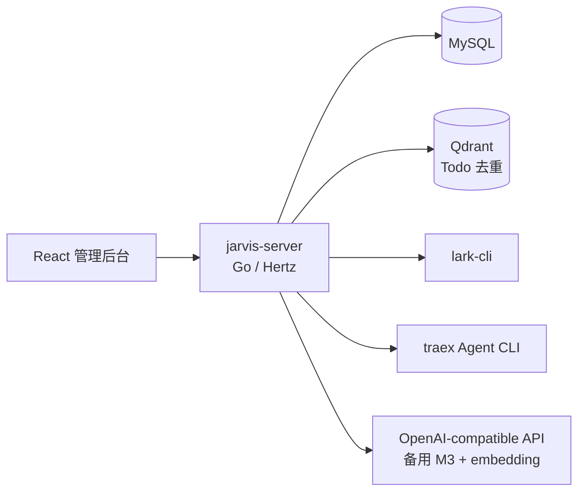
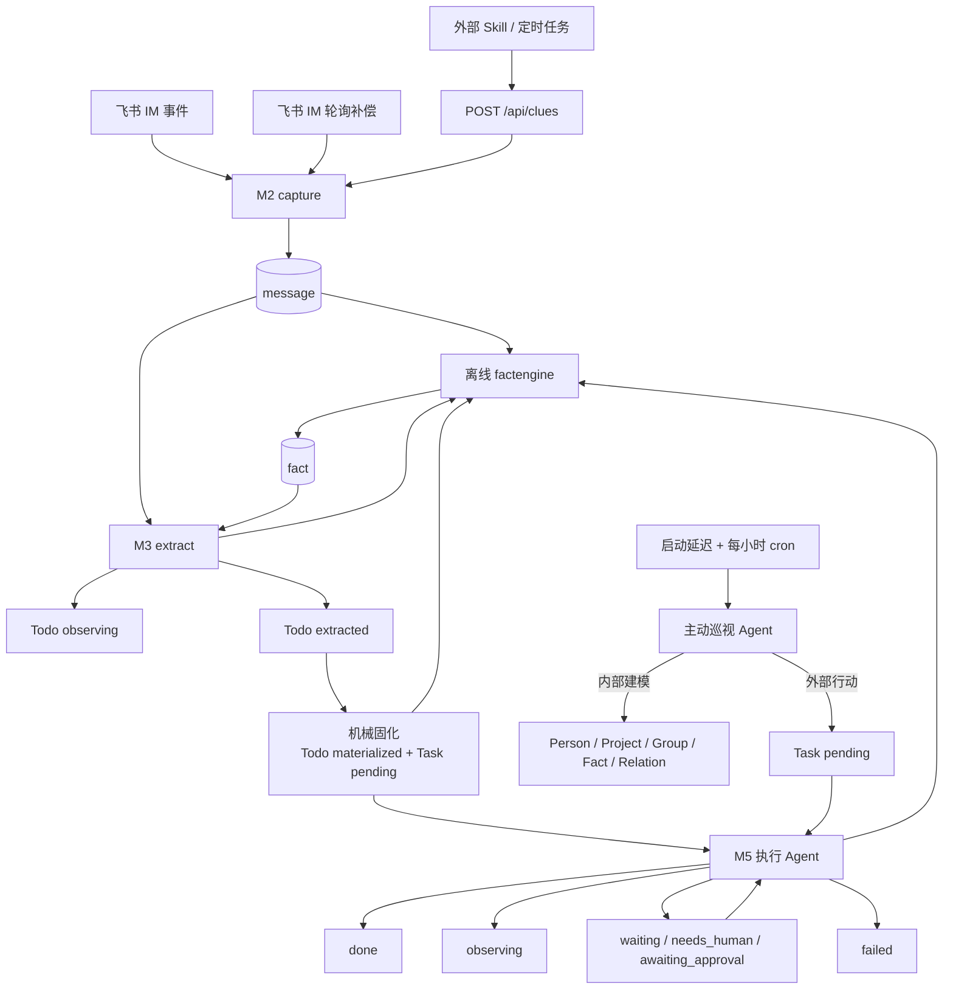

# Jarvis 当前架构与跨模块契约

> Status: current
> Authority: normative architecture
> Last verified: 2026-08-02 @ `89fa24b`

本文只描述当前实现的稳定边界，不复制字段级 DDL、完整路由或本机运行值。文档入口与提案/历史分类见 [docs/README.md](README.md)。

## 1. 系统定位

Jarvis 是单用户、本地、低频运行的主动式任务数字分身。它不是规则引擎，也不是通用 Agent 平台：Go 负责持久化、幂等、调度、权限载体和硬状态；模型结合上下文、Skills 和工具完成语义判断。

全局原则以 [`goal.md`](../goal.md) 和 [`AGENTS.md`](../AGENTS.md) 为准：

- fail-fast，不静默 fallback；
- 新来源不新增专用 Go 流水线；
- 模型语义使用完整原文或宽松 JSON；
- 上下文一次冻结、全程复用；
- M5 对任务理解可演进，审批针对具体副作用；
- 文件化 prompt/rule 是唯一正文真源。

## 2. 进程与依赖



- `jarvis-server` 是主进程：HTTP、静态前端、M2/M3/M5、实时协调和补偿 cron 都在同一进程。
- MySQL 是结构化状态真源。
- Qdrant 当前只服务 Todo 语义去重，不是长期事实真源。
- `traex` 运行 M3 默认引擎、M5 执行、对话、离线事实抽取和主动巡视；各阶段的模型和超时独立读取有效配置。
- `lark-cli` 负责飞书读写；`bytedcli`、`git` 和 `jarvis-tools` 由 Agent 按需调用。
- 生产前端由 18800 托管 `web/dist`；18801 是独立 Vite 开发服务。

技术依赖版本以 `go.mod`、`web/package.json` 和本机 CLI help 为准，不在本总纲固化补丁版本。

## 3. 端到端数据流



### 3.1 M2：机械采集

M2 有两个事实入口：

1. 飞书 IM 的实时消息事件，以及会话发现、principal activity 和增量轮询补偿；
2. 外部定时任务/Skill 通过 `/api/clues` 投递原始事实。

M2 保存原文、来源、外部幂等键和资源引用，成功后唤醒 M3。它不解释错误语义、不决定是否值得做、不创建 Todo、不为会议/邮件等来源增加专用状态机。

`jarvis-server` 通过 `lark-cli event consume im.message.receive_v1` 直接持有 Bot 长连接。事件按飞书 `message_id` 幂等落库，提交后立即唤醒 M3；事件不推进轮询 checkpoint，定时扫描继续作为掉线和进程故障后的恢复真源。同一个 Bot app 只能有一个事件连接拥有者，不得同时配置到 cc-connect/OpenClaw 等进程。资源链路只稳定采集引用元数据；通用下载、正文回填和内容哈希复用尚未形成完整生产链路。

### 3.2 M3：线索抽取与快照

M3 默认使用 Agent CLI，可用工具补查项目、人物、群、代码和飞书证据；model API 是备用引擎。它负责：

- 判断新证据是否形成或更新 Todo；
- 校验 source message / quote；
- 精确、向量和模型辅助去重；
- 推算项目归属和仓库提示，保存 `resolution`；
- 冻结 `context_snapshot` 和完整 `extraction_result`。

M3 可以产出：

- `extracted`：存在需要交给 M5 执行 Agent 调查和判断的动作线索；
- `observing`：值得保留，但当前不需要任何人行动。

`context_snapshot` 是审计快照，不是实时世界状态。M5 全链路复用它，也可查询新事实；不得在下游重新查库拼一份替代快照。

### 3.3 Todo 固化

`extracted` Todo 一律通过无模型的固化步骤创建一个 `pending` Task，并把 Todo 置为 `materialized`。固化继续使用 Todo ID/version 乐观锁、`task.todo_id` 唯一键和同一事务；重复通知返回同一个 Task，陈旧版本 fail-fast。Task 只记录自己的来源与创建时间，不把这一机械步骤包装成判断或确认闸门。

Todo 来源 Task 的 `plan` 为空；执行 Agent 直接读取完整 `source_clue` 和冻结 `background`，不人为制造中间计划或判断上下文。

### 3.4 M5 执行：调查、动作与恢复

Task 可以来自 Todo、手工 API、ScheduledTask 或主动巡视 Agent。执行 Agent 读取完整来源证据、冻结背景、人工 supplements 和最近运行记录，把上游内容视为线索，不视为不可修改的最终计划。

执行 outcome 与状态映射：

| Agent outcome | Task 状态/动作 |
|---|---|
| `completed` | `done` |
| `observing` | `observing`；Todo 来源存在时同步回 observing |
| `waiting` | `waiting`，绑定 ScheduledTask 和 Codex Session，到期续跑 |
| `needs_human` | `needs_human`，principal 回复后续跑同一 Session |
| `failed` | `failed` |
| `needs_approval=true` | `awaiting_approval`，批准后进入 fresh apply run |

审批由模型根据具体副作用判断，不按 `action_type` 分流。代码提供状态、批准/驳回入口和审计载体。`effects` 的 `kind` 是开放字符串，外部后果按 Agent 声明留痕；当前不是独立 receipt verifier。

Task 的 `summary` 表示事项总进展，ExecutionRun 的 `summary` 只表示本次运行。当前 Store 能更新 supplements、状态、结果和 summary。

## 4. 实时推进与恢复

`internal/pipeline.Coordinator` 接收持久化提交后的轻量通知，按 chat/todo/task ID 和 version 推进工作。内存队列只加速，不承担真源：

- M2 新消息唤醒 M3；
- M3 新 `extracted` Todo 唤醒机械固化；
- 固化创建 Task 后唤醒 M5 执行；
- 各阶段 cron 扫描持久化状态，恢复漏通知和崩溃后的工作。

队列按实体 ID/version 合并等待通知，数据库状态和乐观锁拒绝陈旧执行。

`internal/proactive` 使用独立低成本模型。主进程启动后先等待配置的启动延迟（基线 120 秒），运行第一轮，再按独立 cron 周期运行；同一时刻最多一轮。它可以通过既有工具维护 Jarvis 内部世界模型，但任何外部行动必须创建 `source_type=proactive` 的普通 Task，由同一个 Task Submitter 唤醒强 M5。巡视失败会明确记录，不切换模型，也不阻塞 M2→M3→M5 主链路。

## 5. 世界状态与长期事实

当前世界状态分为：

- 人工背景：PrincipalProfile、Project、Person、Group、ManagedResource；
- 原始证据：Message、Resource、ScanRecord；
- 行动链路：Todo、Task、TodoEvent、TaskEvent、ExecutionRun；
- 长期事实：Fact、RelationFact；
- 时间触发和总结：ScheduledTask、DailyDigest。

主动巡视不新增世界状态表：它读取上述现有载体并通过既有 CRUD 工具维护内部认知；跨轮记忆来自这些持久状态，而不是续跑无限对话 Session。

`internal/domain/*.go` 和 `internal/store/mysql.go` 是字段与迁移真源。不要在文档复制完整 DDL。

离线 factengine 消费 `message`、`todo`、`task` 并写 `fact`，三种来源共用同一套 `SourceUnit → Agent → Fact` 协议和独立游标。Message 按会话和大小切出有界批次，批次内每一条已采集消息原样交给 Agent；Todo/Task 跟随 append-only 的 lifecycle event，按自然日和数量切出有界窗口，把窗口内每个事件原文和当前完整实体快照一起交给 Agent，Task 事件有关联 ExecutionRun 时也整块携带。Go 不预先过滤材料、不解释事件类型，也不把已知实体当输出白名单。首次接入 Todo/Task 会从事件 0 开始消费已有材料；Message 保留从当前时刻起步的历史边界。

RelationFact 表示两个既有实体之间的自然语言关系和有效期；它没有 predicate/source/confidence/supersede 状态机。

## 6. 文件化 Agent 配置

| 类型 | 真源 | 读取语义 |
|---|---|---|
| 系统 prompts | `conf/prompts/*.md`，在 `internal/textstore/defaults.go` 注册 | 缺失/空正文 fail-fast |
| 工作 rules | `conf/rules/all.md` + 阶段文件 | 调用时组合读取；正文允许为空 |
| Skills | `.agents/skills/*/SKILL.md` + `conf/skills.yaml` | 正文与启用阶段分离 |
| Shared memory | `data/shared-memory.md` | 作为可信指令块注入 |
| Runtime settings | `conf/config.runtime.yaml` | 覆盖基线配置；重启后生效 |

工具说明由 `internal/toolcatalog` 和 Skills 维护，不复制到每个 prompt。

## 7. 状态真源

### Todo

```text
M3 -> extracted -> materialize -> materialized -> Task -> M5 execution
 └-> observing                              └-> observing（可同步来源 Todo）

fresh evidence 可使 observing 回到 extracted；materialized 不由 M3 随意重开。
```

### Task

```text
pending -> executing -> done | observing | failed
                    ├-> waiting -> executing
                    ├-> needs_human -> executing
                    └-> awaiting_approval -> executing(apply)
```

完整状态守卫以 `internal/execute/store.go` 为准。

## 8. API、页面与运维

- 路由分组：[reference/http-api.md](reference/http-api.md)
- 运行部署：[reference/operations.md](reference/operations.md)
- 页面真源：`web/src/App.tsx`
- 当前主导航：Overview、任务、定时任务、待办、背景、设置、进度、运行状态
- 生产入口：`http://127.0.0.1:18800/`

## 9. 当前已知实现缺口

这些是代码事实，不是自动授权的实施计划：

- 尚无独立 Goal Store / Supervisor / Verifier；长任务控制仍是提案。
- `context_snapshot` 是冻结证据，不是版本化 live world state。
- factengine 已消费 message、Todo 和 Task lifecycle event；其它原料来源尚需按同一投影协议接入。
- effects 是 Agent 声明，不是外部系统 receipt 的独立验证。
- Task 的背景和可选计划缺通用更新 API/tool 与审计写入。
- 编辑既有消息目前不会重新唤醒 M3。
- Resource 通用下载、解析和内容哈希复用未闭环。

未来方案见 [文档导航中的提案区](README.md#提案与实现中设计)，不得把提案内容直接当成当前能力。
