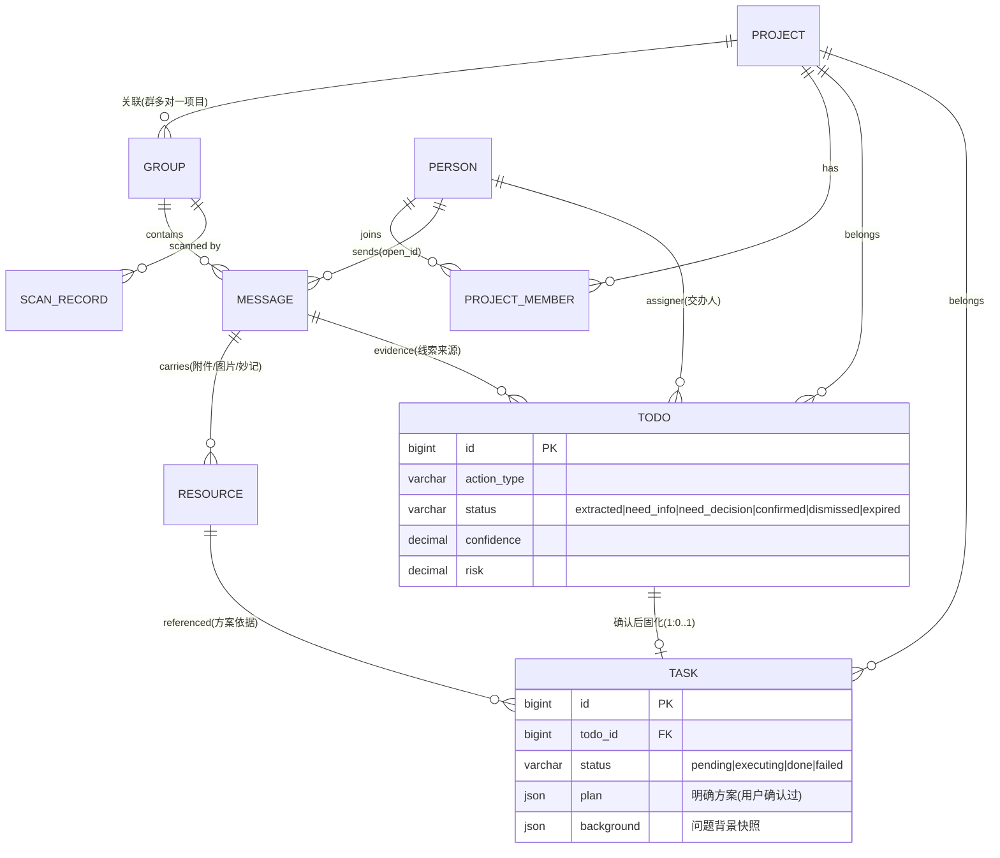

# Jarvis · 基于飞书的本地个人 AI 管家 · 技术方案总纲

> 本文是全系统的**顶层设计与跨模块契约**。各模块细化文档见 `docs/modules/01~05`。
> 定位：字节研发工程师 `chujiejie.1` 在本地 Mac 可信环境运行的私人 AI 管家——自动从飞书消息识别 leader 交办 / 项目讨论，提取行动线索，经确认固化为明确任务并执行。

---

## 0. 设计原则（全局，所有模块遵守）

1. **本地可信环境**：全部数据（消息、open_id、密钥）明文存储，不加密、不脱敏。操作明文密钥时仅提示风险。
2. **fail-fast**：暴露问题，不静默降级、不掩盖，尤其单测。
3. **不乱兼容历史数据 / 不乱加 fallback**：涉及历史数据处理、降级、护栏的地方，一律标注 **【需与用户确认】**，不擅自实现。
4. **模块化 + 高维视角**：先按模块和边界拆清楚，从更高维度判断合理性，再进实现细节。
5. **优先用官方能力**：飞书用 `lark-cli`；记忆用开源 `mem0`；Go 侧用字节已有基建（bytedgorm 等）；不自造轮子。

---

## 1. 技术栈（本次调整已定稿）

| 层 | 选型 | 说明 |
|---|---|---|
| 后端语言 | **Go 1.26** | 本机 `go1.26.4` |
| Web 框架 | **Hertz**（CloudWeGo，`v0.10.5`） | 管理后台 REST API + 内部接口 |
| ORM | **GORM**（`gorm.io/gorm` + MySQL driver） | MySQL 访问；不引入 bytedgorm，保持本地纯净 |
| 定时调度 | **robfig/cron v3** | 分层扫描、记忆化、过期扫描（替代原 APScheduler） |
| 结构化存储 | **MySQL 8**（InnoDB / utf8mb4） | 7 实体 + 消息明文，source of truth |
| 记忆层 | **mem0**（Python）以 **sidecar** 形式，Go 通过 HTTP 调用 | 见 §5 |
| 向量库 | **Qdrant**（Docker，localhost:6333） | mem0 后端 |
| LLM 抽取（M2/M3） | **model API**（OpenAI 兼容 / 本地 ollama / 字节网关，可配置） | 结构化输出，追求稳定与速度 |
| LLM 决策（M4） | **codex CLI**（`codex exec` 子进程） | 复杂确认/风险决策，见 §6 |
| 代码执行后端（M5） | **codex CLI** / cursor-agent | `code_change` executor 后端 |
| 前端 | React + Vite + Ant Design | 管理后台 |
| 进程托管 | macOS **launchd** | 常驻，参考本机 `llm-agent-core` 做法 |

> **明确不用 Eino**：Jarvis 是独立本地单体，LLM 调用只有两种形态——① 高频抽取直接调 model API（HTTP）；② 复杂决策/代码执行走 codex CLI 子进程。不引入 Eino/Kitex 等编排框架，保持轻量。
> **与已有仓库的关系**：`llm_agent_core` / `llm_backstage_agent`（Kitex+Eino 线上 runtime）仅作环境参考，Jarvis 不复用其框架栈。

### 1.1 进程拓扑

```
┌──────────────────────────────────────────────────────────────┐
│  React 管理后台 (M0, Vite)                                      │
└───────────────────────────┬──────────────────────────────────┘
                            │ HTTP/JSON
┌───────────────────────────▼──────────────────────────────────┐
│  jarvis-server (Go / Hertz)  —— 单体进程，launchd 托管           │
│  ┌────────────┬────────────┬────────────┬───────────────────┐ │
│  │ REST API   │ cron 调度  │ 流水线编排  │ 领域服务(7 实体)    │ │
│  │ (M0/各模块) │(scan/mem)  │(M2→M3→M4→M5)│                   │ │
│  └────────────┴────────────┴────────────┴───────────────────┘ │
└──┬──────────┬───────────┬──────────┬──────────┬───────────────┘
   │ 子进程    │ HTTP       │ 子进程    │ HTTP      │ TCP
┌──▼──────┐ ┌─▼─────────┐ ┌▼────────┐ ┌▼────────┐ ┌▼────────┐
│lark-cli │ │mem0 sidecar│ │codex CLI│ │model API│ │ MySQL 8 │
│user+bot │ │(Python)    │ │决策/代码│ │(抽取,可 │ │ (明文)  │
│飞书读写 │ │ ↕ Qdrant   │ │执行     │ │ 配置)   │ └─────────┘
└─────────┘ └────────────┘ └─────────┘ └─────────┘
```

外部依赖：
- **lark-cli**：`--as user` 读全量消息、`--as bot` 收发消息 / 事件 / 交互卡片。
- **mem0 sidecar**：Python FastAPI 薄服务包 mem0，暴露 `/add` `/search` 等；内部连 Qdrant。
- **codex CLI**：`codex exec` 非交互子进程，用于 M4 决策与 M5 代码执行。
- **model API**：可配置 OpenAI 兼容端点，供 M2/M3 高频抽取（Go 直接 HTTP 调用，不经 Eino）。

---

## 2. 核心实体模型（7 实体，全局唯一权威定义）

本次定稿 **7 个核心实体**：`Project` / `Group` / `Person` / `Todo` / `Task` / `Resource` / `ScanRecord`。
外加若干**支撑表**（消息明文、关联表、审计表），不算核心实体但一并列出。

> `ScanRecord`（扫描记录）：记录每一轮/每一次会话扫描的执行情况（扫了哪个群、时间窗、拉了多少条、成功/失败、错误），是运维可观测与排障的一等实体，独立于「扫描游标 checkpoint」（checkpoint 是断点续扫的状态，scan_record 是历史流水）。

### 2.1 实体关系图



### 2.2 七实体职责一览

| 实体 | 一句话定义 | 拥有模块 | 生命周期 |
|---|---|---|---|
| **Project** | 我负责/参与的项目背景 | M1 | 手动维护，长期 |
| **Group** | 飞书群/单聊会话（原 `jarvis_chat` 升为一等实体） | M2（建模）/M1（关联项目） | 自动发现 + 手动标注 |
| **Person** | 重点人员（leader/关键人/同事），leader 最高优先级 | M1 | 手动维护 |
| **Todo** | 从消息提取的**行动线索/候选**（可能模糊、信息不足） | M3 产出，M4 流转 | 短：extracted→confirmed/dismissed |
| **Task** | Todo 确认后固化的**明确可执行任务**（含背景+明确方案） | M4 生成，M5 执行 | 长：pending→executing→done/failed |
| **Resource** | 消息/任务涉及的资源（图片/文件/妙记/文档/链接） | M2 沉淀，M3/M5 引用 | 随消息 |
| **ScanRecord** | 每次扫描的执行流水（群/时间窗/条数/结果/错误） | M2 写入 | 每次扫描一条，可保留期清理 |

### 2.3 Todo 与 Task 拆分（本次核心调整）

**为什么拆**：原单一 `Task` 实体既要承载"疑似要做的模糊线索"又要承载"明确可执行的任务"，生命周期混在一起。拆开后职责清晰：

```
消息(Message)
  │  M3 提取
  ▼
┌─────────────────────────────────────────────┐
│ Todo（线索/候选）                              │
│  - action_type + slots（可能不全）             │
│  - 可能 info 不足、可能是 tentative 软建议      │
│  - 生命周期：extracted → (M4打分)              │
│      → need_info / need_decision              │
│      → confirmed（确认）| dismissed（丢弃）      │
└───────────────┬─────────────────────────────┘
                │ M4：用户确认 or 自动确认
                │ （补齐信息、明确方案、关联背景）
                ▼
┌─────────────────────────────────────────────┐
│ Task（明确可执行任务）                          │
│  - todo_id 外键指向来源 Todo                    │
│  - background：问题背景快照（关联 project/消息） │
│  - plan：明确方案（用户确认过 或 自动确认的明确方案）│
│  - 生命周期：pending → executing → done/failed  │
└───────────────┬─────────────────────────────┘
                │ M5 执行
                ▼
           执行结果回写 M0
```

**关键契约**：
- **一个 Todo 最多生成一个 Task**（1:0..1）。Todo 被 `dismissed` 则永不产生 Task。
- **Task 一旦生成，方案即冻结**（`plan` 是确认时刻的快照）。若后续讨论变了，是**新 Todo → 新 Task**，旧 Task 走正常生命周期（不追溯篡改已确认方案）。
- **背景与方案是 Task 的一等字段**，不是引用：`background`（问题背景）和 `plan`（明确方案）在确认时刻**快照固化**进 Task，保证执行时方案明确、可复现，不受源数据后续变化影响。
- M3 只写 Todo；M4 是 Todo→Task 的**唯一转化闸门**；M5 只读 Task。三者职责不交叉。

### 2.4 各实体 MySQL DDL

> 本地可信明文存储，不加密字段。charset `utf8mb4`，引擎 InnoDB。飞书时间戳裸存毫秒 `BIGINT`。
> Go 侧用 GORM model 映射；此处给 SQL 权威定义，各模块文档不再重复完整 DDL，只补模块私有字段。

#### Project

```sql
CREATE TABLE project (
  id             BIGINT UNSIGNED NOT NULL AUTO_INCREMENT,
  code           VARCHAR(64)  NULL COMMENT '人类可读 slug，唯一',
  name           VARCHAR(255) NOT NULL,
  role           ENUM('owner','participant') NOT NULL COMMENT '我的角色',
  status         ENUM('planning','active','paused','archived','done') NOT NULL DEFAULT 'active',
  priority       TINYINT UNSIGNED NOT NULL DEFAULT 3 COMMENT '重要度 1-5',
  description    TEXT NULL COMMENT '项目背景/目标',
  repos          JSON NULL COMMENT '[{name,url,local_path}]',
  tech_stack     JSON NULL,
  key_decisions  JSON NULL COMMENT '[{date,title,detail}]',
  timeline       JSON NULL,
  notes          TEXT NULL,
  mem0_synced_at DATETIME NULL,
  created_at     TIMESTAMP NOT NULL DEFAULT CURRENT_TIMESTAMP,
  updated_at     TIMESTAMP NOT NULL DEFAULT CURRENT_TIMESTAMP ON UPDATE CURRENT_TIMESTAMP,
  PRIMARY KEY (id),
  UNIQUE KEY uk_project_code (code),
  KEY idx_project_role (role),
  KEY idx_project_status (status)
) ENGINE=InnoDB DEFAULT CHARSET=utf8mb4;
```

#### Group（飞书群/会话，一等实体，表名 `feishu_group`）

```sql
CREATE TABLE feishu_group (
  id                BIGINT UNSIGNED NOT NULL AUTO_INCREMENT,
  chat_id           VARCHAR(64)  NOT NULL COMMENT '飞书 oc_ 会话ID',
  chat_mode         VARCHAR(16)  NOT NULL COMMENT 'group | p2p',
  name              VARCHAR(512) NULL COMMENT '群名；p2p 可空',
  description       TEXT NULL,
  owner_open_id     VARCHAR(64)  NULL,
  external          TINYINT(1)   NOT NULL DEFAULT 0 COMMENT '是否外部会话',
  tenant_key        VARCHAR(64)  NULL,
  project_id        BIGINT UNSIGNED NULL COMMENT '关联项目(群多对一项目)',
  tier              VARCHAR(8)   NOT NULL DEFAULT 'cold' COMMENT 'hot|warm|cold 扫描分层',
  pinned            TINYINT(1)   NOT NULL DEFAULT 0 COMMENT '强制 hot 白名单',
  include_in_memory TINYINT(1)   NOT NULL DEFAULT 1 COMMENT '是否纳入 mem0(报警群置0)',
  is_key_group      TINYINT(1)   NOT NULL DEFAULT 0 COMMENT '关键群(leader/核心项目)',
  last_active_at    BIGINT       NULL COMMENT '最新消息 create_time(ms)',
  created_at        TIMESTAMP    NOT NULL DEFAULT CURRENT_TIMESTAMP,
  updated_at        TIMESTAMP    NOT NULL DEFAULT CURRENT_TIMESTAMP ON UPDATE CURRENT_TIMESTAMP,
  PRIMARY KEY (id),
  UNIQUE KEY uk_group_chat_id (chat_id),
  KEY idx_group_tier_active (tier, last_active_at),
  KEY idx_group_project (project_id),
  CONSTRAINT fk_group_project FOREIGN KEY (project_id) REFERENCES project(id) ON DELETE SET NULL
) ENGINE=InnoDB DEFAULT CHARSET=utf8mb4;
```

> **表名 `feishu_group`（已定）**：避开 SQL 保留字 `group`，GORM 侧无需反引号转义。Go model struct 保留业务简称 `Group`，用 `func (Group) TableName() string { return "feishu_group" }` 固定物理表名。下文实体名一律简称 `Group`，物理表名一律 `feishu_group`。

#### Person

```sql
CREATE TABLE person (
  id               BIGINT UNSIGNED NOT NULL AUTO_INCREMENT,
  open_id          VARCHAR(64)  NOT NULL COMMENT '飞书 open_id，绑定键',
  union_id         VARCHAR(64)  NULL,
  feishu_user_id   VARCHAR(64)  NULL,
  name             VARCHAR(128) NOT NULL COMMENT '姓名(缓存)',
  en_name          VARCHAR(128) NULL,
  avatar_url       VARCHAR(512) NULL,
  department       VARCHAR(255) NULL,
  title            VARCHAR(128) NULL,
  role             ENUM('leader','key','colleague','other') NOT NULL COMMENT '关系角色',
  priority_weight  DECIMAL(3,2) NOT NULL COMMENT '优先级权重 0-1，leader=1.0',
  relation         VARCHAR(255) NULL,
  comm_style       TEXT NULL COMMENT '沟通风格，辅助识别隐含交办',
  p2p_chat_id      VARCHAR(64)  NULL COMMENT '单聊 chat_id，供确认/通知',
  notes            TEXT NULL,
  is_active        TINYINT(1)   NOT NULL DEFAULT 1,
  mem0_synced_at   DATETIME NULL,
  created_at       TIMESTAMP NOT NULL DEFAULT CURRENT_TIMESTAMP,
  updated_at       TIMESTAMP NOT NULL DEFAULT CURRENT_TIMESTAMP ON UPDATE CURRENT_TIMESTAMP,
  PRIMARY KEY (id),
  UNIQUE KEY uk_person_open_id (open_id),
  KEY idx_person_role (role)
) ENGINE=InnoDB DEFAULT CHARSET=utf8mb4;
```

#### Todo（行动线索/候选）

```sql
CREATE TABLE todo (
  id                  BIGINT UNSIGNED NOT NULL AUTO_INCREMENT,
  title               VARCHAR(512) NOT NULL COMMENT '一句话线索(动宾)',
  description         TEXT NOT NULL,
  action_type         VARCHAR(32)  NOT NULL COMMENT 'code_change|summary_post|investigate|schedule_meeting|...',
  slots               JSON NOT NULL COMMENT '结构化参数(可能不全)',
  commitment_strength VARCHAR(16)  NOT NULL COMMENT 'firm|tentative|mentioned',

  -- 来源与背景关联
  source_message_ids  JSON NOT NULL COMMENT '证据消息 om_ 数组',
  source_quote        TEXT NOT NULL COMMENT '逐字证据(防幻觉)',
  group_id            BIGINT UNSIGNED NULL COMMENT '来源会话',
  project_id          BIGINT UNSIGNED NULL,
  assigner_open_id    VARCHAR(64) NULL COMMENT '交办人',
  is_leader_assigned  TINYINT(1)  NOT NULL DEFAULT 0,
  due_at              DATETIME NULL,

  -- M4 打分与路由
  status              VARCHAR(24) NOT NULL DEFAULT 'extracted'
                      COMMENT 'extracted|scoring|need_info|need_decision|confirmed|dismissed|expired',
  confidence          DECIMAL(4,3) NULL COMMENT 'M4 置信度',
  risk                DECIMAL(4,3) NULL COMMENT 'M4 风险',
  route               VARCHAR(16) NULL COMMENT 'auto|need_info|need_decision',
  missing_info        JSON NULL COMMENT 'info 不足时缺什么',

  -- 去重与追溯
  dedup_fingerprint   CHAR(64) NOT NULL,
  extraction_model    VARCHAR(64) NOT NULL,
  prompt_version      VARCHAR(32) NOT NULL,
  revision            INT NOT NULL DEFAULT 1,
  ttl_at              DATETIME NULL COMMENT '待确认过期时间',
  version             INT NOT NULL DEFAULT 0 COMMENT '乐观锁',
  first_seen_at       DATETIME NOT NULL,
  last_evidence_at    DATETIME NOT NULL,
  created_at          TIMESTAMP NOT NULL DEFAULT CURRENT_TIMESTAMP,
  updated_at          TIMESTAMP NOT NULL DEFAULT CURRENT_TIMESTAMP ON UPDATE CURRENT_TIMESTAMP,
  PRIMARY KEY (id),
  UNIQUE KEY uk_todo_fingerprint (dedup_fingerprint),
  KEY idx_todo_status (status),
  KEY idx_todo_leader_status (is_leader_assigned, status),
  KEY idx_todo_project (project_id),
  KEY idx_todo_group (group_id),
  CONSTRAINT fk_todo_project FOREIGN KEY (project_id) REFERENCES project(id) ON DELETE SET NULL,
  CONSTRAINT fk_todo_group   FOREIGN KEY (group_id)   REFERENCES feishu_group(id) ON DELETE SET NULL
) ENGINE=InnoDB DEFAULT CHARSET=utf8mb4;
```

#### Task（明确可执行任务）

```sql
CREATE TABLE task (
  id                 BIGINT UNSIGNED NOT NULL AUTO_INCREMENT,
  todo_id            BIGINT UNSIGNED NOT NULL COMMENT '来源 Todo(1:0..1)',
  title              VARCHAR(512) NOT NULL,
  action_type        VARCHAR(32)  NOT NULL,

  -- Task 的一等字段：确认时刻快照固化，保证方案明确、可复现
  background         JSON NOT NULL COMMENT '问题背景快照:{project, 关键消息, 相关记忆, 交办人}',
  plan               JSON NOT NULL COMMENT '明确方案(用户确认过或自动确认):{steps, params, 依据}',
  slots              JSON NOT NULL COMMENT '执行所需结构化参数(已补齐)',
  confirmed_by       VARCHAR(16)  NOT NULL COMMENT 'user | system(auto)',
  confirmed_at       DATETIME NOT NULL,
  action_hash        CHAR(64) NOT NULL COMMENT '方案指纹,执行前漂移校验',

  -- 执行生命周期(独立于 Todo)
  status             VARCHAR(16) NOT NULL DEFAULT 'pending'
                     COMMENT 'pending|executing|done|failed|cancelled',
  execution_result   JSON NULL COMMENT '{summary, artifacts, error}',
  autonomy_mode      VARCHAR(16) NOT NULL DEFAULT 'copilot',
  project_id         BIGINT UNSIGNED NULL,
  version            INT NOT NULL DEFAULT 0,
  created_at         TIMESTAMP NOT NULL DEFAULT CURRENT_TIMESTAMP,
  updated_at         TIMESTAMP NOT NULL DEFAULT CURRENT_TIMESTAMP ON UPDATE CURRENT_TIMESTAMP,
  PRIMARY KEY (id),
  UNIQUE KEY uk_task_todo (todo_id) COMMENT '一个 Todo 最多一个 Task',
  KEY idx_task_status (status),
  KEY idx_task_project (project_id),
  CONSTRAINT fk_task_todo    FOREIGN KEY (todo_id)    REFERENCES todo(id),
  CONSTRAINT fk_task_project FOREIGN KEY (project_id) REFERENCES project(id) ON DELETE SET NULL
) ENGINE=InnoDB DEFAULT CHARSET=utf8mb4;
```

#### Resource（资源实体）

```sql
CREATE TABLE resource (
  id             BIGINT UNSIGNED NOT NULL AUTO_INCREMENT,
  resource_type  VARCHAR(24) NOT NULL COMMENT 'image|file|audio|video|minutes|doc|link|card',
  -- 飞书侧标识(按类型二选一或都填)
  file_key       VARCHAR(128) NULL COMMENT 'im 资源 key',
  minute_token   VARCHAR(64)  NULL COMMENT '妙记 token',
  doc_token      VARCHAR(64)  NULL COMMENT '云文档 token',
  url            VARCHAR(1024) NULL COMMENT '外链',
  name           VARCHAR(512) NULL,
  mime_type      VARCHAR(128) NULL,
  size_bytes     BIGINT NULL,
  -- 来源与本地化
  source_message_id VARCHAR(64) NULL COMMENT '来自哪条消息 om_',
  group_id       BIGINT UNSIGNED NULL,
  local_path     VARCHAR(1024) NULL COMMENT '若已下载,本地路径(同 content_hash 复用一份)',
  downloaded     TINYINT(1) NOT NULL DEFAULT 0,
  content_hash   CHAR(64) NULL COMMENT '内容 SHA256,下载后回填,跨消息去重键',
  extracted_text MEDIUMTEXT NULL COMMENT '按需解析后的文本(本期仅妙记逐字稿)',
  created_at     TIMESTAMP NOT NULL DEFAULT CURRENT_TIMESTAMP,
  updated_at     TIMESTAMP NOT NULL DEFAULT CURRENT_TIMESTAMP ON UPDATE CURRENT_TIMESTAMP,
  PRIMARY KEY (id),
  UNIQUE KEY uk_resource_msg_key (source_message_id, file_key) COMMENT '同一消息同一资源幂等',
  KEY idx_resource_type (resource_type),
  KEY idx_resource_msg (source_message_id),
  KEY idx_resource_group (group_id),
  KEY idx_resource_content (content_hash) COMMENT '跨消息按内容去重/复用本地文件'
) ENGINE=InnoDB DEFAULT CHARSET=utf8mb4;
```

> **Resource 定位**：原来散在 `message.resources_json` 里的附件信息升为一等实体，好处：① 妙记/文档可被 Todo/Task 直接引用为"方案依据"；② 支持按需下载与解析（`downloaded`/`extracted_text`）；③ 可作为 Task 的方案依据被引用。
> **两层去重键（已定）**：
> - **同消息幂等**：`uk_resource_msg_key (source_message_id, file_key)`——同一条消息重扫不重复插（飞书 `file_key` 与消息绑定，同一文件在不同消息里 key 不同）。
> - **跨消息内容去重**：`content_hash`（内容 SHA256），**下载后回填**。同一文件多次转发/引用时，DB 仍按来源消息各记一行（保留证据），但相同 `content_hash` 复用同一 `local_path`（只存一份本地文件）。未下载前 `content_hash` 为空，去重仅在下载后生效。
> **下载 / 解析范围（已定）**：采集期只沉淀元数据、不下载；**按需下载/解析、且本期仅妙记**（`resource_type=minutes`，用 `lark-cli minutes` 拿逐字稿写入 `extracted_text`）。图片 OCR、飞书文档/表格、附件解析本期不做（见 §11.4）。

#### ScanRecord（扫描记录，一等实体）

```sql
CREATE TABLE scan_record (
  id             BIGINT UNSIGNED NOT NULL AUTO_INCREMENT,
  scan_type      VARCHAR(24) NOT NULL COMMENT 'discover|scan_hot|scan_warm|scan_cold|backfill|event',
  group_id       BIGINT UNSIGNED NULL COMMENT '本次扫描的会话(discover 类可空)',
  chat_id        VARCHAR(64) NULL COMMENT '冗余,便于直接检索',
  window_start   BIGINT NULL COMMENT '扫描时间窗起(ms, create_time)',
  window_end     BIGINT NULL COMMENT '扫描时间窗止(ms)',
  fetched_count  INT NOT NULL DEFAULT 0 COMMENT '本次拉取消息数',
  inserted_count INT NOT NULL DEFAULT 0 COMMENT '实际新增(去重后)',
  page_count     INT NOT NULL DEFAULT 0 COMMENT '分页次数(API 调用次数)',
  status         VARCHAR(16) NOT NULL COMMENT 'ok|partial|error',
  error_type     VARCHAR(64) NULL,
  error_message  TEXT NULL,
  high_water_before BIGINT NULL COMMENT '扫描前高水位',
  high_water_after  BIGINT NULL COMMENT '扫描后高水位',
  started_at     DATETIME NOT NULL,
  finished_at    DATETIME NULL,
  duration_ms    INT NULL,
  created_at     TIMESTAMP NOT NULL DEFAULT CURRENT_TIMESTAMP,
  PRIMARY KEY (id),
  KEY idx_scan_group_time (group_id, started_at),
  KEY idx_scan_type_time (scan_type, started_at),
  KEY idx_scan_status (status)
) ENGINE=InnoDB DEFAULT CHARSET=utf8mb4;
```

> **ScanRecord vs chat_checkpoint（支撑表）**：两者职责分离——
> - `chat_checkpoint`：**状态**表，每会话一行，只存"扫到哪了"（高水位游标），用于断点续扫（幂等前提）。
> - `scan_record`：**流水**表，每次扫描一行（追加），存"这次扫描发生了什么"（时间窗/条数/成败/错误/前后高水位）。用于后台展示扫描历史、排障、监控"某群多久没扫到新消息""哪次扫描报错"。
> 关系：一次成功扫描 = 更新 checkpoint 高水位 + 追加一条 scan_record。

### 2.5 支撑表（非核心实体）

| 表 | 用途 | 拥有模块 |
|---|---|---|
| `message` | 飞书消息明文（source of truth） | M2 |
| `chat_checkpoint` | 每会话扫描高水位游标（状态，断点续扫） | M2 |
| `project_member` | Project↔Person 多对多 | M1 |
| `todo_event` / `task_event` | 状态迁移审计 | M3/M4/M5 |
| `decision_audit` | M4 打分/路由/确认留痕（append-only） | M4 |
| `execution_run` / `execution_step` / `execution_artifact` | M5 执行留痕 | M5 |

---

## 3. 端到端流水线（每 10 分钟一轮 + 事件增强）

```
                         ┌─────────────── cron (robfig) ───────────────┐
                         │ discover(1h) scan_hot(5m) scan_warm(30m)     │
                         │ scan_cold(6h) memorize(10m) extract(10m)     │
                         │ score(10m) expire(10m)                       │
                         └───────────────────┬──────────────────────────┘
                                            │
  M2 采集 ──────────────────────────────────▼──────────────────────────
    lark-cli --as user 分层轮询全量消息 → message(明文) + group + resource
    (可选) lark-cli event --as bot 关键群低延迟增强，om_ 去重合流
                                            │
  M2 记忆化 ─────────────────────────────────▼──────────────────────────
    未处理消息按会话窗口化 → HTTP → mem0 sidecar → Qdrant
                                            │
  M3 提取 Todo ──────────────────────────────▼──────────────────────────
    新消息 + 背景(Project/Person/Group) + mem0 记忆
    → LLM API 结构化抽取 → Todo(线索,可能信息不足)
                                            │
  M4 打分 + 确认(Todo→Task 闸门) ─────────────▼──────────────────────────
    confidence×risk 打分(codex exec 做复杂决策)
    ├─ auto: 明确且低风险 → 自动确认 → 生成 Task
    ├─ need_info: 缺信息 → 飞书卡片/后台问用户 → 回流补齐
    └─ need_decision: 需决策 → 用户确认(可带修改) → 生成 Task
    确认 = 固化 background + plan 快照 → 插入 task, todo.status=confirmed
                                            │
  M5 执行 Task ──────────────────────────────▼──────────────────────────
    按 action_type 路由 executor:
    code_change(codex exec) / summary_post(lark-cli) /
    investigate(rg+codex+web) / schedule_meeting(lark-cli calendar)
    → execution_result 回写 → task.status=done/failed → M0
```

---

## 4. 飞书接入统一约定（lark-cli）

| 用途 | 身份 | 命令 | 覆盖 |
|---|---|---|---|
| 读全量消息 | `--as user` | `im +chat-list` / `+chat-messages-list` | ✅ 全部群+单聊 |
| 收发消息 | `--as bot` | `im +messages-send` / `+messages-reply` | bot 所在会话 |
| 低延迟事件 | `--as bot` | `event consume im.message.receive_v1` | ⚠️ 仅 bot 所在会话 |
| 交互卡片确认 | `--as bot` | 发卡片 + `event consume card.action.trigger` | 私聊本人 |
| 解析 open_id | `--as user` | `contact +search-user` | — |
| 约会议 | `--as user` | `calendar +create` / `+freebusy` / `+room-find` | — |

**已实测的硬约束**：所有 `im.*` 事件仅 `bot` 授权（scope `im:message.p2p_msg:readonly`），事件流无法覆盖全部会话 → **全量捕获必须靠 user 轮询**，事件仅作关键群增强。Go 侧统一封装 `larkcli` 子进程调用层（`--format json` 解析、fail-fast、令牌桶限流）。

---

## 5. mem0 sidecar 方案（Go ↔ Python）

mem0 是 Python 库、无 Go SDK。采用 **sidecar 进程**隔离：

```
┌────────────────────┐   HTTP/JSON     ┌──────────────────────────┐
│ jarvis-server (Go) │ ───────────────▶│ mem0-sidecar (Python)     │
│  MemoryClient      │                 │  FastAPI + mem0.Memory    │
│  (Go http client)  │◀─────────────── │  POST /add /search /delete │
└────────────────────┘                 │  ↕ Qdrant (localhost:6333) │
                                        └──────────────────────────┘
```

- **sidecar 接口**（Python FastAPI 薄封装，直接透传 mem0）：
  - `POST /memories` → `mem0.add(messages, user_id, metadata, infer)`
  - `POST /memories/search` → `mem0.search(query, user_id, filters, top_k, threshold)`
  - `DELETE /memories/{id}` / `POST /memories/delete_all`
  - `GET /health`
- **托管**：sidecar 由 launchd 独立托管（与 jarvis-server 平级），端口固定 `127.0.0.1:18900`（本地）。
- **fail-fast**：Go 侧调用失败直接报错，不降级；sidecar 起不来 / Qdrant 不通 → 记忆化 job 失败告警，不影响消息采集（采集与记忆化解耦）。
- **mem0 版本要点**（2026 实测）：v2 SDK / V3 pipeline，ADD-only 单趟抽取、内建实体链接（**不再需要 Neo4j 等外部图库**）、混合检索。这条统一了各模块此前的分歧：**全系统不部署任何外部图数据库**。

### 5.1 记忆统一约定（消除模块间分歧）

| 约定 | 值 | 说明 |
|---|---|---|
| `user_id` | 配置常量 `OWNER_ID`（默认 `"owner"`） | 单用户系统，全系统统一，各模块不得各用各的 |
| scope | 只用 `user_id`，不用 `agent_id/run_id/app_id` | 避免 null-scope AND 求交返回空的坑 |
| 维度过滤 | 全放 `metadata` **标量等值** | Qdrant 后端对复杂操作符支持有限，**以标量等值为基线**；复杂 AND/OR 过滤需实测确认后才用（开放问题 #5） |
| 背景注入(M1) | `infer=False` 逐条明文 | 权威背景不让 LLM 改写，确定可测 |
| 消息蒸馏(M2) | `infer=True` 窗口化 | 让 LLM 抽取事实 |
| `metadata.source` | `background` / `message` / `decision` | 区分来源，检索可过滤 |

---

## 6. LLM 分工：抽取用 API，决策用 codex（本次调整）

| 环节 | 用什么 | 为什么 |
|---|---|---|
| M2 记忆抽取 | model API（可配置） | 高频、要快、结构化输出稳定 |
| M3 提取 Todo | model API（structured output / JSON schema） | 高频、要稳定的结构化抽取 |
| **M4 确认决策** | **codex exec 子进程** | 复杂推理：结合项目背景+记忆+代码，判断风险/是否需要人工/如何明确方案。codex 有代码库上下文能力，决策质量高 |
| M5 code_change | codex exec 子进程 | 真正改代码 |
| M5 investigate | rg + codex exec `-s read-only` + web | 代码检索+调研 |

**M4 用 codex 做决策的形态**：
- Go 侧把 Todo + 背景 + 记忆 + 相关代码线索组装成 prompt，调 `codex exec -s read-only "<决策 prompt>"`，要求输出结构化 JSON（confidence/risk/路由/建议的明确方案）。
- codex `-s read-only` 保证决策阶段**不写盘、无副作用**。
- fail-fast：codex 退出码非 0 / 输出非法 JSON → 路由到 `need_decision`（人工），绝不自动确认。
- 决策留痕入 `decision_audit`（含 codex 会话 id、prompt version）。

> 这样分工的好处：M4 是"是否固化成 Task + 方案是否明确"的关键闸门，用带代码上下文的 codex 决策最合适；M2/M3 是高频流水线，用轻量 LLM API 保证吞吐与结构稳定。

---

## 7. 模块索引

| 模块 | 文档 | 职责 | 产出/消费 |
|---|---|---|---|
| M0 | （本总纲 + 前端） | 管理后台 + 编排 + cron | — |
| M1 | `modules/01-background.md` | Project/Person/Group 背景 + mem0 注入 | 产出背景 |
| M2 | `modules/02-message.md` | 消息采集 + Group/Resource 沉淀 + 记忆化 | 产出 message/group/resource/记忆 |
| M3 | `modules/03-task-extract.md` | 提取 **Todo** | 消费消息+背景+记忆 → 产出 Todo |
| M4 | `modules/04-confirmation.md` | 打分 + **Todo→Task 转化闸门**（codex 决策） | 消费 Todo → 产出 Task |
| M5 | `modules/05-execution.md` | 执行 **Task** | 消费 Task → 执行结果 |

---

## 8. 目录结构（建议）

```
jarvis/
├── docs/                      # 本方案
│   ├── 00-overview.md
│   └── modules/01~05.md
├── cmd/jarvis-server/main.go  # Go 主入口
├── internal/
│   ├── api/          # Hertz 路由(REST)
│   ├── domain/       # 7 实体领域模型 + service
│   ├── pipeline/     # M2→M3→M4→M5 编排
│   ├── capture/      # M2 采集(lark-cli 封装)
│   ├── memory/       # mem0 sidecar client
│   ├── extract/      # M3 Todo 提取(LLM API)
│   ├── decide/       # M4 打分+确认(codex)
│   ├── execute/      # M5 executor 注册表
│   ├── larkcli/      # lark-cli 子进程统一封装
│   ├── codex/        # codex exec 子进程封装
│   └── store/        # GORM/bytedgorm + DDL 迁移
├── sidecar/mem0/     # Python mem0 sidecar (FastAPI)
├── web/              # React 管理后台
└── deploy/           # launchd plist 等
```

---

## 9. 里程碑（建议）

| 阶段 | 交付 | 依赖 |
|---|---|---|
| M0.1 骨架 | Go/Hertz 工程 + 7 实体 DDL/GORM + MySQL 迁移 + launchd | — |
| M0.2 飞书打通 | larkcli 封装 + 采集 message/group/resource 落库 | M0.1 |
| M0.3 记忆 | mem0 sidecar + Qdrant + 记忆化 job | M0.2 |
| M0.4 提取 | M3 Todo 提取(LLM API) + 后台 Todo 看板 | M0.3 |
| M0.5 确认 | M4 codex 决策 + Todo→Task + 飞书卡片确认 | M0.4 |
| M0.6 执行 | M5 executor(先 investigate/summary_post) + 回写 | M0.5 |
| M0.7 代码执行 | code_change(codex) + schedule_meeting | M0.6 |

---

## 10. 与全局设计原则的对齐检查

- **fail-fast**：采集游标不静默前进、LLM/codex 失败不静默降级、执行失败必带 ExecError、单测断言暴露行为。
- **不乱兼容**：全新库、无历史数据迁移；**backfill 已定不回溯**（首次发现时刻建高水位，§11.3）；噪音群、阈值等仍【需与用户确认】。
- **不乱护栏**：M4/M5 的强制确认清单、自动 push、sandbox 放开、**codex 决策频率/成本上限/灰区边界**等做成**配置项**（§11.2），不硬编码。
- **模块化**：Todo/Task 拆分、7 实体边界清晰、三子进程职责分离。
- **优先官方**：Hertz/GORM/lark-cli/mem0/codex 全用现成，不引入 Eino/Kitex/bytedgorm。

---

## 11. 全局开放问题（需与用户确认，各模块另有细项）

### 11.1 已定项（本轮拍板，不再讨论）

1. **Go 框架**：Hertz + GORM + codex CLI + model API，不用 Eino/bytedgorm。
2. **`group` 表名**：改 `feishu_group`（避开 SQL 保留字，GORM 侧无需转义）。
3. **backfill 首次回溯**：**不回溯历史**。起点 = **系统首次发现该会话的时刻**（每会话 checkpoint 初始高水位 = 首次发现时的当前毫秒时间戳），只采集该时刻之后的新消息。见 §11.3。
4. **Resource 下载 / OCR / 去重**：**只做妙记**（`lark-cli minutes` 拿逐字稿/产物）；**按需下载/解析**（M3/M4 需要该资源内容时才拉取，非采集即下载）；跨消息按**内容 SHA256** 去重（同一文件多次转发只存一份本地文件）。图片 OCR、飞书文档/表格解析、附件解析**本期不做**。见 §11.4。
5. **codex 决策频率/成本上限、灰区边界**：全部**做成配置项**（不硬编码）。见 §11.2。

### 11.2 codex 决策可配置（M4）

M4 的 codex 深判受一组配置控制，全部可在配置文件调整、不硬编码：

| 配置项 | 含义 | 默认（建议，待校准） |
|---|---|---|
| `codex.gray_zone.conf_low` / `conf_high` | 灰区 confidence 边界：落在 `[low, high]` 才触发 codex 深判 | 0.60 / 0.85 |
| `codex.gray_zone.risk_low` / `risk_high` | 灰区 risk 边界 | 0.25 / 0.60 |
| `codex.max_calls_per_hour` | 每小时 codex 决策调用上限（成本闸） | 30 |
| `codex.max_calls_per_day` | 每天上限 | 200 |
| `codex.timeout_seconds` | 单次 codex 决策超时 | 120 |
| `codex.on_budget_exceeded` | 超预算时的行为：`degrade_to_rule`（降级为规则判定并标记）/ `route_need_decision`（直接转人工，默认） | `route_need_decision` |
| `codex.on_timeout` | 超时行为：固定 `route_need_decision`（fail-fast，绝不自动确认） | `route_need_decision` |

> 明确规则：明确 / 明显要人工的 Todo 走规则快判（零成本）；**只有落入灰区的 Todo 才调 codex 深判**。超预算 / 超时一律 fail-fast 转人工，绝不自动确认。细化见 `modules/04-confirmation.md` §2。

### 11.3 backfill 不回溯的落地（M2）

- **不拉任何历史**。每个会话首次被 `DiscoverChats` 发现时，把 checkpoint 初始 `high_water_create_time` 置为**发现时刻的当前毫秒时间戳**（`now_ms`），`backfill_done=1`（无 backfill 阶段）。
- 之后按增量扫描（§3）只采集 `create_time > 首次发现时刻` 的新消息。
- 因此不存在"首次回溯多久"的问题，也不会一次性拉海量历史。原方案里"未配置 backfill_since 则 fail-fast 拒绝首扫"的逻辑改为"首次发现即以当前时刻建高水位"，见 `modules/02-message.md` §3.4。

### 11.4 Resource 策略的落地（M2/M3）

- **采集期（M2）**：只沉淀 `resource` 元数据行（`resource_type`/`file_key`/`minute_token`/`doc_token`/`url`/`name` 等），`downloaded=0`、`extracted_text=NULL`，**不下载任何二进制、不 OCR**。
- **按需拉取（M3/M4）**：当下游需要某 `Resource` 的**内容**（目前仅**妙记**：`resource_type=minutes`）时，才调 `lark-cli minutes` 拿逐字稿/产物写入 `extracted_text`、置 `downloaded=1`。图片/文档/附件本期**不解析**（`extracted_text` 恒空）。
- **跨消息去重**：`resource` 增加 `content_hash CHAR(64)`（内容 SHA256），下载后回填；同一文件多次转发/引用只保留一份本地文件（`local_path` 复用），DB 行仍按来源消息各记一行但指向同一 `content_hash`/`local_path`。未下载前 `content_hash` 为空，去重仅在下载后生效。

### 11.5 仍待确认项

6. **mem0 sidecar 端口/托管**：`127.0.0.1:18900` 是否合适？launchd 独立托管确认。
7. **mem0 metadata 过滤能力**：Qdrant 后端复杂 AND/OR 过滤需实测；基线只依赖标量等值。
8. **autonomy 默认**：整体默认 `copilot`（对外动作需确认）？
9. **自动 git commit/push**：默认关，是否开放及约束。
10. **各类阈值/权重/强制确认清单**：见 M4 文档细项，需校准（codex 灰区默认值同样待校准）。
11. **妙记逐字稿的隐私边界**：`lark-cli minutes` 能否稳定拿到目标妙记内容（权限/授权范围），以及是否所有妙记都允许拉取，需实测确认。
