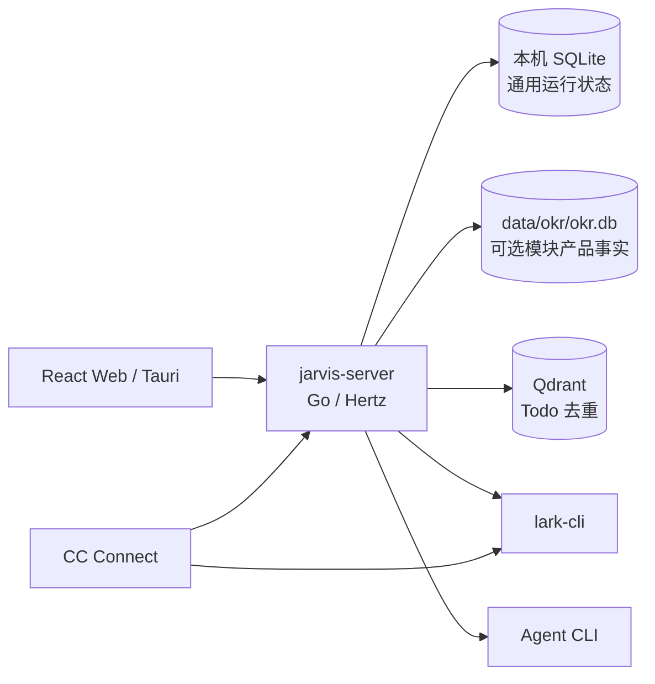
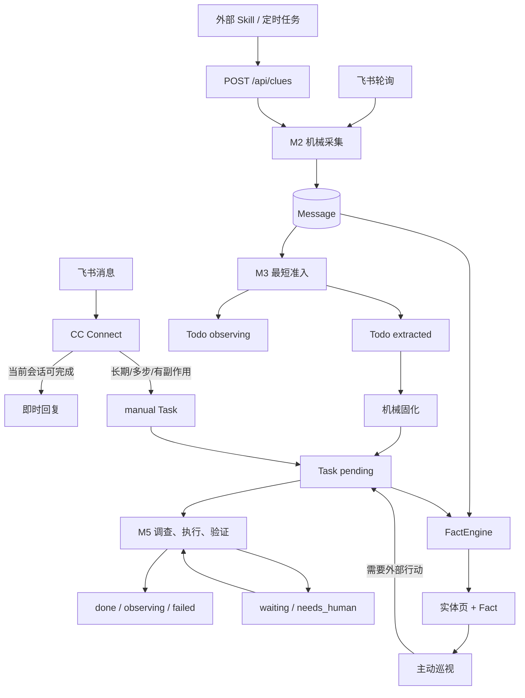

# Jarvis 当前架构与跨模块契约

> Status: current
> Authority: normative architecture
> Last verified: 2026-09-11

本文只定义跨模块稳定边界。字段、路由、默认值、CLI 参数和本机状态以代码、配置及命令帮助为准。

## 1. 系统定位

Jarvis 是单用户、本地可信环境中的主动式任务数字分身。系统由一份世界状态和一个统一执行内核组成：

- **状态**：原始证据、当前实体页、事实索引、Todo、Task 与执行历史。
- **决策**：Agent 根据当前目标和上下文调查现实、选择动作、验证结果并更新状态。

Go 保证持久化、幂等、调度、参数校验和执行留痕；语义判断由 prompts、rules、Skills 和 Agent 完成。阶段职责控制注意力与停止条件，不构成内部权限边界。

## 2. 运行组件

- `jarvis-server` 承载 HTTP、生产前端、M2/M3/M5、调度和后台 Agent；交互式 Chat 也使用主服务的 `/api/chat/*`。
- 本机 SQLite 是通用结构化状态真源；启用 OKR 时，产品事实使用随仓库提交的独立 SQLite。两个连接各自限制为单连接，串行化数据库操作。
- Qdrant 只服务 Todo 语义去重，不是世界模型真源。
- `lark-cli` 负责飞书读写；Agent CLI 负责 M3、M5、对话、世界维护和主动巡视，分别读取所属配置。`bytedcli`、`git` 和 `jarvis-tools` 由 Agent 按需使用。
- CC Connect 独占 Jarvis Bot 的飞书长连接，处理即时对话、卡片回调、文档评论和事件转发。
- macOS App 由 Tauri 启动 `jarvis-app-service` 管理本地子进程；源码安装使用 launchd 或 user systemd。
- 生产前端由 `server.addr` 托管 `web/dist`。Vite 只用于开发，地址从实例配置派生。

监听地址、二进制、模型和调度均来自有效配置，不在架构文档固定本机值。Chat 会话历史持久保存；重启主服务会中断当前轮次。

## 3. 主流水线

### M2：机械采集

M2 保存完整原始事实、来源和外部幂等键，成功后唤醒 M3。它不解释错误、不判断是否值得做，也不为会议、邮件或插件增加专用业务状态。

新来源通过 `source + Skill/定时任务 + POST /api/clues` 接入。来源差异留在外围采集 Skill，不进入核心流水线。

### M3：最短准入

M3 只调查到足以决定：

- `extracted`：存在值得交给 M5 调查和推进的动作线索；
- `observing`：值得保留，但当前不启动 M5。

创建 Todo 时冻结 `source + capture + annotation`。`source` 保留原始语义，`capture` 保存创建时事实，`annotation` 是开放的模型说明。M3 可核验责任、当前状态和已有工作，但不提前完成执行方案、请示判断或深入调查；证据足够即停止。

### Todo 固化

`extracted` Todo 由无模型步骤按 Todo ID/version 幂等创建一个 Task，并把完整 `Todo.content` 复制到 `Task.source_payload`。该步骤不重新判断价值，不重建背景。定时、手工和主动来源也在创建时保存原始指令与冻结背景。

### M5：执行内核

M5 接管 `pending` Task，主动查证真实状态，调整当前目标和范围，选择工具完成动作并验证。上游内容是冻结证据，不是不可修改的执行合同；已通过准入的目标只核验是否完成、失效或重复，不重新进行泛化价值筛选。

| Agent outcome | Task 状态/动作 |
|---|---|
| `completed` | `done` |
| `observing` | `observing`；Todo 来源存在时同步回 observing |
| `waiting` | `waiting`，绑定恢复调度与 Agent Session，到期续跑 |
| `needs_human` | `needs_human` + 一份 `question`，回答后续跑同一 Session |
| `failed` | `failed` |

是否询问 principal 由 M5 根据具体副作用判断，不按 `action_type` 分流。询问副作用和补充信息统一使用 `needs_human + question`；runtime 只负责持久化、卡片渲染、回答传递和版本保护，没有独立批准/驳回接口。

Task 的 `summary` 表示事项总进展，ExecutionRun 的 `summary` 只表示本次运行。外部后果按 Agent 声明原样写入 `effects`，其 `kind` 是开放字符串，不是独立 receipt verifier。

M5 每轮开始时给可达来源消息添加 `OnIt`，本轮离开 `executing` 后 best-effort 删除；消息与 reaction 凭据复用 Run effects，删除失败只告警，不反向改变 Task 结果。

## 4. 上下文与恢复

冻结上下文只组装一次，下游按需展开，不从数据库重新拼一份“等价背景”。消息原文保存在 capture，不按提示词长度截断。实体最新状态通过页面和 Fact 查询，不能替代创建时证据。

执行默认提供直接来源、简报、可展开区块、当前 Task 状态、supplements 和运行概要。会话历史、完整 capture、相关工作和旧 Run 正文按需读取，包括失败尝试及其 effects。

`ExecutionRun` 表示一次进程执行，Agent Session 表示跨 Run 的连续上下文。长等待通过绑定的 `resume_task` ScheduledTask 唤醒；人工回答按 Task version 认领。恢复失败时明确报错，不新建 Session 掩盖上下文丢失。详细决策见 [冻结上下文](decisions/context-snapshot.md)。

## 5. 世界状态与 OKR

世界状态分为：

- 当前实体：PrincipalProfile、Project、KeyMatter、Person、Group、ManagedResource；
- 原始证据：Message、Resource、ScanRecord、TodoEvent、TaskEvent、ExecutionRun；
- 行动状态：Todo、Task、ScheduledTask；
- 长期认知：实体 `summary` 页、Fact、PageRevision；
- 明确关系：EntityRelation 保存需要程序查询、过滤和跨模块投影的带证据映射；
- 周期判断：WorldProgress 保存 Jarvis 对主体在指定周期的证据化评估；
- 只读产物：DailyDigest、晨报和本地 Markdown 报告。

实体页回答“现在是什么”，支持整体读写、字符上限和 CAS；Fact 是带主体、业务时间及原始材料指针的证据索引；PageRevision 保存旧版认知页。叙述性关系使用 `[名字](person:12)` 等页内引用与 backlinks，明确的可查询映射使用 EntityRelation。WorldProgress 不替代外部系统的正式进展。

KeyMatter 表示需长期回看的事项，不等于 Project 或一次执行动作；`closed_at` 表示闭环，`status` 保持自由文本。需要外部行动时另建普通 Task。

FactEngine 在主链路外消费 Message、TodoEvent 和 TaskEvent，按独立游标批量提供完整材料，使用同一 Agent 协议维护当前实体、资料、页面、关系和 Fact。材料超出批次预算时减少行数，不截断单条原文；整轮成功才推进游标，失败重放。它不引入第二套世界状态表。

主动巡视读取这些状态并看护未闭环工作。内部认知可直接维护；任何外部行动统一创建普通 `source_type=proactive` Task 交给 M5。每次实际 Agent 调用保存输入、输出、错误和耗时，不依赖无限续跑会话记忆。

可选 `okr` 模块拥有 Objective、KR、Metric、Point、Owner、周次、Weekly KR Core 和正式 Progress；`biz-okr` 依赖 `okr`，拥有 Plan、标签、Review、评论、评分、Follow-up、催填、Meego 和页面身份。两者生命周期由 AppModule 管理，产品数据在 `data/okr/okr.db`，不复制成世界模型事实。OKR 与世界通过 EntityRelation、Page/Fact 和 WorldProgress 按证据关联，具体边界见 [OKR 模块](modules/06-okr.md) 与 [OKR 世界模型](design-okr-world-model.md)。

字段与迁移以 `internal/domain/`、`internal/store/sqlite.go` 及模块 Store 为准。

## 6. Agent 配置

| 内容 | 真源 | 生效方式 |
|---|---|---|
| 主动程度 | `conf/prompts/initiative-level.md` | M3/M5/proactive 新一轮实时读取 |
| 系统角色与输出协议 | `conf/prompts/` | textstore 固定 key 读取 |
| 阶段工作规则 | `conf/rules/m3.md`, `conf/rules/m5.md` | 只注入所属阶段 |
| Skills | `.agents/skills/`, `conf/skills.yaml` | 正文与启用范围分离 |
| 工具说明 | `internal/toolcatalog/` | 运行时组装 |
| 共享记忆 | `data/shared-memory.md` | 只保存 principal 明确要求的稳定偏好 |
| 运行参数 | `conf/config.runtime.yaml` | 按叶子 key 覆盖基线，重启后生效 |

对话工作区拥有独立的会话、Agent、模型和推理参数，不是 M3/M5 阶段。需要工作事实时按 `jarvis-chat` Skill 查询，不自动灌入完整世界模型。

## 7. 协调与可靠性

`pipeline.Coordinator` 在持久化提交后按实体 ID/version 推进阶段；内存通知只加速，cron 负责恢复漏通知和崩溃后的工作。M3 按 chat 串行、不同 chat 按配置并行；耗时 Agent/外部工具调用在数据库短读写之外执行。实体版本和唯一键拒绝陈旧或重复抢占，只有机器消费的控制字段才做严格校验。

服务名和主服务地址按所选配置解析；脚本和 CC Connect 通过 `jarvis-instance` / `jarvis-api-base` 定位实例。页面分享、通知与问题卡统一优先使用 `server.public_base_url`；未配置时使用实际监听地址的可访问形式，回环链接标注本机访问。

当前限制：

- 没有独立 Goal Store、Supervisor 或结果 Verifier；
- effects 是 Agent 申报，不是外部系统 receipt；
- 外部动作完成到 effects 落盘之间仍可能有崩溃窗口；
- 编辑既有消息不会自动重新唤醒 M3；
- 通用 Resource 下载、解析和内容哈希链路尚未闭环。

路由见 [HTTP API](reference/http-api.md)，部署见 [运行与部署](reference/operations.md)，页面真源是 `web/src/App.tsx`，模块细节见 [文档导航](README.md#当前实现)。
