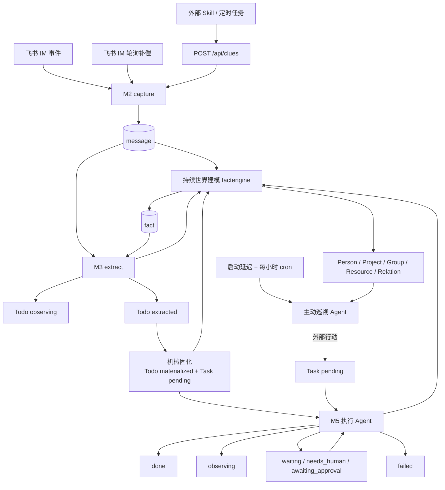

# Jarvis 当前架构与跨模块契约

> Status: current
> Authority: normative architecture
> Last verified: 2026-08-06

本文只描述当前实现的稳定边界，不复制字段级 DDL、完整路由或本机运行值。文档入口与提案/历史分类见 [docs/README.md](README.md)。

## 1. 系统定位

Jarvis 是单用户、本地、低频运行的主动式任务数字分身。它不是规则引擎，也不是通用 Agent 平台：Go 负责持久化、幂等、调度、权限载体和硬状态；模型结合上下文、Skills 和工具完成语义判断。

全局原则以 [`goal.md`](../goal.md) 和 [`AGENTS.md`](../AGENTS.md) 为准：

- fail-fast，不静默 fallback；
- 新来源不新增专用 Go 流水线；
- 模型语义使用完整原文或宽松 JSON；
- 上下文一次冻结、全程复用；
- M5 对任务理解可演进，审批针对具体副作用；
- 文件化 prompt/rule 是唯一正文真源。

## 2. 进程与依赖


- `jarvis-server` 是主进程：HTTP、静态前端、M2/M3/M5、实时协调和补偿 cron 都在同一进程。
- SQLite 是结构化状态真源，服务使用单连接串行化数据库操作。
- Qdrant 当前只服务 Todo 语义去重，不是长期事实真源。
- `traex` 运行 M3 默认引擎、M5 执行、对话、持续世界建模和主动巡视；各阶段的模型和超时独立读取有效配置。
- `lark-cli` 负责飞书读写；`bytedcli`、`git` 和 `jarvis-tools` 由 Agent 按需调用。
- 生产前端由 18800 托管 `web/dist`；18801 是独立 Vite 开发服务。

技术依赖版本以 `go.mod`、`web/package.json` 和本机 CLI help 为准，不在本总纲固化补丁版本。

## 3. 端到端数据流



### 3.1 M2：机械采集

M2 有两个事实入口：

1. 飞书会话发现、principal activity 和 related chat 增量轮询；
2. 外部定时任务/Skill 通过 `/api/clues` 投递原始事实。

M2 保存原文、来源、外部幂等键和资源引用，成功后唤醒 M3。它不解释错误语义、不决定是否值得做、不创建 Todo、不为会议/邮件等来源增加专用状态机。

Jarvis Bot 的飞书长连接由 CC Connect 独占；`jarvis-server` 不启动事件 consumer。M2 按 `scan_schedule` 增量轮询已关联会话并按飞书 `message_id` 幂等落库；普通群和私聊按会话消息流增量读取，话题群按消息自身时间搜索，因此旧话题中的新回复不会受话题根消息水位影响。外部实时事件若要进入流水线只能由 CC Connect 经明确的本机 fan-out 接口转发，不能恢复第二条同 app 长连接。资源链路只稳定采集引用元数据；通用下载、正文回填和内容哈希复用尚未形成完整生产链路。

### 3.2 M3：Task 准入与快照

M3 默认使用 Agent CLI，model API 是可选引擎。它只调查到足以决定是否值得启动一次 M5：判断线索与 principal 的相关性、是否存在未闭环结果、是否需要 principal/Jarvis 介入，以及是否已经完成或重复。它负责：

- 判断新证据是否形成或更新 Todo，以及应为 `extracted` 还是 `observing`；
- 校验 source message / quote；
- 精确、向量和模型辅助去重；
- 在群绑定、原文或短查询能够确认时推算项目归属和仓库提示，保存 `resolution`；
- 冻结 `context_snapshot` 和完整 `extraction_result`。

M3 可以产出：

- `extracted`：存在需要交给 M5 执行 Agent 调查和判断的动作线索；
- `observing`：值得保留，但当前不需要任何人行动。

M3 可以查询责任归属、当前状态、已有 Todo/Task 和明确项目归属，但证据足够作出准入结论后立即停止。它不制定执行方案、不选择具体副作用、不判断审批，也不为丰富 payload 展开代码、commit、MR 或长文档调查。`payload` 是开放的准入简报，只说明相关性、未闭环状态、责任、已核验证据、准入依据和不确定性。

`context_snapshot` 是审计快照，不是实时世界状态。M5 首轮只拿项目、群、交办人和引用消息 ID 等小投影；需要创建时细节再查询这份冻结快照，需要新事实则调用工具，不在下游重拼一份替代快照。

### 3.3 Todo 固化

`extracted` Todo 一律通过无模型的固化步骤创建一个 `pending` Task，并把 Todo 置为 `materialized`。固化继续使用 Todo ID/version 乐观锁、`task.todo_id` 唯一键和同一事务；重复通知返回同一个 Task，陈旧版本 fail-fast。Task 只记录自己的来源与创建时间，不把这一机械步骤包装成判断或确认闸门。

Task 只用一个宽松 `source_payload` 保存来源交来的完整原始语义；Todo 来源直接固化完整 `extraction_result`，定时、手工和主动来源保存各自原始指令。执行 Agent 首轮读取完整 `source_payload` 和冻结 `background` 的小投影，需要时再通过任务查询读取完整背景，不人为制造中间计划或判断上下文。

### 3.4 M5 执行：调查、动作与恢复

Task 可以来自 Todo、手工 API、ScheduledTask 或主动巡视 Agent。执行 Agent 读取完整来源证据、冻结背景的小投影、人工 supplements 和最近运行记录；缺细节时再查询完整冻结背景。Todo 来源已经经过 M3 准入，M5 不从头重复泛化价值筛选；它先核验线索是否因新事实完成、失效或重复，准入仍成立时直接调查真实目标并执行。上游内容是线索，不是不可修改的最终计划。

执行 outcome 与状态映射：

| Agent outcome | Task 状态/动作 |
|---|---|
| `completed` | `done` |
| `observing` | `observing`；Todo 来源存在时同步回 observing |
| `waiting` | `waiting`，绑定 ScheduledTask 和 Codex Session，到期续跑 |
| `needs_human` | `needs_human`，principal 回复后续跑同一 Session |
| `failed` | `failed` |
| `needs_approval=true` | `awaiting_approval`，批准后进入 fresh apply run |

审批由模型根据具体副作用判断，不按 `action_type` 分流。代码提供状态、批准/驳回入口和审计载体。`effects` 的 `kind` 是开放字符串，外部后果按 Agent 声明留痕；当前不是独立 receipt verifier。

Task 的 `summary` 表示事项总进展，ExecutionRun 的 `summary` 只表示本次运行。当前 Store 能更新 supplements、状态、结果和 summary。

## 4. 实时推进与恢复

`internal/pipeline.Coordinator` 接收持久化提交后的轻量通知，按 chat/todo/task ID 和 version 推进工作。内存队列只加速，不承担真源：

- M2 新消息唤醒 M3；
- M3 新 `extracted` Todo 唤醒机械固化；
- 固化创建 Task 后唤醒 M5 执行；
- 各阶段 cron 扫描持久化状态，恢复漏通知和崩溃后的工作。

队列按实体 ID/version 合并等待通知，数据库状态和乐观锁拒绝陈旧执行。M3 以 `chat_id` 为并发隔离键：不同人的单聊和不同群聊受 `extract.concurrency` 控制并行，同一 chat 串行；补偿扫描与实时 M3 互斥，补偿内部再并发不同 chat。SQLite 仍保持单连接串行短读写，耗时的 Agent/工具调查在数据库操作之外并行。

`internal/proactive` 使用独立低成本模型。主进程启动后先等待配置的启动延迟（基线 120 秒），运行第一轮，再按独立 cron 周期运行；同一时刻最多一轮。它以读取世界模型、看护和推进未闭环事项为主要任务；factengine 负责持续建模，但巡视调查中发现明确、有用的内部状态变化时，也可直接使用通用 CRUD 维护并读回，或按判断把原始证据送入统一线索入口。任何外部行动必须创建 `source_type=proactive` 的普通 Task，由同一个 Task Submitter 唤醒强 M5。巡视失败会明确记录，不切换模型，也不阻塞 M2→M3→M5 主链路。每次实际 Agent 调用都在 `proactive_run` 中持久化完整输入 Prompt、最终输出、错误、模型和耗时；运行状态页列表只读摘要，选中一轮后才加载完整正文。

## 5. 世界状态与长期事实

当前世界状态分为：

- 当前背景：PrincipalProfile、Project、KeyMatter、Person、Group、ManagedResource；
- 原始证据：Message、Resource、ScanRecord；
- 行动链路：Todo、Task、TodoEvent、TaskEvent、ExecutionRun；
- 长期事实：Fact、RelationFact；
- 时间触发和总结：ScheduledTask、DailyDigest。

factengine 不新增第二套世界状态表：它通过既有通用 CRUD 工具持续维护上述载体。主动巡视主要消费这些持久状态，也可以在调查过程中维护已经确认的变化；跨轮记忆来自世界模型和事实历史，而不是续跑无限对话 Session。

KeyMatter 承载需要长期记住和定期回看、但不构成项目也不是一次执行动作的事项。是否闭环只由 `closed_at` 表示；`status` 是模型和人维护的自由文本。关键事项本身不进入 Task 执行链路，需要行动时另建普通 Task，进展历史继续写入 Fact 和 RelationFact。

`internal/domain/*.go` 和 `internal/store/sqlite.go` 是字段与迁移真源。不要在文档复制完整 DDL。

持续 factengine 消费 `message`、`todo`、`task` 三种来源并保留独立游标。Message 提供原文，Todo/Task 只投影状态与最终产物，不重复携带已经持久化的背景、快照、来源 payload、计划和执行 prompt。每轮把各来源游标之后的材料合成一个世界变化批次，只启动一次 Agent；材料超过配置的粗粒度字符预算时减少候选行重新取批，降到每来源一行仍超限就把装不下的完整来源材料留到下轮，不截断单条材料；只有第一条完整材料自身超限时允许整条通过。Agent 在真实 Jarvis 工作区运行，使用同一套通用工具按需查询并直接维护当前实体、关系、资料和 Fact，最终自然语言只作审计，不承担机器协议。整次 Agent 会话成功后才推进本批来源游标，失败则保留游标供下次重放；Go 不按来源或实体类型编排语义写入。首次接入 Todo/Task 从事件 0 开始消费已有材料，Message 保留从当前时刻起步的历史边界。

RelationFact 表示两个既有实体之间的自然语言关系和有效期；它没有 predicate/source/confidence/supersede 状态机。

## 6. 文件化 Agent 配置

| 类型 | 真源 | 读取语义 |
|---|---|---|
| 系统 prompts | `conf/prompts/*.md`，在 `internal/textstore/defaults.go` 注册 | 缺失/空正文 fail-fast |
| 工作 rules | `conf/rules/m3.md`、`conf/rules/m5.md` | M3、M5 分阶段读取；正文允许为空 |
| Skills | `.agents/skills/*/SKILL.md` + `conf/skills.yaml` | 正文与启用阶段分离 |
| Shared memory | `data/shared-memory.md` | 作为可信指令块注入 |
| Runtime settings | `conf/config.runtime.yaml` | 覆盖基线配置；重启后生效 |

工具说明由 `internal/toolcatalog` 和 Skills 维护，不复制到每个 prompt。

## 7. 状态真源

### Todo

```text
M3 -> extracted -> materialize -> materialized -> Task -> M5 execution
 └-> observing                              └-> observing（可同步来源 Todo）

fresh evidence 可使 observing 回到 extracted；materialized 不由 M3 随意重开。
```

### Task

```text
pending -> executing -> done | observing | failed
                    ├-> waiting -> executing
                    ├-> needs_human -> executing
                    └-> awaiting_approval -> executing(apply)
```

完整状态守卫以 `internal/execute/store.go` 为准。

## 8. API、页面与运维

- 路由分组：[reference/http-api.md](reference/http-api.md)
- 运行部署：[reference/operations.md](reference/operations.md)
- 页面真源：`web/src/App.tsx`
- 当前主导航：Overview、任务、定时任务、待办、背景、设置、进度、运行状态
- 生产服务监听 `0.0.0.0:18800`；每次发送飞书审批卡片时实时解析当前局域网 IPv4，用于“查看详情”链接

## 9. 当前已知实现缺口

这些是代码事实，不是自动授权的实施计划：

- 尚无独立 Goal Store / Supervisor / Verifier；长任务控制仍是提案。
- `context_snapshot` 是冻结证据，不是版本化 live world state。
- factengine 已消费 message、Todo 和 Task lifecycle event；其它原料来源尚需按同一投影协议接入。
- effects 是 Agent 声明，不是外部系统 receipt 的独立验证。
- Task 的背景和可选计划缺通用更新 API/tool 与审计写入。
- 编辑既有消息目前不会重新唤醒 M3。
- Resource 通用下载、解析和内容哈希复用未闭环。

未来方案见 [文档导航中的提案区](README.md#提案与实现中设计)，不得把提案内容直接当成当前能力。
