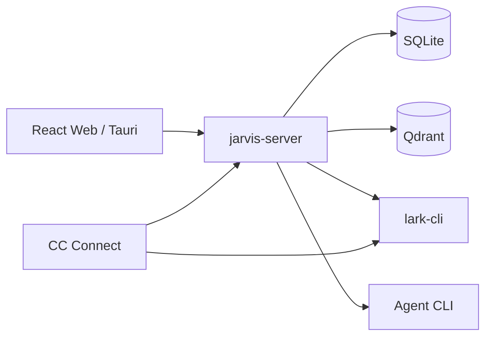
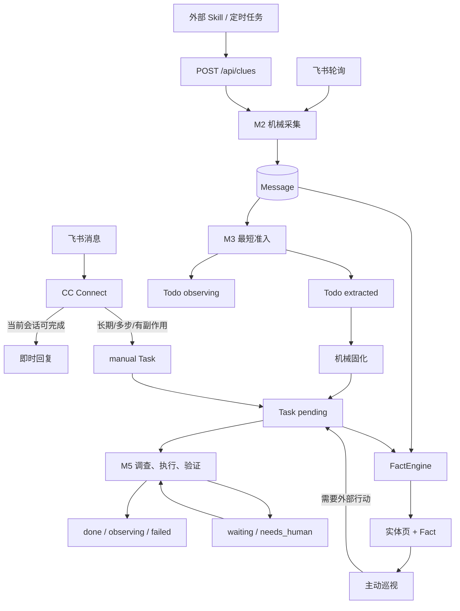

# Jarvis 当前架构与跨模块契约

> Status: current
> Authority: normative architecture
> Last verified: 2026-09-11

本文只定义跨模块稳定边界。字段、路由、默认值、CLI 参数和本机状态以代码、配置及命令帮助为准。

## 1. 系统定位

Jarvis 是单用户、本地可信环境中的主动式任务数字分身。系统由一份世界状态和一个统一执行内核组成：

- **状态**：原始证据、当前实体页、事实索引、Todo、Task 与执行历史。
- **决策**：Agent 根据当前目标和上下文调查现实、选择动作、验证结果并更新状态。

Go 保证持久化、幂等、调度、参数校验和执行留痕；语义判断由 prompts、rules、Skills 和 Agent 完成。阶段职责控制注意力与停止条件，不构成内部权限边界。

## 2. 运行组件



- `jarvis-server` 承载 HTTP、生产前端、M2/M3/M5、调度和后台 Agent。
- SQLite 是结构化状态真源，单进程内使用单连接串行短事务。
- Qdrant 只服务 Todo 语义去重，不是世界模型真源。
- `lark-cli` 负责飞书读写；Agent CLI 负责 M3、M5、对话、世界维护和主动巡视。
- CC Connect 独占 Jarvis Bot 的飞书长连接，处理即时对话、卡片回调、文档评论和事件转发。
- macOS App 由 Tauri 启动 `jarvis-app-service` 管理本地子进程；源码安装使用 launchd 或 systemd。

监听地址、二进制、模型和调度均来自有效配置，不在架构文档固定本机值。

## 3. 主流水线



### M2：机械采集

M2 保存完整原始事实、来源和外部幂等键，成功后唤醒 M3。它不解释错误、不判断是否值得做，也不为会议、邮件或插件增加专用业务状态。

新来源通过 `source + Skill/定时任务 + POST /api/clues` 接入。来源差异留在外围采集 Skill，不进入核心流水线。

### M3：最短准入

M3 只调查到足以决定：

- `extracted`：存在值得交给 M5 调查和推进的动作线索；
- `observing`：值得保留，但当前不启动 M5。

创建 Todo 时冻结 `source + capture + annotation`。`source` 保留原始语义，`capture` 保存创建时事实，`annotation` 是开放的模型说明。M3 不提前完成 M5 的深入调查。

### Todo 固化

`extracted` Todo 由无模型步骤按 Todo ID/version 幂等创建一个 Task，并把完整 `Todo.content` 复制到 `Task.source_payload`。该步骤不重新判断价值，不重建背景。

### M5：执行内核

M5 接管 `pending` Task，主动查证真实状态，调整当前目标和范围，选择工具完成动作并验证。上游内容是冻结证据，不是不可修改的执行合同。

结果映射：

```text
completed   -> done
observing   -> observing
waiting     -> waiting -> 同 Session 恢复
needs_human -> needs_human -> 回答后同 Session 恢复
failed      -> failed
```

是否询问 principal 由 M5 根据具体副作用判断，不按 `action_type` 分流。询问副作用和补充信息统一使用 `needs_human + question`；runtime 只负责持久化、卡片渲染、回答传递和版本保护。

## 4. 上下文与恢复

冻结上下文只组装一次，下游按需展开，不从数据库重新拼一份“等价背景”。实体最新状态通过页面和 Fact 查询，不能替代创建时证据。

执行默认只提供直接来源、简报、可展开区块、当前 Task 状态和运行概要。会话历史、完整 capture、相关工作和旧 Run 正文按需读取。

`ExecutionRun` 表示一次进程执行，Agent Session 表示跨 Run 的连续上下文。长等待通过绑定的 `resume_task` ScheduledTask 唤醒；人工回答按 Task version 认领。恢复失败时明确报错，不新建 Session 掩盖上下文丢失。

## 5. 世界状态

世界状态分为：

- 当前实体：Principal、Project、KeyMatter、Person、Group、ManagedResource；
- 原始证据：Message、Resource、TodoEvent、TaskEvent、ExecutionRun；
- 行动状态：Todo、Task、ScheduledTask；
- 长期认知：实体 `summary` 页、Fact、PageRevision；
- 只读产物：DailyDigest、晨报和本地 Markdown 报告。

实体页回答“现在是什么”；Fact 是带主体和原始材料指针的证据索引；PageRevision 保存旧版认知页。实体关系使用页内引用与 backlinks，不维护通用关系表。

FactEngine 在主链路外消费 Message、TodoEvent 和 TaskEvent，使用同一 Agent 协议维护实体页、资料和 Fact。整轮成功后才推进来源游标。

主动巡视读取世界模型并看护未闭环工作。内部认知可直接维护；任何外部行动统一创建普通 Task 交给 M5。

## 6. Agent 配置

| 内容 | 真源 | 生效方式 |
|---|---|---|
| 主动程度 | `conf/prompts/initiative-level.md` | M3/M5/proactive 新一轮实时读取 |
| 系统角色与输出协议 | `conf/prompts/` | textstore 固定 key 读取 |
| 阶段工作规则 | `conf/rules/m3.md`, `conf/rules/m5.md` | 只注入所属阶段 |
| Skills | `.agents/skills/`, `conf/skills.yaml` | 正文与启用范围分离 |
| 工具说明 | `internal/toolcatalog/` | 运行时组装 |
| 共享记忆 | `data/shared-memory.md` | 只保存 principal 明确要求的稳定偏好 |
| 运行参数 | `conf/config.runtime.yaml` | 覆盖基线，重启后生效 |

对话工作区拥有独立的会话、Agent、模型和推理参数，不是 M3/M5 阶段。需要工作事实时按 `jarvis-chat` Skill 查询，不自动灌入完整世界模型。

## 7. 协调与可靠性

`pipeline.Coordinator` 在持久化提交后按实体 ID/version 推进阶段；内存通知只加速，cron 负责恢复漏通知和崩溃后的工作。

所有耗时 Agent/外部工具调用都在数据库短写之外执行。实体状态、版本和唯一键拒绝重复抢占；未知模型字段保留，机器必须消费的控制字段才做严格校验。

当前限制：

- 没有独立 Goal Store、Supervisor 或结果 Verifier；
- effects 是 Agent 申报，不是外部系统 receipt；
- 外部动作完成到 effects 落盘之间仍可能有崩溃窗口；
- 编辑既有消息不会自动重新唤醒 M3；
- 通用 Resource 下载、解析和内容哈希链路尚未闭环。

模块细节见 [文档导航](README.md#当前实现)。
