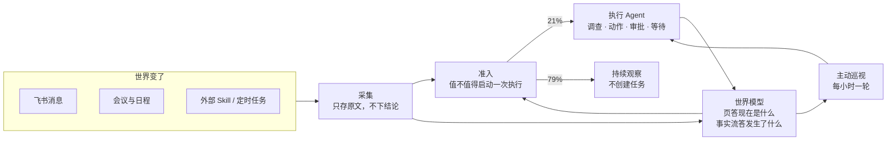

# 主动式数字分身：让 Agent 自己决定该做什么

> Status: article draft（对外文章草稿，非规范文档，不作为实现依据）
> 数据口径：本机单实例真实运行数据，快照时间 2026-08-15 10:23，覆盖 2026-08-02 以来
> 代码口径：2026-07-19 起 381 个提交，299 个 Go 文件约 5.8 万行

## 写在前面

先说一件上周真实发生的事。

一个群里在讨论沙箱环境下怎么统一文件上传工具。有人追问工具网关的 request 参数有没有安全校验、超长 JSON 会不会出问题，另一位同事回了一句「现在倒是没有这种校验」。这条消息被我的 Agent 从群里抽成了一条线索，编号 374。

它调查完之后没有干活。它的结论是：这件事已经由编号 372 的任务承接，正在执行中；374 唯一的新增事实是那句「没有这种校验」的答复；这个事实应该作为 372 判断方案风险和实现边界的证据；374 本身不需要任何动作，以避免重复推进或重复发言。然后它把自己标成了「持续观察」，没有创建新任务，没有在群里说话。

它做对的事不是把活干完，而是**判断出这件事不需要它干活**。

这一个月我一直在打磨的就是这个判断。系统本身很小：一个跑在本地 Mac 上的 Go 服务，一个 SQLite 文件，几个提示词，加十来个 Skill。两周里它收了 4932 条消息，从中抽出 1220 条线索，最终只有 253 条被放行成任务。剩下 967 条，它的结论都是「记下来，但现在不需要任何人做任何事」。

这篇文章讲的是这个 21% 的放行率是怎么设计出来的，以及为什么我认为它比执行能力更难。

### 全文的一句话

> **主动式的分水岭在输入端：别人给 Agent 一个目标，Jarvis 要自己找到目标。**

这句话把它和当前大部分同类工作区分开。长程任务控制面解决的是「人给了 vision，怎么让 Agent 跑一百小时不漂移」；团队级研发 Agent 解决的是「人派了任务，怎么让它进入可追踪的流水线」。这两者的输入端都是一个人下的单。

Jarvis 的输入端是「世界变了」。没有人下单，那 4932 条消息就是全部输入，系统要自己回答哪些值得做。这个差别会一路传导到存储、状态机和权限设计，下面每一节都是它的展开。



图里最重要的一条线是执行结果回到世界模型那一条。沉淀了但取不回来等于没沉淀；决策时拿不到历史认知，Agent 每一轮都在从零推断，做过多少次都不会变聪明。

---

## 一、两个概念，各自推出一批约束

「数字分身」和「主动式」听起来都像形容词，但它们各自都能推出硬约束，这些约束决定了系统长什么样。

**数字分身不是助手。** 助手等指令，分身有代表权。它在群里说话时代表的是我，不是一个工具。代表权推出两件事必须成立：

第一，它的长期记忆必须是我的世界模型，而不是聊天历史。助手可以靠对话上下文工作，因为每次任务边界清楚；分身要在几周后回答「这个项目现在什么状态」，靠的必须是持续维护的外部状态。

第二，它的越界必须受我的审批约束，而且约束要落在代码里，不能靠提示词自觉。有代表权的东西一旦说错话，成本由我承担。

**主动式的核心是系统必须能合法地说「不做」。** 输入端是世界变化而不是人下单，就意味着绝大多数输入的正确处理方式是不处理。这直接推出两个在别处很少见的设计：线索有「持续观察」这一档，主动巡视允许以「NOTHING」结论收尾。

我认为绝大多数主动式 Agent 的失败不在于做不完，而在于**被迫为每个输入制造一件工作**。一个每小时醒来一次、看完一圈说「没事」的系统，比一个每小时制造一件工作的系统难做得多，也有用得多。

---

## 二、让分身看见世界

### 撞过的墙

这一层最早的版本很朴素：把世界状态拼进提示词。实体的几个字段拼成一个 blob，再推几十条最近的事实进去。

它撞墙的方式很具体。提示词字符数涨到 99332 之后，进程直接 `signal: killed`。

更麻烦的是慢性问题。同一时间的实测：一个项目的画像 422 个字符、8 天没变过，而它名下堆了 1089 条事实；另一个项目画像 77 个字符、227 条事实；第三个 25 个字符、72 条事实。画像那一半饿死了，只有事件流在长。

根因不是上下文不够大，是**世界模型没有写读同构的单位**。写入单位是「一条事实」或「一个实体的一个字段」，读取单位是运行时拼出来的投影，两者从来不是同一个东西。后果是 Agent 写下一条事实时无法预演读取者会看到什么，没有反馈回路，于是累积了 238 条重复；「整理」这个动作也失去了对象——不存在「关于这个项目我们现在知道什么」的完整视图，维护动作只能退化成追加。

### 一个实体一页，整体读写

现在的做法是给六类实体（本人、人物、项目、关键事项、群、资料）各一页长期事实，字段名统一叫 `summary`，整体读、整体写。事实表保持不变，职责重新划清：

> **页答「现在是什么」，事实流答「发生了什么」。**

这一句是后面所有设计的依据。页是给判断用的当前状态，事实流是无损的历史底账。三个跟着来的设计决定值得单独讲。

**上限本身就是压缩机制。** 页有 8000 字符硬上限，写超了直接拒绝。代码里的注释把理由写得很直白：

```go
// SummaryMaxChars forces compaction at write time. This is the whole
// mechanism: without a ceiling the agent always appends.
const SummaryMaxChars = 8000
```

而且超限的报错不是单纯拒绝，是教它自救：「summary 有 N 字符，上限 8000。请先压缩：合并旧明细为一句结论、把某一节改成对 fact 的引用、或删除已不重要的内容，再重新提交」。压缩从此是写入路径上绕不过去的动作，不再需要一个独立的压缩作业——之前那个按自然日锚定的压缩层，因为事实是回填的（某天的 144 条在第二天才写入），结构性地漏掉了大部分内容，连续三天产出为 0。

**默认上下文里只放计数，不放内容。** 这一条不做，整个方案就失效：只要还无条件推送几十条事实进提示词，追加就仍然是更省事的路径，页会和之前的画像一样饿死。现在准入阶段的提示词里，事实段落的标题直接叫「世界事实（明细未展开）」，渲染出来是这样：

```text
project:44「公会 Agent 基建」今日 23 条、近 7 天 187 条 —— 需要细节用 list-facts 按主体和日期查。
```

于是读取变成三层：`list-pages` 拿索引（每行是类型、ID、名字、页首行、字符数、最近变化时间），`get-page` 读整页，`list-facts` 按主体和日期下钻明细。`get-page` 的返回里也只给该主体的事实**条数**，不给内容，逼它自己决定要不要下钻。

**关系不建表，用页内 Markdown 引用。** 写法就是正文里的链接：

```markdown
[某同事](person:12) 08-11 决定按不保留历史会话灰度，影响 [Agent Runtime](project:45)。
根因见 [Task 393](task:393)，它更正了 [Task 390](task:390) 的结论。
```

写入时逐个校验目标存在，不存在就直接失败。这一条在代码注释里写明了它真正的作用：**这是防模型编造 ID 的唯一手段**。反查靠六张表 `LIKE` 扫一遍，因为全库实体只有一两百行。原来那张专门的关系表整表废弃，25 条内容不迁移。

并发用 `updated_at` 做 CAS：写入要带 `--if-unchanged-since`，不匹配返回 409，而且响应体带当前全文，让 Agent 基于最新版本重新合并再写。事实引擎和执行 Agent 可能同时改同一个实体，但不为执行 Agent 开第二条写入路径。旧版全文写进独立的 `page_revision` 表，历史不丢。它一开始借住在事实表里，代价很快显现：旧版的时间戳是写页面那一刻，永远排在真实证据之上，于是上一轮自己写下的结论以证据身份回到同一个 Agent 面前。fact 答「世界发生了什么」，旧版答「我们自己的笔记被改过」，是两件事。

### 这一层现在的真实状态

必须说清楚：页机制是最近才上线的，从空开始，不做历史重建。当前覆盖率很薄——99 个人物里 3 个有页，7 个项目里 3 个有页，45 个活跃群里 2 个有页。

事实引擎的三个来源游标都在最新位置，它不会回头读之前两周的历史消息，因此世界模型从上线当天开始积累。加上事实已经撤出默认上下文，接下来一到两周准入判断质量会明显下降——这是设计时就写进文档并接受的代价。历史没有丢失：事实表里 2598 条记录随时可以按主体和日期下钻。

我给这个机制留了两个一周后回看的指标：那个 422 字符 8 天不动的项目页是否开始持续变化，以及单轮提示词字符数是否稳定在几千（对比 99332 那次）。

---

## 三、让分身自己决定做什么

这是全文的重心，也是我花时间最多的地方。

### 反面例子先讲

这条链路上我犯过的错误有共同的形状：**把语义判断写成 Go 代码里的 `if`**。三个真实的例子：

用 `strings.Contains(err, "permission")` 判断错误语义。结果「会议没开录制」「妙记还没生成好」「真的没权限」被压成同一种情况，下游据此产出了假线索。

用 `waiting_minutes`、`permission_denied` 这类枚举，把「为什么还没拿到结果」固化进 Go。这些词看起来是状态，其实是结论，而结论应该由看得到上下文的那一方给出。

采集时按固定字符数截断证据。原文已经落盘了，却只把残缺副本交给下游判断。

这些错误单独看都很小，合起来的后果是同一个：判断质量的天花板被写死在采集层。所以现在这条链路上的分工非常硬。

### 采集层：只做机械动作

采集只做三件事：存原文、按来源加外部 ID 幂等、唤醒下游。然后就结束了。

它不分类、不下结论、不判断要不要重试、不按长度截断。**失败的原始错误全文也是事实**，原样存下来交给模型读。判断「这场会到底有没有开录制」「妙记是还没生成好还是真的没权限」「该不该再等一会儿」全是结合上下文的语义判断，写在提示词里，不写成 Go 的分支。

等待和重试也不在这一层。执行 Agent 有一个 `yield-until` 工具可以把自己挂起到某个时间点，等多久、等几次、什么时候放弃都由模型决定。Go 里没有 `retryDelay` 常量，也没有重试上限。

这样做的直接收益是接入成本。新来源等于**一个新的 `source` 值加一份 Skill**，不是一个新的 Go 模块：写个定时任务让 Agent 自己去外部世界取事实，原样投递回统一入口，判断要点写在 Skill 里。已结束会议扫描和未来日程预扫都是这么接进来的，两者都没有在 Go 里留下任何专属代码；目前经统一线索入口进来的证据有 117 条。

### 准入层：只回答值不值得启动一次执行

准入这一步的职责边界我改过好几版，最后收敛成一句话：**它只调查到足以决定是否值得启动一次执行，证据够了立刻停。**

它判断线索和我的相关性、是否存在未闭环的结果、是否需要我或 Jarvis 介入、是否已经完成或重复；在群绑定或原文能直接确认时记录项目归属和仓库提示。它不制定执行方案、不选择具体动作、不判断审批，也不为了让载荷更丰富就展开代码、提交记录或长文档调查。

它的输出只有两档：

- **放行**：存在需要执行 Agent 调查和判断的动作线索；
- **持续观察**：值得记下来，但当前不需要任何人行动。

两周的实测分布：

| 环节 | 数量 | 占比 |
|---|---|---|
| 采集到的消息 | 4932 | — |
| 形成的线索 | 1220 | — |
| 其中放行 | 253 | 21% |
| 其中持续观察 | 967 | 79% |

**这个 79% 就是「主动式」的实际含义。** 一个从世界变化里自己找目标的系统，它绝大多数时候的正确动作是不动。如果没有「持续观察」这一档，这 967 条只有两个去处：要么被丢掉（那么下次同样的线索还要重新判断一遍），要么被强行做成任务（那么我每天会收到几十个没有意义的东西）。两条路都会让系统在一周内变得不可用。

### 固化层：不调用模型

放行的线索一律通过一个**不调用模型**的固化步骤创建任务，用线索 ID 和版本号做幂等，重复通知返回同一个任务，陈旧版本直接失败退出。

这一步我特意没有包装成「确认」或「二次判断」。理由是判断权必须完整地属于一个持有全部上下文的角色。中间每加一道闸门，都会出现一个只看得到部分信息却有否决权的环节，而这类环节产生的错误最难排查。

### 「持续观察」在执行侧同样是终态

执行 Agent 的结果里也有 `observing` 这一档。代码注释解释了为什么必须留着它：

> 执行可能在调查之后才发现，这件事是真的，但它不要求任何人做任何事。把这种情况压进 `completed`（什么也没做）或 `failed`（什么也没出错）会毁掉这个区分。

真实数据支撑：402 个任务里 107 个以「持续观察」收尾，占 27%。开篇那个 374 就是其中之一。

---

## 四、让分身把事做完，又不越界

### 按动作类型分流审批是错的

这是我在这个项目上想清楚得最慢的一件事。

一个直觉的做法是：给任务打个类型标签，改代码走一条路，发消息走另一条路，只读操作直接放行。我写过这样的代码，也删掉了。

理由很简单：**风险在动作的具体内容里，不在类型名里。** 改代码可能只是改个注释，也可能是删库。发消息可能是回一句「收到」，也可能是对外做一个我兑现不了的承诺。类型标签对风险几乎没有信息量，但它会给人一种已经管住了的错觉。

现在的做法是代码只提供三样东西：一个可以停下来的状态（`awaiting_approval`）、一对批准和驳回的入口、以及事件流和副作用记录。判断尺度只写在一份 30 行的自然语言策略文件里，开篇第一句就是：

> 本策略适用于所有任务的执行阶段。模型结合即将产生的副作用自行判断是否必须先由委托人审批——包括改代码；不要按 action_type 分流。

执行模块的代码里没有任何一处按动作类型分支。策略正文里最能说明尺度的是这两条对照：

写 Jarvis 自己的账本不需要审批——「这些只影响 Jarvis 内部账本，不对外产生任何动作，即使会唤醒后续流水线也不需要审批」。

主动对外发消息需要审批——「即使内容确定且与我负责的项目有关，也必须提交包含目标和完整文案的 proposal 让我审批。不确定的消息同样必须先审批」。

两条并排一放，尺度就清楚了：切的是**对外干扰程度**，不是动作类型。兜底规则也写在最后一行：一个计划里同时有只读步骤和需要审批的步骤，整个计划先审批；无法确定某个动作会不会产生副作用时，按需要审批处理。

顺便说个有意思的细节。这份策略文件是我直接编辑的自然语言，所以里面留着一句我写给它的口语批注：「我发现你现在发的消息，太 AI 味道了，讲清楚点，别用太多术语」。这句话没有对应任何代码，但它确实改变了它的行为。策略正文是文件、是唯一真源、可以被人随手改，这件事本身就是设计的一部分。

审批卡片的时序也有考虑：先持久化提案和 `awaiting_approval` 状态，**再**发飞书卡片。这样卡片出现的时候，确认和拒绝按钮一定已经可用。

### 两周的审批实测

| 事件 | 次数 |
|---|---|
| 模型自己选择停下来请示 | 61 |
| 我批准 | 19 |
| 我驳回 | 12 |
| 仍在等我决定 | 4 |

61 次请示不是代码拦下来的，是模型看着自己即将产生的副作用自己停的。**12 次驳回是这里最重要的数字**——它说明这个闸门不是装饰，模型确实会提出我不同意的方案，而我确实拦得住。

驳回不是回滚：驳回理由会覆盖原提案，任务直接转为失败，不会偷偷改成别的状态再继续。

### 副作用一律留痕

任何对外产生的后果都原样写进执行记录，代码不校验、不重写、不拒绝未知类型——`kind` 是模型自己起的自由字符串。两周里的主要类型：

| 副作用类型 | 次数 |
|---|---|
| 飞书消息 | 186 |
| 权限申请 | 20 |
| 文件写入 | 18 |
| 飞书文档 | 11 |
| 拉群与群成员变更 | 12 |
| 代码评审与评论 | 5 |
| 会议与审批类动作 | 3 |

因为 `kind` 是模型自己起的，同一类动作会出现好几种写法（`file`、`local_file`、`file_download` 都是文件写入）。这是宽松协议的代价，我认为它比强行枚举一套类型划算：类型划错会丢信息，写法不统一只是统计时多合并一次。

这里必须写清一个限定，代码里那段 schema 描述自己就写着：**"Display-only, not verified"**。副作用是 Agent 的声明，不是外部系统回执的独立核验。想做成核验需要一个独立的 verifier，现在没有。

### 它在群里替我说话

前面讲的都是它怎么判断。但「分身」这个词还有另一半：它得真的出现在协作现场。

它有自己的飞书 Bot 身份，可以被 @、可以在原消息的话题里回复、必要时把自己加进目标群。那 186 次飞书消息里，一部分是发给我本人的日报和简报，其余就是这类在协作现场的发言。举一个完整的：某个群里在排查「生成的本地文件上传时找不到」，后来有人确认真实原因不是文件没生成，而是模型调用上传工具时编造了另一个文件名。这条更正需要同步回原话题，于是它自己加入目标群、在原话题里发出了根因修正，并把消息 ID 记回执行记录。

这类对外发言全部走审批。它可以自己判断先调查到什么程度，但**要不要以我的名义说这句话，是我点的**。所以那 12 次驳回不是流程摩擦，它就是代表权的价格。

也有更琐碎的用法：有人在群里 @ 它说一句「你好」，它确认了原消息所在的话题，在同一个话题里 @ 对方回了一句，然后把任务标成完成，并在总结里写明「没有悬而未决的事项」。这件事本身毫无价值，但它验证了一条我很在意的链路：从群消息进来，走完采集、准入、执行，再回到同一条话题里——中间没有任何一步是为「打招呼」这个场景专门写的。

### 等待与续跑

执行 Agent 不是一次性的。它可以：

- **挂起自己**：调 `yield-until` 指定一个时间点和原因，任务转 `waiting`，绑定一个定时触发和当前会话；到期后恢复同一个会话继续跑，不是从头重来。
- **问我**：转 `needs_human`，我回复后同一个会话续跑。
- **停下等审批**：转 `awaiting_approval`，批准后进入一次全新的执行轮次。

两周里挂起了 80 次、续跑了 76 次；问我 35 次，我回了 6 次。

最后这个 35 比 6 的落差是真实的：它问的次数远多于我回的次数。这暴露了一个还没解决的问题——问我这个动作对它来说太便宜了。我倾向于继续压「能查到的自己查」，而不是加一个提醒机制。

### 它真的能查出东西

为了不让这一节只有机制没有效果，举两个真实的执行案例。

一个是主动巡视自己发现并创建的任务（编号 345），标题是「对内巡检 0% 成功率（0/215），阻塞明天对内版上线」。它把结论从「评测整体异常」一路收敛到一个明确的线上入口问题：抽样记录全部是某个 debug-chat 接口返回 502，线上访问日志显示对应 controller 的具体报错。这不是总结消息，是一次真的排查。

另一个来自群消息线索（编号 396）。有人在群里贴了两条日志和截图，说 PPE 环境的技能报错。它自己去核验了这两条 trace，确认主链路都执行成功并返回了结果，真正的失败点分别是生产环境某个工具没有发布版本、PPE 环境读取一份参考文档出错——也就是说，截图里看起来是同一个问题，实际是两个环境的两个不同原因。

这两个案例的共同点是：它给出的结论比线索本身更具体。这是我判断这套东西有没有用的唯一标准。

---

## 五、主动巡视：NOTHING 是一个高质量结果

前面三节讲的都是「有输入之后怎么办」。但一个数字分身还要回答一个更难的问题：**没有新输入的时候，它该干什么？**

现在的答案是每小时醒来一轮。输入极简到只有四块：系统提示词、共享记忆、工具目录，和一个心跳块。心跳块的全文就这么几行：

```text
当前时间：2026-08-15T09:22:00+08:00
时区：Asia/Shanghai
现在执行一轮完整主动巡视。不要假设存在必须创建的 Task。
```

最后一句是防御性的。世界状态一概不推送，全靠它自己用工具查。

提示词里写死了它的使命顺序：先维护未闭环的事项，再看今天的新变化。也写死了克制：

> **保持克制**：调查后没有值得推进的事，就安静结束。NOTHING 是高质量结果，不要为了显得主动而制造 Task。

单轮边界也是硬的：默认每轮创建 0 到 1 个新任务，多个事项都有独立证据且今天确实紧急时最多 3 个；启动已有任务、更新和关闭都不计入上限；不执行自己刚创建的任务，不在同一轮回头检查自己的写入结果来找更多工作。

### 一轮真实输出

这是它最近一轮的原话，我一个字没改：

> **查了什么**：未闭环关键事项 1 个、启用资源 32 个（在 50 上限内）、非终态 Task 7 个、今天消息 5 条（均为闲聊无待办）、定时任务 83 个（含 3 个活跃）、今天 Todo 29 条（materialized 全部已处理）、昨天日报（Task 385 done）。
>
> **Task 维护**：无需操作。7 个非终态 Task 状态均合理……
>
> **新 Task**：0。今天仅有 5 条闲聊消息（Qwen 模型讨论），没有可执行事项。
>
> **本轮结论：NOTHING** —— 系统处于健康的状态。

我认为这段输出比任何一次成功执行都更能说明问题。它查了七类对象、逐个核对了 7 个未闭环任务的状态是否合理、确认了昨天的日报已完成，然后决定什么都不做。

### 为什么外部动作必须转成任务

巡视有一条硬边界：它不得直接改变外部业务世界。不发消息、不改代码、不提交、不创建 MR、不修改外部文档、日程、审批和飞书任务。任何需要外部副作用的工作，都必须创建一个普通任务，把完整证据和成功标准交给执行 Agent。

这条边界有四层理由，缺一层都不足以让它成立：

1. **能力隔离**。巡视用的是独立的低成本模型，因为它每小时跑一次。外部副作用需要执行 Agent 的判断质量。
2. **审批载体**。只有任务有 `awaiting_approval` 状态、批准和驳回入口、副作用记录。绕过任务就绕过了整套审批基础设施。
3. **单一执行入口**。巡视创建的任务和线索放行的任务走完全相同的入口，不为来源开专用链路。
4. **有界性**。任务有明确的创建上限，而一个可以直接产生副作用的巡视循环没有天然边界。

代码侧对应的硬边界也不是靠提示词自觉：巡视用的几个写命令要求环境变量标明当前阶段，其它阶段调用直接被拒；`awaiting_approval` 的任务只允许更新进展摘要，标题、目标和执行指示改不动——因为那张审批卡片背后是一个具体方案，在我看卡片的时候悄悄换掉方案会让审批本身失去意义。

两周跑了 350 轮。**其中有失败的，最长的一轮跑到 15 分钟超时。** 失败会明确记录，不切换模型，也不阻塞主链路。

---

## 六、和相邻工作的定位差异

读到这里大概会问：这和长程任务控制面、和团队级研发 Agent 是什么关系。我认为它们解决的是三个不同的问题，放在一起看反而更清楚。

| 维度 | 本项目（个人数字分身） | 长程任务控制面 | 团队级研发 Agent |
|---|---|---|---|
| 输入是什么 | 世界变了：消息、会议、日程、外部线索 | 人给的 vision 和 goal | 人派的研发任务 |
| 目标从哪来 | Agent 自己从世界变化里推断，多数时候结论是无事可做 | 人维护，Agent 长程推进不漂移 | 团队统一定义工作方式与规范 |
| 状态属于谁 | 我的世界模型，绑定我个人 | 项目的目标状态与证据链 | 团队的生产线与流程 |
| 什么算成功 | 该动的时候动了，不该动的时候没动 | 长时间弱看护下状态不漂移 | 任务可追踪、可介入、可验收 |
| 主要风险 | 判断错：该做的漏了，不该做的做了 | 目标漂移、状态丢失 | 流程成本高于收益 |

**三者不冲突。** 它们分别回答「要不要做」、「怎么长期做完」、「怎么让团队复用」。这个项目赌的是第一个问题最难，而且做的人最少。

还有一个更近的对照。我看过一篇讲个人工作流的文章，作者把人的角色总结成「context 装配师」——人的活是把上下文在需求群、本地、开发机和 bot 之间接好，让它流到该在的位置，执行和答疑交给 Agent。我很认同那个描述，但这个项目想把**装配这一步也交出去**。代价很直接：它必须自己维护世界模型，而世界模型的质量直接决定判断质量。这也是为什么第二节那面墙（99332 字符、画像饿死）不是一个性能问题，而是一个方向问题。

---

## 七、现在还不成立的部分

写清楚边界比多讲一个能力更重要。以下都是代码事实，不是路线图。

**没有独立的目标存储、监督者和验证者。** 任务完成主要来自执行 Agent 自己的声明。长任务控制仍然是提案。

**副作用没有外部回执核验。** 前面说过，它是声明，不是 receipt。

**冻结的上下文快照不是版本化的实时世界状态。** 它是线索被放行那一刻的世界，整份传给执行 Agent，下游不做投影和重拼；需要某个实体**现在**的状态时另外读它的页。这个设计是刻意的，但它确实意味着快照会过时。

**世界模型页的覆盖率还很低**，见第二节末尾的数字。

**编辑已有的飞书消息不会重新唤醒准入判断。**

**执行记录还没有作为事实引擎的独立来源接入。**

**402 个任务里 52 个失败**，占 12.9%。这个数字我没有藏起来的理由，它是当前判断和工具链的真实水位。

还有一个我认为是真问题的：前面提到的「问我 35 次、我回 6 次」。它现在还没有很好的办法区分「这个问题只有我能回答」和「这个问题我懒得查所以问你」。

---

## 总结

这一个月真正做的事，是把「决定该做什么」这件事从我脑子里挪到一个可以持续运行的系统里，并且给这个系统三样东西：

**一份能被读回来的世界状态。** 六类实体各一页长期事实，整体读写、有硬上限、超限必须压缩；页答现在是什么，事实流答发生了什么；默认上下文只给计数，明细靠下钻。写读同构是这一层唯一的要求，其余都是它的后果。

**一条不替模型做判断的采集与准入链路。** 采集只存原文，错误原文也是事实；准入只回答值不值得启动一次执行，证据够了立刻停；放行之后不再加闸门，判断权完整属于持有全部上下文的执行 Agent。79% 的线索停在「持续观察」，这不是漏做，这就是主动式的常态。

**一套只管硬边界、不替模型判断风险的执行与审批机制。** 审批不按动作类型分流，尺度写在一份可以被我随手编辑的自然语言策略里；代码只提供一个能停下来的状态、一对批准驳回入口和一条留痕。两周里它自己停了 61 次，我驳回了 12 次。

再加上一个每小时醒来、经常什么都不做的巡视循环。

工具会变，模型会变。我现在确定的是这一条：

> **主动式 Agent 的难点从来不是把活干完，而是在绝大多数时刻正确地什么都不做。**

---

<!--
对外发布前需要处理的三件事：
1. 人名与内部标识脱敏：正文已避免出现同事实名，但案例里的接口路径、服务名、群名如需对外发布仍应泛化。
2. 数字口径复核：所有数据取自本机单实例、快照时间 2026-08-15 10:23；发布前重跑同样的查询并更新口径行与正文数字。
3. 配图：正文一张 Mermaid 流程图可直接转飞书画板；另建议补三张——世界模型读取三层（索引 / 整页 / 事实明细）、准入漏斗（4932 / 1220 / 253）、执行状态机与审批分叉。
-->
