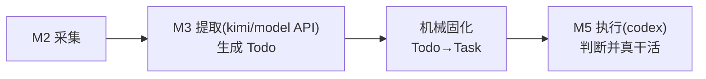
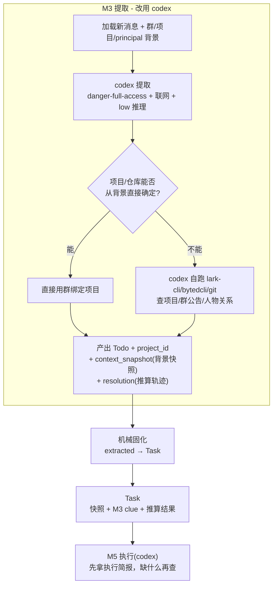

# 关键设计：上下文链路重设计（M3/M5 全链路上下文传递）

> Status: implemented-history
> Authority: non-normative implementation record
> Last verified: 2026-08-02 @ `89fa24b`
> Current behavior: `docs/00-overview.md`, `docs/modules/03-task-extract.md`, `docs/modules/05-execution.md`

> 所属系统：基于飞书的本地个人 Jarvis 管家（Principal 由初始化配置与 M1 Profile 确定，本地 Mac 可信环境）
> 隶属总纲：`docs/00-overview.md`。本文保留当时的设计与实施顺序，不再作为当前字段、模型版本或工具说明的权威来源。
> 本文定位：一份**跨 M3 与 M5 执行**的专项设计，解决"上下文在链路上逐级丢失、项目/仓库推算缺失"的问题。当前链路以总纲和模块文档为准。
> 设计原则：本地可信明文 · fail-fast · 不擅自处理历史数据 · 模块化 · 优先已有实现与官方 CLI · 复杂度红线。

---

原始提示词，保留：
所以这里M3生成todo的时候，

输入是当前已有的上下文，

1、这些上下文也放在todo的背景信息里面，直接作为一段提示词，（比如feishu群绑定了项目，，需要自动放项目信息）

2、 比如群和项目没有绑定，如果没有放项目信息，这种情况，提供一批 决策工具（和会话历史工具类似）可以查询 当前项目，项目进度，老板是谁，同事有哪些，XX同事和主体的关系，等等，你要设计一批决策工具

3、现在M3 推算是怎么推算的

4、信息不足时，这个todo判断重点来了，可以根据上下文用工具，一、进一步尝试自动补充信息，二、如果实在拿不到上下文，可以把要问的问题带着走，三、可以直接产出todo，四、什么都不做，判断任选一个

结合我之前的目标：你说的不对，我想要达到的效果是，比如 我的leader让我去读下agent runtime项目 agent loop代码，或者我说我回去读下 agent runtime项目 agent loop代码，这些上下文都在，一起进提示词，生成todo，todo也附带着上下文，然后再生成task，这个时候，要根据todo的上下文（谁提出的，群消息， 项目背景， 群公告等） ，想办法推算出，是哪个项目，项目地址是哪个（推算，或者是从绑定项目的代码资源里面找），然后，就是这个task是带上下的，明确的，任务，再一起交给执行者，就是这个链路，上下文都是传递的，可以有压缩总结，但是上下文都在

你重新设计下整理流程和方案，整体给我设计下这块，写成关键设计方案

## 版本说明


| 项        | 内容                                                                                                                                                                              |
| -------- | ------------------------------------------------------------------------------------------------------------------------------------------------------------------------------- |
| 提出背景     | 用户目标：leader 交办或本人提出"读 agent runtime 项目 agent loop 代码"这类任务时，系统要把"谁说的、哪个群、项目背景、群公告"等上下文一路带下去，并**推算出是哪个项目、仓库地址是什么**，最终交给执行者一个"上下文完整、目标明确"的 Task。                                   |
| 核心变更     | ① M3 提取引擎默认改用 **codex**（现有 kimi/model API 链路保留为备用）；② codex 提取时可**自跑 lark-cli/bytedcli/git** 查项目/人物/群公告；③ Todo 生成时就**固化一份背景快照**并**推算 project_id**；④ Task 机械固化并由 M5 执行复用同一份快照。 |
| codex 权限 | M3 的 codex 调用使用 `--sandbox danger-full-access` + 联网（本地可信环境，用户已认可）。统一加 `-c model_reasoning_effort=low` 覆盖用户全局 `xhigh`，控制单次耗时。 |
| 历史数据     | `context_snapshot` 非空是 Todo 固化为 Task 的硬前提，为空即 fail-fast，不保留回退或临时拼接分支。 |
| repos 数据 | 本轮**先不填** `Project.repos`，只打通"推算 + 上下文传递"链路。repos 为空时 M5 不阻塞，codex 自行想办法。                                                                                                       |
| 不做       | 不为 M3 封装一批 Go 决策工具（lark-cli/bytedcli 命令太多）；不给 codex 维护命令清单（提示词只给简短指引，让它自己 `--help` 探索）。                                                                                         |


---


## 0. 现状与断点（已核实，带证据）


### 0.1 现有链路




### 0.2 三个断点


| 断点               | 现状                                                           | 证据                                                                   |
| ---------------- | ------------------------------------------------------------ | -------------------------------------------------------------------- |
| **1. 项目推算缺失**    | `Todo.project_id` 只从群绑定项目继承；模型输出的 `project_hint` 被完全忽略（无消费点） | `internal/extract/persist.go:258`、`internal/extract/candidate.go:69` |
| **2. 上下文不固化**    | Todo 无背景快照字段；下游建 Task 时才临时 Snapshot 并冻结进 Task        | 当时的 Todo→Task 落库路径      |
| **3. repos 数据空** | 项目库有 `Agent Runtime` 等，但 `repos` 全 NULL；即便关联上也拿不到仓库地址        | project 表 `repos` 字段实测全空                                             |


### 0.3 关键技术约束

- `project_id` 是 M3 **去重指纹**的组成部分（`internal/extract/candidate.go:188`），且语义去重按 `project_id` 过滤（`internal/extract/dedup.go:74`）。→ 这是"推算必须放 M3、project_id 尽早定死"的根本理由：若 M3 落库时 project_id 空、下游再改，同一条线索下次提取会因指纹变化而**重复创建 Todo**。
- M3 现用 kimi/model API，其工具循环 `ExtractWithTools`（`internal/extract/tool_loop.go:22`）是**应用层 function-calling**，模型只能调 Go 注册的工具（`query_chat_history`/`query_resources`），**不能自跑 shell**。→ 要"让模型自跑 lark-cli/bytedcli"，引擎必须换成能执行命令的 codex。
- **已实测**：codex 0.144.1 在 `--sandbox workspace-write -c sandbox_workspace_write.network_access=true` 下成功执行 `lark-cli contact whoami` 并返回真实 JSON（非编造）。macOS 沙箱网络在本机可用。

---


## 1. 目标链路（重设计后）




核心思想：**上下文只在 M3 组装/推算一次，固化进 Todo，之后机械固化到 Task 并由 M5 执行全程复用同一份**——这既保证"上下文都在、可传递、可压缩"，又避免下游重复查库、结果漂移。

---


## 2. 分模块设计


### 2.1 模块 A：codex 提取器（M3 引擎切换 + CLI 自查）

**目标**：M3 可在 `codex` 与 `model_api`(现有 kimi) 之间按配置切换；codex 引擎下 codex 作为 agent 自己决定要不要查、查什么——**我们不给它写 Go 工具循环，只给它 CLI 工具（§2.2）+ 一段提示词**。

**关键认知：codex 是完整 agent，不是纯模型。** 它自带执行 shell、读写文件、多轮思考的能力。所以接 codex：

- **不实现** `ExtractWithTools`/`tool_box`/`tools` 那套 function-calling（那是 kimi 专用，留给备用引擎不动）。
- codex 提取器 = **复用 M5 已有的** `internal/execute/codex_runner.go` **调用范式**（已能跑 `codex exec --output-schema` 拿 JSON），换提示词和 schema 即可。我们**发一次、收一次 JSON**；多轮工具调用是 codex 在它自己进程内完成的。

具体：

- **保留备用**：`internal/extract/provider/client.go`（kimi）与其工具循环不动，由配置 `extract.engine` 选择走 codex 还是 kimi。
- **codex 调用**：`codex exec --ephemeral --sandbox danger-full-access --json --output-schema <TodoSchema> --model gpt-5.5 -c model_reasoning_effort=low`；沿用现有 `internal/extract/provider/schema.go` 的 Todo JSON schema 强约束输出。
- **提示词结构**（改 `internal/extract/prompt.go`，就一段）：`任务说明 + principal/群/参与者背景（我们预查好拼入）+ [new]/[context] 会话 + 一节"你可用的工具" + 输出 schema 要求`。"你可用的工具"一节大意——
  > 你运行在本地可信环境，可执行 shell。需要补充信息时可用：`jarvis-tools <子命令>`（Jarvis 自带的决策查询工具，见其 `--help`，输出 JSON）查记忆/历史消息/项目/人物/群；`lark-cli`、`bytedcli`（先 `--help` 自行探索子命令）查飞书侧信息；`git` 查仓库。查询结果用于判断归属与背景；但**只有被引用的 [new] 消息才能作为证据**，工具查到的内容不得当作新证据。
- **消费 project_hint（打通断点 1）**：codex 输出的 `project_hint`（项目 code 或 name）在落库前解析成 `project_id`——按 `project.code`/`project.name` 精确匹配；匹配不到则留空并记入 `resolution`。群绑定项目仍是**最高优先级信号**。


### 2.1a 决策工具 CLI 规范（`jarvis-tools`，codex 的自查工具集）

**决策（用户拍板）：我们自己的能力（查记忆/历史消息/项目/人物/群）一律做成 CLI 子命令，交给 codex 按需自跑**——不预塞提示词、不做 MCP、不做 Go 工具循环。

- **独立 CLI** `scripts/jarvis-tools`（经 `jarvis-server` HTTP API 访问数据，职责单一：给 agent 调）。
- **输出契约（严格）**：每个子命令把结果以**紧凑 JSON 打到 stdout**，错误信息打到 stderr 并以非零退出码结束（fail-fast）。stdout **只有 JSON**，不掺日志——codex 才能稳定解析。
- **分阶段使用**：M3 调用查询子命令；受控写子命令仅供 M5 执行或用户直接要求时调用。
- **复用现有实现**：CLI 经 `jarvis-server` HTTP API 复用现有 service，不直连数据库、不另写一套查询逻辑。

子命令集（参数与 JSON 字段实现时定稿）。**本轮先做核心 5 个（打通项目推算所必需）**，`search-memory`/`query-messages` 用户已定**用到再补**：


| 子命令                                                                      | 本轮  | 作用                           | 数据源                       |
| ------------------------------------------------------------------------ | --- | ---------------------------- | ------------------------- |
| `jarvis-tools list-projects`                                             | ✅   | 列全部项目（含 `repos`/`code`/描述）   | SQLite `project`           |
| `jarvis-tools get-project --id <n> | --code <c>`                         | ✅   | 查某项目详情                       | SQLite `project`           |
| `jarvis-tools get-group --chat-id <id>`                                  | ✅   | 查群详情（群公告 `description`/绑定项目） | SQLite `feishu_group`      |
| `jarvis-tools get-principal`                                             | ✅   | 查 principal 自身背景与直属 leader   | SQLite `principal_profile` |
| `jarvis-tools get-person --open-id <id>`                                 | ✅   | 查人物（角色/是否 leader/关系）         | SQLite `person`            |
| `jarvis-tools query-messages --chat-id <id> [--keyword <k>] [--limit N]` | 后补  | 查本地历史消息                      | SQLite `message`           |


> 外部 `lark-cli`/`bytedcli`/`git` **不封装**，codex 直接跑（它们本就是外部可执行文件）。`jarvis-tools` 只补"我们自己的库/记忆"这部分 codex 摸不到的数据。
> M5 执行同样可用这套 `jarvis-tools`（共享一套工具，不重复造）。


### 2.2 模块 B：Todo 背景快照固化（打通断点 2）

给 `Todo` 增加两个 JSON 字段（`internal/domain/models.go`）：

- `**context_snapshot**`（生成 Todo 时固化）：`{principal, group(含公告/description), project(含 repos), assigner, messages, memories}`。
- `**resolution**`（项目推算轨迹）：`{method: group_bound | codex_cli | unresolved, project_id, repos_hint, confidence, basis}`——让用户和执行者都能看到"为什么判成这个项目/仓库"。

机械固化 Task 时，**直接复用 Todo 的** `context_snapshot`（不再重新 Snapshot），保证全链路同一份上下文。

> **fail-fast**：固化 Task 时强制要求 `context_snapshot` 非空，为空即报错暴露问题，不保留任何回退或临时拼接分支。


### 2.3 模块 C：机械固化消费快照

- `status=extracted` 的 Todo 直接读取 `Todo.context_snapshot` 并固化为 Task，不调用模型。
- Task 不人为生成中间 `plan`；M3 的完整 extraction result 作为 `source_payload` 交给 M5 执行，由它调查后决定是否继续、观察或询问 principal。


### 2.4 模块 D：执行环节先拿简报、按需下钻

- 执行环节提示词（`internal/execute/prompt.go`）只投影当前项目、群、交办人和引用消息 ID；完整 `task.background` 保留在 Task 上，通过 `get-task` 按需读取。
- `task.repo_path` 只接受调用方明确选定的工作副本，不从 `project.repos[]` 默认取第一项；未明确指定时 M5 继承 Jarvis 当前工作目录，再按任务语义自行定位仓库。
- 未明确指定 `repo_path` 时**本轮不阻塞**：codex 继承 Jarvis 当前工作目录，可通过完整背景与 `git`/`lark-cli` 自行定位需要的仓库；只有确实无法查明时才如实报告缺口。


### 2.5 模块 E：前端展示（对人友好）

- 待办页 / Todo 详情：展示 `resolution`（推算出的项目 + 仓库 + 理由）和精简后的 `context_snapshot`。
- 复用上一轮已加的 `web/src/slots.tsx`（只展示非空字段）的思路，避免铺裸 JSON。

---


## 3. 配置变更

`conf/config.yaml` + `internal/config/config.go`：

```yaml
extract:
  engine: "codex"                       # 新增：codex | model_api（备用 kimi）
  codex_sandbox: "danger-full-access"   # 新增：M3 codex 权限
  codex_network: true                   # 新增：开联网跑 lark-cli/bytedcli
  codex_reasoning_effort: "low"         # 新增：覆盖全局 xhigh，控耗时
```

> 用户全局 `~/.codex/config.toml` 设的是 `model_reasoning_effort = "xhigh"`，Jarvis 每次调用必须显式 `-c model_reasoning_effort=low` 覆盖，否则继承 xhigh 会更慢。

---


## 4. 实施顺序（小步提交，每步 build/vet/test）

1. **文档**（本文）+ 修订 `00`/`03` 被推翻的旧约定（见 §8）。→ 用户过目
2. 模块 B：Todo 加 `context_snapshot`/`resolution` 字段 + GORM 迁移。
3. `jarvis-tools` **CLI**（§2.1a）：维护 `scripts/jarvis-tools` 单一入口，查询命令 stdout 纯 JSON；受控写命令只供执行阶段按需调用。这是 agent 自查的前置基础设施。
4. 模块 A：codex 提取器（复用 M5 codex_runner 范式）+ `extract.engine` 切换 + 提示词工具指引 + `project_hint→project_id` 解析。
5. M3 落库时生成并写入 `context_snapshot`/`resolution`。
6. 模块 C：机械固化读取快照（`context_snapshot` 为空即 fail-fast 报错）。
7. 模块 D：执行环节仓库路径解析。
8. 模块 E：前端展示。
9. 清空旧 `todo`/`task` 派生数据 + 全量验证 + 端到端用测试消息（"读 agent runtime agent loop 代码"）跑通。

---


## 5. 性能与安全

- **耗时**：codex 联网自查比 kimi 慢（实测查一次 lark-cli 约 31s）。用 `model_reasoning_effort=low` 压低单次耗时；M3 是 10min 一轮批处理、延迟不敏感，可接受。不额外限制"仅未绑定项目才联网查"——保持逻辑简单（复杂度红线）。
- **安全**：`danger-full-access` 意味着 codex 提取时能读写整机、能联网。**本地可信环境**下用户已认可（总纲 §0.1）。这是本方案的显式前提，非疏漏。

---


## 6. 与总纲/复杂度红线的关系

- 总纲 §1 原写"LLM 抽取(M2/M3) 用 model API / LLM 判断用 codex"。本方案将 **M3 主引擎改为 codex**（model API 保留备用），属于对总纲 LLM 分工的调整，需同步更新总纲 §1 表述（见 §8）。
- 复杂度红线：本方案**不新增重型设施**（不加向量库、不加独立进程、不加多级调度）；核心是"引擎切换 + 一个快照字段 + 一次 project 解析"，用已有的 codex 子进程能力承载"自查"，符合"能用一次 LLM 调用解决就不上重设施"。

---


## 7. 数据契约（新增字段草案）

```go
// Todo 新增（internal/domain/models.go）
ContextSnapshot datatypes.JSON `gorm:"column:context_snapshot;type:json"` // 生成时固化的背景快照
Resolution      datatypes.JSON `gorm:"column:resolution;type:json"`       // 项目/仓库推算轨迹
```

`resolution` 示例：

```json
{
  "method": "codex_cli",
  "project_id": 45,
  "project_name": "Agent Runtime",
  "repos_hint": "agent-runtime",
  "confidence": 0.8,
  "basis": "消息提到 agent runtime + agent loop；lark-cli 查群公告确认该群主题为 Agent Runtime 攻坚"
}
```

---


## 8. 会修订的现有文档约定（按"文档删除/改动需重点确认"原则单列）

以下是**当前文档写死、本方案要改**的地方：


| 文档位置                                        | 旧约定                                | 改为                                                                  |
| ------------------------------------------- | ---------------------------------- | ------------------------------------------------------------------- |
| `docs/00-overview.md` §1 表                  | LLM 抽取(M2/M3) 用 model API          | M3 主引擎改 **codex**，model API 保留备用                                    |
| `docs/modules/03-task-extract.md` L16       | "只有下游判断才用 codex，M3 不用"          | M3 默认用 codex；kimi 备用                                                |
| `docs/modules/03-task-extract.md` §0.3 / 落库 | `Todo.project_id` 从群绑定继承           | M3 用 codex 推算（群绑定仍最高优先级）                                            |
| Todo→Task 固化               | Task 背景在建 Task 时从 SQLite 临时读 | 背景在 **M3 就固化进 Todo**，固化器直接复用；`context_snapshot` 为空即 fail-fast，不保留回退分支 |


> 这些修订仅调整"引擎与上下文固化时机"，不改变 Todo/Task 拆分、7 实体、fail-fast 等核心契约。
