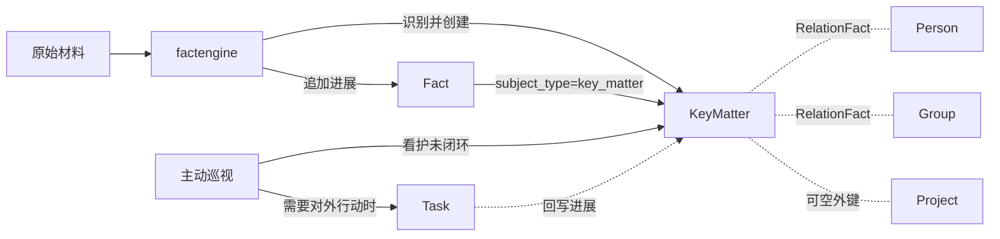

# KeyMatter：关键事项实体

> Status: implemented-history
> Authority: normative design
> Last verified: 2026-08-06 @ `codex/jarvis-workspace-snapshot-20260805`

## 1. 缺口

当前世界模型的当前状态载体是 `PrincipalProfile`、`Project`、`Person`、`Group`、`ManagedResource`；历史载体是 `Fact` 和 `RelationFact`。

缺少一类实体：**一件持续存在、需要被记住和跟进，但不构成项目的事**。例如「和法务对齐某项合规口径」「某人的入职交接」「一次对外合作谈判」。这类事在现有模型中只能被拆成两种残缺形态：

- 拆成一串独立 `Task`：每个 Task 执行完即进入 `done` 终态，事情本身的连续性无处承载；
- 拆成一堆 `Fact`：`Fact` 当前只被挂在 project / group / person 上，一件横跨多个群和多个人的事，其进展被迫散落到不同主体，无法完整读回。

本方案新增 `KeyMatter`（中文：关键事项），作为与 Project、Person、Group 平级的第四类当前状态载体。

## 2. 概念边界

三者的区分必须先定死，否则实际使用中会退化成同义词。

| | 定义 | 谁在动它 | 如何结束 |
|---|---|---|---|
| `Task` | 一次需要办完的动作 | M5 执行 | `done` / `failed`，终态 |
| `KeyMatter` | 一件需要长期记住并定期回看的事 | 只被读取和更新，**永不交给 M5 执行** | 事情本身闭环后关闭 |
| `Project` | 长期工作容器，含仓库、角色、技术栈 | Task 的执行归属 | 项目结束后归档 |

判据：需要「现在去做点什么」的是 Task；需要「一直记着」的是 KeyMatter。一个 KeyMatter 的生命周期内可能派生 0 到 N 个 Task，也可能一个都不派生。

KeyMatter 比 Project 轻——没有仓库、没有 role、没有优先级分档；比 Task 重——不随一次执行结束而终止；且可以不属于任何 Project。

## 3. 数据模型

新增 `key_matter` 表，定义在 `internal/domain/models.go`，注册进 `CoreModels()`。schema 由 `store.Migrate` 的 `AutoMigrate` 生成，不写迁移函数。

```go
// KeyMatter is a long-running thing worth remembering that is not a Project and
// not a single executable action. It is never materialized into a Task; agents
// read and update it, and its history lives in Fact rows with
// subject_type=key_matter.
type KeyMatter struct {
	ID    uint64 `gorm:"column:id;primaryKey;autoIncrement"`
	Title string `gorm:"column:title;not null"`
	// Status is a free-text label ("等法务回复", "本周收口") written for humans.
	// It is deliberately not an enum and is never parsed by code: whether the
	// matter is still open is decided by ClosedAt alone.
	Status  string  `gorm:"column:status;not null;default:''"`
	Summary *string `gorm:"column:summary"`
	// ProjectID is the only structured association. Everything else (people,
	// groups, documents) goes through RelationFact.
	ProjectID *uint64    `gorm:"column:project_id;index:idx_key_matter_project"`
	DueAt     *time.Time `gorm:"column:due_at;index:idx_key_matter_due"`
	ClosedAt  *time.Time `gorm:"column:closed_at;index:idx_key_matter_closed"`
	// LastProgressAt moves only when Summary actually changes, so a matter that
	// keeps being touched does not look alive. Same rationale as
	// Task.LastProgressAt; UpdatedAt cannot do this (any column write bumps it).
	LastProgressAt *time.Time `gorm:"column:last_progress_at;index:idx_key_matter_last_progress"`
	CreatedAt      time.Time  `gorm:"column:created_at;not null;default:CURRENT_TIMESTAMP;autoCreateTime"`
	UpdatedAt      time.Time  `gorm:"column:updated_at;not null;default:CURRENT_TIMESTAMP;autoUpdateTime"`

	Project *Project `gorm:"foreignKey:ProjectID;constraint:OnDelete:SET NULL"`
}

func (KeyMatter) TableName() string { return "key_matter" }
```

设计取舍：

- **`status` 不设枚举。** 模型写短标签供人阅读，不构成状态机。程序判断是否闭环只看 `closed_at IS NULL`，不解析 `status`。这遵循 AGENTS.md §8。
- **`last_progress_at` 与 `Task.LastProgressAt` 同构。** 只在 `summary` 真实变化时移动，使「哪些关键事项已经失速」可由一条 SQL 查出；`updated_at` 无法承担该职责。
- **`due_at` 有明确程序消费点。** 晨间简报与主动巡视需要按 SQL 查出临期或逾期的未闭环事项；要求模型逐条解析 `summary` 中的日期既不可靠也不经济。
- **不引入的字段**：优先级分档（重要程度写在 `summary` 中）、负责人、相关人/群关联表、来源字段。后三者分别由 `RelationFact` 和创建时写入的一条 `Fact` 承担。

### 3.1 关联关系

只有 `project_id` 做成外键，因为它有确定的程序消费点：按项目聚合与过滤。其余关联——相关人、相关群、相关资料——全部走 `RelationFact`，不新建关联表。

`internal/knowledge/service.go` 的 `validEntityTypes` 是硬校验白名单（`requireEntity` 需要确认实体真实存在），需新增 `EntityKeyMatter EntityType = "key_matter"`，并在 `entityModel` 与 `entityLabel`（返回 `Title`）补对应分支。

### 3.2 进度追加

`Fact.SubjectType` 在设计上不是枚举，`internal/domain/progress.go` 已明确注明未知类型只存不拒，`TestPrepareFactKeepsUnknownSubjectType` 钉住了该决定。因此 `subject_type=key_matter` 的事实流**无需改动即可写入和读回**。

两条通道分工与 factengine 现有约定一致：

- `update-key-matter` 更新 `summary` 与 `status`：**当前认知**；
- `append-fact --subject-type key_matter`：**发生过什么**，只追加，不覆盖历史。

`internal/progress/service.go` 的 `factSubjectModel` 需补 `key_matter` 分支，使写入前校验父实体存在，避免拼错 ID 产生孤儿事实。

## 4. 谁维护它

按 AGENTS.md §2，识别与维护关键事项的判断全部写在提示词中，Go 侧只提供载体。**不新增扫描器、流水线、来源专用分支或状态枚举。**

- **factengine** 已持续消费 message / todo / task 增量，其提示词已授权它维护「以后增加的世界对象」。补上 KeyMatter 的 CRUD 工具，并在 `conf/prompts/fact-extract-system-prompt.md` 中写明识别口径——何时值得立成一个关键事项，何时只写一条 Fact 即可——它即具备该能力。
- **主动巡视** 同样已被授权维护世界模型。在 `conf/prompts/proactive-system-prompt.md` 中把未闭环 KeyMatter 纳入每轮看护范围：读取失速与临期事项，据此判断是否要创建 Task。
- **M5** 执行结束后可回写相关 KeyMatter 的进展。
- **人工** 从后台「背景 → 关键事项」页直接维护。



## 5. 服务层

新增 `internal/background/key_matter.go`，结构与 `internal/background/project.go` 一致：`KeyMatterService` 持有 `*gorm.DB` 与 `*progress.Service`，复用 `ErrNotFound`、`invalid()`、`ListFilter`。

`KeyMatterInput` 定义在 `internal/background/types.go`：

```go
type KeyMatterInput struct {
	Title     string     `json:"title"`
	Status    string     `json:"status"`
	Summary   *string    `json:"summary"`
	ProjectID *uint64    `json:"project_id"`
	DueAt     *time.Time `json:"due_at"`
}
```

校验只做三件事，其余一律放行：`title` 去空格后非空；`project_id` 非 nil 时必须存在对应项目（fail-fast，不静默置空）；`status` 不校验取值。

行为约定：

- **List** 默认只返回 `closed_at IS NULL`，按 `due_at` 升序（NULL 排后）、`last_progress_at` 降序排列；支持 `include_closed=true` 查询参数返回全部。分页复用 `ListFilter`。
- **ListAll** 供 jarvis-tools 全量扫描与关键字过滤使用，同样默认只返回未闭环。
- **Update** 先读当前行，比较后只在真正有变化时写入；`summary` 发生变化时同步把 `last_progress_at` 置为当前时间。
- **Delete** 语义是闭环而非物理删除：写入 `closed_at`，已闭环再次调用返回 `invalid`。与 `ProjectService.Delete` 的归档语义一致。

Fact 副作用，全部 `subject_type=key_matter`、`source_kind=background`，与 `ProjectService` 的写法保持一致：

- 创建时写一条「立项」事实；
- `summary` 变化时写一条记录新进展的事实；
- 其余字段变化时写一条「更新资料：字段列表」事实；
- 闭环时写一条闭环事实。

## 6. 接口与工具

HTTP 路由在 `internal/api/router.go` 注册，handler 放在 `internal/api/background.go`，错误码复用现有的 40020（列表参数）、40021（请求体）、40022（路径 ID）：

```text
GET    /api/key-matters?page=&page_size=&include_closed=
POST   /api/key-matters
GET    /api/key-matters/:key_matter_id
PUT    /api/key-matters/:key_matter_id
DELETE /api/key-matters/:key_matter_id
```

`Dependencies` 增加 `KeyMatters *background.KeyMatterService` 字段及 nil 检查，在 `cmd/jarvis-server/main.go` 中与 `projectService` 相邻处构造并注入。

`scripts/jarvis-tools` 新增五个子命令，复用现有 `cmd_payload_create` / `cmd_payload_by_id` / `cmd_delete_by_id` helper，并在 `--help` 的背景分组中登记：

```text
list-key-matters    默认只列未闭环；支持 --keyword、--limit
get-key-matter      --id
create-key-matter   --payload
update-key-matter   --id --payload
close-key-matter    --id
```

`list-key-matters` 的输出投影保持紧凑（id、title、status、summary、project_id、due_at、last_progress_at），遵循工具目录的渐进式加载原则；完整对象由 `get-key-matter` 返回。

## 7. 前端

`web/src/Background.tsx` 在「项目 / 人物 / 会话 / 资源」之后新增「关键事项」页签。按 `.cursor/rules/list-inline-edit.mdc`，`status`、`summary`、`due_at` 在列表行内编辑并就地落库，不进弹窗；只有「新建」和「关系」使用弹层。详情区复用 `SubjectFactsCard` 展示事实流，复用 `EntityRelations` 展示关系。

`web/src/types.ts` 增加 `KeyMatter` 类型，`web/src/api.ts` 增加 CRUD 封装，并把 `listSubjectFacts` 的类型联合扩展为包含 `'key_matter'`。`web/src/components/EntityRelations.tsx` 支持 `key_matter` 实体类型。

## 8. 明确不做

- **不进 M3 的 `context_snapshot`。** 快照体积已经不小，而 M3 只做准入判断，关键事项对该判断的价值尚未验证。M5 与巡视按需通过工具查询即可，符合渐进式加载原则。
- **不建通用 entity 表**，不复制既有实体，沿用 `design-temporal-relations-and-progress.md` 的结论。
- **KeyMatter 不进入执行链路。** 它不会被固化成 Task，也不会被 M5 直接消费。需要对外行动时由巡视或 M5 创建独立 Task。
- **不为它写数据库事务**，多步写入按顺序执行，出错即 fail-fast（AGENTS.md §5）。

## 9. 改动清单

后端：

1. `internal/domain/models.go` — `KeyMatter` 定义，加入 `CoreModels()`
2. `internal/background/key_matter.go`（新）— `KeyMatterService`
3. `internal/background/types.go` — `KeyMatterInput` 与校验
4. `internal/background/views.go` — `KeyMatterView`、`toKeyMatterView(s)`
5. `internal/api/background.go`、`internal/api/router.go` — 五个 handler、路由与 `Deps.KeyMatters`
6. `cmd/jarvis-server/main.go` — 服务构造与注入
7. `internal/knowledge/service.go` — `EntityKeyMatter`，三处
8. `internal/progress/service.go` — `factSubjectModel` 补分支
9. `scripts/jarvis-tools` — 五个子命令与 help 文本

提示词：

10. `conf/prompts/fact-extract-system-prompt.md` — 识别与维护口径
11. `conf/prompts/proactive-system-prompt.md` — 未闭环关键事项纳入看护

前端：

12. `web/src/types.ts`、`web/src/api.ts`、`web/src/Background.tsx`、`web/src/components/EntityRelations.tsx`

文档：

13. `docs/00-overview.md` §5 实体清单、`README.md` 模块表、`docs/README.md` 索引状态

测试：

14. `internal/background/key_matter_test.go` — 校验、闭环幂等、`summary` 变化才推进 `last_progress_at`
15. `internal/background/sqlite_integration_test.go` — 建表与 Fact 副作用
16. `internal/knowledge` / `internal/progress` 测试 — 新实体类型被接受
17. `web/test/` — 前端列表与行内编辑

## 10. 验收

```bash
go build ./...
go test ./...
npm --prefix web run typecheck
npm --prefix web test
npm --prefix web run build
git diff --check
```

不使用 `t.Skip` 伪装通过；缺依赖的测试应 fail-fast。重启服务必须走 `./scripts/rebuild-server.sh`。
