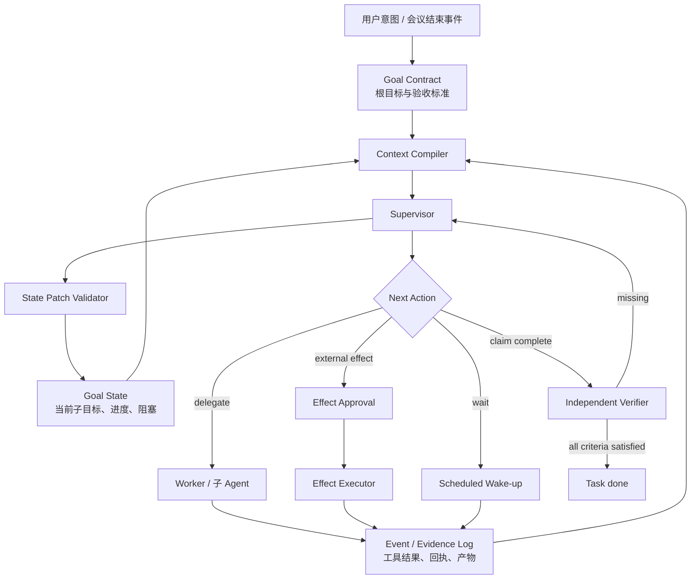
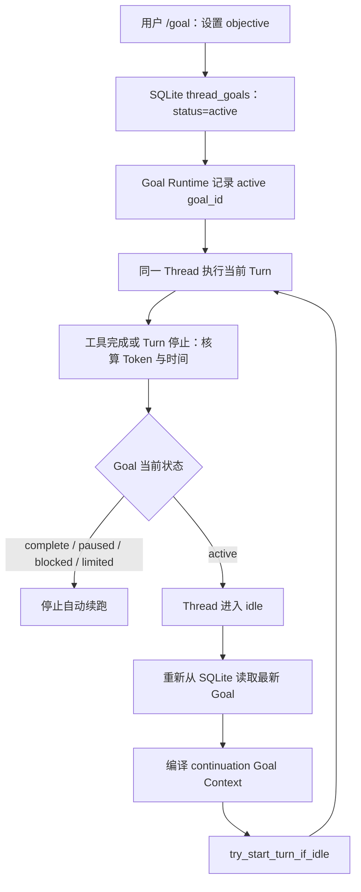

# 长任务 Agent 如何不丢失最初目标

> Status: proposal / partial implementation
> Authority: non-normative
> Last verified: 2026-08-02 @ `89fa24b`
> Implemented: M3 clue verbatim forwarding, Task summary, waiting/human Session resume
> Not implemented: Goal Store, Goal State, Supervisor, independent Verifier

> 从“申请妙记权限成功”被误判为“会议结论已经产出”，推导 Jarvis 的 Goal Control Plane

- **状态**：设计草案
- **日期**：2026-07-23
- **适用范围**：Jarvis M3 线索抽取、Task 机械固化、M5 长任务执行、审批、等待与恢复

**核心结论**：长任务不能把对话历史当作任务状态。应把根目标、当前进度、真实事件和完成证据放在模型外，由 Supervisor 驱动子目标，由独立 Verifier 决定是否关单。

## 1. 问题不是“模型忘了”，而是系统没有保存什么不能忘

这次问题表面上是：

1. 用户真正想要的是读取会议妙记，产出会议结论和 Todo。
2. 读取妙记时发现无权限。
3. Agent 把“申请权限”当成了当前工作。
4. 权限申请成功后，Task 被标记为 `done`。
5. 原始目标——读取妙记、整理结论、生成并同步 Todo——消失了。

这很像大模型“更听最后一次指令”，但只归因于模型的注意力或提示词还不够准确。真正的系统性问题是：

> 系统没有把“根目标”“当前子目标”“一次外部动作”“工具返回结果”“整个目标是否完成”建模成不同对象，却允许同一个 Agent 用同一个 `outcome=completed` 同时表达它们。

于是，最新、最具体、最容易验证的局部动作自然取代了更早、更抽象的业务目标。

人类也会在长任务中忘记目标，但人通常有几层外部支撑：任务标题、项目计划、检查清单、负责人、验收人和交付物。成熟的 Agent 系统也需要同样的控制面，不能期待模型仅靠一段越来越长的聊天记录始终维持目标层级。

## 2. BAX 会议问题的完整失效链

前后两个现象其实属于同一个问题：

- “**AM Agent 产品Demo周会**”已经结束，但系统没有生成预期的会后 Todo；
- BAX 的 3 场会议生成了 Task，但 Task 变成“处理妙记无权限”，申请完成后又错误关单。

第一个现象说明当前链路主要围绕“有没有读到新的会议证据”触发 M3，没有先持久化一个“这场会议结束后必须完成会后处理”的 Goal。第二个现象说明一旦采集错误被 M3 抽成 Todo，错误处理本身又会变成新的顶层任务。两者共同暴露出：会议结束事件、会议产物采集、Todo 抽取和最终交付之间没有一个稳定的根目标串联。

本次本机数据中，Todo 和 Task 被物化为：

```text
处理 3 场 BAX 会议妙记无权限问题，解锁会后待办整理
```

它保留了“之后继续补做会议待办整理”的描述和计划，但 Task 的直接 `target` 已经变成“3 场妙记权限缺失”。后续执行大致经历了：

```text
根目标：读取会议内容，整理结论与 Todo
    ↓
阻塞：3 场妙记无查看权限
    ↓
局部方案：提交 3 条权限申请
    ↓
人工批准局部外部动作
    ↓
权限申请提交成功
    ↓
Agent 返回 completed
    ↓
Task 被标记 done
```

根目标在两个位置被稀释。

### 2.1 第一次稀释：抽取层把阻塞变成了任务身份

[M3 抽取提示词](../internal/extract/prompt.go)把 `target` 定义为“对象/主题，作为去重标识”，而不是“最终要达到的结果”。这对于 Todo 去重是合理的，但后续 [Task Factory](../internal/taskcreate/factory.go)又直接把 `Todo.target` 复制成 `Task.target`，相当于让一个身份字段兼任执行目标。

当时的会议采集实现会把 permission denied 作为中立证据，不申请权限也不决定后续动作；该专用模块后来已删除，当前会议通过 Skill 和通用 `/api/clues` 入口进入 M2。但是这类失败证据进入普通 M3 后，模型仍可能把“处理权限”抽成新的 Todo。系统缺少持久根目标承接 blocker 时，局部动作仍可能反客为主。

### 2.2 第二次稀释：审批阶段把 Effect 完成解释为 Goal 完成

[M5 execution/apply 提示词](../internal/execute/prompt.go)允许执行 Agent 在具体副作用前暂停审批，这个安全方向是对的：

- execution：调查、选择动作；需要审批时只准备 proposal 并暂停；
- apply：忠实落地已批准的动作。

问题在于，批准对象只是“提交妙记查看权限申请”这个局部 Effect，而 apply 的结果仍使用通用的：

```json
{"outcome": "completed"}
```

apply 提示词所说的“真正落地成功才填 completed”，在它自己的局部语境中没有错；但 [AgentExecutor.finishRun](../internal/execute/agent_executor.go)把这个局部 `completed` 直接映射成了 `Task.status=done`。系统没有再回到根目标检查：

- 妙记是否已经可读；
- 会议结论是否生成；
- principal 的 Todo 是否抽取；
- 结果是否按预期同步。

这不是一次偶然的模型误判，而是控制协议允许的合法错误路径。

### 2.3 一个额外的信息缺口

当前 [M5 的 `executionTask`](../internal/execute/prompt.go)只把 `title/target` 作为 hint，完整传递 `source_payload`，并从冻结 `background` 投影当前项目、群、交办人和引用消息 ID；完整背景按需查询。来源证据与可变执行判断已经分开；本方案后续只需讨论长周期目标状态，不应再引入第二套来源计划字段。

## 3. 必须先区分的八个概念

如果不先统一语义，增加多少提示词都会继续混淆。

| 概念 | 定义 | BAX 例子 |
|---|---|---|
| Root Goal | 用户最终希望世界达到的状态 | 读取 3 场会议妙记，整理会议结论和 principal Todo，并同步结果 |
| Success Criterion | 可逐项验收的完成条件 | 3 场均处理；结论已产出；Todo 有负责人；群消息有 `message_id` |
| Plan | 当前认为可行的实现路径，可随事实变化 | 读取妙记 → 提取结论/Todo → 去重 → 发送 |
| Subgoal | 为根目标服务的阶段性结果 | 获得 3 场妙记的读取权限 |
| Effect | 一次会改变外部世界、需要授权或幂等控制的动作 | 向妙记所有者提交查看权限申请 |
| Observation | 工具、Worker 或外部系统返回的事实 | 3 条权限申请已经提交 |
| Evidence | 可供验收和审计引用的证据 | 权限申请回执、妙记内容、产物文件、飞书消息 ID |
| Goal State | 根目标当前走到哪里 | SG-1 已完成，SG-2 等待权限生效，尚未生成结论 |

最关键的两个不等式是：

```text
Effect completed ≠ Subgoal completed ≠ Root Goal completed
```

以及：

```text
Conversation history ≠ Goal State
```

对话历史回答“模型见过什么”；Goal State 回答“任务现在走到哪里”。前者可以被压缩、裁剪或换 Session，后者必须是权威、可恢复、可校验的数据。

## 4. 我们的推演是怎样收敛的

### 4.1 第一层想法：每轮重复根目标

最直接的修复是每次调用模型都追加：

> 最终目标仍然是整理会议结论和 Todo；申请权限只是子步骤，不得把 Task 标记完成。

它值得作为短期补丁，但不能作为最终架构：

- 提示词仍由当前执行 Agent自行解释；
- 子步骤变多后，模型仍可能错误更新计划；
- 审批、等待、恢复和重试会不断生成新局部语境；
- “completed”仍然没有结构化作用域；
- 根目标重复出现不等于完成条件得到验证。

### 4.2 第二层想法：主 Agent 管目标，子 Agent 干活

用户提出的第一种方案是让主 Agent只负责：

- 持有根目标；
- 拆分并分派子目标；
- 接收 Worker 结果；
- 判断下一步；
- 负责最终交付。

Worker 只解决当前子问题，例如“提交三条权限申请”或“读取这场妙记并提取行动项”。

这个方向解决了“责任归属”：干活的 Agent 不再天然拥有整个 Task 的关单权。但它仍有一个缺口——如果 Supervisor 的目标只存在于自己的长对话里，Supervisor 也可能漂移。因此，多 Agent 不是 Goal State 的替代品。

### 4.3 第三层想法：模型每轮输出 State Patch 和 Next Action

用户提出的第二种方案更接近运行时本质。每次得到新的工具结果后，模型输出两部分：

1. 这个 Observation 应如何更新目标和计划状态；
2. 下一步应执行什么动作。

例如：

```json
{
  "state_patch": {
    "base_revision": 12,
    "operations": [
      {
        "op": "complete_subgoal",
        "subgoal_id": "SG-1",
        "evidence_refs": ["effect-result:ER-31"]
      },
      {
        "op": "set_active_subgoal",
        "subgoal_id": "SG-2"
      },
      {
        "op": "set_blocker",
        "description": "等待妙记所有者批准查看权限"
      }
    ]
  },
  "next_action": {
    "kind": "wait",
    "wake_at": "2026-07-23T21:15:00+08:00"
  }
}
```

这里需要一个重要限制：模型输出的是 `state_patch`，不是一份可任意覆盖的完整 Goal，也不是“修改原始用户意图”。普通工具结果只能更新事实、进度、阻塞和计划。它不能把：

```text
读取会议并产出结论
```

改写为：

```text
申请会议权限
```

根目标只有在收到明确的新用户意图后才能产生新版本；模型最多提出 `propose_goal_revision`，不能自行执行 `replace_root_goal`。

### 4.4 最终收敛：两种方案必须组合

两种方案不是二选一，而是分别解决不同问题：

| 机制 | 解决的问题 |
|---|---|
| Supervisor + Worker | 谁对最终目标负责，谁只能解决子问题 |
| Goal Contract + Goal State | 根目标和进度存在哪里，如何跨调用恢复 |
| Context Compiler | 如何在不无限增长上下文的情况下让模型看到最新状态 |
| Effect-scoped Approval | 人工批准的究竟是哪一个外部动作 |
| Independent Verifier | 谁有权宣布整个目标已经完成 |

因此完整答案是：

> Supervisor 持有根目标，Worker 解决子目标；模型外 Goal Store 持有权威状态；Context Compiler 生成每轮输入；审批绑定具体 Effect；Verifier 按证据决定是否关单。

## 5. “复写上下文”可以做，但不应该修改历史

用户提出的难点非常准确：如果每轮都把根目标和完整计划继续追加到对话，会产生重复和上下文膨胀；如果不重复，根目标又可能淡出注意力。

解决办法不是修改模型已经看过的历史，而是把三种数据分开。

```text
完整 Event Log：发生过什么，追加保存，不改写
最新 Goal State：现在走到哪里，可生成新版本
Prompt View：这一轮模型需要看到什么，临时编译
```

每次 Supervisor 调用前，Context Compiler 重新构造：

```text
固定系统约束
+ 最新 Goal Contract，恰好一份
+ 最新 Goal State，恰好一份
+ 当前活动 Subgoal
+ 最新 Observation
+ 与本轮相关的 Evidence
+ 少量最近事件
```

旧的 Goal State Snapshot 不再进入下一轮 Prompt；完整工具输出继续保存在 ExecutionRun、文件或 Evidence Store 中，只把引用和必要摘要放入模型上下文。

所以根目标仍然会在每次 Supervisor 调用中出现，但它不会在上下文里累计成十几份。应该优化的是重复历史和长工具结果，而不是省掉那几百 token 的根目标。模型看不到目标，就不可能稳定围绕目标推理。

这不改变现有 [context snapshot 全链路复用](design-context-pipeline.md)原则。M3 冻结的 `Todo.context_snapshot` 仍是不可丢失的原始业务证据；Context Compiler 只决定本轮从快照、事件和 Evidence 中取哪些内容给模型看，不回写或替换原始快照。换言之，原始上下文负责“证据不丢”，Goal State 负责“进度不丢”，Prompt View 负责“本轮不过载”。

### 5.1 Client-managed context

如果调用方自己维护 messages，每轮都可以从数据库重新构造输入：

```text
Goal Store + Event Store → Context Compiler → 新一轮 messages
```

审计历史保留在系统里，但不需要逐条重放给模型。

### 5.2 Server-managed Session

如果模型供应方的 Session 历史不能原地编辑，有两种可靠做法：

1. 在每轮输入前通过 input filter 注入唯一的最新 Goal Snapshot，并裁掉旧 Snapshot；
2. 在子目标完成、审批结束、长等待唤醒等 phase boundary 开一个新的模型 Run，用最新 Goal Snapshot 恢复。

这意味着“任务连续性”不应该等价于“永远续跑同一个模型 Session”。当前 [Codex Session 挂起与续跑设计](design-codex-session-continuation.md)适合保存 Worker 在一个子目标内部的工具上下文，但需要补充一个边界：

- 子目标内部的短暂停顿，可以恢复原 Session；
- Effect 已落地、长等待结束、需要重规划或可能产生下一次审批时，必须回到 Supervisor，由持久化 Goal State 重新编译上下文；
- 即使底层仍复用 Session，也不能把 Session 当作根目标的唯一真相来源。

## 6. 推荐架构：Goal Control Plane



这套架构不是要求 Jarvis 立刻变成一个复杂工作流引擎。MVP 可以继续复用现有的 `Task`、`TaskEvent`、`ExecutionRun` 和 `ScheduledTask`，只补齐语义边界。

## 7. 数据模型

### 7.1 Goal Contract：根目标在一个 revision 内不可变

建议在 `Task` 上新增一个版本化 JSON：

```json
{
  "goal_version": 1,
  "objective": "读取 3 场 BAX 会议妙记，生成每场会议结论和 principal Todo，并把整理结果同步到对应群",
  "source_intent": {
    "kind": "meeting_postprocess",
    "source_ids": ["meeting-1", "meeting-2", "meeting-3"]
  },
  "success_criteria": [
    {
      "id": "C1",
      "description": "3 场会议产物均已读取，或记录了最终不可用结论"
    },
    {
      "id": "C2",
      "description": "每场会议均有结论摘要"
    },
    {
      "id": "C3",
      "description": "属于 principal 的 Todo、负责人和时间点已整理"
    },
    {
      "id": "C4",
      "description": "结果已同步到目标群，并记录消息回执"
    }
  ],
  "constraints": [
    "外部权限申请和群消息发送分别审批"
  ],
  "non_goals": [
    "仅提交妙记权限申请不算完成任务"
  ]
}
```

原则：

- `objective` 不允许被普通 Worker、工具结果或 State Patch 修改；
- 明确的用户补充可以产生 `goal_version=2`；
- 新版本应记录旧版本、修改原因和用户证据；
- 完整 Goal Contract 应进入新的完整性 Hash；Plan 变化只更新 Goal State，不改变根目标 Hash；
- Goal 变化后，旧审批必须按版本和 Effect Hash 重新校验；
- 不为旧数据静默猜测 Goal Contract。历史 Task 是否回填应单独确认。

### 7.2 Goal State：可变的当前投影

```json
{
  "revision": 12,
  "active_subgoal_id": "SG-2",
  "subgoals": [
    {
      "id": "SG-1",
      "description": "提交 3 条妙记查看权限申请",
      "status": "completed",
      "evidence_refs": ["effect-result:ER-31"]
    },
    {
      "id": "SG-2",
      "description": "等待权限生效并读取 3 场妙记",
      "status": "waiting",
      "evidence_refs": []
    },
    {
      "id": "SG-3",
      "description": "整理会议结论和 principal Todo",
      "status": "pending",
      "evidence_refs": []
    },
    {
      "id": "SG-4",
      "description": "同步整理结果",
      "status": "pending",
      "evidence_refs": []
    }
  ],
  "blockers": [
    {
      "id": "B-1",
      "description": "等待妙记所有者批准查看权限",
      "status": "open"
    }
  ],
  "next_action": {
    "kind": "wait",
    "wake_at": "2026-07-23T21:15:00+08:00"
  }
}
```

不需要把所有业务语义拆成大量列。Task 的控制状态继续保持：

```text
pending / executing / waiting / awaiting_approval / done / failed
```

具体子目标、阻塞、计划和证据放在版本化 JSON 中，符合 Jarvis “只固定控制面，不固定语义内容”的原则。

ScheduledTask、手工、主动和 Todo 来源都只把原始语义放进 `Task.source_payload` 作为审计基线，不再保存来源专用计划。运行过程中因新事实产生的剩余计划放进 `goal_state`，不要把计划演进包装成已经过用户确认。

### 7.3 Event Log：只追加事实

可以继续利用 `TaskEvent` 和 `ExecutionRun`，逐步增加以下事件语义：

```text
GoalCreated
GoalRevised
SubgoalAdded
SubgoalProgressed
ObservationRecorded
EffectProposed
EffectApproved
EffectRejected
EffectSucceeded
WaitScheduled
TaskResumed
CompletionClaimed
GoalVerified
```

MVP 不必建设完整 Event Sourcing 框架。只需做到：

- 运行结果和外部回执追加保存；
- `goal_state` 是最新物化投影；
- 每个 State Patch 带 `base_revision`；
- revision 不匹配时 fail-fast，不自动合并或覆盖。

## 8. Supervisor 的输出协议

建议把现有笼统 `outcome` 拆成三层：

```text
step_outcome：当前 Worker 或 Effect 做得怎样
goal_completion_claim：执行侧是否认为可以验收
goal_verdict：Verifier 是否允许关单
```

Supervisor 每轮只输出 `state_patch + next_action`：

```json
{
  "state_patch": {
    "base_revision": 12,
    "operations": [
      {
        "op": "record_fact",
        "description": "3 条妙记权限申请均已成功提交",
        "evidence_refs": ["effect-result:ER-31"]
      },
      {
        "op": "complete_subgoal",
        "subgoal_id": "SG-1",
        "evidence_refs": ["effect-result:ER-31"]
      },
      {
        "op": "set_active_subgoal",
        "subgoal_id": "SG-2"
      }
    ]
  },
  "next_action": {
    "kind": "wait",
    "reason": "等待权限生效",
    "wake_at": "2026-07-23T21:15:00+08:00"
  },
  "goal_completion_claim": null
}
```

允许的 Patch 操作应是一个小而明确的控制词表：

```text
record_fact
add_subgoal
update_subgoal
complete_subgoal
set_active_subgoal
set_blocker
clear_blocker
set_next_action
propose_goal_revision
claim_goal_complete
```

明确禁止：

```text
replace_root_goal
delete_success_criterion
mark_task_done
```

运行时先校验 Patch 是否越权，再应用状态，然后执行 `next_action`。模型不是数据库事务执行器，也不应该直接写 Task 终态。

## 9. Supervisor 与 Worker 的职责边界

### 9.1 Worker 输入

Worker 只收到一个边界明确的 Assignment：

```json
{
  "assignment_id": "A-19",
  "parent_goal_ref": {
    "task_id": 67,
    "goal_version": 1
  },
  "subgoal_id": "SG-1",
  "objective": "提交 3 条妙记查看权限申请",
  "acceptance_criteria": [
    "3 条申请均获得可核验的请求回执"
  ],
  "relevant_context": {
    "minute_refs": ["minute-1", "minute-2", "minute-3"]
  }
}
```

### 9.2 Worker 输出

```json
{
  "assignment_id": "A-19",
  "step_outcome": "completed",
  "observations": [
    "3 条权限申请已提交"
  ],
  "evidence_refs": [
    "effect-result:ER-31"
  ],
  "blocked_by": [],
  "suggested_next": "等待权限生效"
}
```

Worker 不返回 `root_goal_completed`，也没有更新 `Task.status` 或 `goal_contract` 的工具。它的中间工具历史不必全部进入 Supervisor 上下文，只返回结果、证据、阻塞和建议。

### 9.3 不需要每个工具调用都启动子 Agent

真正的多 Agent 会增加调用成本和延迟。推荐“两种时间尺度”：

- **Worker 内循环**：在一个子目标内连续查资料、调用工具、修正错误；
- **Supervisor 外循环**：只在子目标完成、失败、等待、审批、明显停滞或需要重规划时运行。

MVP 甚至可以继续使用同一个模型，只把 Supervisor 和 Worker 做成两个不同 Stage、两个不同 Schema 和两套工具权限。结构边界比模型身份更重要。

## 10. 审批必须绑定 Effect，而不是绑定整个 Task

建议审批对象扩展为：

```json
{
  "effect_id": "E-31",
  "task_id": 67,
  "goal_version": 1,
  "subgoal_id": "SG-1",
  "effect_type": "request_minute_view_permission",
  "effect_payload": {
    "minute_refs": ["minute-1", "minute-2", "minute-3"]
  },
  "effect_hash": "sha256:...",
  "completes_goal": false
}
```

用户批准后，只允许执行这个 Effect。执行成功产生：

```text
EffectSucceeded(E-31)
```

然后必须返回 Supervisor：

```text
apply → Observation → Goal State Patch → Next Action
```

不能再走：

```text
apply → Task done
```

后续如果需要发送会议总结到群，又会产生新的 Effect 和新的审批。审批一次只授权一个明确、可审计的外部动作，不隐含批准所有后续动作，更不代表根目标已经完成。

拒绝审批也不必自动把整个 Task 标记 `failed`。更准确的语义通常是：

- 当前 Effect 被拒绝；
- 对应 Subgoal blocked；
- Supervisor 判断是否有替代路径；
- 没有替代路径时保持根目标未完成，并记录需要人工处理；确认目标已不可达时再进入 `failed`。

## 11. Verifier：只有证据满足验收标准才能关单

执行 Agent 可以提出完成声明，但不能直接关单：

```json
{
  "goal_completion_claim": {
    "goal_version": 1,
    "evidence_refs": [
      "artifact:meeting-summary-1",
      "artifact:meeting-summary-2",
      "artifact:meeting-summary-3",
      "lark-message:om_xxx"
    ]
  }
}
```

Verifier 对每条 Success Criterion 生成证据矩阵：

```json
{
  "achieved": false,
  "criteria": [
    {
      "criterion_id": "C1",
      "satisfied": false,
      "evidence_refs": ["minutes:1", "minutes:2"],
      "missing": "第 3 场妙记仍无权限"
    },
    {
      "criterion_id": "C2",
      "satisfied": true,
      "evidence_refs": ["artifact:meeting-summary-1", "artifact:meeting-summary-2"],
      "missing": ""
    },
    {
      "criterion_id": "C4",
      "satisfied": false,
      "evidence_refs": [],
      "missing": "尚未发送群消息"
    }
  ],
  "next": "继续等待第 3 场权限，并在产物齐全后请求发送审批"
}
```

只有 `achieved=true` 才能将 `Task.status` 更新为 `done`。

Verifier 应先使用确定性校验：

- 权限申请是否有真实 request ID；
- 妙记内容是否实际读取；
- 产物文件是否存在且非空；
- 飞书发送是否返回 `message_id`；
- 代码任务是否有测试、commit 或 diff 证据。

无法用代码判断的语义质量，再交给独立模型评审。执行者和验证者即使使用相同模型，也应使用独立调用、独立上下文和不同角色，避免直接复用执行 Agent 的自我叙述。

## 12. 会议场景在新架构中的完整运行

```text
1. 会议结束
2. 创建 Goal Contract：
   “读取妙记，生成会议结论和 principal Todo”
3. Worker 读取妙记，Observation=permission_denied
4. Supervisor：
   - 保留 Root Goal
   - 新增 SG-1：申请权限
   - 生成 Effect E-31
5. Task → awaiting_approval
6. 用户批准 E-31
7. Effect Executor 提交权限申请
8. Worker Result：step_outcome=completed
9. Supervisor：
   - SG-1 completed
   - SG-2 waiting
   - 安排未来唤醒
10. Task → waiting
11. 到期后从 Goal State 恢复 Supervisor
12. 权限仍未生效 → 继续等待或 needs_human
13. 权限生效 → Worker 读取妙记
14. Worker 生成结论和 Todo 草稿
15. Supervisor 生成“发送群消息”Effect E-44
16. 用户批准 E-44
17. 发送成功，记录 message_id
18. Verifier 对 C1-C4 逐项验收
19. 全部满足后 Task → done
```

这个流程中可以出现多个等待、多个 Worker Run、多个审批，但只有一个 Root Goal。任何局部成功都不会覆盖它。

## 13. 外部实现调研

截至 2026-07-23，没有一个通用框架开箱即用地同时提供“版本化根目标、子目标账本、Effect 级审批、证据门禁和长等待”。但多个一手实现已经分别验证了这套设计的组成部分。

### 13.1 OpenHands：最直接的 Goal Completion Loop

OpenHands 的普通 `conversation.run()` 会在 Agent 自己认为完成时停止；它的 [`/goal` Goal Completion Loop](https://docs.openhands.dev/sdk/guides/convo-goal)在 Agent 外层固定持有 objective，每轮结束后调用第二个 Judge LLM，根据文件内容、命令输出、测试结果等权威证据审计：

```text
Agent 声称完成
    ↓
Judge 输出 score / complete / missing
    ↓
complete=false → 把 missing 回灌，继续运行
```

这直接验证了三个判断：

- Agent 停止不等于业务目标完成；
- 根目标应由执行循环之外的 Controller 持有；
- 最终停止需要独立证据审计。

OpenHands 还把 [append-only events 和 base state 分开持久化](https://docs.openhands.dev/sdk/guides/convo-persistence)，并通过 [Condenser](https://docs.openhands.dev/sdk/arch/condenser)从完整事件生成压缩的 LLM View，而不是把压缩后的对话当作唯一真相。这与“Event Log + Materialized Goal State + Prompt View”高度一致。

它的不足是 Goal 主要还是一个 objective 字符串，没有直接表达 Jarvis 需要的版本、子目标、等待和 Effect 审批。

### 13.2 Magentic-One：Task Ledger 与 Progress Ledger

微软的 [Magentic-One](https://www.microsoft.com/en-us/research/articles/magentic-one-a-generalist-multi-agent-system-for-solving-complex-tasks/)由 Orchestrator 负责高层计划、任务派发和进度追踪：

- 外循环维护原始 task、facts 和 plan；
- 内循环在每个 Worker 回合后维护 Progress Ledger；
- Worker 不直接关单；
- 停滞时更新 facts 和 plan，但保留原始 task。

这是“根目标、事实和计划分离”以及“Supervisor 快慢双循环”的直接参考。它的局限是完成判断仍由 Orchestrator 模型自己给出 `is_request_satisfied`，没有结构化 Success Criteria 和独立证据门禁。

### 13.3 LangGraph：State Patch 与 Next Action 的运行时原语

[LangGraph Graph API](https://docs.langchain.com/oss/python/langgraph/graph-api)允许节点读取外部 State 并返回局部更新；`Command(update=..., goto=...)`把“更新状态”和“决定下一节点”放在一个受控输出中，几乎就是本文的：

```json
{"state_patch": {}, "next_action": {}}
```

[Persistence](https://docs.langchain.com/oss/python/langgraph/persistence)按步骤保存 checkpoint，[interrupt](https://docs.langchain.com/oss/python/langgraph/interrupts)支持暂停和恢复，[subgraphs](https://docs.langchain.com/oss/python/langgraph/use-subgraphs)支持父子 Agent 使用不同 State Schema。

LangGraph 解决的是状态、路由和恢复原语，不会自动保证根目标语义。Jarvis 仍需自行限制 Worker 的写权限，并增加 Goal Contract 和 Verifier。

### 13.4 OpenAI Agents SDK：Manager 应保留最终控制权

[OpenAI Agents SDK 的多 Agent 编排](https://openai.github.io/openai-agents-python/multi_agent/)区分：

- `Agent.as_tool()`：Manager 保留最终回答权，Worker 只返回有界结果；
- Handoff：把当前控制权转给另一个 Agent。

Jarvis 的子任务更适合 Manager 模式，而不是 Handoff。权限申请 Agent 不应成为新的 Task Owner。

SDK 的 [Human-in-the-loop](https://openai.github.io/openai-agents-python/human_in_the_loop/)把审批绑定到具体 tool call interruption，并允许序列化 RunState 后恢复。这支持 Effect-scoped Approval 的方向。不过 SDK 的 Session 本质上仍是对话历史，Goal Store 和完成验收要由应用层补充。

### 13.5 DeepAgents：子 Agent 隔离和上下文卸载

[DeepAgents](https://github.com/langchain-ai/deepagents)提供 Todo、子 Agent、持久化、长上下文总结和大工具结果文件卸载。其子 Agent 实现明确隔离父子 `messages/todos/structured_response`，只把最后报告返回主 Agent。这证明“Worker 的局部计划和工具历史不应直接覆盖父 Agent 状态”是可落地的。

但 DeepAgents 的 Todo 仍是同一层列表，根目标不是一等对象；整表替换 Todo 也不如带 revision 的 Patch 安全。

### 13.6 Temporal：连续性来自状态和事件，不来自常驻进程

[Temporal](https://docs.temporal.io/)通过持久化 Workflow Event History，在故障后恢复执行。长历史可以使用 [Continue-As-New](https://docs.temporal.io/workflow-execution/continue-as-new)，把当前状态传给同一业务 Workflow 的新 Run，而不是无限增长旧历史。

对 Jarvis 的启发不是引入 Temporal，而是：

> 长任务的连续性来自持久化状态、事件和幂等 Effect，不来自同一个模型 Session 永远不断。

### 13.7 Anthropic Context Editing：编辑的是 View，不是真相

[Anthropic Context Editing](https://platform.claude.com/docs/en/build-with-claude/context-editing)会在调用模型前清理旧 tool results 或 thinking blocks，客户端仍保留完整历史。这再次说明 Context Editing 是 Prompt View 优化，不是 Goal Store。

### 13.8 研究体系：哪些问题已经被解决，哪些没有

工程框架之外，几类经典 Agent 研究也能帮助我们划清边界。

- [ReAct](https://arxiv.org/abs/2210.03629)把 Thought、Action、Observation 交错在一条轨迹中，适合 Worker 的短期工具循环；但根目标只存在于线性 Prompt，`Finish` 也由同一个执行模型发出，不能单独承担长任务控制面。
- [Plan-and-Solve](https://arxiv.org/abs/2305.04091)证明“先显式规划再执行”能减少漏步骤，但原始方案主要是单次推理，没有持久状态、工具回写、等待恢复和独立验收。
- LangGraph 的 [Plan-and-Execute](https://blog.langchain.dev/planning-agents/)进一步把原始 input、当前 plan、past steps 和 response 放进共享状态，由 Replanner 更新剩余计划。它最值得借鉴的是“原始输入与可变计划分离”，不足是 Replanner 仍同时承担重规划和结束判断。
- [Reflexion](https://arxiv.org/abs/2303.11366)把失败轨迹压缩成自然语言策略记忆，在下一次尝试时与原任务一起注入。这适合 Jarvis 的失败诊断层：历史保留在 Event Log，进入工作上下文的是“学到了什么”，但 reflection 无权修改 Goal Contract。
- [Voyager](https://arxiv.org/abs/2305.16291)让执行器解决当前 task，并由独立 Critic 根据环境证据判断该 task 是否成功。这证明执行与验收分离有效；它也暴露了另一层风险：所有 subgoal 都通过，不代表最初分解一定覆盖了完整根目标，所以 Jarvis 仍需要 Root Goal Verifier。
- [Generative Agents](https://arxiv.org/abs/2304.03442)把 broad-strokes daily goals、细化 schedule、当前动作和 memory stream 分开；突发事件只改写受影响的时间片。这支持“局部 Observation 默认只 Patch 局部计划，而不是重写整个目标”。

更早的符号 Agent 理论给出了两个很清楚的语义约束：

- BDI 把 Belief、Desire/Goal 和 Intention 分离。对本案例而言，“没有妙记权限”是 Belief，“先申请权限”是当前 Plan，“产出会议结论和 Todo”才是持续的 Intention。Observation 可以更新 Belief，Plan 可以变化，局部困难不能静默替换 Intention。可参考 Wooldridge 等人的 [Intention Reconsideration](https://www.cs.ox.ac.uk/people/michael.wooldridge/pubs/atal98a.pdf)。
- HTN 把复合父任务分解为子任务网络。完成一个 primitive child 不会让 non-primitive parent 自动完成；父任务必须完成全部必要展开。可参考 [HTN Planning Overview](https://arxiv.org/abs/1403.7426)。Jarvis 不需要实现完整符号规划器，但应该继承这条父子完成纪律。

这些研究可以压缩成一句话：

> 用 BDI 约束谁能修改根目标，用 HTN 约束 child complete 不等于 parent complete，用 ReAct 承担 Worker 内循环，用 Supervisor/Replanner 维护外部计划，用独立 Critic 和 Root Verifier 控制结束。

### 13.9 对照总结

| Jarvis 所需能力 | 最接近的外部实现 | 仍需 Jarvis 补齐 |
|---|---|---|
| 根目标、事实、计划分离 | Magentic-One | 版本、Success Criteria、Evidence |
| State Patch + Next Action | LangGraph `Command` | Patch 权限和业务 Schema |
| 主 Agent 保留最终责任 | OpenAI Manager / Agent as Tool | Goal Store 和 Verifier |
| Worker 上下文隔离 | DeepAgents subagents | 根目标只读边界 |
| 外层完成审计 | OpenHands Goal Completion Loop | 子目标、等待、Effect 审批 |
| 可恢复长任务 | LangGraph / Temporal / OpenHands | 与 Jarvis Task 状态机集成 |
| 压缩模型上下文 | OpenHands Condenser / Anthropic Context Editing | 根目标不能交给摘要器决定是否保留 |

## 14. Codex Goal 的真实实现

Codex Goal 与本文讨论的问题高度相关，因为它直接针对“长任务跨多个 turn 后，Agent 缩小或忘记原始目标”设计。它没有实现完整的 Goal Control Plane，但已经提供了一套很有价值的最小闭环：

```text
持久化一个线程级根目标
    + 每轮重新锚定完整 objective
    + 线程空闲后自动续跑
    + 用户控制暂停、恢复和编辑
    + Agent 只能声明完成或真正阻塞
    + Token 预算与运行时间核算
```

本节不是根据 UI 行为猜测，而是交叉检查了三类一手材料：

- OpenAI 当前的 [Long-running work 官方说明](https://learn.chatgpt.com/docs/long-running-work)；
- 本机安装的 `codex-cli 0.145.0`；
- OpenAI Codex 仓库的 [`rust-v0.145.0` Goal Extension 源码](https://github.com/openai/codex/tree/rust-v0.145.0/codex-rs/ext/goal)。

本机 ChatGPT/Codex 桌面应用内置的 CLI 版本略早于独立 CLI，因此下面的源码级细节以 `rust-v0.145.0` 为准；产品语义以当前官方文档为准。

### 14.1 产品语义：Goal 文本同时是首轮任务和完成标准

官方文档对 `/goal` 的定义很直接：

- Goal 文本既是第一轮 Prompt，也是后续判断完成的 Completion Criteria；
- 建议 Goal 同时写清 Outcome、Constraints 和 Verification；
- 运行中可以暂停、恢复、编辑或清除 Goal；
- 后续消息可以增加上下文或调整约束；
- Goal 不会扩大权限，仍沿用原线程的 Sandbox 和 Approval Policy；
- 每个 Chat 独立保有自己的 Context、Messages、Results 和 Goal。

因此，Codex 没有先强制把 Goal 拆成结构化字段，而是要求用户把“结果、约束、验收方式”都写入一个自然语言 objective。这很符合 Agent-first 的最小实现原则，但也意味着：

> 如果一开始把 Goal 写成“处理三场 BAX 妙记无权限问题”，Codex 只能忠实追踪这个错误目标；只有把 Goal 写成“完成三场 BAX 会议结论和 Todo，权限申请只是必要步骤”，它的续跑机制才能防止授权子任务覆盖最终目标。

### 14.2 持久化模型：每个 Thread 只有一个当前 Goal

Codex 在独立 SQLite 表中保存 Goal。核心模型和迁移见 [`thread_goal.rs`](https://github.com/openai/codex/blob/rust-v0.145.0/codex-rs/state/src/model/thread_goal.rs#L12-L71)与 [`0001_thread_goals.sql`](https://github.com/openai/codex/blob/rust-v0.145.0/codex-rs/state/goals_migrations/0001_thread_goals.sql#L1-L18)：

| 字段 | 作用 |
|---|---|
| `thread_id` | 主键；一个 Thread 同时只有一个当前 Goal |
| `goal_id` | 一次 Goal 实例的内部身份，用于防止旧 Turn 回写新 Goal |
| `objective` | 完整自然语言根目标 |
| `status` | `active / paused / blocked / usage_limited / budget_limited / complete` |
| `token_budget` | 可选 Token 预算 |
| `tokens_used` | 已计入本 Goal 的 Token |
| `time_used_seconds` | 本 Goal 的有效运行时间 |
| `created_at / updated_at` | 生命周期时间 |

这里有三个值得注意的设计选择。

第一，Goal 是线程级单例，不是 Todo 列表，也不是子目标 DAG。创建新 Goal 时，如果当前 Goal 尚未 `complete`，Agent 侧创建会直接失败；完成后的 Goal 才能被新 Goal 替换。对应实现见 [`insert_thread_goal`](https://github.com/openai/codex/blob/rust-v0.145.0/codex-rs/state/src/runtime/goals.rs#L213-L269)。

第二，`goal_id` 与 `thread_id` 分离。用户编辑当前 Goal 时可以保留同一 Goal 实例；真正替换 Goal 时会生成新的 `goal_id`。正在运行的旧 Turn 在核算用量或回写状态时携带 `expected_goal_id`，如果 Goal 已被替换，旧结果不会污染新 Goal。这是一种轻量的乐观并发控制。

第三，Goal Store 保存的是控制面最小状态，没有保存完整计划、子目标、Evidence 或每轮 State Patch。更丰富的语义仍留在 Thread 对话、当前工作区和外部系统中。

### 14.3 双控制面：用户能改目标，Agent 只能报告完成或阻塞

Codex Goal 有两套不同权限的接口。

面向用户或 App Server 的接口是：

```text
thread/goal/set
thread/goal/get
thread/goal/clear
```

`thread/goal/set` 可以设置或修改 `objective`、`status` 和 `token_budget`；桌面 UI 和 `/goal` 命令据此实现创建、编辑、暂停和恢复。接口定义见 [`ThreadGoalSetParams`](https://github.com/openai/codex/blob/rust-v0.145.0/codex-rs/app-server-protocol/src/protocol/v2/thread.rs#L759-L855)，处理链路见 [`thread_goal_processor.rs`](https://github.com/openai/codex/blob/rust-v0.145.0/codex-rs/app-server/src/request_processors/thread_goal_processor.rs#L117-L182)。

面向模型的工具则严格收窄为：

```text
get_goal()
create_goal(objective, token_budget?)
update_goal(status = complete | blocked)
```

源码对权限作了明确限制：

- `create_goal` 只能在用户、System 或 Developer 明确要求创建 Goal 时调用，不能把普通任务擅自升级为 Goal；
- 有未完成 Goal 时不能创建新 Goal；
- `update_goal` 只能设置 `complete` 或 `blocked`；
- Agent 不能自行暂停、恢复、设置 `budget_limited` 或 `usage_limited`；
- `complete` 必须表示整个 objective 已实现且没有剩余工作；
- `blocked` 必须是同一个阻塞连续出现至少三个 Goal Turn，且确实无法在没有用户输入或外部状态变化时继续推进。

其中，“必须由用户明确要求创建”“三轮后才能报告阻塞”和“必须真正完成”是写给模型的工具契约；“只能写 `complete/blocked`”“不能覆盖未完成 Goal”等边界由运行时代码硬校验。实现见 [`spec.rs`](https://github.com/openai/codex/blob/rust-v0.145.0/codex-rs/ext/goal/src/spec.rs#L9-L93)与 [`tool.rs`](https://github.com/openai/codex/blob/rust-v0.145.0/codex-rs/ext/goal/src/tool.rs#L180-L290)。

这是一条非常重要的控制面原则：

> 根目标内容由用户控制；运行时控制资源停止；Agent 只能对“是否完成”和“是否真正阻塞”提出受限状态变更，不能因为眼前子任务变了就重写根目标。

不过，Codex 仍允许同一个执行模型调用 `update_goal(complete)`。它依靠严格 Prompt 和工具说明降低误关单概率，并没有引入独立 Verifier。

### 14.4 自动续跑：线程一空闲，就从 Goal Store 重新读取根目标

Codex Goal 被实现为一个 Extension，挂接在线程和 Turn 生命周期上。其核心时序如下：



具体实现是：

1. `on_thread_resume` 从 SQLite 恢复 Goal；
2. `on_thread_idle` 调用 `continue_if_idle()`；
3. `continue_if_idle()` 再次读取当前 Goal；
4. 只有状态仍为 `active` 才生成 continuation context；
5. 通过 `try_start_turn_if_idle()` 在同一 Thread 启动下一 Turn。

源码见 [`extension.rs`](https://github.com/openai/codex/blob/rust-v0.145.0/codex-rs/ext/goal/src/extension.rs#L139-L167)和 [`runtime.rs`](https://github.com/openai/codex/blob/rust-v0.145.0/codex-rs/ext/goal/src/runtime.rs#L335-L425)。

这不是一个 Supervisor Agent 调用 Worker Agent 的多 Agent 架构。它仍由同一 Thread 中的同一个执行 Agent 继续工作，只是在每个 Turn 边界由外部 Runtime 决定是否再启动一轮。

### 14.5 它没有复写历史，而是重新编译一个很小的 Goal Context

这正面回答了我们前面讨论的难点：如何一边维护进度，一边避免每轮重复传输大量上下文？

Codex 的答案不是修改历史，也不是把所有旧消息重发一遍，而是：

1. Goal Store 在模型外保存一份很小的权威状态；
2. 每次 continuation 只读取最新 `objective + budget`；
3. Runtime 把它编译为一个 `InternalModelContextFragment(source="goal")`；
4. 这个片段作为内部上下文注入下一 Turn。

实现见 [`steering.rs`](https://github.com/openai/codex/blob/rust-v0.145.0/codex-rs/ext/goal/src/steering.rs#L37-L78)。核心 continuation 模板见 [`continuation.md`](https://github.com/openai/codex/blob/rust-v0.145.0/codex-rs/ext/goal/templates/goals/continuation.md)。

这个模板明确要求 Agent：

- Goal 跨 Turn 持续存在；
- 不要把 objective 缩小成当前 Turn 能完成的范围；
- 如果本轮做不完，要朝真实最终状态取得进展并保持 Goal `active`；
- 不要为了更容易通过测试而替换成更窄、更安全或更小的方案；
- 以当前 Worktree 和外部状态作为权威证据；
- 如果有 `update_plan`，维护与真实 objective 对齐的当前计划。

所以 Codex 的上下文结构可以理解为：

```text
Model Input View
  = 当前系统与开发者指令
  + 当前可见会话上下文
  + 当前工作区/工具结果
  + 每轮重新生成的一份最新 Goal Fragment
```

它只重复根目标这个小对象，不重复整个历史。这一点与本文提出的 Context Compiler 是同一个方向。

但 Codex 还没有把“当前进度”做成独立的 `GoalState`。当前进度主要存在于对话历史、工作区、外部系统以及可选的 `update_plan` 中。因此：

- 根目标不容易因 Recency Bias 消失；
- 计划和子目标仍可能在长上下文或压缩中变形；
- Runtime 无法仅靠 Goal 表精确回答“每个 Success Criterion 做到哪一步”。

### 14.6 用户编辑目标时，Runtime 会立即 Steer 当前 Turn

`thread/goal/set` 不只是更新数据库。Goal Runtime 会在写入前后串行化外部修改，避免“刚读取旧目标准备续跑，用户同时修改目标”的竞态。

如果目标在 Agent 正在运行时被编辑，Runtime 会注入一个 `objective_updated` Context，明确告诉 Agent：

- 新 objective 取代旧 objective；
- 当前 Turn 应转向新目标；
- 只服务旧目标、且不再帮助新目标的工作应停止；
- 未真正完成新目标时不能调用 `update_goal`。

模板见 [`objective_updated.md`](https://github.com/openai/codex/blob/rust-v0.145.0/codex-rs/ext/goal/templates/goals/objective_updated.md)，外部写入的并发保护见 [`api.rs`](https://github.com/openai/codex/blob/rust-v0.145.0/codex-rs/ext/goal/src/api.rs#L143-L281)。

这相当于一种“用户可控 Goal Revision”，但它没有显式保存 revision 历史，也没有要求记录“为什么改、由哪条用户输入触发”。Jarvis 如果需要审批可追溯性，仍应增加 `goal_version` 和来源事件。

### 14.7 完成审计很强，但仍属于同一个 Agent 的自证

Codex continuation Prompt 的 `Completion audit` 比普通的“检查一下是否完成”严格得多。它要求：

1. 从 objective、引用文件、计划、Issue 和用户要求中推导逐项需求；
2. 为每一项找到能证明完成的权威 Evidence；
3. 检查文件、命令输出、测试、PR、渲染结果或真实运行行为；
4. 区分“证明完成、证明未完成、证据太弱、证据缺失”；
5. 不确定或间接 Evidence 一律视为未完成；
6. 所有要求都有证据且没有剩余工作时，才能 `update_goal(complete)`。

这套 Prompt 直接处理了本文的核心风险：局部动作完成不能作为根目标完成的证明。

但其信任结构仍是：

```text
同一个 Agent 执行
    ↓
同一个 Agent 收集证据
    ↓
同一个 Agent 判断完成
    ↓
同一个 Agent 调用 update_goal(complete)
```

因此它属于 Prompt-based Completion Audit，不是 Independent Verification。对于代码任务，当前文件、测试和命令结果通常足以让自审发挥作用；对于 Jarvis 的会议任务，发送消息、生成 Todo、权限状态和三场会议覆盖率涉及多个外部副作用，最好仍由独立 Verifier 按结构化 Success Criteria 验收。

### 14.8 预算、错误和并发：由 Runtime 管，不能交给模型自律

Codex 在每个 Goal Turn 中记录 Token 和有效运行时间：

- Turn 开始时记录基线；
- Tool 完成、Turn 停止或异常时结算增量；
- Plan Mode 不计入 Goal 执行用量；
- 达到 Token Budget 后，Runtime 自动把状态改为 `budget_limited`；
- `budget_limit` Context 要求 Agent 不再开始新的实质工作，只总结进展和剩余项；
- 硬性用量限制会进入 `usage_limited`；
- 不可重试的 Turn Error 会把活跃 Goal 停在 `blocked`，避免自动续跑形成消耗循环。

生命周期挂钩见 [`extension.rs`](https://github.com/openai/codex/blob/rust-v0.145.0/codex-rs/ext/goal/src/extension.rs#L197-L390)，预算模板见 [`budget_limit.md`](https://github.com/openai/codex/blob/rust-v0.145.0/codex-rs/ext/goal/templates/goals/budget_limit.md)。

为了防止竞态，它还使用两类控制：

- 每个 Thread 的 Goal State Semaphore：串行化用户 set/clear 与 idle continuation；
- `expected_goal_id`：防止旧 Turn 的核算或状态更新写到已经替换的新 Goal。

这说明稳定的 Goal 系统不能只有 Prompt。调度、预算、状态跳转、并发和幂等身份必须由代码控制。

### 14.9 Fork 与恢复：可以延迟第一次续跑，但不是通用长等待

Goal 随持久化 Thread 恢复。Fork Thread 时也可以复制当前 Goal，并通过 `deferGoalContinuation=true` 暂缓 Fork 后的第一次自动续跑，直到显式 Turn 启动。这个延迟标志单独持久化在 `thread_goal_continuation_deferrals` 表中，见 [`0002_thread_goal_continuation_deferrals.sql`](https://github.com/openai/codex/blob/rust-v0.145.0/codex-rs/state/goals_migrations/0002_thread_goal_continuation_deferrals.sql)和 [App Server 协议说明](https://github.com/openai/codex/blob/rust-v0.145.0/codex-rs/app-server/README.md#example-set-and-update-a-thread-goal)。

但从 `rust-v0.145.0` 的状态模型和续跑逻辑看，Goal 本身没有：

```text
waiting_for
next_wake_at
external_condition
resume_event
```

因此这里的 deferral 是 Fork 协调机制，不是 Jarvis 所需的“等妙记权限通过后，再由事件或调度器唤醒”的长等待模型。Codex 的 `blocked` 会停止自动续跑，但恢复仍需要用户或上层系统把 Goal 重新设为 `active`。

### 14.10 Codex Goal 解决了什么，没有解决什么

可以把 Codex Goal 准确概括为：

> Persistent Root Objective + Automatic Continuation + Prompt-based Completion Audit + Runtime Budget Accounting

它不是：

> Structured Goal Contract + Subgoal Ledger + Effect Approval + Independent Verifier

两者对照如下：

| 维度 | Codex Goal `rust-v0.145.0` | Jarvis 会议长任务所需 |
|---|---|---|
| 根目标持久化 | 有，`objective TEXT` | 有，且应带 `goal_version` |
| 每轮目标重锚定 | 有，自动注入 Goal Fragment | 应直接复用 |
| 自动续跑 | 有，Thread idle 后继续 | 还需事件/定时唤醒 |
| 目标编辑 | 用户可编辑并立即 Steering | 需版本化、记录来源 |
| 子目标 | 无一等模型，可用 `update_plan` 辅助 | 需持久化 Subgoal/Plan |
| 当前进度 | 主要在对话、工作区和外部状态 | 需独立 Goal State |
| Success Criteria | 由 objective 自然语言表达 | 需结构化并逐项挂 Evidence |
| 权限边界 | 用户改目标；Agent 只能 complete/blocked | Worker 还应不能直接关 Root Goal |
| 审批 | 继承通用 Tool Approval | 需绑定 `effect_id + effect_hash + goal_version` |
| 完成判断 | 同一 Agent 自审后调用 `complete` | 独立 Verifier 决定 Task `done` |
| 资源控制 | Token、时间核算和预算停止 | 可借鉴 |
| 长等待 | 无通用 `next_wake_at` | 必须持久化等待条件 |
| 并发安全 | Semaphore + `expected_goal_id` | 应借鉴 revision/CAS |

### 14.11 如果把 BAX 会议任务交给 Codex Goal

正确的 Goal 不应该是：

```text
处理 3 场 BAX 会议妙记无权限问题。
```

而应该是：

```text
读取指定的 3 场 BAX 会议妙记，产出每场会议结论、跨会议汇总和可执行 Todo，
并将最终结果同步到约定位置。

约束：
- 如果妙记无权限，申请权限并等待权限生效，然后继续读取和整理；
- 权限申请成功只算解除阻塞，不算任务完成；
- 不得遗漏任一场会议。

完成验证：
- 3 场妙记都有成功读取证据；
- 每场都有会议结论；
- Todo 包含明确 owner 和下一步；
- 最终同步动作有可追溯回执。
```

在 Codex Goal 的续跑机制下，权限申请成功后进入下一 Turn 时，完整 objective 会再次出现，Prompt 还会明确要求不能围绕更小任务重定义成功。因此它大概率会继续读取妙记，而不是把“授权已申请”当作完成。

但它仍存在三个结构性风险：

1. “三场会议”只是自然语言，Runtime 没有持久化 `3/3` 覆盖率；
2. 权限申请、读取、生成、发送没有独立的 Effect 和 Evidence 类型；
3. 仍由执行 Agent 自己判断全部完成。

所以 Jarvis 不应该照搬 Codex Goal，而应该把它作为最小控制内核，再补上业务层 Goal State、Effect Approval 和 Verifier。

### 14.12 对 Jarvis 最值得直接借鉴的五点

第一，不修改历史。把最新 Goal 存在模型外，每轮编译一个小的权威 Goal Fragment。

第二，根目标和可变状态分权。用户能修改 Goal；Worker 不能因为 Observation 或 Tool Result 重写 Goal。

第三，状态驱动调度。只有 `active` 才自动继续，`paused/blocked/limited/complete` 都不应盲目续跑。

第四，完成前执行逐项证据审计。即使后续增加独立 Verifier，这段 Completion Audit 也应该保留在 Worker/Supervisor Prompt 中，作为第一道自检。

第五，用实例 ID 和 Revision 防止旧结果回写。Codex 的 `expected_goal_id` 对应 Jarvis 应有的 `goal_version + state_revision`。

但 Jarvis 还必须补三项 Codex 当前没有的一等能力：

```text
Goal Contract：objective + success_criteria + non_goals
Goal State：subgoals + blockers + waiting + evidence refs
Verifier：只有证据覆盖全部 Success Criteria 才能关单
```

因此，本文提出的架构不是与 Codex Goal 相反，而是对它的业务化扩展：

```text
Codex Goal
  └── 解决“根目标如何跨 Turn 存活并持续驱动”

Jarvis Goal Control Plane
  ├── 继承上述能力
  ├── 增加“子目标和等待如何持久化”
  ├── 增加“审批只授权哪个 Effect”
  └── 增加“谁用什么证据决定真正完成”
```

## 15. 对 Jarvis 当前实现的最小改造

不建议第一步就建设通用 DAG、完整 Event Sourcing 或复杂多 Agent 平台。按风险和收益分四阶段推进。

### Phase 0：先堵住错误关单

目标：即使没有完整 Goal Control Plane，也不能再把 Effect 成功直接当作 Task 完成。

1. M5 的 `TASK_CONTEXT` 显式携带 `Task.target`。
2. apply 结果改成 `step_outcome/effect_outcome`，不再直接产生 Task `done`。
3. apply 成功后重新进入 execution/supervisor 阶段。
4. 在 Task 完成前增加最小 Goal Check：M3 `desired_outcome` 的交付项是否有证据。
5. 针对 BAX 流程增加回归测试：权限申请成功后 Task 必须保持未完成。

这一步仍可能依赖模型判断，但能消除当前确定性的错误状态跳转。

### Phase 1：固化 Goal Contract

1. 不再把 `Todo.target` 直接当作完整业务目标。
2. M5 执行首次调查时产出 `objective/success_criteria/non_goals`。
3. Task 执行时维护 `goal_contract` 和 `goal_version`。
4. 会议结束时先建立“会后产物处理”根目标；权限错误作为 Observation/Blocker 进入该目标。
5. 对旧 Task 不做语义猜测式回填；是否迁移历史数据另行确认。

### Phase 2：Goal State、Supervisor 和多轮审批

1. Task 增加 `goal_state` 与 `goal_state_revision`。
2. 增加 `state_patch + next_action` Schema 和 Patch Validator。
3. `ExecutionRun.stage`明确区分 `supervisor/worker/effect_apply/verifier`。
4. proposal 增加 `effect_id/goal_version/subgoal_id/effect_hash`。
5. apply、等待唤醒和 Worker 完成后统一回到 Supervisor。
6. 在 phase boundary 用 Context Compiler 构造最新 Goal Snapshot。

### Phase 3：独立 Verifier

1. Success Criteria 逐项关联 Evidence。
2. 优先执行确定性验证器，再执行语义 Judge。
3. 只有 Verifier 可以触发 `Task.status=done`。
4. 缺失项自动形成新的 Subgoal 或 Blocker，不直接失败。

### Phase 4：按需引入真正的 Worker 子 Agent

当一个子目标会产生大量工具历史，或需要专业工具与权限隔离时，再启用独立 Worker。简单任务继续由单模型的 Supervisor/Worker 两阶段完成，避免为了架构纯度增加不必要成本。

## 16. 必须建立的系统不变量

下面这些不变量应该由代码和测试保证，不依赖 Prompt 自律：

1. Worker 不能写 `goal_contract`。
2. Tool Observation 不能改变 `objective`。
3. `base_revision` 过期的 State Patch 必须失败。
4. Effect 审批只能批准同一 `goal_version + effect_hash`。
5. `EffectSucceeded` 不能直接触发 Task `done`。
6. `step_outcome=completed` 不能直接触发 Task `done`。
7. 缺少任一必需 Success Criterion 的 Evidence 时，Verifier 不能通过。
8. 等待恢复后必须读取最新 Goal State，不能只依赖旧 Session。
9. Context Compiler 生成的 Prompt 中只出现一份最新 Goal Contract 和一份最新 Goal State。
10. 大工具结果被压缩或卸载后，原始 Evidence 仍可按引用读取。
11. 审批被拒绝时，系统记录 Effect 失败或阻塞，不擅自把用户根目标改写为“取消”。
12. Goal Revision 必须能追溯到明确用户输入。

## 17. 测试与观测

### 17.1 关键回归场景

- 妙记无权限 → 申请权限成功 → Task 仍未完成；
- 权限生效 → 读取两场，第三场仍失败 → Verifier 不通过；
- 结论已生成但未发送 → 生成新的发送审批；
- 发送成功但缺消息回执 → Verifier 不通过；
- 等待期间用户修改目标 → 旧审批失效，新 Goal Version 生效；
- Worker 返回恶意或错误的 `replace_root_goal` → Patch Validator 拒绝；
- Context 压缩后 → 根目标和 Success Criteria 仍完整存在；
- 同一 Effect 重试 → 幂等，不重复提交外部动作。

### 17.2 建议指标

```text
false_completion_rate
goal_verification_failure_rate
criteria_evidence_coverage
goal_revision_count
subgoal_replan_count
approval_rounds_per_goal
waiting_resume_success_rate
context_snapshot_token_size
worker_result_to_evidence_ratio
```

UI 上应优先展示：

```text
最终目标
验收条件进度
当前子目标
当前阻塞
下一步
待审批 Effect
最近证据
```

而不是只展示一个容易误导的 Task 标题和最后一次 Run Summary。

## 18. 不建议采用的方案

### 18.1 只靠更强的提示词

它可以降低概率，不能建立状态和权限不变量。

### 18.2 每轮完整重放所有历史

它会增加成本和噪声，最近的局部结果仍可能占据注意力；完整审计历史也不等于良好的工作上下文。

### 18.3 让模型整块重写完整计划

整表替换容易误删已完成步骤、丢失阻塞或覆盖根目标。应使用带 revision 的受控 Patch。

### 18.4 把所有流程固化成庞大状态机

Jarvis 仍然应是 Agent-first 系统。代码只固定目标权限、版本、审批、等待、幂等和完成门禁；计划内容、事实理解和子目标拆解仍由模型以自然语言完成。

### 18.5 把 Session 当作唯一恢复机制

Session 可以保存推理轨迹，但不能替代 Goal Store。供应方压缩、长历史、阶段切换或模型升级都可能改变它的行为。

## 19. 最终设计判断

本次问题暴露的不是一个“会议权限提示词”缺陷，而是长任务 Agent 的通用边界：

> 当系统没有独立保存根目标时，最具体的最新子问题会逐渐成为事实上的主任务；当系统没有区分 Effect Outcome 和 Goal Outcome 时，局部成功会被错误解释为整体完成。

推荐的最终模型是：

```text
Goal Contract 规定用户最终要什么
Goal State 表示当前走到哪里
Event Log 记录真实发生过什么
Evidence 证明哪些条件已经满足
Context Compiler 决定本轮模型需要看到什么
Supervisor 决定下一步做什么
Worker 只完成当前子目标
Effect Approval 只授权一个外部动作
Verifier 决定是否真的完成
```

回到最初的问题：“一边维护任务进度，一边进行下一步推理，可以做吗？”

答案是可以，而且不需要让模型修改自己的过去。模型每轮只需读取最新 Goal Snapshot，输出受控 State Patch 和 Next Action；系统负责持久化、版本校验、执行动作并生成新的 Observation。上下文是从真实状态编译出来的临时视图，不是任务本身。

这才是长任务 Agent 与“永远服从最后一句话”的聊天模型之间真正的架构分界。
