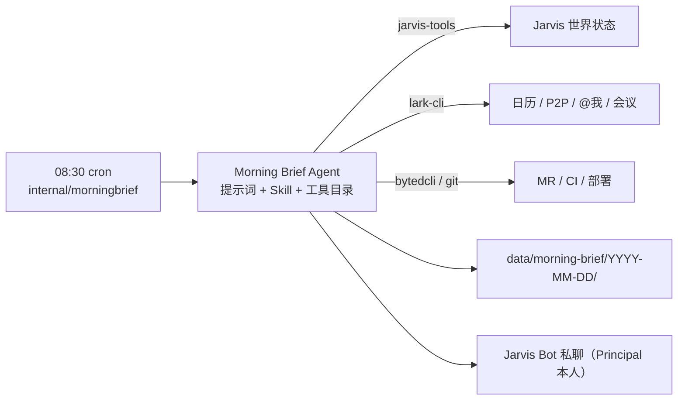

# 晨间作战简报（Morning Brief）产品方案

> Status: implementation-in-progress
> Authority: non-normative
> Last verified: 2026-08-04 @ `5baa104`

## 0. 一句话结论

Jarvis 应在每个工作日开工前给 Principal 发一份「晨间作战简报」：把今天的日程容量、未闭环
承诺、隔夜变化和当前执行状态压缩成最多三个今日结果，并明确指出现在先做什么。

它不是另一份日报，也不是把所有未完成任务重新罗列一遍，而是 Jarvis 每天与 Principal
完成的一次开工对齐：

> 今天最重要的结果是什么、时间是否够、什么发生了变化，以及现在先做什么。

第一阶段只服务一个本地 Principal，不建设多用户、租户、团队权限或 ToB 管理平台。

**实现形态上，它是一个 Skill 加一个定时器，不是一个新子系统。** 全部语义——取证范围、
容量判断、结果取舍、正文写法、投递时机、一天只发一次的自检——都在 Skill 和提示词里；
Go 侧只提供最薄的触发器，参照 `internal/meetingsweep`（229 行生产代码、无表、无 API、
无前端页面）。

## 1. 背景与用户问题

### 1.1 核心用户

- 同时参与多个项目的研发负责人、技术 owner 或核心 IC；
- 每天接收大量飞书群、私聊、会议、文档和代码仓库信息；
- 工作任务经常来自自然语言讨论、leader 交办、本人承诺或会议 follow-up，而不是正式工单；
- 需要频繁切换项目，同时要求上下文不丢、执行可追溯；
- 愿意让 Agent 主动推进工作，但要求清楚知道 Agent 为什么做、做到了什么，以及如何恢复。

### 1.2 典型痛点

- 群聊里说过的事情容易漏；
- 会议结论和行动项没有稳定进入执行闭环；
- 多项目并行时，任务、进展、阻塞、日程和代码状态散落在不同系统；
- 早上知道“有很多事情”，但不知道今天真正能完成什么；
- Agent 执行时缺少项目背景、仓库位置和历史决策，经常需要重新解释；
- 自动化工具会做事，但缺少确认、审计、恢复和项目级视图。

### 1.3 当前能力与缺口

Jarvis 已经具备三类相关能力：

| 能力 | 回答的问题 | 当前形态 |
|---|---|---|
| 19:00 个人日报 | 今天发生了什么 | 完整复盘、证据丰富、篇幅较长 |
| 会议巡扫 | 最近结束了哪些会议、未来 24 小时有哪些待参加会议 | 只采集线索，会后纪要和逐场处理判断都交给通用 M2→M3→M5 流水线 |
| 每小时主动巡视 | 世界发生了什么变化，Jarvis 是否应该行动 | 后台、低成本、通常静默 |

仍然缺少一个明确面向 Principal 的「今天怎么开工」界面。日报适合回顾，主动巡视适合
后台维护世界状态，二者都不能直接回答：

1. 今天只有多少真实可用时间；
2. 哪三个结果比其它事情更重要；
3. 昨晚之后发生了哪些会改变今天计划的变化；
4. Principal 现在应该先做什么。

## 2. 产品定位

### 2.1 产品定义

晨间作战简报是一个**每日一次、面向未来的开工建议**。

它以当前世界状态为输入，产出一份当天计划建议；计划本身不是硬状态机，Principal
可以接受、调整或忽略。Jarvis 不把建议伪装成已确认承诺，也不因为生成了一份简报就
自动创建 Task。

### 2.2 与相邻能力的边界

| 能力 | 时间方向 | 主要消费者 | 是否产生业务 Task |
|---|---|---|---|
| 个人日报 | 向后复盘 | Principal / 审计 | 否 |
| 会议巡扫 | 新事实采集 | M3 / M5 | 由通用流水线判断 |
| 主动巡视 | 持续观察现在 | Jarvis 内部 | 只在值得行动时创建普通 Task |
| 晨间简报 | 面向今天计划 | Principal | 否，第一阶段完全只读 |

晨间简报不能与主动巡视合并：

- 事实引擎负责持续维护内部世界状态；主动巡视需要频繁、便宜、允许 `NOTHING`，主要消费状态并维护未闭环工作；
- 晨间简报每天固定出现，必须稳定、短小、可解释，承担人与 Agent 的计划对齐；
- 二者可以复用同一组只读工具和世界状态，但提示词、产物和成功标准不同。

与主动巡视的协调规则（写进提示词，不写进 Go）：晨报必须读 Task/Run 的**当前**状态，
主动巡视刚创建的 Task 应体现为“已在推进”，不得重复呈现成“建议开始”；`今天先别提醒我`
这类偏好只影响晨报，不停止主动巡视。

### 2.3 第一阶段产品原则

1. **单人本地优先**：一个 Principal、一个时区、一个固定投递对象；
2. **Skill 自带全部语义**：判断逻辑放提示词和 Skill，不放 Go；
3. **低耦合**：不新增表、接口、前端页面，不改动 M2/M3/M5 与日报；
4. **结果优先**：最多三个今日结果，不生成任务清单瀑布；
5. **容量约束**：日程已经占满时，不能继续推荐三个大任务；
6. **只展示增量**：隔夜变化基于晨报自己的上一次证据截止点；
7. **证据可追溯**：重要判断必须能回到消息、会议、Task、文档或代码状态；
8. **背景不丢失**：简报是压缩展示，不取代 Task 的完整来源证据和上下文快照；
9. **只读 + 一次预授权投递**：除给 Principal 本人发这条消息外，不产生任何外部副作用；
10. **失败可见**：数据源缺失时明确标 `partial/error`，不静默补写看似完整的结论。

## 3. 用户体验

### 3.1 触发时间

第一阶段默认：

- `Asia/Shanghai`；
- 周一至周五 08:30（`30 8 * * 1-5`）；
- 支持本地配置修改与手动跑一次；
- 同一天只投递一次；手动重跑默认只更新文件，不重新投递。

第一阶段不做法定节假日服务和动态工作时间推断。周末不生成也不投递——这条规则完全由
cron 表达式的 `1-5` 承担，Go 里没有第二份工作日判断：改成 `* * *` 就真的周末也会跑，
不会被代码里的隐藏规则静默吞掉。

第二阶段可以改为“第一场会议前 30～45 分钟生成”，但必须保留最晚生成时间，避免
第一场会议过早或日历异常导致完全没有简报。

### 3.2 投递位置与查看方式

- **飞书 Jarvis Bot 私聊**：唯一主动触达入口，正文控制在一屏内；
- **本地 Markdown**：`data/morning-brief/YYYY-MM-DD/`，保存完整版正文、逐项日程、
  全部风险、证据索引和来源覆盖状态；飞书消息里给出该路径。

第一阶段**不做今日页**。产物的可观察性来自三处：磁盘上的 Markdown、飞书里那条消息、
以及 stderr 的一行运行日志（同 `meetingsweep`：产物本身可观察，就不建运行表）。

### 3.3 简报结构

飞书正文（硬约束的一屏）只包含五块：

#### A. 今日一句话

先判断今天的整体形态，例如会议密集日、交付冲刺日、风险处理日、有完整深度工作窗口的
推进日。

> 今天下午会议密集，真正连续可用的时间主要在 09:00–11:00；上午应优先完成飞书消息入口的端到端验收。

#### B. 今日最多三个必达结果

这里写结果，不写宽泛动作。

不好的表达：看一下 MR；写代码；跟进飞书。

好的表达：

- 完成 Jarvis 私聊消息入口的端到端验收，明确接收、判断和回复是否闭环；
- 给 agency 项目的方案评审产出可以直接讨论的正式版本；
- 消除发布链路当前唯一的人工阻塞。

每项在飞书正文里必须给出四件事，且**必须带项目名**（核心用户同时并行多个项目，不带
项目名的结果无法直接行动）：

- 要达成的结果（含项目）；
- 为什么必须是今天；
- 当前卡在哪；
- 建议的下一步。

对应 Task/Todo ID、来源消息、会议和证据链接放完整版，不占飞书正文。

简报不是为了填满三个位置：当天容量不足时只给一个或两个；没有可靠证据时不能编造
第三项。

#### C. 今天的固定安排（压缩到两三行）

只写会改变今天计划的部分：第一场会议是什么、需要准备什么、有哪些完整工作窗口、
哪段时间不适合安排编码。逐场日程明细放完整版。

#### D. 隔夜变化（最多三条）

只展示会改变今天计划的新增事实，例如：新收到的私聊与群内 @Principal、leader 新交办、
昨天承诺后的回复、日程或会议材料变化、MR/CI/部署状态变化、waiting Task 等待条件已
满足、新出现的阻塞或审批需求。超过三条时按“会不会改变今天的取舍”取舍，其余进完整版。

#### E. 建议的第一个动作 + 被延后项

结尾给一个清晰动作，并让“被主动延后”这件事**可见**：

> 建议现在先用 45 分钟完成第 1 项验收。另有 3 项今天排不进去（见完整版），其中「发布链路人工阻塞」明天最晚要处理。

用户一次发现“重要的事没出现在简报里”，就不会再信任这个产品。所以宁可少写内容，
也必须保留这一行计数。

### 3.4 飞书消息示例

```text
早上好。今天是会议偏重日，10:00 前有约 60 分钟完整工作窗口。

今日必达
1. [Jarvis] 完成私聊事件入口验收 —— 今天必须做，它阻塞后续所有主动交互能力。
   卡在：接收→判断→回复整链未验证。建议：先查事件消费状态和消息落库。
2. [agency] 产出晨报一期正式方案 —— 明天评审要用。
   卡在：范围已收敛，缺正式文档和实施拆分。建议：直接改 docs/design-morning-brief.md。

今天的安排
- 10:30 项目评审，材料仍缺最后一版结论。
- 14:00–17:00 连续会议，不适合安排编码。

隔夜变化
- Task #128 已到恢复时间，可以继续执行。
- MR !231 CI 已通过，尚未完成真实环境验收。

建议现在先推进第 1 项。另有 3 项今天排不进去。
完整版：data/morning-brief/2026-08-04/99-brief.md
```

### 3.5 想让 Jarvis 开始推进时怎么做

第一阶段**不做飞书文本命令**。原因是 Jarvis 不保留 Feishu event consumer，
Jarvis Bot 的 `im.message.receive_v1` 由 CC Connect 独占（同一 app 只能有一个事件连接
拥有者），而轮询侧 `isAutoRelatedP2P` 明确排除 `p2p_target_type=bot` 的私聊。也就是说
Principal 回给 Bot 的消息今天既没有事件流、也不会被采集。

在这个前提下承诺“回复 `推进 1` 即可”，等于让用户对着一个不存在的入口说话，比不做更糟。
提示词必须禁止在正文里出现这类承诺。

第一阶段的推进路径复用现成能力，零新代码：

- 在后台右侧对话里说一句（`POST /api/chat` 已接 `ContextAssembler`，拿的是同一份完整背景）；
- 或直接在任务页对已有 Task 操作。

简报正文可以给出一句可直接粘贴到对话框的话，但不定义 `推进 N` 这类编号协议——序号会
因重算而漂移，而且把语义编码成协议与本仓库“让模型自己理解自然语言”的取向相反。

打通 IM 双向交互需要先解决 Bot 事件所有权（给 Jarvis 单独申请 app、让 CC Connect 转发，
或放开 bot 私聊采集）。那是一项独立的基建决策，不应该绑住晨报。

## 4. 优先级与计划判断

### 4.1 不做固定分数公式

Agent 综合以下信号判断今日结果，不把它们固化成 Go 枚举或加权公式：

- 是否今天截止或今天有明确会议/发布节点；
- 是否来自 Principal 明确承诺、leader 交办或会议结论；
- 是否阻塞其他人或多个下游事项；
- 当前外部条件是否已经具备；
- 不做的真实代价；
- 是否能在今天剩余容量内取得可验证结果；
- 是否已经存在等价 Task 或已在执行，避免重复呈现；
- 是否属于当前活跃项目和 Principal 的核心职责。

提示词要求 Agent 解释“为什么是今天”，但不要求输出分数表。

### 4.2 容量是软判断，取证失败时不许硬下结论

建议顺序：先读今天的固定日程 → 估算可连续工作的窗口 → 再选今日结果 → 容量不足就主动
减少结果或建议延后 → 最后给第一个动作。

但日历取证是全链路里最容易 `partial` 的一环（Go 侧没有日历读取，完全靠 Agent 跑
`lark-cli`）。因此：

- 日程取到了：按容量校验结果数量，并写明依据；
- 日程 `partial/error`：正文必须明确“今天日程未取全，以下结果未经容量校验”，不得编造
  时间窗口，也不得因此不发简报。

会议已经占满一天时，正确结果可能只有一个“完成关键决策并保护一个 45 分钟窗口”，而不是
继续列三个大项目。

## 5. 数据源与证据边界

全部取证走**已有工具**，第一阶段不新增任何采集能力。

### 5.1 Jarvis 内部状态（`jarvis-tools`）

`get-principal`、`list-projects`、`list-tasks --status ...`、`list-todos`、`get-task`、
`list-scheduled-tasks`、`list-facts`、`list-relations`、`query-messages`、`get-context`。

重点查当前未闭环状态：`awaiting_approval`、`needs_human`、`waiting`、`executing`，以及
已到恢复时间的等待项。必须读当前状态，不能拿历史失败当成今天仍然有效的风险。

### 5.2 飞书（`lark-cli`）

- 今天的日历、会议、参与人和直接关联材料；
- 隔夜收到的 P2P 与群内 @Principal（以用户身份 `im +messages-search --as user`）；
- 直接影响今日计划的关键线程、文档和会议结论。

**这些取证只读，不落库、不进 M3。** 晨报不负责把隔夜消息变成 Todo——那是 M2/M3 的职责。
当前 `internal/capture/principal_activity.go` 只发现 Principal 自己发言的群，收到的 P2P 和
群内 @ 尚未进入流水线；补齐它是 M2 的独立工作，不是晨报的前置条件。晨报只需在覆盖状态
里如实标注读到了什么。

### 5.3 工程状态（`bytedcli` / `git`）

只围绕今日候选事项和活跃 Task 查询关联仓库的 Commit、MR/CR、Review、CI、部署和运行
验收。第一阶段不扫描全部本地仓库和全部远端项目；没有全量覆盖时使用“当前可达范围内”
或“至少 N”口径。

### 5.4 昨天的背景

- **上一份晨报**（必读）：提供证据截止点，见 §6.3；
- **上一份个人日报**（可选）：提供“昨天发生了什么”的压缩背景；读不到就标 `partial`，
  不作为窗口来源，也不因此失败。

### 5.5 证据保真

飞书正文可以压缩，但完整版必须让每个今日结果至少关联到一个现有 Task/Todo、一条来源
消息、一场会议，或一个代码/CI/部署/运行状态证据。用户后续通过对话推进时，Task 由现有
通用入口创建并使用唯一 Context Assembler 冻结背景；晨报的一句话只是入口提示，不覆盖
`source_payload`、原始证据或完整背景。

## 6. 第一阶段系统方案

### 6.1 总体结构



Go 侧的全部职责：到点、读提示词、拼工具目录、注入本轮硬边界、跑 Agent、记一行日志、
做一次最轻的产物检查。**没有别的。**

### 6.2 Go 侧改动清单（适度依赖的完整边界）

新增 `internal/morningbrief/`，照抄 `internal/meetingsweep` 的结构与体量：

```text
internal/morningbrief/worker.go      # 组装提示词、跑 Agent、检查产物
internal/morningbrief/scheduler.go   # cron + SkipIfStillRunning + Recover + 启动延迟
```

依赖的现有基建只有五项，每项都换来明确收益：

| 依赖 | 换来什么 |
|---|---|
| `internal/textstore` 注册 `morning_brief_system_prompt` + `conf/prompts/morning-brief-system-prompt.md` | 提示词是文件真源，`/api/text-files` 已可读写，缺失即 fail-fast（后台「系统提示词」页的 key 列表写死在 `web/src/Background.tsx`，`meeting_sweep` 也还没进去，要在页面上编辑需另加一项） |
| `internal/toolcatalog` 新增 stage `morning_brief` | 工具说明不复制进提示词；`jarvis-tools` 的 stage 门禁天然挡住 `create-task` |
| `execute.CodexRunner.RunTextSandboxAtStage` | 不自己起子进程、不自己管沙箱与超时 |
| `conf/config.yaml` 一个 `morning_brief` 段 + `internal/config` 一个结构体和一段校验 | 与其它定时 Agent 一致的启动期校验 |
| `cmd/jarvis-server/main.go` 两处接线 | 与 `meetingsweep` 完全同构 |

**明确不动**：不新增表、不改 `internal/domain`、不加 HTTP 路由、不改前端、不改
`internal/dailydigest`、不改 M2/M3/M5、不改 `internal/capture`。

### 6.3 Skill 与产物

新增：

```text
.agents/skills/summarize-morning-brief/SKILL.md
conf/prompts/morning-brief-system-prompt.md
```

Skill 负责本方案第 3、4、5 章的**全部**内容，并管理自己的目录：

```text
data/morning-brief/YYYY-MM-DD/
├── 00-context.md   # 本轮 run id、窗口、来源覆盖状态、投递记录
├── 10-evidence-*.md
└── 99-brief.md     # 完整版正文（飞书是它的短投影）
```

`00-context.md` 里有三行是 Skill 自己的状态真源，格式固定、由提示词约定：

```text
- run_id: morning-brief-20260804T083012
- cutoff_at: 2026-08-04T08:30:12+08:00
- delivered: om_xxx at 2026-08-04T08:30:41+08:00
```

**证据截止点靠这条链自洽**：本轮窗口起点 = 上一份晨报目录里的 `cutoff_at`，终点 = 本轮
生成时刻。首次运行（或找不到上一份）退化到前一自然日 00:00，并在覆盖状态里标注“缺少
上一份晨报基线”，不伪装成正常增量。

刻意不挂在个人日报的 `cutoff_at` 上：日报 19:00 生成、可被手动重算，起点会漂移，且
19:00 之后手动重算过的时段会同时落在两份产物的缝里。晨报维护自己的链，不受另一条
产品线影响。

### 6.4 一天只发一次：文件自检 + 进程内互斥

不建表，防重分两层：

- **程序保证**：cron 使用 `SkipIfStillRunning` + `Recover`，同一进程内不并发、不重入；
- **模型判断**：Agent 开工先读当天目录。已有 `delivered:` 记录时不再投递，可以更新文件
  但必须说明本轮没有重复发送。

Go 只传当天日期和 `trigger`（`schedule` / `manual`），不替模型判断“今天发过没有”。

启动补跑照 `internal/dailydigest` 的 `catchUpDue` 语义，而不是 `meetingsweep` 的“启动就跑
一次”：只有**当天的计划点已经过去**、且**当天 `99-brief.md` 还不存在**时才补跑一次。少了
这道门槛，每次 `rebuild-server.sh` 都会烧一次强模型，并且当天第一次重启还会在任意时刻
投出一份“晨报”。文件存在性检查是机械判断（当天产物在不在磁盘上），投递去重仍然归模型。

这是本方案对 §AGENTS-3 的取舍：投递去重没有程序消费点（无 UI、无 API、无调度依赖），
所以不做成硬字段。将来真要做今日页和投递审计，再加薄记录——届时优先做成
`internal/dailydigest` 的第三个 scope（它的 `ClaimGeneration` / `SetDone` / `SetFailed` /
`RecoverInterruptedGeneration` 已经是 scope 无关的），而不是新建一张表。

### 6.5 投递

Skill 复用现有 `.agents/skills/feishu-send-message`：`jarvis-tools get-principal` 拿身份，
`lark-cli im +messages-send --user-id <principal open_id> --as bot`。

硬约束写进提示词：

- 收件人只能是 Principal 本人，不得自行选择其他人或群；
- 定时触发投递；手动重跑默认只更新文件，除非本轮任务显式要求重新投递；
- 投递后把 `message_id` 和时间写回 `00-context.md`；
- 发送失败保留完整版正文并在日志与覆盖状态里留下原始错误，不静默重试到另一个渠道；
- 生成失败时不发送任何看似成功的简报。

当天没有会议、没有隔夜变化、也没有未闭环事项时，仍发一条极短的“轻量日”简报，维持
稳定的开工仪式。

### 6.6 唯一的 Go 侧产物检查

日报踩过一个坑：模型只在最终消息里写了摘要，磁盘上的正式稿还是旧的
（`internal/dailydigest/person.go` 因此用 hash + mtime 校验新鲜度）。晨报保留这条教训，
但只做最轻的版本：运行结束后 `os.Stat` 当天 `99-brief.md`，确认存在且 mtime 晚于本轮
启动时刻，否则记 error 日志并把本轮判为失败。一次系统调用，不引入对 `dailydigest`
的依赖。

### 6.7 模型

用 `execute` 段的强模型（当前 `gpt-5.6-sol`）、`danger-full-access`、联网。

晨报每天只跑一次，成本可忽略；而它的核心动作是“三个结果的取舍 + 容量推理 + 判断哪些
变化会影响今天”，是全系统最吃判断力的产物之一。这里不用便宜模型换成本。超时按日报量级
给（600 秒），只作失控兜底。

## 7. 第一期交付拆分

第一阶段只有两步，都不依赖其它模块的进度。

### 7.1 P1：能发出一份可信的简报

- `internal/morningbrief` worker + scheduler，配置段与启动期校验；
- 提示词与 Skill：取证范围、容量降级、三块内容结构、正文字数与形态约束；
- 证据截止点链与首次运行退化；
- Markdown 目录、`00-context.md` 三行状态、完整版正文；
- 飞书固定私聊投递、一天一次自检、失败可见；
- Go 侧产物新鲜度检查。

### 7.2 P2：跑两周，只改提示词

不加功能，连续观察 10 个工作日，只调提示词和 Skill：

- 三个结果是否真的是当天最重要的；
- 有没有出现“重要的事没进简报”；
- 容量判断是否可信；
- 隔夜变化有没有重复昨天已知信息；
- 是否出现过重复投递、空简报或假成功。

P2 结束后再决定要不要今日页、投递审计和 IM 双向交互。**在有真实使用数据之前不加结构。**

## 8. 第一阶段不做什么

- 新表、新 HTTP 接口、新前端页面；
- `principal_inbox` 等 M2 采集改造，以及 Bot 事件所有权变更；
- 飞书文本命令（`推进 N` / `延后` / `静默`）和编号协议；
- 晨报自动创建 Todo/Task，或晨报专用状态机；
- 多租户、团队空间、成员管理、经理视角；
- 自动修改日历或替 Principal 对外承诺 deadline；
- 全量扫描全部飞书群、Drive、仓库和远端项目；
- 全天持续自动重排、富卡片、拖拽排程；
- 为数据源失败增加静默 fallback。

## 9. 验收标准

### 9.1 内容（可判定，不用主观感受）

- 飞书正文不超过 800 个中文字符，且只含 §3.3 的 A–E 五块；完整版不限长度；
- 今日结果不超过三个，每项都带项目名、为什么今天、卡在哪、下一步；
- 每个今日结果在完整版里都能追溯到 Task/Todo、消息、会议或工程状态之一；
- 日程覆盖状态显式；`partial/error` 时正文必须声明未经容量校验；
- 隔夜变化基于 `cutoff_at` 增量，不重播上一份晨报已经说过的事；
- 结尾必有“另有 N 项今天排不进去”这一行（N 可以为 0）；
- 正文不出现“回复即可推进”这类当前不存在的交互承诺。

### 9.2 系统行为

- 每个配置工作日生成一次、投递一次；重跑不重复投递；
- 生成失败时不发送简报，日志有原始错误；
- 除给 Principal 发这一条消息外，无任何外部副作用（stage 门禁保证 `create-task` 不可用）；
- 运行结束后当天 `99-brief.md` 必然是本轮产物；
- 进程重启不会导致当天重复投递。

### 9.3 观察方式

第一阶段不建指标系统，只靠三样东西：

- stderr 日志行（成功/失败、耗时）；
- 当天目录里的覆盖状态；
- Principal 的直接反馈——发现漏报或误判时在后台对话里说一句，由 Jarvis 用
  `jarvis-tools append-shared-memory` / `append-fact` 沉淀成偏好，下一轮晨报自然读到。

这条反馈回路本身就是本仓库“闭环真的闭上”的一次检验：用了现成工具，不需要新表。

管理后台的「回顾」页在「每日总结」后提供「晨报」Tab，直接读取上述 canonical Markdown
归档，并复用每日总结的日期切换、报告卡片和 Markdown 阅读格式。页面保持只读，不复制正文、
不新增数据库，也不改变晨报的生成与投递链路。

## 10. 后续阶段

按价值排序，都要等 P2 的真实数据：

1. **IM 双向交互**：先解决 Bot 事件所有权，再谈“一条回复就能推进”；
2. **今日页与投递审计**：回顾页只读归档已经落地；若继续建设独立今日页或投递审计，
   再基于真实需求决定是否扩展现有接口，不复制正文真源；
3. **日内重新计划**：关键会议被提前、Top 1 已完成、发布失败导致计划失效时，由主动巡视
   建议重算一次，不默认频繁打扰；
4. **专注时间建议**：根据日历空窗建议保护深度工作时间，是否写入日历由 Principal 确认；
5. **个性化学习**：把接受/调整/忽略沉淀为自然语言偏好（Fact / PrincipalProfile），不设计
   偏好枚举和推荐模型。

## 11. 外部产品参考

### 11.1 Google Gemini Scheduled Actions

Gemini 支持把日历、待办和邮件等连接数据组合成定时摘要，并在预定交付前准备内容。
Jarvis 应借鉴“固定节奏 + 新鲜连接数据”，但不能停留在信息拼接，还要结合真实任务
状态和执行能力给出今日取舍。

- <https://support.google.com/gemini/answer/16316416?hl=en-CA>

### 11.2 Sunsama Daily Planning

Sunsama 的核心不是自动罗列任务，而是通过每日规划选择今天真正做什么、检查工作量并
按可用时间安排。Jarvis 应借鉴“先看容量，再承诺结果”，避免生成一个不可完成的 Top 3。

- <https://help.sunsama.com/docs/getting-started/basics/daily-planning-the-basics/>
- <https://help.sunsama.com/docs/usage-guides/daily-planning/>

### 11.3 Motion

Motion 强调在 deadline、优先级和可用时间变化后持续重排。这个方向适合作为 Jarvis
后续阶段的“日内修正”，不应在第一阶段就引入自动排程和复杂日历写入。

- <https://www.usemotion.com/help>

## 12. 最终产品判断

日报是 Jarvis 的记忆，主动巡视是后台神经系统，晨间作战简报是每天一次的开工对齐。

第一版成功的标准不是生成更长、更漂亮的摘要，也不是建成一个新子系统，而是：

1. 早上两分钟内讲清今天真正重要的事情；
2. 主动暴露日程容量与计划之间的冲突，取不到日程时诚实承认；
3. 被压缩掉的内容仍然可见、可追溯，不让 Principal 担心漏事；
4. 全部判断都在提示词和 Skill 里，改口径不需要改 Go；
5. Go 侧新增代码与 `internal/meetingsweep` 同量级，且不牵动任何既有模块。
