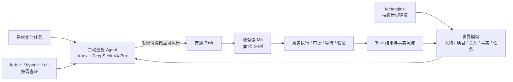

# 主动巡视 Agent（Proactive Heartbeat）方案

> Status: implemented-history
> Authority: non-normative
> Last verified: 2026-08-02 @ `feature/proactive-heartbeat-agent`
> Current behavior: 稳定边界已并入 [`00-overview.md`](00-overview.md)，本文保留实施动机和验收设计。

> 2026-08-06 ownership update: factengine 以持续世界建模为主要任务；主动巡视以看护和推进未闭环工作为主。这个职责划分不是写入禁令：巡视调查中发现明确、有用的变化时，可以直接维护 Person / Project / Group / ManagedResource / Fact / RelationFact，但不为了补全模型扩大单轮范围。以 `00-overview.md` 为准。

## 1. 一句话结论

增加一个由系统定时任务唤醒的低成本 Agent：它使用 `traex + DeepSeek-V4-Pro` 周期性读取 factengine 维护的世界状态、看护未闭环事项，并把此刻值得推进且已经具备执行条件的工作创建成普通 Task，交给现有强 M5 Agent 执行。

它不是新的规则引擎，也不是 M3/M5 之间的新闸门。它是站在现有流水线上方、定时醒来观察全局的 Agent。



## 2. 为什么不能直接复用现有 ScheduledTask 执行路径

当前 `internal/scheduledtask` 的语义是“到点后物化一个普通 Task”，普通 Task 随后统一使用 `execute.model` 执行。仓库当前基线是 `gpt-5.6-sol`。

如果直接创建一个每小时执行的 ScheduledTask：

1. 每次巡视都会先创建一条用户可见 Task，任务列表会被心跳噪声淹没；
2. 巡视本身使用强 M5 模型，无法满足 `DeepSeek-V4-Pro` 的成本分层；
3. “决定现在要不要创建 Task”和“执行已经确定的 Task”再次混为同一职责；
4. 心跳 Task 的 `completed` 只表示巡视结束，容易与真正业务目标完成混淆。

因此 MVP 复用的是现有系统 cron 模式（与 factengine、daily digest 同类），不是 ScheduledTask 的“到点创建 M5 Task”分发语义。

## 3. 主动巡视 Agent 的三个目标

### 3.1 读取世界模型

factengine 用同一个低成本 Agent 把 message / Todo / Task 原料蒸馏成增量 Fact，并通过通用 CRUD 工具按需维护当前实体、关系、资源和重要背景。主动巡视从这些当前投影和事实历史中渐进加载上下文，不承担全量持续建模的主要职责；巡视调查时发现明确、有用的变化，可以直接维护并读回，也可以按判断走统一线索入口。

### 3.2 发现此刻值得推进的事情

巡视 Agent 不只看新消息，而是把以下信息放在一起判断：

- Principal 的职责、偏好和约束；
- 活跃项目、优先级、近期事实和关系；
- 最近消息、Todo、Task、ScheduledTask 及执行结果；
- 必要时从飞书、代码仓库和内部研发系统查到的实时状态。

它不是另一套 M3。单条新消息已经构成明确行动线索时，仍由 M3 进入 Todo/Task；heartbeat 重点寻找的是跨多条证据才显现的机会、时间流逝带来的变化、长期没有新输入但仍应推进的目标，以及已有 Task 的失速或误关单。

只有同时满足以下语义条件，才创建普通 Task：

- 对 Principal 或活跃项目存在具体价值；
- “为什么是现在”能够由当前证据解释；
- 下一步是边界清楚、可以由强 M5 调查并推进的工作；
- 已检查 Todo、运行中/等待中/已失败 Task，不存在等价事项；
- Task 自带根目标、证据、成功标准、约束和相关项目/仓库上下文。

不满足时，合法结果包括继续调查、保留观察，或本轮什么都不做。不要为了证明主动性而制造 Task。

### 3.3 看护已经开始但尚未闭环的事情

这是让系统从“主动发现器”变成“主动任务数字分身”的关键补充。

每轮应关注：

- 长时间没有真实进展的 pending / executing / waiting / needs_human Task；
- 失败后外部条件已经变化、现在可能值得重试的事项；
- 执行 Agent 自报 done，但成功标准或真实世界结果仍缺证据的事项；
- 新事实已经推翻原 Task 假设、需要重新调查或调整方向的事项；
- 已经存在 Task，因此不应重复创建的新线索。

发现已关单事项仍未真正完成时，MVP 不偷偷改写原 Task 的完成历史；它记录新证据，并在确有下一步时创建带原 Task 引用的 follow-up Task。

MVP 不新增 Goal Tree、Concern、评分维度或完成状态机。Agent 先利用当前 Project、Todo、Task、Fact 和 RelationFact 做语义判断；只有真实运行证明这些载体不足，再把 Goal/Commitment 提升成一等持久对象。

## 4. 权限与职责边界

主动巡视 Agent 本轮允许：

- 使用 `jarvis-tools`、`lark-cli`、`bytedcli`、`git` 做调查；
- 读取 Jarvis 内部的世界模型；
- 在调查过程中按需维护已经确认且有用的内部认知；
- 创建普通 Task；
- 本轮没有值得做的事时明确结束。

主动巡视 Agent 本轮不负责：

- 直接给人或群发消息；
- 直接改代码、推送、开 MR；
- 直接修改外部文档、日程、审批或其它业务对象；
- 代替 M5 做长任务执行；
- 仅凭一次局部 Effect 宣布业务目标已经完成。

这些外部动作统一进入普通 Task，由现有 M5 在完整上下文下执行，并按具体副作用判断是否需要审批。

这个边界不是按 action_type 做风险枚举，而是按主要职责划分：factengine 持续维护内部认知；巡视 Agent 主要看护和推进工作，也能顺手维护调查确认的内部变化；Worker Agent 才改变外部世界。

## 5. 一轮 heartbeat 的行为

```text
定时唤醒
  ↓
读取 Principal + 活跃项目 + 当前 Todo/Task 概览
  ↓
按近期变化和当前关注点，渐进加载事实、关系、消息和外部状态
  ↓
审视未闭环工作：是否卡住、失效、误关单或时机已经变化
  ↓
判断本轮是否存在一个或少量真正值得推进的动作
  ├─ 否：NOTHING，安静结束
  └─ 是：查重并创建完整普通 Task → 强 M5 异步执行
  ↓
输出本轮简短运行摘要，写入 system-task 日志
```

这是一轮新的、无长期对话依赖的 Agent Session。跨轮记忆来自世界模型和 Task/Fact 历史，不来自无限续跑的模型聊天历史。

最终摘要不设计成新的严格语义 DTO。程序只要求 Agent 进程成功且最终消息非空；本轮到底更新了什么、创建了什么，以工具写入和 Task ID 为真实记录，摘要只服务人工观测。

## 6. 模型与调度

建议新增独立配置：

```yaml
proactive:
  enabled: true
  schedule: "@every 1h"
  startup_delay_seconds: 120
  bin: "traex"
  model: "DeepSeek-V4-Pro"
  sandbox: "danger-full-access"
  reasoning_effort: "medium"
  timeout_seconds: 900
```

选择理由：

- 本机 `traex models` 已确认存在精确模型名 `DeepSeek-V4-Pro`；
- 与 `execute.model=gpt-5.6-sol` 独立，明确形成“低成本巡视 + 强模型执行”分层；
- 首版每小时一次，先观察真实 token 成本、空跑率、世界更新质量和 Task 命中率，再决定是否缩短到 30 分钟；
- 使用 `cron.SkipIfStillRunning`，上一轮未结束时跳过本轮，不并发跑两个全局巡视；
- 运行失败直接记录失败，不静默切换到强模型或其它模型。

不在第一版加入工作时间段、动态频率、事件触发或多模型 fallback。真实运行证明每小时不够及时后，再讨论事件唤醒；它最终也应进入同一 `RunOnce`，而不是出现第二条判断链路。

## 7. Prompt 设计

稳定行为正文放在：

```text
conf/prompts/proactive-system-prompt.md
```

并在 `internal/textstore/defaults.go` 注册稳定 key。文件缺失或正文为空时 fail-fast，不在 Go 中复制 fallback Prompt。

Prompt 只约束角色与行为，不复制工具手册。工具能力继续由 `internal/toolcatalog` 与 Skills 维护。

核心指令应包括：

1. 你是 Jarvis 的主动巡视 Agent，不是业务执行 Worker；
2. 先理解 Principal、活跃项目和未闭环工作，再决定查什么；
3. 主动使用工具多跳查证，能查到的不要问 Principal；
4. 渐进读取当前画像、增量事实和时效关系；调查中发现明确变化时可顺手维护，但不为补全模型扩大范围；
5. 创建 Task 前查重，并写清根目标、成功标准、证据、约束和 why now；
6. 外部业务动作只创建 Task，不直接执行；
7. `NOTHING` 是正常且常见的高质量结果；
8. 不输出评分表，不被固定枚举驱动，结合完整上下文自行判断。

## 8. Task 创建契约

`scripts/jarvis-tools` 当前能查 Task，但不能创建普通 Task；已有 `POST /api/tasks` 只服务后台手工创建。MVP 增加 `create-task` 子命令，复用同一 `taskcreate.Submitter`，不再造第二套任务创建链路。

建议 payload 保持现有 Task 外壳，语义正文继续使用宽松 JSON：

```json
{
  "title": "核实并补齐 Agent runtime 项目的发布阻塞",
  "action_type": "agent_task",
  "target": "确认当前发布阻塞并推进到可发布状态",
  "project_id": 12,
  "background": {
    "origin": "proactive_heartbeat",
    "observed_at": "2026-08-02T15:00:00+08:00",
    "why_now": "最新 CI 已结束，但发布状态仍未更新",
    "evidence": [
      "task:381 昨日已完成代码修复",
      "bytedcli: pipeline 9172 已通过"
    ],
    "success_criteria": [
      "核实真实发布状态",
      "若仍被阻塞，明确并推进下一步",
      "用可追溯证据记录最终状态"
    ],
    "constraints": "不要重复已有 Task；对外动作按 M5 审批策略判断"
  }
}
```

创建后仍由 Context Assembler 把 Principal、Project、repo 和 request context 组装为完整快照；M5 不需要知道这条 Task 来自哪一种业务来源。

审计上建议给 Task 增加机器来源 `source_type=proactive`，并在 created TaskEvent 中记录本轮时间和触发方式。它只用于来源追踪和查重，不参与语义分流、审批或执行策略。

第一版查重由 Agent 在创建前查询当前 Todo/Task 并做语义判断。若真实运行出现重复创建，再增加明确的幂等键；不要预先设计候选表、评分表和复杂去重状态机。

## 9. 与现有模块的关系

| 现有模块 | 保持不变的职责 | 主动巡视如何使用 |
|---|---|---|
| M2 capture | 原样采集外部事实 | 必要时查询已采集消息，不介入采集判断 |
| M3 extract | 从新证据提取/更新 Todo | 不替换 M3；巡视从全局状态主动发现跨线索机会 |
| factengine | 原料蒸馏为增量 Fact，并用通用工具维护当前世界状态 | 作为巡视的持续世界模型 |
| World model CRUD | 保存画像、事实、关系和资源 | factengine 主要维护；巡视调查中按需维护 |
| taskcreate | 来源无关地创建 Task | `create-task` 复用同一 Submitter |
| M5 execute | 调查并完成具体 Task | 继续使用 `gpt-5.6-sol` 做强执行 |
| ScheduledTask | 到点创建 Task / 恢复等待 Session | 不承载 heartbeat 自身 |
| System Tasks | 配置和查看系统 cron | 展示 heartbeat 配置与运行日志 |

## 10. MVP 代码落点

预计最小改动：

```text
internal/proactive/worker.go             一轮 Agent 调用与结果检查
internal/proactive/scheduler.go          cron 唤醒，SkipIfStillRunning
internal/proactive/worker.go             同时组装时间、工具、规则、共享记忆
conf/prompts/proactive-system-prompt.md  唯一 Prompt 真源
internal/textstore/defaults.go           注册 Prompt key
internal/config/                         独立模型与调度配置、runtime settings
cmd/jarvis-server/main.go                构造 runner、worker、scheduler
internal/toolcatalog/catalog.go          新增 proactive 阶段说明
scripts/jarvis-tools                     新增 create-task
internal/api/task_create.go              接受 agent 来源并复用 Submitter
internal/taskcreate/factory.go           记录 proactive 来源、照常组装快照
web/src/SystemTasks.tsx                  展示配置与运行记录
```

同时提供 `-proactive-once`，让开发和真实验收可以明确触发一轮，而不必修改 cron 或等待一个小时；它与定时任务调用同一个 `RunOnce`。

`execute.CodexRunner` 可以继续复用进程管理和 `RunTextSandboxAt`，但要允许调用者显式设置 `JARVIS_AGENT_STAGE=proactive`，不能把所有 one-shot Agent 都伪装成 execute 阶段。

## 11. 验收标准

### 11.1 自动化测试

- `proactive.enabled=true` 时缺 bin/model/schedule/prompt 任一项启动失败；
- scheduler 重入时跳过，不产生并发巡视；
- Agent 失败时本轮明确失败，不切模型、不吞错；
- `create-task` 通过既有 API 创建 `source_type=proactive` 的 pending Task；
- 创建的 Task 经过 Context Assembler，包含 Principal、Project、repo 和主动巡视证据；
- Task 创建后能够被现有 M5 实时领取；
- prompt 明确包含世界维护、未闭环看护、Task 查重和 `NOTHING` 边界；
- Prompt 文件缺失或为空 fail-fast。

### 11.2 真实验收

手工触发一次 heartbeat，至少完成以下闭环之一：

1. 找到真实但缺失的世界信息，使用 Jarvis 工具补齐，并在下一次查询中读回；
2. 发现一个真实、尚未有等价 Todo/Task、当前可推进的事项，创建完整 Task；
3. 在没有值得做的事情时不创建 Task，并在系统任务日志中留下清楚的 NOTHING 摘要。

若创建了 Task，还必须继续验证该 Task 确实由强 M5 而不是 DeepSeek-V4-Pro 执行。

## 12. 第一版之后再根据数据决定的事项

以下方向重要，但不进入 MVP：

- Goal / Commitment 成为一等持久对象；
- 事件到达后即时唤醒同一个巡视循环；
- 独立 Verifier 对 M5 的完成声明做系统化验收；
- 为 heartbeat 增加数据库级运行历史、候选历史和接受/拒绝反馈；
- 根据空跑率、Task 接受率、重复率和错误世界更新率自动调频；
- 多 Principal、多 Agent 或并行巡视。

先跑通“factengine 持续世界建模 → 低成本定时巡视读取状态并返回 NOTHING / 创建高质量 Task → 强 M5 执行 → TaskEvent 回到 factengine”这一条最小闭环，再决定哪些抽象真的有必要。
