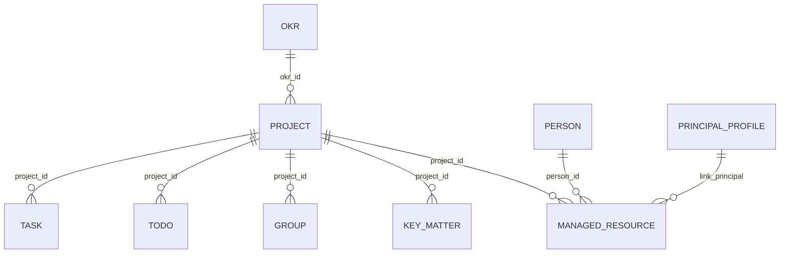

# M1 背景信息模块

> Status: current
> Authority: normative module guide
> Last verified: 2026-08-02 @ `89fa24b`
> Code source: `internal/background/`, `internal/domain/models.go`, `internal/domain/knowledge.go`

M1 维护 principal 的稳定工作背景，供 M3/M5 和日报读取。SQLite 是真源；不向向量库同步背景，也没有 memory sidecar。

## 1. 边界

| M1 负责 | M1 不负责 |
|---|---|
| PrincipalProfile、OKR、Project、KeyMatter、Person、ManagedResource CRUD | 消息采集、Todo 抽取、M5 执行 |
| Group 的人工背景与 Project 归属 | Group 发现、活跃度和消息落库 |
| lark-cli 姓名解析 | 完整飞书读写封装 |
| 后台背景配置页 | 持续世界建模 |

## 2. 当前关系

Task 是独立执行单元，只保留既有可选 `project_id`，不增加 `okr_id` 或 `key_matter_id`。当前没有 `project_member` 模型或表。动态实体关系使用自然语言 `RelationFact` 表达；一个 Group 至多直接绑定一个 Project。

## 3. 关键模型

- OKR：`title`、`cycle`、自由文本状态、负责人和闭环时间；通过 `okr_id` 聚合 Project
- Project：`code`、`name`、`role(owner|participant)`、`status(planning|active|paused|archived|done)`、`priority` 和可选 `okr_id`
- KeyMatter：项目内持续跟进的重要事项，状态保持自由文本，可选截止时间；闭环后保留历史
- Person：Feishu ID、姓名、`role(leader|key|colleague|other)`、权重、关系、沟通风格、P2P chat、启用状态
- PrincipalProfile：本人身份、职责、偏好和 leader
- Group：采集维护会话身份与活跃信息；M1 维护 `project_id` 和 `background_note`。`include_in_memory` 当前只存储/展示，没有 memory sidecar 运行效果
- ManagedResource：人工维护的文档、链接、仓库或备注，可关联 Person、Project 和 principal

字段和 allowlist 以 Go model/service 为准，不在本文复制 DDL。

## 4. Fact 与 RelationFact

- Project 创建、修改、归档会写自然语言 Fact；Fact 也可通过 API 写入。
- factengine 从 message、TodoEvent 和 TaskEvent 持续蒸馏 Fact，并通过通用 CRUD 工具按需维护当前背景、关系和资料。
- RelationFact 保存两个既有实体之间的自然语言关系与有效期。
- M1 不负责从会话批量蒸馏事实。
- OKR 周视图把当前 Page 结论与所选周的 Fact 并列展示：显式风险词或逾期事项标为风险；活跃实体本周无 Fact 且最近实质进展早于本周时标为失速。该投影只读，Task 仍是独立执行单元。
- OKR 证据写回只接受已采集 Message：外部 Meego/飞书内容保持只读，以 Message 数值行 ID 作为 Fact 来源追溯；同一来源和描述可安全重放，Page 仍走原有 CAS，冲突不会丢失已关联 Fact。
- 未关联 OKR 证据通过只读列表按来源、采集时间和稳定锚点收窄；列表不猜 OKR 实体，Agent 回读层级后选择最小的 OKR/Project/KeyMatter，再复用统一证据写回边界。关联完成后该来源消息从列表消失，不产生 Task。

## 5. API 与初始化

OKRs、Projects、Key matters、Persons、Groups、Profile、Managed resources、Facts 和 RelationFacts 的路由见 [HTTP API](../reference/http-api.md)。OKR/KeyMatter 的删除接口是闭环，Project 的删除接口是软归档。

首次身份、项目、人物、重点事项和群监听统一由仓库级 `bootstrap-jarvis-world-model` Skill 依据当前用户证据建立。M1 不保留任何特定用户的 seed 数据，也不从关键群机械批量导入人物。

## 6. 已知边界

- 多仓库 Project 由模型结合 Task 上下文选择 repo。
- Person 停用依赖人工维护。
- Project 与 Person 目前没有结构化成员关系表。
