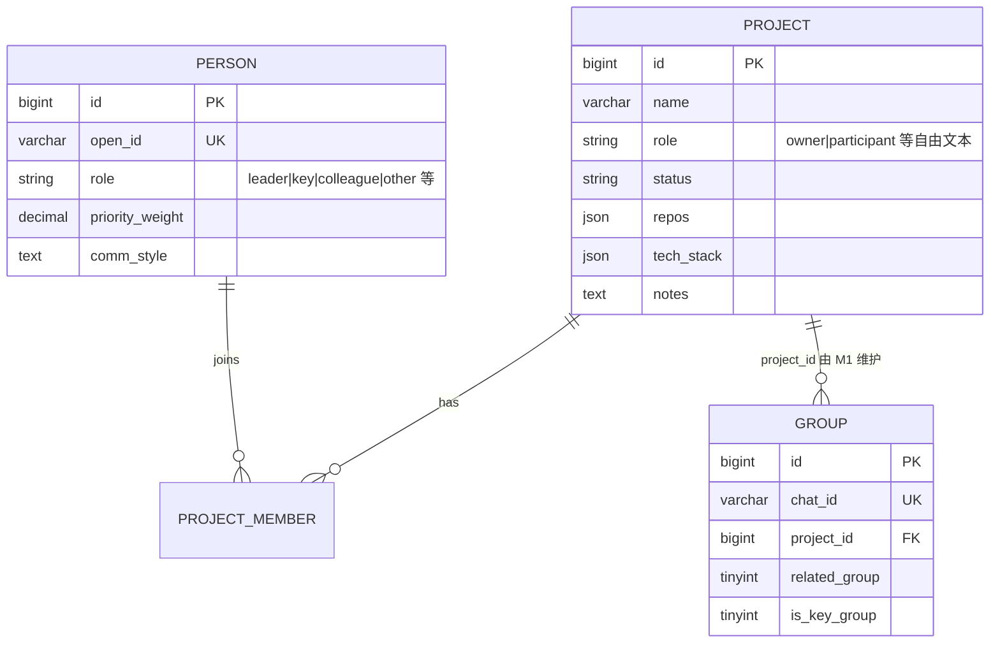

# M1 背景信息模块

> 隶属总纲 [`docs/00-overview.md`](../00-overview.md)。技术栈与实体权威定义以总纲为准。
>
> 模块定位：手工维护的背景知识底座——`Project` / `Person` / `principal_profile`，以及 Group↔Project 归属。下游 M3/M5 读这些背景做判断；长期事实不在这里写，由离线事实引擎沉淀到 `fact` 表（见总纲 §5）。

---

## 0. 边界

| 属于 M1 | 不属于 M1 |
|---|---|
| Project / Person / principal_profile 建模与 CRUD | 消息采集（M2）、Todo 提取（M3）、判断与执行（M5） |
| Group↔Project 关联（`feishu_group.project_id`） | Group 发现、扫描分层、消息落库（M2） |
| 用 lark-cli 把姓名解析成 open_id | 飞书消息读写的完整封装（M2/M5） |
| 后台「背景配置页」的交互契约 | 事实蒸馏（`internal/factengine`） |

原则：本地可信明文；fail-fast；MySQL 是 source of truth；不往向量库投背景、不经 sidecar。

---

## 1. 实体关系



- Project ↔ Person 多对多，走 `project_member`。
- Project ↔ Group 一对多：一个群至多挂一个项目。
- Person 的全局 `role` / `priority_weight` 与项目内 `project_member.relation` 正交。

代码：`internal/domain/models.go`，服务在 `internal/background/`。

---

## 2. 关键字段（以代码为准）

权威 DDL 与 GORM model 以仓库为准，这里只列下游真正消费的字段：

**Project**：`name`、`role`、`status`、`repos`（本地路径列表，随任务交给执行者）、`description` / `notes`、`tech_stack` / `key_decisions`（宽松 JSON，模型读）。

**Person**：`open_id`（绑定键）、`name`、`role`、`priority_weight`、`comm_style`（辅助识别隐含交办）、`p2p_chat_id`、`notes`、`is_active`。

**principal_profile**：本人身份、leader、偏好等，供 M3/M5 提示词注入「我是谁」。

已删除（勿再写回）：`mem0_synced_at`。背景不再注入任何记忆 sidecar。

---

## 3. 与事实层的关系

| 东西 | 谁写 | 谁读 | 用途 |
|---|---|---|---|
| Project / Person | 后台 / seed | M3、M5、日报 | 结构化背景 |
| `fact` | 离线事实引擎（主）/ API（辅） | M3、contextsnap、日报 | 「已经这样了」的自然语言结论 |
| `relation_fact` | knowledge / API | knowledge | 实体间动态关系 |

M1 不负责蒸馏事实。模型要查「这个项目/人身上发生过什么」时用 `jarvis-tools list-facts`，不要指望后台点一次「同步记忆」。

---

## 4. API 与运维

路由注册在 `internal/api/router.go`，handler 在 `internal/api/`。

常用 one-shot：

```bash
./bin/jarvis-server -config conf/config.yaml -seed
./bin/jarvis-server -config conf/config.yaml -seed-persons
```

姓名 → open_id：`internal/background/resolve.go`（lark-cli contact）。

---

## 5. 开放问题

1. Project `repos` 多仓库时，执行环节如何选默认路径——目前靠上下文与模型推断。
2. Person 是否需要「离职/停用」自动从关键群成员同步——当前靠 `is_active` 手工维护。
