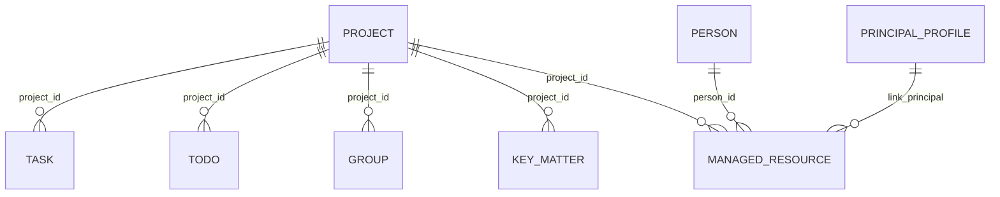

# M1 背景信息模块

> Status: current
> Authority: normative module guide
> Last verified: 2026-09-11
> Code source: `internal/background/`, `internal/domain/models.go`, `internal/domain/progress.go`, `internal/progress/`, `internal/factengine/`

M1 维护 principal 的稳定工作背景，供 M3/M5 和日报读取。SQLite 是真源；不向向量库同步背景，也没有 memory sidecar。

## 1. 边界

| M1 负责 | M1 不负责 |
|---|---|
| PrincipalProfile、Project、KeyMatter、ProjectRisk、ProjectChange、Person、ManagedResource CRUD | 消息采集、Todo 抽取、M5 执行 |
| Group 的人工背景与 Project 归属 | Group 发现、活跃度和消息落库 |
| lark-cli 姓名解析 | 完整飞书读写封装 |
| 后台背景配置页 | 持续世界建模 |

## 2. 当前关系

Task 是独立执行单元，只保留可选 `project_id`，不直接关联 KeyMatter 或产品模块实体。当前没有 `project_member` 模型或表。确定性归属优先使用既有外键，跨模块且需要程序查询的实体映射使用通用 `EntityRelation`，叙述性关系写在实体 `summary` 页的 Markdown 引用中；一个 Group 至多直接绑定一个 Project。

## 3. 关键模型

- Project：`code`、`name`、`role(owner|participant)`、`status(planning|active|paused|archived|done)`、`priority` 和 `summary`
- KeyMatter：项目内持续跟进的重要事项，状态保持自由文本，可选截止时间；闭环后保留历史
- ProjectRisk：项目级不确定性，保留轻量概率、影响以及触发/关闭时间；详细条件、缓解方案和证据写在 Page
- ProjectChange：已经作出的项目级目标或范围调整，以 `changed_at` 记录生效时间；变更前后、原因和影响写在 Page
- Person：Feishu ID、姓名、`role(leader|key|colleague|other)`、权重、P2P chat、`summary` 和启用状态
- PrincipalProfile：本人身份和 `summary`
- Group：采集维护会话身份与活跃信息；M1 维护 `project_id`、控制字段和 `summary`。`include_in_memory` 当前只存储/展示，没有 memory sidecar 运行效果
- ManagedResource：人工维护的文档、链接、仓库或备注，可关联 Person、Project 和 principal

字段和 allowlist 以 Go model/service 为准，不在本文复制 DDL。

## 4. Fact、Page 与 EntityRelation

- `summary` 保存实体当前最佳认知，整体读写、有字符上限，更新使用 CAS 防止并发覆盖。
- 所有实体共用 `entity-page-guidance.md` 的内容契约，由模型根据对象与证据组织页面，不维护按实体类型划分的模板。
- 自然语言关系写成 `[名称](type:id)` 页内引用；写入时校验目标存在，反查使用 backlinks。
- EntityRelation 保存两个既有实体之间带证据、需要程序查询的跨模块映射，不替代叙述性引用。
- WorldProgress 保存指定主体在一个周期内的证据化判断；项目进展与 OKR 世界投影使用同一服务，但不替代 OKR 产品的正式 Progress，也不重复承载独立 ProjectRisk。
- `Fact` 是追加式证据索引，不是第二份知识正文。它保存简短锚点、业务发生时间和原始材料指针；需要判断时沿 `source_kind/source_id` 读取原文。
- Fact 可以指向 `message`、`todo_event`、`task_event`、`execution_run` 和 `resource`；程序自身的状态变化使用 `source_kind=system`，不携带 `source_id`。FactEngine 当前自动消费的来源只有 Message、TodoEvent 和 TaskEvent。
- `PageRevision` 保存实体页被改写前的完整正文。它记录“认知笔记怎样变化”，不是“现实发生了什么”，因此不进入 Fact。
- factengine 消费 Message、TodoEvent 和 TaskEvent 的独立游标，把一批完整材料交给同一个 Agent。Todo/Task 事件只提供证据定位，Task 的状态流转和 Task.summary 留在行动记录中；有关联 Run 时携带原始 output 与 effects，供 Agent 判断背后的现实事实是否改变实体认知。整轮成功后才推进游标，失败则重放。
- M1 不负责从会话批量蒸馏事实。
- 外部证据先进入 Message/Clue，再由 Agent 写入最小的 Project、KeyMatter 或其它通用实体；Page 继续使用 CAS，Fact 保留来源追溯。

实体页回答“现在是什么”，Fact 帮助定位“发生了什么”，PageRevision 回答“我们的认知怎样被改写”。三者不能互相替代。

## 5. API 与初始化

Projects、Key matters、Project risks、Project changes、Persons、Groups、Profile、Managed resources、Facts、EntityRelations 和实体长期事实页的路由见 [HTTP API](../reference/http-api.md)。KeyMatter、ProjectRisk、ProjectChange 的删除接口是闭环，Project 的删除接口是软归档。Risk 触发后的承接使用 `project_risk --handled_by--> key_matter` 通用关系，KeyMatter 不增加类型字段。

首次身份、项目、人物、重点事项和群监听统一由仓库级 `bootstrap-jarvis-world-model` Skill 依据当前用户证据建立。M1 不保留任何特定用户的 seed 数据，也不从关键群机械批量导入人物。

## 6. 已知边界

- 多仓库 Project 由模型结合 Task 上下文选择 repo。
- Person 停用依赖人工维护。
- Project 与 Person 目前没有结构化成员关系表。
- 旧 Fact 可能没有可追溯指针；新写入按当前服务校验，历史数据不伪造迁移。
