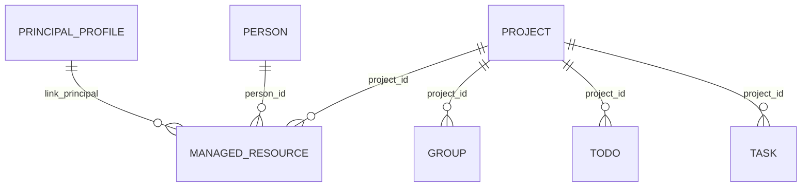

# M1 背景信息模块

> Status: current
> Authority: normative module guide
> Last verified: 2026-09-06 @ `250bbdb`
> Code source: `internal/background/`, `internal/domain/models.go`, `internal/progress/`

M1 维护 principal 的稳定工作背景，供 M3/M5 和日报读取。SQLite 是真源；不向向量库同步背景，也没有 memory sidecar。

## 1. 边界

| M1 负责 | M1 不负责 |
|---|---|
| PrincipalProfile、Project、Person、ManagedResource CRUD | 消息采集、Todo 抽取、M5 执行 |
| Group 的人工背景与 Project 归属 | Group 发现、活跃度和消息落库 |
| lark-cli 姓名解析 | 完整飞书读写封装 |
| 后台背景配置页 | 持续世界建模 |

## 2. 当前关系

当前没有 `project_member` 或通用实体关系表。确定性归属使用既有外键；其他关系写在实体 `summary` 页中，以 `[名称](person:12)` 这类 Markdown 引用连接目标实体。写入时校验目标存在，反向关系由正文引用查询得到。一个 Group 至多直接绑定一个 Project。

## 3. 关键模型

- Project：`code`、`name`、`role(owner|participant)`、`status(planning|active|paused|archived|done)`、`priority` 和 `summary`
- Person：Feishu ID、姓名、`role(leader|key|colleague|other)`、权重、P2P chat、`summary` 和启用状态
- PrincipalProfile：本人身份和 `summary`
- Group：采集维护会话身份与活跃信息；M1 维护 `project_id`、控制字段和 `summary`。`include_in_memory` 当前只存储/展示，没有 memory sidecar 运行效果
- ManagedResource：人工维护的文档、链接、仓库或备注，可关联 Person、Project 和 principal

字段和 allowlist 以 Go model/service 为准，不在本文复制 DDL。

## 4. Fact 与页内引用

- `summary` 保存实体当前长期认知，`Fact` 保存发生过的事情；Fact 可通过 API 写入。
- factengine 从 message、TodoEvent 和 TaskEvent 持续蒸馏 Fact，并通过页面工具维护当前背景、关系和资料。
- 自然语言关系没有独立表或字段，使用 `summary` 中的实体引用表达；读取走 page/backlink API。
- M1 不负责从会话批量蒸馏事实。

## 5. API 与初始化

Projects、Persons、Groups、Profile、Managed resources、Facts 和实体长期事实页的路由见 [HTTP API](../reference/http-api.md)。`DELETE /api/projects/:id` 实际是软归档。

首次身份、项目、人物、重点事项和群监听统一由仓库级 `bootstrap-jarvis-world-model` Skill 依据当前用户证据建立。M1 不保留任何特定用户的 seed 数据，也不从关键群机械批量导入人物。

## 6. 已知边界

- 多仓库 Project 由模型结合 Task 上下文选择 repo。
- Person 停用依赖人工维护。
- Project 与 Person 目前没有结构化成员关系表。
