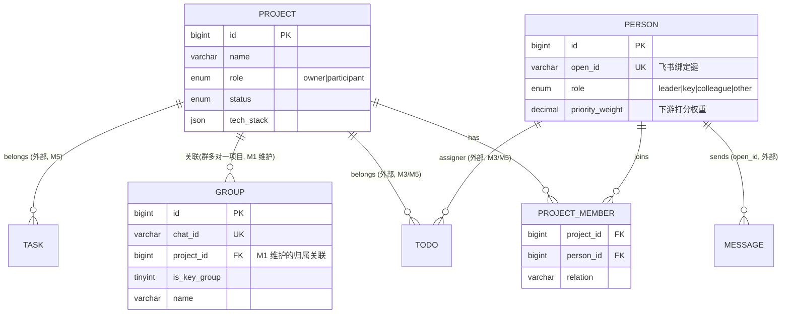

# M1 背景信息模块 · 详细技术方案

> **版本说明**：本模块隶属总纲 [`docs/00-overview.md`](../00-overview.md)，遵循其全局技术栈与实体定义。技术栈 **Go 1.26 / Hertz（CloudWeGo v0.10.5）/ GORM（`gorm.io/gorm` + MySQL driver，不引入 bytedgorm）**；定时任务 robfig/cron v3；记忆层 **mem0（Python）以 sidecar 形式，Go 侧通过 HTTP 调用**（不引入 Eino/Kitex）。本次技术方案由 Python 栈整体迁移到 Go 栈，实体从 4 个扩展为 7 个（见总纲 §2），M1 负责其中 Project / Person 的建模与 CRUD，并新增「Group↔Project 关联维护」职责。

> 模块定位：飞书私人 AI 管家系统的「背景知识底座」。让研发工程师（owner: `chujiejie.1`）**手动设计并持续完善**自己的项目背景（Project）与重点人员背景（Person），把这些背景以可检索形式注入 mem0（经 sidecar），供下游 **Todo 提取（M3）/ M5 判断环节** 使用，并维护飞书群（Group）与项目的归属关联。**leader 交办的行动线索是全系统的最高优先级信号，其建模从本模块起源。**

---

## 0. 全局约定与设计原则（本模块严格遵守）

1. **本地可信环境**：open_id、姓名、部门、沟通风格等全部明文存 MySQL，不加密、不脱敏。
2. **fail-fast**：解析不到 open_id、mem0 注入失败、唯一键冲突等一律显式报错并向上暴露（Go 侧返回 `error`、handler 返回非 0 code），**不静默降级、不写 fallback**。尤其单测必须让问题暴露。
3. **不乱兼容历史数据**：涉及版本/审计/历史留存/未知发件人处理等策略，一律在文末「开放问题清单」标注 **【需与用户确认】**，不擅自实现兼容逻辑。
4. **模块化 + 高维视角**：MySQL 是结构化事实的**唯一权威源（source of truth）**；mem0 只是它的**语义可检索投影**。两者职责分离，不互相污染。
5. **优先用官方能力**：人员解析用 `lark-cli contact`（Go 侧 `exec.Command` 子进程封装）；记忆层用开源 `mem0`（Python sidecar 暴露的 HTTP 接口 + Qdrant 后端），不自造记忆存储；ORM 用官方 `gorm.io/gorm`。

### 0.1 模块边界

| 属于 M1 | 不属于 M1（由其他模块负责） |
|---|---|
| Project / Person 实体建模、DDL、GORM model、CRUD API | 消息采集（M2）、Todo 提取（M3）、判断与执行（M5） |
| **Group↔Project 关联维护**（把飞书群标注归属到某项目） | Group 实体建模/发现/扫描分层（M2 拥有，见总纲 §2） |
| open_id ↔ 姓名 的解析与绑定 | 飞书消息读写的 lark-cli 封装（M2/M5） |
| 背景注入 mem0（写侧，经 sidecar）+ 提供检索接口（供 M3 调用） | mem0 sidecar 进程 / Qdrant 部署（M0 基础设施，见总纲 §5） |
| 管理后台「背景配置页」的交互契约 | React 后台框架本身（M0） |

> **Group 职责边界**：Group（飞书群/单聊会话，原 `jarvis_chat` 升为一等实体）的**完整建模与 DDL 归 M2**（见总纲 §2）。M1 只负责**维护它与 Project 的关联**（`group.project_id`）——即在后台把某个群标注为归属某项目，并把「群↔项目」关系纳入背景语义（供 M3 判断消息属于哪个项目）。M1 不负责群的发现、扫描分层、消息落库。

---

## 1. 实体关系概览

本模块**拥有** 2 个核心实体（`Project`、`Person`）与 1 张关联表（`project_member`）。总纲定稿的 7 实体中，`Group` / `Todo` / `Task` / `Resource` / `ScanRecord` 由其他模块拥有，M1 只做外部引用：通过 `person.open_id`（下游按发件人反查）、`group.project_id`（M1 维护的关联）、`todo.project_id`/`task.project_id`（下游按项目归类）。



- **Project ↔ Person 是多对多**：用独立关联表 `project_member`，而非 JSON 字段，保证可查询、可反查（"这个 leader 关联了哪些项目"）。
- **Project ↔ Group 是一对多**：一个项目可关联多个群，一个群至多归属一个项目（`group.project_id` 外键，见总纲 §2 Group DDL）。M1 提供后台维护这层归属。
- **Person 的全局关系角色（role）** 决定其 `priority_weight`；**项目内的具体角色** 由 `project_member.relation` 表达（如同一人是 A 项目 tech_lead、B 项目 collaborator）。两者正交，互不覆盖。

---

## 2. Project 实体建模

### 2.1 字段语义

| 字段 | 类型 | 语义 | 注入 mem0 | 备注 |
|---|---|---|---|---|
| `id` | BIGINT PK | 自增主键 | 否 | 内部主键 |
| `code` | VARCHAR(64) UK NULL | 人类可读 slug（如 `jarvis`） | 是（做实体锚点） | 可空；填了则唯一 |
| `name` | VARCHAR(255) | 项目名称 | 是 | 必填 |
| `role` | ENUM(`owner`,`participant`) | 我在项目中的角色（负责 / 参与） | 是 | **owner 项目权重更高**，下游可利用 |
| `status` | ENUM(`planning`,`active`,`paused`,`archived`,`done`) | 项目状态 | 是 | 默认 `active` |
| `priority` | TINYINT 1–5 | 项目重要度 | 是 | 供 M5 判断环节参考的项目侧权重 |
| `description` | TEXT | 项目背景/目标（自由文本） | 是（核心） | 用户"不断完善"的主战场 |
| `repos` | JSON | 仓库列表 `[{"name","url","local_path"}]` | 是 | 关键决策/代码定位用 |
| `tech_stack` | JSON | 技术栈 `["Go","Hertz","GORM"]` | 是 | 辅助 Todo 提取判断相关性 |
| `key_decisions` | JSON | 关键决策 `[{"date","title","detail"}]` | 是 | v1 用 JSON，见开放问题 #6 |
| `timeline` | JSON | 里程碑 `[{"date","milestone"}]` | 是 | v1 用 JSON |
| `notes` | TEXT | 备注 | 是 | 杂项 |
| `mem0_synced_at` | DATETIME NULL | 最近一次成功注入 mem0 的时间 | 否 | 同步状态，UI 展示 |
| `created_at` / `updated_at` | TIMESTAMP | 创建/更新时间 | 否 | 提供最基本的"时间"感知 |

> 设计取舍：`key_decisions` / `timeline` 用 JSON 列而非子表，是为了匹配"手动逐步完善"的低频编辑场景、避免过度建模。若未来需要**按决策查询/带审计时间线**，再升级为子表 —— 见开放问题 #6【需与用户确认】。

### 2.2 DDL

> 权威 DDL 见总纲 §2.4；此处与总纲一致，附完整 CHECK 约束版本便于本模块自测。

```sql
CREATE TABLE project (
  id              BIGINT UNSIGNED NOT NULL AUTO_INCREMENT,
  code            VARCHAR(64)  NULL          COMMENT '人类可读唯一 slug，可空',
  name            VARCHAR(255) NOT NULL      COMMENT '项目名称',
  role            ENUM('owner','participant') NOT NULL COMMENT '我在项目中的角色',
  status          ENUM('planning','active','paused','archived','done')
                  NOT NULL DEFAULT 'active'  COMMENT '项目状态',
  priority        TINYINT UNSIGNED NOT NULL DEFAULT 3 COMMENT '项目重要度 1-5',
  description     TEXT NULL                  COMMENT '项目背景/目标，自由文本',
  repos           JSON NULL                  COMMENT '[{"name":..,"url":..,"local_path":..}]',
  tech_stack      JSON NULL                  COMMENT '["Go","Hertz","GORM"]',
  key_decisions   JSON NULL                  COMMENT '[{"date":..,"title":..,"detail":..}]',
  timeline        JSON NULL                  COMMENT '[{"date":..,"milestone":..}]',
  notes           TEXT NULL                  COMMENT '备注',
  mem0_synced_at  DATETIME NULL              COMMENT '最近成功注入 mem0 时间',
  created_at      TIMESTAMP NOT NULL DEFAULT CURRENT_TIMESTAMP,
  updated_at      TIMESTAMP NOT NULL DEFAULT CURRENT_TIMESTAMP
                  ON UPDATE CURRENT_TIMESTAMP,
  PRIMARY KEY (id),
  UNIQUE KEY uk_project_code (code),
  KEY idx_project_role (role),
  KEY idx_project_status (status),
  CONSTRAINT ck_project_priority CHECK (priority BETWEEN 1 AND 5)
) ENGINE=InnoDB DEFAULT CHARSET=utf8mb4 COLLATE=utf8mb4_0900_ai_ci
  COMMENT='项目背景实体';
```

### 2.3 GORM Model（Go struct，替代原 Pydantic 领域模型）

DB 交互统一用 `gorm.io/gorm` + `gorm.io/driver/mysql`。JSON 列用自定义类型实现 `driver.Valuer` / `sql.Scanner`（或用 `gorm.io/datatypes`），避免手写序列化。

```go
package domain

import (
	"time"

	"gorm.io/datatypes"
)

// Project 对应表 project。JSON 列用 datatypes.JSON 承载，
// 应用层按 Repo/Decision/Milestone 结构编解码。
type Project struct {
	ID           uint64          `gorm:"column:id;primaryKey;autoIncrement" json:"id"`
	Code         *string         `gorm:"column:code;uniqueIndex:uk_project_code" json:"code,omitempty"`
	Name         string          `gorm:"column:name;not null" json:"name"`
	Role         string          `gorm:"column:role;not null" json:"role"`     // owner|participant
	Status       string          `gorm:"column:status;not null;default:active" json:"status"`
	Priority     uint8           `gorm:"column:priority;not null;default:3" json:"priority"` // 1-5
	Description  *string         `gorm:"column:description" json:"description,omitempty"`
	Repos        datatypes.JSON  `gorm:"column:repos" json:"repos,omitempty"`               // []Repo
	TechStack    datatypes.JSON  `gorm:"column:tech_stack" json:"tech_stack,omitempty"`     // []string
	KeyDecisions datatypes.JSON  `gorm:"column:key_decisions" json:"key_decisions,omitempty"` // []Decision
	Timeline     datatypes.JSON  `gorm:"column:timeline" json:"timeline,omitempty"`        // []Milestone
	Notes        *string         `gorm:"column:notes" json:"notes,omitempty"`
	Mem0SyncedAt *time.Time      `gorm:"column:mem0_synced_at" json:"mem0_synced_at,omitempty"`
	CreatedAt    time.Time       `gorm:"column:created_at" json:"created_at"`
	UpdatedAt    time.Time       `gorm:"column:updated_at" json:"updated_at"`
}

func (Project) TableName() string { return "project" }

type Repo struct {
	Name      string `json:"name"`
	URL       string `json:"url"`
	LocalPath string `json:"local_path,omitempty"`
}
type Decision struct {
	Date   string `json:"date"`
	Title  string `json:"title"`
	Detail string `json:"detail,omitempty"`
}
type Milestone struct {
	Date      string `json:"date"`
	Milestone string `json:"milestone"`
}
```

> **fail-fast**：`role`/`status` 用字符串常量而非隐式默认。落库前在 service 层校验取值合法（非法即返回 error，不静默改成默认值）。是否引入枚举校验中间件属实现细节，不做兜底转换。

---

## 3. Person 实体建模（含 leader 高权重建模）

### 3.1 字段语义

| 字段 | 类型 | 语义 | 注入 mem0 | 备注 |
|---|---|---|---|---|
| `id` | BIGINT PK | 自增主键 | 否 | |
| `open_id` | VARCHAR(64) **UK** | 飞书 open_id | 是（实体锚点） | **绑定主键**，见 §5 |
| `union_id` | VARCHAR(64) NULL | 飞书 union_id | 否 | 跨应用备用 |
| `feishu_user_id` | VARCHAR(64) NULL | 飞书 user_id | 否 | 备用 ID |
| `name` | VARCHAR(128) | 姓名（缓存自通讯录） | 是 | 必填 |
| `en_name` | VARCHAR(128) NULL | 英文名 | 是 | |
| `avatar_url` | VARCHAR(512) NULL | 头像 | 否 | UI 展示 |
| `department` | VARCHAR(255) NULL | 部门（缓存） | 是 | |
| `title` | VARCHAR(128) NULL | 职位（缓存） | 是 | |
| `role` | ENUM(`leader`,`key`,`colleague`,`other`) | **关系角色** | 是 | 决定 `priority_weight` |
| `priority_weight` | DECIMAL(3,2) 0–1 | **优先级权重** | 是（核心） | 下游打分直接使用，见 §3.3 |
| `relation` | VARCHAR(255) NULL | 关系描述（直属 leader / 隔级 / 跨部门 PM） | 是 | |
| `comm_style` | TEXT NULL | 沟通风格（如"结论先行、指令常隐含"） | 是（核心） | 辅助 M3 理解隐含交办 |
| `p2p_chat_id` | VARCHAR(64) NULL | 与该人单聊 chat_id | 否 | 供 M5 发消息/确认 |
| `notes` | TEXT NULL | 备注 | 是 | |
| `is_active` | TINYINT(1) | 是否有效 | 否 | 软标记，非软删除历史 |
| `mem0_synced_at` | DATETIME NULL | 最近注入 mem0 时间 | 否 | |
| `created_at`/`updated_at` | TIMESTAMP | 时间戳 | 否 | |

### 3.2 DDL

> 权威 DDL 见总纲 §2.4；此处与总纲一致，附 CHECK 约束版本便于本模块自测。

```sql
CREATE TABLE person (
  id               BIGINT UNSIGNED NOT NULL AUTO_INCREMENT,
  open_id          VARCHAR(64)  NOT NULL      COMMENT '飞书 open_id，绑定键',
  union_id         VARCHAR(64)  NULL,
  feishu_user_id   VARCHAR(64)  NULL          COMMENT '飞书 user_id',
  name             VARCHAR(128) NOT NULL      COMMENT '姓名（缓存自通讯录）',
  en_name          VARCHAR(128) NULL,
  avatar_url       VARCHAR(512) NULL,
  department       VARCHAR(255) NULL          COMMENT '部门（缓存）',
  title            VARCHAR(128) NULL          COMMENT '职位（缓存）',
  role             ENUM('leader','key','colleague','other') NOT NULL
                   COMMENT '关系角色，决定优先级',
  priority_weight  DECIMAL(3,2) NOT NULL      COMMENT '优先级权重 0.00-1.00',
  relation         VARCHAR(255) NULL          COMMENT '关系描述',
  comm_style       TEXT NULL                  COMMENT '沟通风格，注入 mem0',
  p2p_chat_id      VARCHAR(64)  NULL          COMMENT '单聊 chat_id，供 M5',
  notes            TEXT NULL,
  is_active        TINYINT(1) NOT NULL DEFAULT 1,
  mem0_synced_at   DATETIME NULL,
  created_at       TIMESTAMP NOT NULL DEFAULT CURRENT_TIMESTAMP,
  updated_at       TIMESTAMP NOT NULL DEFAULT CURRENT_TIMESTAMP
                   ON UPDATE CURRENT_TIMESTAMP,
  PRIMARY KEY (id),
  UNIQUE KEY uk_person_open_id (open_id),
  KEY idx_person_role (role),
  CONSTRAINT ck_person_weight CHECK (priority_weight >= 0 AND priority_weight <= 1)
) ENGINE=InnoDB DEFAULT CHARSET=utf8mb4 COLLATE=utf8mb4_0900_ai_ci
  COMMENT='重点人员背景实体';
```

### 3.3 GORM Model（Go struct）

```go
// Person 对应表 person。open_id 是不可变绑定键（唯一索引）。
type Person struct {
	ID             uint64     `gorm:"column:id;primaryKey;autoIncrement" json:"id"`
	OpenID         string     `gorm:"column:open_id;not null;uniqueIndex:uk_person_open_id" json:"open_id"`
	UnionID        *string    `gorm:"column:union_id" json:"union_id,omitempty"`
	FeishuUserID   *string    `gorm:"column:feishu_user_id" json:"feishu_user_id,omitempty"`
	Name           string     `gorm:"column:name;not null" json:"name"`
	EnName         *string    `gorm:"column:en_name" json:"en_name,omitempty"`
	AvatarURL      *string    `gorm:"column:avatar_url" json:"avatar_url,omitempty"`
	Department     *string    `gorm:"column:department" json:"department,omitempty"`
	Title          *string    `gorm:"column:title" json:"title,omitempty"`
	Role           string     `gorm:"column:role;not null" json:"role"`                 // leader|key|colleague|other
	PriorityWeight float64    `gorm:"column:priority_weight;not null" json:"priority_weight"` // 0-1
	Relation       *string    `gorm:"column:relation" json:"relation,omitempty"`
	CommStyle      *string    `gorm:"column:comm_style" json:"comm_style,omitempty"`
	P2PChatID      *string    `gorm:"column:p2p_chat_id" json:"p2p_chat_id,omitempty"`
	Notes          *string    `gorm:"column:notes" json:"notes,omitempty"`
	IsActive       bool       `gorm:"column:is_active;not null;default:1" json:"is_active"`
	Mem0SyncedAt   *time.Time `gorm:"column:mem0_synced_at" json:"mem0_synced_at,omitempty"`
	CreatedAt      time.Time  `gorm:"column:created_at" json:"created_at"`
	UpdatedAt      time.Time  `gorm:"column:updated_at" json:"updated_at"`
}

func (Person) TableName() string { return "person" }
```

### 3.4 leader 高权重如何建模 + 下游如何利用

**建模**：`role` → `priority_weight` 的默认映射（可被单个 Person 覆盖）：

| role | 默认 priority_weight | 语义 |
|---|---|---|
| `leader` | **1.00** | 直属/关键 leader，交办即最高优先级 |
| `key` | 0.70 | 关键协作人（核心同事、跨端负责人） |
| `colleague` | 0.40 | 普通同事 |
| `other` | 0.10 | 一般联系人 / 未定级 |

Go 侧默认映射（用户可覆盖；`PersonCreate.PriorityWeight` 为 nil 时按 role 取默认）：

```go
var defaultPriorityWeight = map[string]float64{
	"leader":    1.00,
	"key":       0.70,
	"colleague": 0.40,
	"other":     0.10,
}

// resolveWeight: 显式传入优先；否则按 role 取默认。role 非法直接报错（fail-fast，不兜底）。
func resolveWeight(role string, explicit *float64) (float64, error) {
	if explicit != nil {
		return *explicit, nil
	}
	w, ok := defaultPriorityWeight[role]
	if !ok {
		return 0, fmt.Errorf("invalid person role: %q", role)
	}
	return w, nil
}
```

> 默认值在应用层落库时写入（用户可改）；具体数值需据实跑校准 —— 开放问题 #4【需与用户确认】。

**下游利用（本模块提供数据，M3 与 M5 判断环节消费）**：

1. **M3 Todo 提取**：当一条消息的 `sender_open_id` 命中 `role='leader'` 的 Person，提取 Todo 的 prompt 注入强信号：
   > "以下消息来自你的直属 leader（最高优先级）。leader 的交办默认视为可执行**行动线索（Todo）**，需重点识别**显性与隐性**的行动项。其沟通风格：{comm_style}。"

   `comm_style` 帮助模型理解"隐含指令"（例如 leader 习惯用"看下这个"表达"排期处理"）。注意：M3 产出的是 **Todo（线索/候选，可能模糊）**，是否固化为 **Task（可执行任务）** 由 M5 判断环节决定（见总纲 §2.3 Todo/Task 拆分）。

2. **M5 判断环节**：`priority_weight` 与 `project.priority` 随背景快照一起进 prompt，作为"这条线索值不值得做"的判断依据之一。**不入任何打分公式**——早期的 `confidence × risk` 打分已随规则引擎退役，现在由模型自己权衡：leader 交办、高优先级项目天然更容易被判为值得做，但结论由模型结合具体内容给出，不由权重算出来。

---

## 4. project_member 关联表

### 4.1 DDL

```sql
CREATE TABLE project_member (
  id          BIGINT UNSIGNED NOT NULL AUTO_INCREMENT,
  project_id  BIGINT UNSIGNED NOT NULL,
  person_id   BIGINT UNSIGNED NOT NULL,
  relation    VARCHAR(64) NOT NULL DEFAULT 'collaborator'
              COMMENT '项目内角色：tech_lead/pm/collaborator/...',
  created_at  TIMESTAMP NOT NULL DEFAULT CURRENT_TIMESTAMP,
  PRIMARY KEY (id),
  UNIQUE KEY uk_project_person (project_id, person_id),
  KEY idx_pm_person (person_id),
  CONSTRAINT fk_pm_project FOREIGN KEY (project_id)
             REFERENCES project(id) ON DELETE CASCADE,
  CONSTRAINT fk_pm_person  FOREIGN KEY (person_id)
             REFERENCES person(id)  ON DELETE CASCADE
) ENGINE=InnoDB DEFAULT CHARSET=utf8mb4 COLLATE=utf8mb4_0900_ai_ci
  COMMENT='项目-人员关联';
```

### 4.2 GORM Model

```go
type ProjectMember struct {
	ID        uint64    `gorm:"column:id;primaryKey;autoIncrement" json:"id"`
	ProjectID uint64    `gorm:"column:project_id;not null;uniqueIndex:uk_project_person,priority:1" json:"project_id"`
	PersonID  uint64    `gorm:"column:person_id;not null;uniqueIndex:uk_project_person,priority:2" json:"person_id"`
	Relation  string    `gorm:"column:relation;not null;default:collaborator" json:"relation"`
	CreatedAt time.Time `gorm:"column:created_at" json:"created_at"`
}

func (ProjectMember) TableName() string { return "project_member" }
```

- `ON DELETE CASCADE`：删除 Project/Person 时自动清理关联行（fail-fast、无孤儿数据）。
- **删除实体时对应的 mem0 记忆需在应用层显式清理**（见 §6.3），DB 级联不覆盖 mem0。

---

## 5. open_id 与姓名解析绑定

绑定键是 **immutable 的 `open_id`**；`name/department/avatar/title` 都只是**缓存展示字段**，可刷新。

### 5.1 lark-cli 能力（已只读探测）

```text
# 按姓名/关键词搜索（用户身份），返回 open_id + p2p_chat_id + 部门等
lark-cli contact +search-user --query "张三" --as user --format json
lark-cli contact +search-user --queries "alice,bob,张三" --as user   # 多名并行
lark-cli contact +search-user --query "张三" --has-chatted --exclude-external-users  # 同名消歧

# 按已知 open_id 反查资料（用户身份，可批量 ≤100）
lark-cli contact +search-user --user-ids "ou_xxx,ou_yyy" --as user

# bot 身份按 id 取单个用户
lark-cli contact +get-user --user-id ou_xxx --as bot --format json
```

调用方式：Go 主服务以 **`exec.Command` 子进程**调用 lark-cli，`--format json` 解析 stdout。统一封装在总纲 §8 的 `internal/larkcli/` 包（供 M1/M2/M5 共用）。**fail-fast**：子进程非 0 退出、超时、或结果 `has_more=true` 无法唯一确定时，直接返回 `error` 给上层（handler 转 4xx/5xx），由用户消歧，绝不猜测绑定。

**Go 封装示意**（`internal/larkcli`，M1 只用 contact 子集）：

```go
package larkcli

import (
	"context"
	"encoding/json"
	"fmt"
	"os/exec"
	"time"
)

type Candidate struct {
	OpenID     string `json:"open_id"`
	Name       string `json:"name"`
	EnName     string `json:"en_name,omitempty"`
	Department string `json:"department,omitempty"`
	AvatarURL  string `json:"avatar_url,omitempty"`
	P2PChatID  string `json:"p2p_chat_id,omitempty"`
}

type searchResult struct {
	Users   []Candidate `json:"users"`
	HasMore bool        `json:"has_more"`
}

// SearchUser 调 `lark-cli contact +search-user`，fail-fast：非 0 退出/超时/解析失败直接返回 error，不吞。
func (c *Client) SearchUser(ctx context.Context, query string) ([]Candidate, error) {
	ctx, cancel := context.WithTimeout(ctx, 15*time.Second)
	defer cancel()

	cmd := exec.CommandContext(ctx, c.bin,
		"contact", "+search-user",
		"--query", query,
		"--as", "user",
		"--format", "json",
	)
	out, err := cmd.Output() // stderr 未捕获时 err 里含 *ExitError
	if err != nil {
		return nil, fmt.Errorf("lark-cli search-user failed: %w", err)
	}
	var r searchResult
	if err := json.Unmarshal(out, &r); err != nil {
		return nil, fmt.Errorf("parse lark-cli output: %w", err)
	}
	return r.Users, nil
}
```

> 令牌桶限流、`--as user/bot` profile 选择、stderr 摘要透传等由 `internal/larkcli` 统一处理（见总纲 §4）。M1 不重复实现，只调用。

### 5.2 正向绑定：姓名 → open_id（创建 Person 时）

1. 用户在后台"新建人员"输入姓名 → 前端调 `POST /api/persons/resolve`。
2. 后端执行 `larkcli.SearchUser(ctx, name)`，返回候选列表（`open_id / name / en_name / avatar / department / p2p_chat_id`）。
3. 前端渲染候选卡片，用户点选正确的人。
4. 提交 `POST /api/persons`，落库 `open_id`（+ 缓存字段），并触发 mem0 注入。

### 5.3 反向解析：open_id → Person（流水线中）

- M2 采集到消息，携带 `sender_open_id`。M3 通过 `PersonRepo.GetByOpenID(ctx, openID)` 拿到权威结构化背景（role、priority_weight、comm_style）。
- **未知发件人**（open_id 不在 person 表）：fail-fast 不自动降级。默认视为无背景（下游按 `other`/低权重处理），并在后台"待认领发件人"列表提示用户手动补录。**是否自动创建 `role=other` 占位人** —— 开放问题 #4【需与用户确认】。

### 5.4 资料刷新

提供 `POST /api/persons/{id}/refresh`：以 `open_id` 调 `SearchUser`（`--user-ids`）重新拉取 `name/department/title/avatar`，覆盖缓存字段。绑定键 `open_id` 不变，因此不涉及历史数据兼容问题。刷新频率/是否自动 —— 开放问题 #8【需与用户确认】。

---

## 6. 背景注入 mem0 与下游检索机制

> **调用方式变更（本次核心调整）**：mem0 是 Python 库、无 Go SDK。总纲 §5 已定稿把 mem0 做成独立 **Python FastAPI sidecar 进程**（`127.0.0.1:18900`，launchd 独立托管，内部连 Qdrant）。Go 主服务**不再 `import mem0`**，改为通过 Go 侧 `MemoryClient` 发 **HTTP** 调 sidecar。mem0 的配置（Qdrant 后端 / user_id / infer 策略）仍然有效，只是承载在 sidecar 内、调用方式变成 HTTP。

### 6.1 sidecar 接口契约（M1 依赖的子集）

sidecar 是 mem0 的薄 HTTP 封装（直接透传 mem0 的 `add/search/get_all/delete`）。M1 用到的端点：

| 方法 | 路径 | 透传到 mem0 | M1 用途 |
|---|---|---|---|
| POST | `/memories` | `add(messages, user_id, metadata, infer)` | 写侧：逐条明文注入背景 |
| POST | `/memories/search` | `search(query, user_id, filters, top_k, threshold)` | 读侧：供 M3 语义召回 |
| GET | `/memories` | `get_all(user_id, filters?)` | re-sync 前按 `entity_id` 找旧记忆 |
| DELETE | `/memories/{id}` | `delete(id)` | re-sync/删除时清旧记忆 |
| POST | `/memories/delete_all` | `delete_all(user_id/...)` | 批量清理（谨慎，见开放问题 #9） |
| GET | `/health` | — | 健康检查 |

**请求/响应示意（JSON）**：

```jsonc
// POST /memories  （infer=false 逐条明文注入）
{
  "messages": "你负责项目《Jarvis》(code=jarvis)，角色 owner，状态 active，重要度 4。",
  "user_id": "owner",
  "metadata": { "source": "background", "entity_type": "project", "entity_id": "project:12" },
  "infer": false
}
// → 200 { "results": [ { "id": "<mem_id>", "memory": "...", "event": "ADD" } ] }

// POST /memories/search
{ "query": "张三 交办 Jarvis", "user_id": "owner", "top_k": 8,
  "filters": { "source": "background" } }
// → 200 { "results": [ { "id": "...", "memory": "...", "score": 0.83, "metadata": {...} } ] }
```

### 6.2 Go 侧 MemoryClient（HTTP 调 sidecar，替代原 `import mem0`）

```go
package memory

import (
	"bytes"
	"context"
	"encoding/json"
	"fmt"
	"net/http"
	"time"
)

type Client struct {
	baseURL string       // http://127.0.0.1:18900
	http    *http.Client
	userID  string       // 配置常量 OWNER_ID，默认 "owner"
}

type AddRequest struct {
	Messages string            `json:"messages"`
	UserID   string            `json:"user_id"`
	Metadata map[string]any    `json:"metadata,omitempty"`
	Infer    bool              `json:"infer"`
}

type MemItem struct {
	ID       string         `json:"id"`
	Memory   string         `json:"memory"`
	Score    float64        `json:"score,omitempty"`
	Metadata map[string]any `json:"metadata,omitempty"`
}
type listResp struct {
	Results []MemItem `json:"results"`
}

// Add 逐条明文注入（infer=false）。fail-fast：非 2xx 直接返回 error，不吞、不重试降级。
func (c *Client) Add(ctx context.Context, stmt string, meta map[string]any) error {
	body, _ := json.Marshal(AddRequest{
		Messages: stmt, UserID: c.userID, Metadata: meta, Infer: false,
	})
	return c.doNoContent(ctx, http.MethodPost, "/memories", body)
}

// SearchBackground 仅召回背景记忆（标量等值过滤 source=background）。
func (c *Client) SearchBackground(ctx context.Context, query string, topK int) ([]MemItem, error) {
	body, _ := json.Marshal(map[string]any{
		"query": query, "user_id": c.userID, "top_k": topK,
		"filters": map[string]any{"source": "background"},
	})
	return c.doList(ctx, "/memories/search", body)
}

// GetAllByEntity 拉全量后按 entity_id 过滤（单用户量小，可全量），用于 re-sync 清旧。
func (c *Client) GetAllByEntity(ctx context.Context, entityID string) ([]MemItem, error) {
	body, _ := json.Marshal(map[string]any{"user_id": c.userID})
	all, err := c.doList(ctx, "/memories", body)
	if err != nil {
		return nil, err
	}
	var hit []MemItem
	for _, m := range all {
		if v, _ := m.Metadata["entity_id"].(string); v == entityID {
			hit = append(hit, m)
		}
	}
	return hit, nil
}

func (c *Client) Delete(ctx context.Context, id string) error {
	return c.doNoContent(ctx, http.MethodDelete, "/memories/"+id, nil)
}

func (c *Client) doList(ctx context.Context, path string, body []byte) ([]MemItem, error) {
	ctx, cancel := context.WithTimeout(ctx, 20*time.Second)
	defer cancel()
	req, _ := http.NewRequestWithContext(ctx, http.MethodPost, c.baseURL+path, bytes.NewReader(body))
	req.Header.Set("Content-Type", "application/json")
	resp, err := c.http.Do(req)
	if err != nil {
		return nil, fmt.Errorf("mem0 sidecar call %s: %w", path, err)
	}
	defer resp.Body.Close()
	if resp.StatusCode/100 != 2 {
		return nil, fmt.Errorf("mem0 sidecar %s status=%d", path, resp.StatusCode) // fail-fast
	}
	var r listResp
	if err := json.NewDecoder(resp.Body).Decode(&r); err != nil {
		return nil, fmt.Errorf("decode mem0 resp: %w", err)
	}
	return r.Results, nil
}
```

> `doNoContent` 同理：非 2xx 直接返回 error。**Go 侧不做任何降级/静默重试**；sidecar/Qdrant 不通即背景同步失败并暴露（见 §6.3）。sidecar 生命周期与端口由 M0 托管（总纲 §5），M1 只做 client。

### 6.3 注入机制（写侧，本模块负责）

采用 **`infer=False` 逐条明文注入**（确定、可测、fail-fast，且不让 LLM 改写用户精心撰写的权威背景，与总纲 §5.1「背景注入(M1) infer=False」一致）。流程：

1. **渲染**：`BackgroundSyncService` 把一个实体渲染成若干条原子自然语言陈述。例：
   - Project → `"你负责项目《Jarvis》(code=jarvis)，角色 owner，状态 active，重要度 4。"`、`"项目 Jarvis 技术栈：Go、Hertz、GORM、mem0、Qdrant。"`、`"项目 Jarvis 关键决策(2026-07)：后端由 Python 迁移到 Go/Hertz。"`
   - Person → `"张三 是你的直属 leader（最高优先级，priority_weight=1.0）。"`、`"张三 沟通风格：结论先行，指令常以'看下'隐含表达。"`、`"张三 关联项目：Jarvis(tech_lead)、Foo(pm)。"`
   - Group（M1 维护的关联）→ `"飞书群『Jarvis 研发群』(chat_id=oc_xxx) 归属项目 Jarvis，是关键群。"`（把群↔项目关系纳入背景语义，供 M3 判断消息所属项目）。
2. **写入**：每条陈述调 `MemoryClient.Add`：

```go
meta := map[string]any{
	"source":          "background",
	"entity_type":     "person",       // or "project" / "group"
	"entity_id":       "person:ou_xxx", // 稳定实体键
	"role":            "leader",        // person 专有
	"priority_weight": 1.0,             // person 专有
}
if err := mem.Add(ctx, statement, meta); err != nil {
	return fmt.Errorf("inject background to mem0: %w", err) // fail-fast，向上抛
}
```

3. **更新时的干净重注入（re-sync）**：Project/Person 被编辑后，先删旧后写新，保证 mem0 与 MySQL 一致：

```go
// 单用户量小，可全量拉后按 entity_id 匹配删除旧记忆，再写新。
old, err := mem.GetAllByEntity(ctx, entityID)
if err != nil {
	return err
}
for _, m := range old {
	if err := mem.Delete(ctx, m.ID); err != nil {
		return fmt.Errorf("delete stale mem0 %s: %w", m.ID, err) // fail-fast
	}
}
for _, stmt := range render(entity) {
	if err := mem.Add(ctx, stmt, metaOf(entity)); err != nil {
		return fmt.Errorf("re-inject mem0: %w", err) // fail-fast
	}
}
// 全部成功后才更新同步水位
return db.WithContext(ctx).Model(entity).Update("mem0_synced_at", time.Now()).Error
```
   - **fail-fast**：任一 `Add/Delete` 返回 error → 整个同步失败并向上抛，`mem0_synced_at` 不更新，后台显示同步失败（红色），不吞异常、不写半截状态。
   - **删除实体**：同样先 `GetAllByEntity` 过滤 `entity_id` 删干净 mem0 记忆，再删 MySQL 行。
   - `infer=True`（LLM 自动拆解）为可选替代方案 —— 开放问题 #2【需与用户确认】。

### 6.4 检索机制（读侧，供 M3 调用）

本模块对外暴露 `BackgroundContextService`（既可 in-process 调用，也可走 §7 的内部 API）：

```go
type Context struct {
	Person     *domain.Person `json:"person"`      // 权威结构化背景（可能 nil）
	Memories   []MemItem      `json:"memories"`    // 背景+历史语义召回
	Background []MemItem      `json:"background"`  // 仅背景（标量过滤）
}

func (s *BackgroundContextService) BuildContext(ctx context.Context, senderOpenID, text string) (*Context, error) {
	person, err := s.persons.GetByOpenID(ctx, senderOpenID) // 未知发件人返回 (nil, nil)
	if err != nil {
		return nil, err
	}
	name := senderOpenID
	if person != nil {
		name = person.Name
	}
	query := fmt.Sprintf("%s: %s", name, text)

	mems, err := s.mem.Search(ctx, query, 8) // 背景+历史语义召回（不带 source 过滤）
	if err != nil {
		return nil, err
	}
	bg, err := s.mem.SearchBackground(ctx, query, 5) // 仅背景（标量过滤 source=background）
	if err != nil {
		return nil, err
	}
	return &Context{Person: person, Memories: mems, Background: bg}, nil
}
```

- **双通道设计**：结构化权威字段（role/weight/comm_style/项目归属）直接从 **MySQL** 取（准确）；自由文本背景 + 历史事实从 **mem0**（经 sidecar）语义召回（模糊、跨条关联）。二者在 M3 prompt 中合并。
- M3 据此判断：消息是否来自 leader、涉及哪个项目（含 Group→Project 归属）、该人沟通习惯，从而更准地抽取 **Todo（行动线索）**。

### 6.5 mem0 配置（承载在 sidecar 内，Qdrant 后端，示意）

> 配置位于 sidecar（Python）侧；Go 主服务不持有 mem0 config，只知道 sidecar 的 URL。列此以说明"配置仍有效"。

```python
# sidecar/mem0：mem0 装配（Qdrant 后端），由 sidecar 进程加载
config = {
    "vector_store": {"provider": "qdrant",
                     "config": {"host": "localhost", "port": 6333,
                                "collection_name": "jarvis_owner"}},
    "llm":      {"provider": "<configurable>", "config": {"temperature": 0.1}},
    "embedder": {"provider": "<configurable>"},
    "version":  "v1.1",
}
memory = Memory.from_config(config)   # sidecar 启动时装配；Go 侧通过 HTTP 调用它
```

- **user_id 统一约定**：固定 `user_id = OWNER_ID`（配置常量，默认 `"owner"`），全系统统一（总纲 §5.1）。
- **scope**：只用 `user_id`，不用 `agent_id/run_id/app_id`，避免 null-scope 求交返回空。
- **metadata 过滤**：以**标量等值**为基线（Qdrant 后端对复杂操作符支持有限）；复杂 AND/OR 需实测确认后才用。
- **不部署 Neo4j 等外部图库**：mem0 v2/V3 已内建实体链接，全系统不部署任何外部图数据库（总纲 §5，已定为否）。

---

## 7. CRUD 后端 API 设计（Hertz）

Web 框架用 **Hertz**（CloudWeGo v0.10.5）。统一前缀 `/api`；返回体统一 `{"code":0,"data":...}`，错误走 HTTP 4xx/5xx + `{"code":<非0>,"msg":...}`。**fail-fast：不做静默兜底。** handler 签名统一 `func(ctx context.Context, c *app.RequestContext)`。

### 7.1 路由清单（方法/路径语言无关，沿用）

| Method | Path | 说明 | 关键入参 | 返回 |
|---|---|---|---|---|
| GET | `/api/projects` | 列表/筛选 | `role`,`status`,`q`(名称模糊),分页 | `ProjectResp[]` |
| POST | `/api/projects` | 新建（写后自动注入 mem0） | `ProjectCreate` | `ProjectResp` |
| GET | `/api/projects/{id}` | 详情（含 members + 关联 groups） | — | `ProjectDetailResp` |
| PUT | `/api/projects/{id}` | 全量更新（触发 re-sync） | `ProjectUpdate` | `ProjectResp` |
| DELETE | `/api/projects/{id}` | 删除（级联 member + 清 mem0） | — | `{ok}` |
| POST | `/api/projects/{id}/members` | 添加成员 | `{person_id, relation}` | `MemberResp` |
| DELETE | `/api/projects/{id}/members/{person_id}` | 移除成员 | — | `{ok}` |
| GET | `/api/projects/{id}/groups` | 列出关联到该项目的群 | — | `GroupBriefResp[]` |
| POST | `/api/projects/{id}/sync-mem0` | 手动重注入 | — | `{mem0_synced_at}` |
| GET | `/api/persons` | 列表/筛选（**支持 `role=leader` 快筛**） | `role`,`q`,分页 | `PersonResp[]` |
| POST | `/api/persons/resolve` | 姓名→候选（lark-cli 搜索） | `{query}` 或 `{queries[]}` | `ResolveCandidate[]` |
| POST | `/api/persons` | 新建（需合法 open_id，写后注入 mem0） | `PersonCreate` | `PersonResp` |
| GET | `/api/persons/{id}` | 详情 | — | `PersonDetailResp` |
| PUT | `/api/persons/{id}` | 全量更新（触发 re-sync） | `PersonUpdate` | `PersonResp` |
| DELETE | `/api/persons/{id}` | 删除（级联 + 清 mem0） | — | `{ok}` |
| POST | `/api/persons/{id}/refresh` | 按 open_id 刷新通讯录缓存 | — | `PersonResp` |
| POST | `/api/persons/{id}/sync-mem0` | 手动重注入 | — | `{mem0_synced_at}` |
| GET | `/api/background/context` | 供 M3 取注入上下文（内部） | `sender_open_id`,`text` | `ContextResp` |
| **GET** | **`/api/groups`** | **列群（支持 `project_id`/`unassigned`/`q` 筛选）** | `project_id?`,`unassigned?`,`q`,分页 | `GroupBriefResp[]` |
| **PUT** | **`/api/groups/{id}`** | **设置/变更 Group↔Project 关联（写 project_id）** | `{project_id\|null, is_key_group?}` | `GroupBriefResp` |

> `/api/groups` 相关两条为 M1 新增职责（Group↔Project 关联维护）。Group 的完整 CRUD/发现/扫描由 M2 拥有（总纲 §2），M1 只提供"列群 + 设归属"这层关联维护入口。

### 7.2 请求/响应结构（Go struct，替代原 Pydantic）

Hertz 用 struct tag 做绑定与校验（`json` 绑定 + `vd`/binding 校验；也可用 go-playground/validator）。**校验失败 fail-fast 返回 400，不静默取默认。**

```go
package dto

// ---- Project ----

type ProjectCreate struct {
	Name         string             `json:"name" vd:"len($)>0"`
	Role         string             `json:"role" vd:"in($,'owner','participant')"`
	Status       string             `json:"status,omitempty"` // 默认 active，service 层补
	Code         *string            `json:"code,omitempty"`
	Priority     int                `json:"priority" vd:"$>=1 && $<=5"`
	Description  *string            `json:"description,omitempty"`
	Repos        []domain.Repo      `json:"repos,omitempty"`
	TechStack    []string           `json:"tech_stack,omitempty"`
	KeyDecisions []domain.Decision  `json:"key_decisions,omitempty"`
	Timeline     []domain.Milestone `json:"timeline,omitempty"`
	Notes        *string            `json:"notes,omitempty"`
	MemberIDs    []uint64           `json:"member_ids,omitempty"` // 关联 person.id
}

type ProjectResp struct {
	ID           uint64             `json:"id"`
	Name         string             `json:"name"`
	Role         string             `json:"role"`
	Status       string             `json:"status"`
	Code         *string            `json:"code,omitempty"`
	Priority     int                `json:"priority"`
	Description  *string            `json:"description,omitempty"`
	Repos        []domain.Repo      `json:"repos,omitempty"`
	TechStack    []string           `json:"tech_stack,omitempty"`
	KeyDecisions []domain.Decision  `json:"key_decisions,omitempty"`
	Timeline     []domain.Milestone `json:"timeline,omitempty"`
	Notes        *string            `json:"notes,omitempty"`
	Mem0SyncedAt *time.Time         `json:"mem0_synced_at,omitempty"`
	CreatedAt    time.Time          `json:"created_at"`
	UpdatedAt    time.Time          `json:"updated_at"`
}

// ---- Person ----

type PersonCreate struct {
	OpenID         string   `json:"open_id" vd:"len($)>0"`             // 必须来自 resolve，非法即 400
	Name           string   `json:"name" vd:"len($)>0"`
	Role           string   `json:"role" vd:"in($,'leader','key','colleague','other')"`
	PriorityWeight *float64 `json:"priority_weight,omitempty"`         // nil → 按 role 取默认
	Relation       *string  `json:"relation,omitempty"`
	CommStyle      *string  `json:"comm_style,omitempty"`
	Notes          *string  `json:"notes,omitempty"`
	// union_id/feishu_user_id/department/title/avatar_url/p2p_chat_id 由 resolve 回填
}

type ResolveCandidate struct {
	OpenID     string  `json:"open_id"`
	Name       string  `json:"name"`
	EnName     *string `json:"en_name,omitempty"`
	Department *string `json:"department,omitempty"`
	AvatarURL  *string `json:"avatar_url,omitempty"`
	P2PChatID  *string `json:"p2p_chat_id,omitempty"`
}

// ---- Group 关联维护（M1 新增职责）----

type GroupBriefResp struct {
	ID          uint64  `json:"id"`
	ChatID      string  `json:"chat_id"`
	Name        *string `json:"name,omitempty"`
	ProjectID   *uint64 `json:"project_id,omitempty"` // 关联的项目；null 表示未归属
	IsKeyGroup  bool    `json:"is_key_group"`
}

// SetGroupProject：设置/解除 Group↔Project 关联。project_id 为 nil 表示解除归属。
type SetGroupProject struct {
	ProjectID  *uint64 `json:"project_id"`            // null → 解除；非 null 必须存在，否则 400/404
	IsKeyGroup *bool   `json:"is_key_group,omitempty"`
}
```

### 7.3 Hertz 路由注册与 handler 示意

```go
package api

import (
	"context"

	"github.com/cloudwego/hertz/pkg/app"
	"github.com/cloudwego/hertz/pkg/app/server"
)

func Register(h *server.Hertz, ph *ProjectHandler, ps *PersonHandler, gh *GroupHandler) {
	api := h.Group("/api")

	projects := api.Group("/projects")
	projects.GET("", ph.List)
	projects.POST("", ph.Create)
	projects.GET("/:id", ph.Get)
	projects.PUT("/:id", ph.Update)
	projects.DELETE("/:id", ph.Delete)
	projects.POST("/:id/members", ph.AddMember)
	projects.DELETE("/:id/members/:person_id", ph.RemoveMember)
	projects.GET("/:id/groups", ph.ListGroups)      // 该项目关联的群
	projects.POST("/:id/sync-mem0", ph.SyncMem0)

	persons := api.Group("/persons")
	persons.GET("", ps.List)
	persons.POST("/resolve", ps.Resolve)
	persons.POST("", ps.Create)
	persons.GET("/:id", ps.Get)
	persons.PUT("/:id", ps.Update)
	persons.DELETE("/:id", ps.Delete)
	persons.POST("/:id/refresh", ps.Refresh)
	persons.POST("/:id/sync-mem0", ps.SyncMem0)

	// Group↔Project 关联维护（M1 新增；Group 主体建模归 M2）
	groups := api.Group("/groups")
	groups.GET("", gh.List)             // ?project_id= / ?unassigned=1 / ?q=
	groups.PUT("/:id", gh.SetProject)   // 设置/解除 project_id

	api.GET("/background/context", ph.BackgroundContext) // 供 M3 内部调用
}
```

```go
// Create 新建 Project：落库 → 自动 re-sync mem0。fail-fast：任一步失败回滚 + 非 0 code。
func (h *ProjectHandler) Create(ctx context.Context, c *app.RequestContext) {
	var in dto.ProjectCreate
	if err := c.BindAndValidate(&in); err != nil {
		fail(c, 400, err) // 校验失败直接 400，不补默认
		return
	}
	out, err := h.svc.Create(ctx, &in) // service 内：DB 事务 + MemoryClient 注入，失败即 error
	if err != nil {
		fail(c, 500, err)
		return
	}
	ok(c, out)
}

// SetProject 设置/解除 Group↔Project 关联（M1 新增职责）。
func (h *GroupHandler) SetProject(ctx context.Context, c *app.RequestContext) {
	id, err := parseUint(c.Param("id"))
	if err != nil {
		fail(c, 400, err)
		return
	}
	var in dto.SetGroupProject
	if err := c.BindAndValidate(&in); err != nil {
		fail(c, 400, err)
		return
	}
	// project_id 非 nil 时校验项目存在；不存在直接 404，不静默置空
	out, err := h.svc.SetProject(ctx, id, in.ProjectID, in.IsKeyGroup)
	if err != nil {
		fail(c, 500, err)
		return
	}
	ok(c, out)
}
```

> `ok`/`fail` 是统一响应封装（`c.JSON(code, ...)`）。关联维护会**同步把"群↔项目"关系重注入 mem0**（见 §6.3 Group 陈述），保证 M3 能语义感知群归属。

### 7.4 fail-fast 错误约定（不 fallback）

| 场景 | 行为 |
|---|---|
| `POST /persons` 的 open_id 未经 resolve / 查无此人 | `400`，拒绝落库 |
| open_id 已存在 | `409 Conflict`（唯一键），不静默 upsert |
| lark-cli 子进程非 0 退出 / 超时 | `502`，透传 stderr 摘要 |
| resolve 命中多人无法唯一确定 | 返回全部候选，交前端消歧（不自动选第一个） |
| mem0 sidecar 调用（Add/Search/Delete）任一步失败 | `500`，`mem0_synced_at` 不更新，事务回滚，不写半截 |
| 删除实体但 mem0 清理失败 | `500`，整体失败，暴露问题 |
| `PUT /groups/{id}` 指定的 project_id 不存在 | `404`，拒绝写关联（不静默置 null） |

---

## 8. 管理后台交互设计（M0 React + Ant Design）

背景配置页设两个 Tab：**项目** / **人员**。核心目标是让用户"**不断完善更新**"低摩擦、且能一眼看到 mem0 同步状态。（前端与后端语言无关，沿用 React + AntD；仅接口对接改为 Hertz `/api`。）

### 8.1 项目配置页（Tab: 项目）

- **列表**：AntD `Table`，列 = 名称、我的角色(Tag: owner/participant)、状态(Tag)、成员数、**关联群数**、重要度、`mem0 同步`(徽标：已同步✓/未同步/失败✗ + `mem0_synced_at`)、更新时间。
- **筛选**：顶部 `role` / `status` 下拉 + 名称搜索框。
- **新建/编辑**：右侧 `Drawer` 表单：
  - 基础：name、code、role、status、priority(1–5 `Rate`/`Select`)、description(`TextArea`)。
  - 动态列表：repos / key_decisions / timeline 用 `Form.List`；tech_stack 用 `Select mode="tags"`。
  - 成员：`Select mode="multiple"`（数据源来自人员列表，显示"姓名·role"），保存写 `project_member`。
  - 保存 → `POST/PUT` → 后端自动 re-sync mem0 → Drawer 关闭并刷新同步徽标。
- **手动重注入**：行内"重新注入 mem0"按钮（调 `/sync-mem0`），失败显红并可展开错误详情。
- **项目详情页 · 关联的群（M1 新增）**：详情页新增"关联群"区块：
  - 表格列出 `GET /api/projects/{id}/groups` 返回的群（群名、chat_id、是否关键群）。
  - "添加群"用 `Select`（数据源 `GET /api/groups?unassigned=1` 未归属群 + 搜索），选定后调 `PUT /api/groups/{id}` 写 `project_id`；行内"移出项目"调 `PUT /api/groups/{id}`（`project_id=null`）。
  - 可切换 `is_key_group`（关键群，用于 M2 扫描分层的强信号）。
  - 关联变更后后端同步把"群↔项目"关系重注入 mem0（见 §6.3）。

### 8.2 人员配置页（Tab: 人员）

- **列表**：列 = 姓名(+头像)、role(Tag，**leader 高亮红/金色**)、priority_weight、部门、关联项目数、mem0 同步、更新时间。
- **快筛**：`Segmented`/`Radio` 一键"只看 leader / key / 全部"（对应 `?role=leader`）。
- **新建流程（体现姓名→open_id 绑定）**：
  1. 输入姓名 → 点「解析」→ 调 `/persons/resolve`。
  2. 弹候选卡片列表（头像/姓名/部门/open_id）→ 用户点选。
  3. 补 role、priority_weight（选 leader 时默认自动填 1.0、可改）、relation、comm_style、notes → 保存。
- **编辑**：同 Drawer 重用；`role` 改变时提示默认权重是否同步调整。
- **刷新缓存**：行内「刷新资料」→ `/persons/{id}/refresh` 重拉姓名/部门。

### 8.3 "不断完善更新" 与 版本/历史

- v1：所有字段随时可编辑，靠 `updated_at` + mem0 内置历史（sidecar 侧 `history(memory_id)`）提供最基本的变更痕迹；后台可只读展示"最近同步时间"。
- **是否需要独立的 Project/Person 变更版本表 / 审计日志 / 回滚 UI** —— 涉及历史数据留存策略，**不擅自实现** —— 开放问题 #1【需与用户确认】。

---

## 9. 与其他模块的接口

| 模块 | 交互 |
|---|---|
| **M0 后台/编排** | 消费 §7 API 渲染背景配置页；承载 lark-cli 鉴权 profile（`--as user/bot`）、mem0 sidecar（`127.0.0.1:18900`）/ Qdrant 依赖、cron 调度 |
| **M2 采集** | **Group 主体建模归 M2**；M2 产出 `sender_open_id` 与 Group 记录，M1 提供 `GetByOpenID` 反查、"未知发件人"清单、以及维护 `group.project_id` 关联 |
| **M3 提取** | 调 `BackgroundContextService.BuildContext()` 取 person 结构化背景 + mem0 语义召回（含 Group→Project 归属），用于提取 **Todo（行动线索）** |
| **M5 判断环节** | 消费 `person.priority_weight`、`project.priority` 作为 **Todo→Task** 判断的背景依据（不入打分公式） |
| **M5 执行环节** | 消费 `person.p2p_chat_id` 做 **Task** 请示/回执发送 |

> 实体归属速查（总纲 §2）：`Project`/`Person` 由 **M1** 拥有；`Group`/`Resource`/`ScanRecord` 由 **M2** 拥有（M1 仅维护 Group↔Project 关联）；`Todo` 由 **M3** 产出、**M5 判断环节** 流转；`Task` 由 **M5 判断环节** 生成、**M5 执行环节** 执行。

---

## 10. 开放问题清单（均需与用户确认，不擅自实现）

> 已定项已从本清单移除：**Go 框架/ORM/记忆调用方式**（Hertz + GORM + mem0 sidecar HTTP，总纲 §1/§5 已定稿，不用 Eino/Kitex/bytedgorm）；**是否引入 Neo4j 等 graph_store**（已定为**否**，mem0 v2/V3 内建实体链接，总纲 §5）；**单用户 user_id 命名**（已定为配置常量 `OWNER_ID` 默认 `"owner"`，总纲 §5.1）。

| # | 问题 | 默认倾向 | 影响 |
|---|---|---|---|
| 1 | 是否需要 Project/Person 变更**版本表/审计日志/回滚 UI**？ | v1 只靠 `updated_at` + mem0 history，不建版本表 | 历史数据留存策略【需与用户确认】 |
| 2 | mem0 注入用 `infer=False`（逐条明文，推荐）还是 `infer=True`（LLM 拆解）？ | `infer=False` | 召回质量 vs 确定性【需与用户确认】 |
| 3 | **未知发件人**（open_id 不在 person 表）：自动建 `role=other/weight=0.1` 占位，还是仅进"待认领"列表？ | 仅进待认领，不自动建 | 数据整洁 vs 便利【需与用户确认】 |
| 4 | leader/key/colleague/other 的**默认 priority_weight 数值**（只作为模型判断的背景信号，无打分公式） | 1.0/0.7/0.4/0.1 | 需据实跑校准【需与用户确认】 |
| 5 | `key_decisions`/`timeline` 用 **JSON 列(v1)** 还是升级为**可查询子表**（带时间/审计）？ | JSON 列 | 建模复杂度【需与用户确认】 |
| 6 | Person 通讯录缓存（name/dept/avatar）**刷新触发方式/频率**（手动 vs 定时 cron）？ | 手动刷新 | 数据新鲜度【需与用户确认】 |
| 7 | 删除 Project/Person 时是否**级联删除其 mem0 记忆**（应用层，经 sidecar）？ | 是，级联清理 | 一致性【需与用户确认】 |
| 8 | mem0 `metadata` 复杂 AND/OR 过滤在 Qdrant 后端能力有限，是否需要（当前基线只用标量等值）？ | 只用标量等值 | 检索精度（对齐总纲 §11 #5）【需与用户确认】 |
| 9 | Group↔Project 关联：解除项目关联时，是否**一并解除 `is_key_group`**、并从 mem0 撤下该群的背景陈述？ | 撤下群背景陈述；`is_key_group` 保留由用户单独决定 | 关联一致性【需与用户确认】 |
| 10 | ~~`group` 表名~~ **已定：`feishu_group`**（总纲 §11.1，避开保留字）。M1 引用统一用 `feishu_group.project_id` | ✅ 已定 | 表名/转义（M1/M2 共用），已对齐 |
