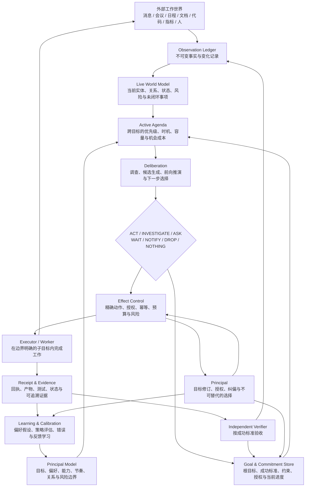

# Jarvis 下一代主动式数字分身总体方案

> Status: proposal
>
> Authority: non-normative
>
> Date: 2026-08-22
>
> 本文只描述目标形态、长期语义和演进路线，不受当前模块、数据结构和兼容成本限制。具体实施前，应再为当期里程碑编写独立设计并确认复杂度。

## 1. 摘要

Jarvis 的长期目标不应是一个更会聊天、更会调用工具的助手，而应是服务于 principal 的**主动式工作数字分身**：它与 principal 共享长期目标、工作上下文、判断标准和授权边界，持续感知现实变化，自主选择最值得推进的事项，在授权范围内完成行动，用真实证据验证结果，并把新的事实和经验带入下一次决策。

目标公式：

```text
主动式数字分身
= 持续演化的世界状态
× 可纠正的主人模型
× 不丢失的目标与承诺
× 跨目标的主动议程
× 可验证的现实行动
× 可审计的持续学习
```

这里使用乘法而不是加法，是因为任何一项缺失都会让系统退化：

- 没有世界状态，只是每轮从零开始的聊天机器人；
- 没有主人模型，只是通用 Agent；
- 没有目标连续性，只能处理短任务；
- 没有跨目标议程，只能被动响应；
- 没有行动和验证，只能给建议；
- 没有学习，只会重复犯错。

最终判断标准不是“Jarvis 完成了多少次调用”，而是：

> principal 能否把一个持续存在的责任域交给 Jarvis，并相信它会看住目标、发现变化、选择时机、完成行动、验证结果，只在真正需要人类判断时打扰自己。

## 2. 产品定义

### 2.1 数字分身是什么

数字分身是 principal 在工作世界中的一个长期代理。它代表 principal 的目标和判断标准持续运行，但不伪装成 principal，也不以模仿语言风格为核心价值。

它应具备六个基本特征：

1. **连续性**：跨消息、任务、等待、重启和模型切换仍知道目标与进度。
2. **情境性**：判断建立在当前世界状态上，而不是只服从最后一条输入。
3. **主动性**：能够在多个开放事项之间自主选择下一步，也可以选择不行动。
4. **行动力**：能够使用工具真实改变外部世界，而不止生成建议。
5. **责任性**：用外部证据验证结果，不能凭执行者自述宣布完成。
6. **个体性**：随着长期使用，越来越符合 principal 的取舍、节奏和边界。

### 2.2 数字分身不是什么

它不是：

- principal 的人格复制品；
- 所有工作信息的无差别知识图谱；
- 每收到一条消息就创建任务的自动化规则引擎；
- 依赖一个无限增长 Session 维持记忆的聊天机器人；
- 由大量子 Agent 组成的通用 Agent 平台；
- 可以绕过 principal 授权边界的全自动执行器。

### 2.3 北极星场景

principal 向 Jarvis 委托一个长期责任：

> “让项目 X 在本季度达到可稳定服务核心用户的状态。”

之后 Jarvis 应持续完成：

1. 与 principal 对齐成功标准、约束和授权范围；
2. 建立项目、人、承诺、交付物和风险的当前世界状态；
3. 持续感知会议、消息、文档、代码、指标和外部系统变化；
4. 维护所有开放目标、阻塞和机会的统一议程；
5. 判断今天最值得推进的事项，而不是只处理最新消息；
6. 能查到的事实自己调查，只把不可替代的选择交给 principal；
7. 在授权范围内直接准备或执行行动；
8. 经历等待、审批和失败后仍回到原始目标继续推进；
9. 用测试、产物、状态查询和外部回执证明结果；
10. 从 principal 的纠正和最终结果中学习，下次减少询问和返工。

## 3. 总体设计原则

### 3.1 一个状态，一个决策内核，多个外围适配

外部消息、会议、代码、日程、文档和业务系统都只是在描述“世界发生了变化”。来源差异留在外围连接器、Skill 和工具中；进入内核后统一变成 Observation、Goal、Effect 和 Evidence。

数字分身只维护一份权威世界认知。外部采集到的事实和 Jarvis 自己行动产生的结果都进入同一个变化历史，不建立两套互相竞争的记忆。

### 3.2 世界事实、目标意图、当前计划分开

- 世界事实回答“现实现在是什么”；
- Goal Contract 回答“principal 希望现实变成什么”；
- Goal State 回答“目前走到哪里”；
- Plan 回答“当前认为怎样做可行”。

事实变化可以触发重新规划，但不能自动改写 principal 的根目标。计划可以频繁变化，目标只能由明确的新意图产生新版本。

### 3.3 语义交给模型，硬边界交给程序

模型负责理解事实、拆分子目标、比较价值、选择行动和解释原因。程序只固定必须可靠保证的边界：

- 身份、权限和授权范围；
- 幂等、版本和并发；
- 调度、等待和恢复；
- Effect 的精确审批对象；
- Evidence 与外部 Receipt 的保存；
- Goal 完成门禁和审计。

计划、理由、背景、判断和学习内容保持自然语言或宽松 JSON，不固化成庞大业务状态机。

### 3.4 事件历史不可变，当前视图可重建

完整历史回答“发生过什么”，当前投影回答“现在是什么”。

```text
Observation / Effect / Receipt / Feedback
                    ↓
             Append-only Ledger
                    ↓
        Reducer / Curator / Model Update
                    ↓
              Current Projection
```

历史不覆盖；当前投影可以随着新证据更新、失效或被推翻。任何重要当前结论都应能追溯到来源证据。

### 3.5 不行动是一等决策

数字分身的输出不应只有“创建 Task”或“执行动作”。合法决定至少包括：

```text
ACT / INVESTIGATE / ASK / WAIT / NOTIFY / DROP / NOTHING
```

克制是可信自主性的组成部分。没有足够价值、时机或证据时，`NOTHING` 比制造工作更正确。

### 3.6 完成必须由现实证明

必须长期保持：

```text
工具调用成功
≠ Effect 生效
≠ Subgoal 完成
≠ Root Goal 完成
```

执行者只能提出完成声明。只有独立 Verifier 根据 Success Criteria 和 Evidence 验收通过，才能结束根目标。

## 4. 目标架构



这不是一条输入到输出的流水线，而是一个持续运行的认知—行动闭环。Task、Worker 和工具调用只是其中一次局部执行，不是系统的中心。

## 5. 核心语义对象

| 对象 | 负责回答 | 长期语义 |
|---|---|---|
| Observation | 发生了什么 | 带来源、时间和原始证据的不可变事实 |
| Belief / Projection | 现在相信什么 | 对 Observation 的当前解释，可被更新或推翻 |
| Principal Model | principal 通常如何判断 | 明确规则与带置信度的偏好假设 |
| Goal Contract | 最终希望达到什么 | 版本化根目标、成功标准、约束和授权 |
| Goal State | 现在走到哪里 | 当前进度、子目标、阻塞、剩余风险和下一步 |
| Agenda Item | 此刻为什么值得关注 | 某个 Goal 的候选推进机会及其时机、价值和成本 |
| Decision | 这一拍决定什么 | 行动、调查、询问、等待、通知、放弃或不做 |
| Effect | 准备怎样改变现实 | 精确、可授权、可幂等的一次外部副作用 |
| Receipt | 外部系统确认了什么 | Effect 是否真正被目标系统接受或生效 |
| Evidence | 哪些结论可以被证明 | 产物、状态、测试、消息 ID、引用或核验结果 |
| Decision Record | 当时为什么这样选 | 当时状态、候选、权衡、结论和使用的证据 |
| Preference Hypothesis | Jarvis 认为 principal 有什么偏好 | 带证据、置信度、适用范围和可纠正状态的学习结果 |

这些对象不要求一开始全部建成独立表。语义内容应尽量保留为自然语言或宽松 JSON；只有身份、关联、版本、权限、幂等、调度和终态门禁需要固定结构。

## 6. 世界状态平面

### 6.1 Observation Ledger

所有外部变化和 Jarvis 行动结果都先成为 Observation。它至少保留：

- 来源与外部标识；
- 发生时间、发现时间和可能的有效时间；
- 原始内容或可读取引用；
- 关联实体和 Goal 提示；
- 来源可靠性；
- 是否被编辑、撤回、替代或纠正。

Observation 只记录事实，不直接写“应该做什么”。一条消息编辑、会议材料补充或状态变化会生成新的 Observation，并触发当前投影和相关 Goal 的重新评估。

### 6.2 Live World Model

Live World Model 是面向决策的当前现实投影，而不是无边界知识库。它应覆盖：

- principal；
- 人与协作关系；
- 项目与责任域；
- Goal、承诺和依赖；
- 资源与交付物；
- 当前状态、风险、阻塞和未闭环事项；
- Jarvis 自己近期产生的 Effect 和结果。

每个重要结论都应具备：

```text
statement
evidence_refs
valid_from / expires_at
confidence
status: asserted / inferred / conflicted / superseded
```

默认向决策模型提供摘要；只有判断需要时才展开实体页、历史事件和原始证据。渐进式披露是长期成本控制的基础。

### 6.3 变化传播

一个新的 Observation 进入后，不应机械地重跑所有目标。系统先建立受影响范围：

```text
Observation
→ 关联实体变化
→ 受影响 Goal / Commitment
→ Agenda dirty set
→ 对相关目标重新审议
```

事件触发负责及时性，低频 heartbeat 负责补偿遗漏、时间流逝和跨目标复盘。

## 7. Principal Model

### 7.1 建模内容

Principal Model 至少包含：

- 长期方向和当前重点；
- 质量、速度、风险和成本的取舍；
- 决策与沟通偏好；
- 工作时段、注意力和容量约束；
- 对不同人、项目和外部范围的关系边界；
- principal 擅长、必须亲自决定和希望委托的事项；
- 已明确的授权规则；
- 从历史行为中推断的偏好假设。

### 7.2 三类信息必须分开

| 类型 | 例子 | 使用方式 |
|---|---|---|
| Explicit Policy | “对外承诺前必须问我” | 作为硬约束执行 |
| Stable Preference | “方案先给结论，再给证据” | 默认采用，可被即时指令覆盖 |
| Contextual Hypothesis | “这个项目当前更偏速度” | 带适用范围和置信度，仅作判断证据 |

数字分身不得把单次选择直接泛化成永久偏好，也不得自行把偏好升级成授权。

### 7.3 可见、可解释、可纠正

principal 应能看到：

- Jarvis 认为自己当前最重要的目标是什么；
- Jarvis 学到了哪些偏好；
- 每个偏好的证据与置信度；
- 哪些是明确规则，哪些只是推断；
- 如何修改、撤销或限制适用范围。

主人模型不可见，就会逐渐变成不可控的隐藏 Prompt。

## 8. Goal 与 Commitment 控制面

### 8.1 Goal Contract

Goal Contract 保存一个版本内不可被执行过程改写的根意图：

```json
{
  "goal_id": "G-001",
  "version": 1,
  "objective": "让项目 X 在本季度达到可稳定服务核心用户的状态",
  "success_criteria": [
    "核心场景有明确验收并持续通过",
    "关键运行指标达到约定范围",
    "主要失败模式有恢复路径",
    "核心用户完成真实使用验收"
  ],
  "constraints": [
    "不以牺牲数据安全换取速度"
  ],
  "non_goals": [
    "不建设与当前目标无关的通用平台"
  ],
  "deadline": "2026-12-31",
  "authority_scope": "project-x-delivery-v1"
}
```

这里的 JSON 是开放语义示例，不应演化成固定业务字段大全。

### 8.2 Goal State

Goal State 是可变的当前投影，保存：

- 已满足和未满足的成功条件；
- 当前子目标；
- 阻塞、风险和依赖；
- 已获得的 Evidence；
- 当前计划与备选路径；
- 下次检查时间或唤醒条件；
- 最近一次重新规划的原因。

模型每轮只能提交带 `base_revision` 的 State Patch，不能整块覆盖根目标。revision 过期时 fail-fast，重新读取最新状态后再判断。

### 8.3 Commitment

Goal 描述希望达到的结果，Commitment 描述 principal 或协作者已经对外承担的责任。Commitment 应同时关联：

- 对谁承诺；
- 承诺内容；
- 截止时间；
- 依赖和当前可信状态；
- 违反承诺的影响；
- 所属 Goal。

数字分身的主动性很大一部分来自对承诺的持续看护，而不是从消息中猜测更多任务。

## 9. Active Agenda 与 Deliberation

### 9.1 Agenda 不是 Task 列表

Active Agenda 是所有开放 Goal、Commitment、风险和机会在当前时刻的统一决策面。它回答：

> 如果此刻只能推进一件事，哪件最值得做？如果没有合适行动，下一次应该在什么条件下重新检查？

Agenda Item 可以由以下条件产生：

- 新事件改变了相关世界状态；
- 截止时间临近；
- 等待条件满足或超时；
- 某个阻塞解除；
- 新机会出现；
- 一段时间没有进展；
- 低频 heartbeat 发现目标组合需要重新排序。

### 9.2 决策维度

系统不使用固定公式替模型决定价值，但应向模型稳定提供以下判断视角：

- 与 principal 长期目标的关联度；
- 紧迫性和错过窗口的代价；
- 对其它 Goal 的解锁价值；
- 当前准备度；
- 所需时间、注意力和计算成本；
- 不确定性与可调查性；
- 行动风险和可逆性；
- 当前是否适合打扰 principal；
- 最近是否已经做过相同或冲突动作。

### 9.3 Deliberation 输出

每一拍只产生一个明确决定：

```json
{
  "decision": "INVESTIGATE",
  "goal_ref": "G-001@v1",
  "reason": "发布窗口临近，但两项稳定性结论缺少实时证据",
  "next_step": "读取最近一周的错误率和恢复记录",
  "reconsider_when": "证据齐全或两小时后",
  "expected_information_gain": "判断是否应暂停功能开发并先处理可靠性"
}
```

决策记录需要保存当时使用的世界状态版本、候选事项和证据引用，以便后续回放“为什么当时这样判断”。

### 9.4 两种时间尺度

- **Supervisor 外循环**：比较目标、选择子目标、处理等待和重新规划；
- **Worker 内循环**：在一个边界明确的子目标中连续调查和执行。

不是每次工具调用都需要新 Agent。只有任务需要上下文隔离、专业权限、长工具历史或并行探索时，才启动独立 Worker。

## 10. 行动、授权与验证

### 10.1 Effect 是授权的最小单位

Effect 表示一次会改变外部世界的动作。它应包含：

- 所属 Goal 版本和 Subgoal；
- 具体目标系统与对象；
- 将要发生的变化；
- 幂等键；
- 风险、可逆性和预期结果；
- 所需授权；
- 超时和结果查询方式。

审批只批准精确的 `goal_version + effect_hash`。目标变化、Effect 内容变化或授权过期后，旧批准不得复用。

### 10.2 自主权分级

自主权应按领域、对象和影响范围分别授予：

| 等级 | 能力 | 典型行为 |
|---|---|---|
| L0 感知 | 读取和建模 | 采集事实、更新摘要 |
| L1 建议 | 给出判断 | 推荐下一步、提示风险 |
| L2 准备 | 生成待确认产物 | 草稿、方案、代码 diff |
| L3 可逆行动 | 执行低风险可撤销动作 | 本地整理、内部状态更新 |
| L4 外部代表 | 在明确范围内改变外部系统 | 发消息、提交代码、更新任务 |
| L5 目标委托 | 在预算和边界内持续推进责任域 | 自主规划、执行、等待和验收 |

同一个数字分身可以在代码调查上处于 L5，在对外承诺上仍处于 L1。系统可以建议提高授权，但不能自行扩大权限。

### 10.3 Receipt 与 Evidence

Effect 执行成功后必须产生可以核验的 Receipt，例如：

- 消息系统返回的 `message_id`；
- 代码仓库中的 commit、PR 或远端 SHA；
- 文档系统的 revision；
- 任务系统的对象 ID 和最终状态；
- 测试运行记录；
- 部署版本和健康检查；
- 外部系统的读回结果。

没有 Receipt 时，只能记录“执行尝试完成”，不能声称现实已经改变。

### 10.4 Independent Verifier

Verifier 输入 Goal Contract、完成声明和 Evidence，逐条生成成功标准矩阵：

```text
Criterion
→ 当前是否满足
→ 支撑 Evidence
→ 缺失内容
→ 证据是否新鲜、是否冲突
→ 下一步建议
```

确定性条件优先用代码验证；语义质量再使用独立模型判断。Verifier 应与执行上下文隔离，不能直接复用执行者的自我叙述。

只有全部必需条件满足，Goal 才能进入 verified/done。局部 Effect、审批、消息投递或子目标成功都不能直接关闭根目标。

## 11. Context Compiler

长期连续性不依赖无限增长的聊天历史，而依赖权威状态和按轮编译的上下文。

每次 Supervisor 运行前，Context Compiler 生成：

```text
稳定角色和硬边界
+ 最新 Goal Contract，恰好一份
+ 最新 Goal State，恰好一份
+ 与当前候选相关的 World Summary
+ 最近变化和关键 Evidence
+ Principal Model 的相关切片
+ 当前授权和预算
```

完整 Event Log、长工具结果和历史模型输出继续保留在系统中，但只通过引用按需读取，不全部重放给模型。

应保持三者分离：

```text
Event Log：完整审计真相
Current State：当前权威投影
Prompt View：本轮临时认知视图
```

Context Compiler 可以压缩 View，但不得改写或丢失原始事实，也不得用新投影覆盖历史审计证据。

## 12. 学习与校准

### 12.1 学习来源

数字分身从以下信号学习：

- principal 接受、修改、拒绝或撤销的建议；
- principal 对询问时机和信息充分度的反馈；
- 外部行动是否产生预期结果；
- 是否需要人工返工；
- Verifier 失败原因；
- 同类任务的历史路径、成本和成功率；
- 决策之后现实发生的变化。

### 12.2 学习结果分层

学习不能直接修改根目标、授权或硬策略。它应先形成：

```text
Observation
→ Preference / Strategy Hypothesis
→ 置信度与适用范围
→ 离线回放或多次真实验证
→ principal 确认或稳定证据
→ 写入 Principal Model / Playbook
```

一次拒绝可能是当时情境特殊，不能直接得出永久结论。

### 12.3 决策回放

系统应能在历史数据上重放某次决策：

- 当时知道什么；
- 有哪些候选行动；
- 为什么选择这个；
- 哪个假设后来被证明错误；
- 如果使用新策略会做出什么不同选择。

只有可回放，偏好学习和主动策略才可能被安全校准。

## 13. 多时间尺度运行

真正的数字分身需要同时在不同时间尺度上工作：

| 时间尺度 | 主要职责 | 典型触发 |
|---|---|---|
| 秒到分钟 | 感知变化、处理即时风险 | 新消息、状态变化、执行回执 |
| 分钟到小时 | 推进活动 Subgoal | Worker 调查、等待恢复、审批结果 |
| 每日 | 编排今日议程和容量 | 晨间、重要变化、截止时间 |
| 每周 | 检查目标组合和承诺 | 周复盘、项目状态变化 |
| 月度及更长 | 更新长期方向与主人模型 | OKR、责任变化、稳定偏好证据 |

高频事件不应触发全量世界重建，低频 heartbeat 也不应每次扫描所有原始数据。每一层只处理与自身时间尺度相关的变化。

## 14. 产品交互

### 14.1 principal 最需要看到的不是 Task 列表

主界面应围绕以下信息组织：

```text
我当前委托给 Jarvis 的目标
每个目标的成功标准进度
Jarvis 认为今天最重要的三件事
正在推进什么，以及为什么
当前阻塞和等待条件
需要我做出的不可替代选择
最近完成并已验证的现实结果
Jarvis 最近学到了什么
```

### 14.2 询问必须是调查后的决策包

Jarvis 向 principal 提问时，应尽量提供：

- 当前目标；
- 已确认事实；
- 真正无法自行决定的分歧；
- 两到三个可选方向及影响；
- 推荐选择；
- 不回答时系统将如何处理。

数字分身的价值之一，是把原始问题压缩成 principal 才能回答的最小决策。

### 14.3 可解释但不过载

默认只展示结论、影响、下一步和关键证据。完整 Prompt、Event、Decision Record 和工具轨迹作为调试与审计视图按需展开。

## 15. 系统不变量

以下边界必须由代码和测试保证，不能依赖模型自律：

1. Observation 不可被原地覆盖；修正通过新事件表达。
2. 任何当前 Belief 都能追溯到 Evidence。
3. 模型不能通过 State Patch 改写 Goal Contract。
4. Goal Revision 必须关联明确的 principal 新意图。
5. 过期 revision 的 State Patch 必须失败。
6. Worker 不能写 Root Goal 或直接关闭 Goal。
7. Effect 审批只能授权精确的 Goal 版本和 Effect 内容。
8. Effect 重试必须幂等。
9. EffectSucceeded 不能直接触发 Goal done。
10. 缺少必需 Evidence 时 Verifier 不能通过。
11. 等待恢复必须读取最新 Goal State，不能只续跑旧 Session。
12. Context Compiler 每轮只注入一份最新 Goal Contract 和 Goal State。
13. 压缩上下文不得删除原始 Evidence。
14. 推断偏好不能自动升级成硬策略或更高授权。
15. Jarvis 不能自行扩大自治范围。
16. `NOTHING`、`WAIT` 和 `ASK` 必须是合法且可审计的决策。

## 16. 评价体系

### 16.1 北极星指标

```text
Verified Goal Completion Rate
```

即：委托给 Jarvis 的目标中，有多少真正满足成功标准并具有完整证据。

### 16.2 结果质量

- `false_completion_rate`：错误关单率；
- `criteria_evidence_coverage`：成功标准证据覆盖率；
- `goal_reopen_rate`：关单后重新打开比例；
- `external_effect_success_rate`：外部行动真实生效率；
- `duplicate_effect_rate`：重复副作用率；
- `waiting_resume_success_rate`：等待后恢复成功率。

### 16.3 主动判断质量

- 有价值事项漏检率；
- 无价值打扰率；
- `NOTHING` 决策准确率；
- 风险提前发现时间；
- Agenda 选择被 principal 接受的比例；
- 因错误优先级导致的延期或返工。

### 16.4 个体化效果

- principal 修改建议的比例；
- 同类场景重复询问率；
- 人工返工时间；
- 学习后同类错误复发率；
- 自治范围内行动的撤销率；
- principal 主观信任度。

### 16.5 成本与克制

- 每个 Verified Goal 的 token、工具调用和人工介入成本；
- 无有效状态变化的重复调查率；
- 上下文中 Evidence 的有效利用率；
- 主动通知带来的实际后续行动比例。

不能用 Task 数量、模型调用次数或消息发送量作为核心成功指标。这些是活动量，不是数字分身创造的结果。

## 17. 演进路线

演进应按产品能力闭环推进，而不是按基础设施模块铺开。

### Phase 1：它知道现在发生了什么

建设：

- 统一 Observation Ledger；
- 时间化、可追溯的 Live World Model；
- 初始 Principal Model；
- 变化影响传播和渐进式上下文读取。

验收：

- 重要结论都有来源、时间和置信度；
- 消息编辑、事实推翻和状态变化会更新当前投影；
- 能回答“现在最重要的项目、人、承诺和风险是什么”。

### Phase 2：它不会丢失最终目标

建设：

- Goal Contract、Goal State 和 Commitment；
- Context Compiler；
- 等待、恢复、目标版本和 State Patch；
- Success Criteria 与 Evidence 关联。

验收：

- 跨审批、长等待、重启和模型切换仍保持根目标；
- 局部动作不能错误关闭根目标；
- principal 可以随时看到当前进度、阻塞和下一步。

### Phase 3：它能可靠代表 principal 做事

建设：

- Effect、细粒度审批和自治等级；
- 幂等执行和外部 Receipt；
- Independent Verifier；
- 失败后的替代路径和重新规划。

验收：

- 重试不产生重复副作用；
- 每个完成目标都有完整证据矩阵；
- 执行失败不会自动丢失根目标；
- 自治范围内的外部动作可追踪、可解释、可撤销或可补偿。

### Phase 4：它能主动经营工作

建设：

- Active Agenda；
- 事件触发与低频 heartbeat；
- 跨 Goal 优先级、容量和机会成本判断；
- 日、周、长期多时间尺度复盘。

验收：

- 能提前发现风险和窗口；
- 能主动推进长期无新消息但仍未完成的目标；
- 能合理选择等待和 `NOTHING`；
- 打扰 principal 的问题经过调查且不可替代。

### Phase 5：它越来越符合 principal

建设：

- Preference Hypothesis；
- 决策回放与离线评测；
- 个性化策略和领域 Playbook；
- 授权提升建议与安全校准。

验收：

- 同类任务询问率和返工率持续下降；
- Jarvis 能解释自己学到了什么以及证据是什么；
- principal 可以纠正、限制或撤销任何学习结论；
- 新策略在历史回放和真实任务中均优于旧策略。

### Phase 6：责任域委托

建设：

- 面向项目、会议闭环、研发运营等责任域的 Goal 模板；
- 责任域级预算、授权和健康指标；
- 周期复盘与 principal 交接机制。

验收：

- principal 可以把一个持续责任域交给 Jarvis，而不是逐条下达任务；
- Jarvis 能稳定维护目标、议程、行动、验证和复盘；
- principal 主要处理取舍、授权和方向变化，不再承担日常追踪。

## 18. 建议的首个纵向场景

不要同时在所有工作领域建设数字分身。应选择一个具备完整闭环、价值明确、证据可验证的纵向场景，贯穿六项核心能力。

推荐候选：**项目交付看护**。

一个完整 Demo 应覆盖：

1. principal 创建季度项目 Goal 和成功标准；
2. Jarvis 建立项目、人、承诺和交付物的世界状态；
3. 新会议、代码、消息和指标作为 Observation 进入；
4. Agenda 发现一个影响交付的风险；
5. Jarvis 调查并选择下一步；
6. 在授权范围内准备或执行 Effect；
7. 等待外部响应后自动恢复；
8. Verifier 用真实 Evidence 判断阶段目标；
9. 周复盘展示目标变化、完成结果和下一步；
10. principal 的纠正形成可审计的偏好假设。

该场景比“多接一个消息源”更能验证数字分身是否成立，因为它同时考验长期状态、主动议程、外部行动、等待恢复和结果验证。

## 19. 不建议采用的方向

### 19.1 先建设通用多 Agent 平台

多 Agent 只解决上下文隔离、专业工具和并行调查，不解决目标、世界状态、完成验证和主人对齐。结构边界稳定后再按需引入 Worker。

### 19.2 先复制所有工作数据

世界模型应服务决策。无差别抓取会带来噪声、成本和隐私风险，却不一定提高判断质量。应围绕 Goal 和责任域渐进扩展感知面。

### 19.3 把向量检索当作长期记忆

向量检索适合找相似材料，不适合表达当前状态、时间有效性、冲突、承诺和完成条件。它只能是 Evidence 读取手段之一。

### 19.4 只提升模型能力

更强模型可以改善局部推理，但不能替代 Goal Store、版本、授权、Receipt、Verifier 和等待恢复等系统不变量。

### 19.5 用庞大状态机表达所有工作

代码只固定硬边界；开放世界中的目标、计划、原因、关系和判断必须保留给模型。否则系统会重新退化成规则引擎。

### 19.6 把更高频运行当成更主动

主动性来自跨目标判断、时机选择和责任连续性。高频扫描只会放大噪声和成本。

### 19.7 过早追求完全自治

数字分身的自治来自长期积累的信任，而不是一次配置。应按领域逐级授权，以真实成功率、撤销率和返工率证明可以扩大范围。

## 20. 关键设计决策

在进入具体实施前，需要由 principal 明确以下产品决策：

1. 第一个可委托的责任域是什么；
2. 该责任域的北极星成功标准是什么；
3. 哪些世界变化必须进入感知范围；
4. 哪些动作可以处于 L2、L3 或 L4 自治级别；
5. 哪些判断永远必须由 principal 决定；
6. 允许 Jarvis 使用多少时间、模型和外部工具预算；
7. 主动通知的可接受频率和安静时段；
8. 学习结论需要怎样的证据才能进入稳定 Principal Model；
9. Goal 完成需要哪些确定性证据和语义质量判断；
10. 哪些数据和行为必须支持删除、导出和完整审计。

这些选择决定数字分身的身份和信任边界，不能由实现细节反向替 principal 决定。

## 21. 最终判断

真正的数字分身不是“更自动的 Task 系统”，而是 principal 的长期工作控制环：

```text
感知现实变化
→ 更新世界状态
→ 对照目标和主人模型
→ 在全部开放事项中选择下一步
→ 在授权范围内行动
→ 用证据验证结果
→ 更新目标、世界状态和学习模型
→ 等待下一次变化
```

它最终应做到：

> Jarvis 持续维护“principal 想让现实变成什么样”，在正确的时机选择最值得做的动作，真正改变现实并证明结果；principal 保留目标、授权和不可替代选择的最终控制权。

这条边界同时保证了数字分身的主动性、长期连续性和可信度，也使系统不必退化为规则引擎或膨胀成通用 Agent 平台。
