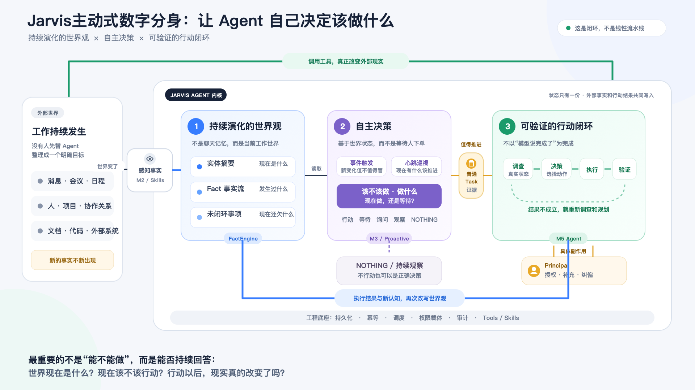

# Jarvis 主动式数字分身架构图绘制说明

> Status: deliverable
> Authority: non-normative
> Last reviewed: 2026-09-11

## 成图



- 可编辑源文件：[jarvis-proactive-digital-twin-architecture.svg](jarvis-proactive-digital-twin-architecture.svg)
- PNG 导出图：[jarvis-proactive-digital-twin-architecture.png](jarvis-proactive-digital-twin-architecture.png)
- 画布：`1920 × 1080`，16:9
- 标题：`Jarvis主动式数字分身：让 Agent 自己决定该做什么`

## 这张图要表达什么

核心公式：

> **主动式 Agent = 持续演化的世界观 + 自主决策 + 可验证的行动闭环**

整张图不是一条从输入到输出的单向流水线，而是一个持续运行的认知—行动闭环：

```text
外部世界变化
→ 感知事实
→ 更新世界观
→ 自主判断是否行动
→ 执行并验证
→ 改变外部现实
→ 把结果和新认知写回世界观
```

其中必须保留两个一等结果：

1. 值得推进时，形成普通 Task，进入统一执行闭环。
2. 当前不应行动时，以 `NOTHING / 持续观察` 结束；它不是失败，也不应被强行转成任务。

## 版式结构

### 1. 左侧：外部工作世界

表示 Agent 面对的不是整理好的指令，而是持续变化的现实：

- 消息、会议、日程；
- 人、项目、协作关系；
- 文档、代码和外部系统。

外部来源差异留在外围，进入内核时统一表现为“世界发生了新的事实”。

### 2. 中间：Jarvis Agent 内核

内核按从左到右的三项核心能力展开：

#### 持续演化的世界观

- 实体摘要回答“现在是什么”；
- Fact 事实流回答“发生过什么”；
- 未闭环事项回答“现在还欠什么”。

外部事实和 Jarvis 自己的行动结果共同写入同一份世界状态，不建立两套互相竞争的记忆。

#### 自主决策

- 事件触发：新变化是否值得处理；
- 心跳巡视：即使没有新消息，现在是否有事情应该推进；
- 允许选择行动、等待、询问、观察或 `NOTHING`。

#### 可验证的行动闭环

用“调查真实状态 → 选择动作 → 执行 → 验证”表示同一执行 Agent 内持续重规划的循环。验证不成立时回到调查，不把“模型说完成了”当成完成。

### 3. 侧边边界：Principal

Principal 不是固定审批流水线中的一道关卡，而是在具体副作用需要时提供授权、补充和纠偏。图中将它画成执行循环旁边的边界，而不是四号核心模块。

### 4. 底部：工程底座

持久化、幂等、调度、权限载体、审计、Tools 和 Skills 负责支撑整个闭环，但不与“世界观、决策、执行”处在同一语义层级。

## 箭头语义

图中最重要的是两条回边：

1. **绿色外环：执行 → 外部世界。** 表示 Agent 通过工具真正改变现实。
2. **蓝色内环：执行 → 世界观。** 表示执行结果与新认知会影响下一次判断。

如果缺少第一条，系统只是给建议；如果缺少第二条，Agent 每轮都从零开始，不会因为做过事情而变得更懂当前世界。

其它箭头：

- 外部世界 → 感知事实：世界变化进入系统；
- 世界观 → 自主决策：判断必须以当前状态为依据；
- 自主决策 → 普通 Task：值得推进的事项进入统一执行载体；
- 自主决策 → `NOTHING`：不行动是一等决策；
- Principal ↔ 执行：只围绕具体副作用发生授权、补充或纠偏。

## 与当前实现的映射

图以概念为主，模块名只作为小标签出现：

| 图中概念 | 当前实现映射 |
|---|---|
| 感知事实 | M2、来源 Skills、定时采集、统一线索入口 |
| 持续维护世界观 | FactEngine、实体 summary、Fact、Todo/Task 状态 |
| 事件准入 | M3 |
| 周期巡视 | Proactive Agent |
| 行动闭环 | M5 Agent |
| 工程底座 | SQLite、调度、幂等、权限载体、审计和工具系统 |

这份映射用于帮助读者理解当前实现，不把模块名提升为长期概念真源。实现变化后，先核对规范文档和代码，再更新图。

## 视觉规范

- 外部世界：中性灰，表示复杂现实。
- 世界观：蓝色，表示状态、事实和认知。
- 自主决策：紫色，表示判断和选择。
- 行动闭环：绿色，表示执行和真实结果。
- Task、审批与 Principal：黄色，表示边界和交接。
- `NOTHING`：浅灰紫，保持可见但不做成警告色。
- 大标题和关键模块使用深色粗体；辅助说明降低对比度。

不要这样画：

- 不把数据库、模型、cron、Qdrant、`lark-cli` 与世界观、决策、执行画成同级核心模块；
- 不省略执行结果写回世界观的箭头；
- 不把所有输入都画成必然生成 Task；
- 不把审批画成每个动作都必须经过的固定阶段；
- 不用 M2/M3/M5 作为对外文章的一级概念，模块映射放在小标签或图注中。

## 修改与导出

直接编辑同目录 SVG。修改后在仓库根目录重新导出 PNG：

```bash
sips -s format png \
  docs/summery/jarvis-proactive-digital-twin-architecture.svg \
  --out docs/summery/jarvis-proactive-digital-twin-architecture.png
```

导出后检查：

- PNG 尺寸仍为 `1920 × 1080`；
- 中文没有截断或重叠；
- 两条回边清晰可见；
- 标题与文章标题一致；
- SVG 和 PNG 表达完全一致。
