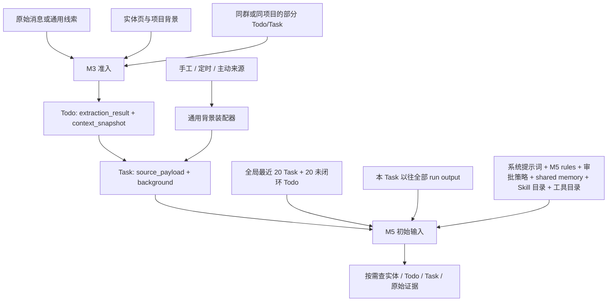

# M5 上下文设计评审：完整保存、按任务阅读、按证据查重

> 日期：2026-09-05。性质：设计建议，未修改运行代码、提示词、数据库或服务。
> 依据：当前工作区代码、只读生产数据抽样、只读 jarvis-tools 返回。旧设计文档用于了解意图，不当作实现证明。
> 后续明确方案：[M5 渐进式上下文架构与实施方案](m5-progressive-context-plan.md)。默认输入与接口设计以该方案为准，本文保留调查依据。

## 1. 结论

现有架构已经有正确的基础：实体当前页与事实历史分开，原始来源与执行状态分开，创建时冻结背景与执行时运行态分开。应保留这些边界。

主要问题在读取方式：完整持久化快照直接等同于默认模型输入；为防重推入全局最近 40 条记录；命中任务后又通过详情接口加载完整档案。结果是默认输入大、查一次还会变大，但真正决定是否重复的来源、对象、已做动作和结果并没有成为便宜的检索入口。

建议的最终形态：**当前 Task 简报 + 可追溯的来源证据 + 与任务相关的实体信息 + 相关工作摘要；完整快照、实体全文和执行历史按需展开。** 不新增独立记忆系统、事项总表或语义去重状态机，也不合并 Todo/Task 的生命周期。

## 2. 实测：大在哪里

抽样取 `execution_run` 中最近 100 条含 `BEGIN_TASK_CONTEXT` 的持久化 prompt，时间范围为 2026-09-03 06:47:27 至 2026-09-05 03:53:04 UTC。按 Unicode 字符计数，JSON 子块按紧凑格式统计。

| 部分 | 中位数 | P90 | 最大值 |
| --- | ---: | ---: | ---: |
| 完整初始 prompt | 42,925 | 58,893 | 106,146 |
| 指令等上下文块之外的部分 | 16,174 | 16,175 | 16,563 |
| TASK_CONTEXT | 26,774 | 42,719 | 89,971 |
| 冻结背景 execution_context | 14,004 | 29,415 | 76,962 |
| current_world | 11,842 | 12,671 | 13,196 |
| 当前任务 source_payload | 492 | 749 | 1,123 |
| previous_runs | 2 | 2 | 2,409 |

这里不是 tokenizer token 数，也不包含 CLI 自身系统输入、工具定义、工具返回、后续对话或恢复 Session 的既有历史。各列是独立分位数，不能把中位数直接相加。100 条仅代表近期样本，previous_runs 很小不代表长期重跑没有风险。

冻结背景中，principal 平均约 2,817 字符，group 约 2,864，participants 约 3,643，conversation 约 4,469。其他项目目录平均只有约 291 字符，不是当前首要优化对象。

具体例子：run 1593 / Task 1309 的完整初始 prompt 为 106,146 字符，其中 conversation 55,516，冻结背景总计 76,962。限制“最近 25 条消息”限制不了字符量。一条长消息就可能很大。

工具返回实测：

| 调用 | 返回字符数 | 解释 |
| --- | ---: | --- |
| `list-tasks` 默认 20 条 | 14,428 | 已经是列表投影，不含完整 background |
| `list-todos` 默认 20 条 | 9,156 | 已经是列表投影，仍有多项展示字段 |
| `get-task --id 1309` | 81,858 | 默认仍有完整 Task.background、source_payload、execution_result |
| `get-todo --id 2852` | 10,364 | 默认带完整 context_snapshot |

`get-task` 隐藏的是 run.prompt / run.output；这不等于隐藏 Task 的背景和结果。为核实“这个任务做过什么”付出了加载整个背景的成本。

## 3. 当前完整链路与所有权

生产和消费真源：

- `internal/extract/pipeline_store.go`：M3 装载；`loadRecentTasks` 内连接 Todo，只覆盖 Todo 来源 Task。
- `internal/extract/snapshot.go`：从批次和会话单元冻结 principal、项目、群、交办人、参与者、引用消息、周边消息和资源。
- `internal/execute/materializer.go`：完整 extraction_result → source_payload，context_snapshot → background。
- `internal/taskcreate/factory.go`、`internal/contextsnap/assembler.go`：非 Todo 来源创建时装配背景；加载所有未归档其他项目，以及关联 principal/项目的全部活跃资料及其 summary。
- `internal/execute/agent_executor.go` 的 `runOnce` 与 `internal/execute/prompt.go`：实时读取规则、目录及运行态，原样注入 background。
- `internal/execute/currentworld.go`：全局按进展时间选择 20 个 Task、按证据时间选择 20 个 observing/extracted Todo。
- `internal/execute/prior_runs.go`：重跑新调用带全部历史 run 的完整 output。
- `scripts/jarvis-tools` 的 `cmd_list_tasks`、`cmd_get_task`、`cmd_get_todo`：列表已有投影，详情仍混合多个阅读层次。

恢复要单独看：`resume_waiting` / `resume_human` 延续原 Session，只追加本轮指令、原因/回答和时间，不执行 `loadCurrentWorld`。因此“每个 run 都刷新 current_world”的文档描述比代码更强。恢复时依靠模型主动查最新状态，不能把初始列表当实时状态。

## 4. 实体模型：存储层合理，默认加载范围过大

实体 `summary` 页回答“现在是什么”，Fact 回答“过去发生了什么”，这是合适的划分。现有 `list-pages` 已有 `index_line`，`get-page` 能读全文，具备渐进读取的基础。

需要减去的内容：

1. **无条件携带整页。** 每个实体页允许 8,000 字符。principal、项目、群、多人参与者相加，单页限制不能保证总输入小。页上与当前任务无关的进展也会反复出现。
2. **同一实体重复。** 交办人可能已经在 participants，principal 也可能是参与者。阅读视图应只展开同一实体一次，其他角色用引用。
3. **引用消息重复。** `messages` 与 `conversation` 有重叠。样本重复序列化平均约 643 字符，最大约 18,054；关键来源原文只需出现一次，其余位置用引用。
4. **资料全文按粗关联推送。** 非 Todo 来源只要资料关联 principal/项目就带整段 summary，没有任务相关性或数量限制。
5. **冻结全文与当前全文二次阅读。** 创建时的页用于解释历史判断，当前页用于现在行动。两份都有意义，但不必每轮先读所有旧全文、再查新全文。

理想默认输入保留：principal 的必要身份和职责、直接相关实体的名称/关系/可解析引用、影响当前任务判断的事实片段，以及明确的时间。需要确认当前负责人、仓库或状态时再读取相应当前页。

实体片段必须来自已有页或冻结快照，不能另设一份独立维护的“短 summary”形成双真源。现有 index_line 可用于发现实体，不能假定首行足以替代关键背景。必要的任务相关背景在准入简报里表达；M3 只做到能决定准入，不额外展开深度调查。

持久化的冻结背景保留原样。M5 的默认阅读视图从这份快照投影，完整快照有显式、可定位的读取入口；最新事实是新增读取结果，不能重新查库伪造原来的世界。非 Todo 来源遵循相同展示规则。

## 5. 运行态模型：应以相关工作为中心

### 5.1 最近列表不是充分的防重上下文

全局最新 20 条会混入不相关的工作，也会挤掉更早的同一事项。Task 摘要有 1,000 字符上限，但 20 条加上 Todo 仍构成稳定的一万多字符成本。扩大窗口或统一截短标题不能解决召回方向的问题。

初始 taskBrief 不含 todo_id、target、来源引用或产物引用；todoBrief 不含引用原句、source_message_ids 或对应 Task。模型主要靠标题和自然语言 summary 猜关联，然后必须打开大详情。

M3 还有来源覆盖缺口：它的近期 Task 查询显式排除手工、定时、主动来源。M5 的全局 20 条虽覆盖来源，却仍可能遗漏窗口以外的记录。

### 5.2 Todo 和 Task 不应成为两份“待办事实”

Todo 表示线索及准入判断；Task 表示 Jarvis 的执行及结果。两者保留各自状态和审计。Todo 的 observing 也不等于一个待执行任务。

现库有 316 条 observing Todo 关联 observing Task，说明同一事项会同时存在于两侧。不是应该删数据，而是阅读视图应按真实 `task.todo_id` 合并展示：以 Task 的执行进展为主，Todo 提供来源；没有 Task 的 Todo 才作为独立线索列出。不靠标题相似度做这种展示合并。

### 5.3 防重需要三种不同的关联

| 关联 | 回答的问题 | 可使用的已有材料 |
| --- | --- | --- |
| 来源证据 | 是不是同一请求或同一观察事件？ | message/source ID、引用原句、发起人、时间、上下文锚点 |
| 处理对象 | 是不是同一对象、范围或实例？ | URL、资源 ID、仓库与 MR、工单、文档、会议实例、周期任务 occurrence |
| 已发生动作和结果 | 当前目标已经被满足了多少？ | Task.summary、run.effects、产物链接、未闭环条件 |

同一原文可以要求多项动作；不同来源可以讲同一件事。同一对象的不同版本、日期或工作范围也可能需要不同动作。因此引用与对象标识用于检索候选，不能变成自动拒绝执行的语义指纹。

状态也不等于业务事实：failed 可能已有成功副作用，done 也可能只完成当前目标的一部分范围。实际判断要结合结果与 effects；effects 当前是 Agent 声明，必要时核验外部结果。

### 5.4 原始上下文目前已经有，但没有便宜地展现出来

Task 1259 是现成例子：source_payload 有 `source_message_ids`、`source_quote`，background.messages 保存了 MR 链接和“jarvis 你来仔细review下这个代码”两条原文。不是丢了来源，而是 current_world 摘要不呈现这一关系。

通用线索也已有入口：`AppendClue` 用 `(source, external_id)` 构造稳定 message_id，原始正文保留来源和发生时间。应复用这一证据流，不为会议、邮件或工单各建一条链路。模型侧应表述成“来源证据 / 容器或线程 / 处理对象”，不要求所有任务都来自真实群聊。

来源容器只是限定范围的线索，不是去重身份：同一个通用来源通道里可能有大量互不相关事件。Task.source_type 表示创建入口，也不能替代外部业务对象标识。

建议的工作摘要用宽松自然语言表达：

> Task 1259｜done｜来源 Todo 2852；由两条来源证据触发。原始要求：仔细 review 这份代码。对象：完整仓库标识与 MR 链接。已做：提交审查结果，附结果引用。当前结论及仍待处理范围：……。详情可分别展开来源证据或执行结果。

这是阅读内容示例，不要求新建严格 DTO 或给所有来源规定同一组业务键。机器需要稳定的是记录 ID、来源关联、可解析引用和分页信息。

## 6. 最终上下文结构与查询方式

默认阅读包包含四部分：

1. **当前任务**：完整来源原始语义、当前理解/总进展、必要人工补充；当前任务的关键引用原文与来源锚点默认可见。
2. **相关背景**：任务直接相关的实体信息和事实片段，注明冻结时间；全文和更多实体留在可查询真源。
3. **相关工作**：来源关联或对象关联的 Todo/Task 工作摘要，跨所有 Task 来源，含已完成、失败及未闭环记录，不仅仅查最近任务。
4. **继续执行所需记录**：已有成功副作用的引用、最近阻塞/恢复原因和必要历史；更早的完整 run output 不默认全部重放。

相关工作查询遵循：优先已有来源/对象引用，再用目标、项目、容器、关键词扩大查询；时间用于排序与主动收窄，不作为排除相关旧记录的唯一条件。无准确关联时可以先查询，不能把“默认未展示”当作“没有重复”。每次查询返回匹配依据、检索范围和是否还有结果。

实现优先扩展现有 list/get，而不是另建检索服务：

- list 支持真实分页、关键词、来源证据/对象引用；当前 CLI 固定 page=1 且 limit 最大 100，按日期和群项目过滤并不等于完整搜索。
- 相关候选先从现有 ID 关联及原始 JSON/正文检索取出，复用同一摘要投影；M3 做短准入查询，M5 围绕执行继续查证。
- 仅当实际查询需要，再对少量稳定引用做机械投影和索引；原始 JSON 完整保留。不新增一套要求模型填满的对象、动作、原因枚举，也不先建向量数据库或重做现有 Todo 向量去重。
- get 默认只读单个任务的目标、当前进展、来源索引和结果索引；来源证据、冻结背景、效果详情、run output、prompt 分别显式展开。查询执行结果不隐式附带全文背景。
- 恢复 Session 查询最新相关工作；新一轮重跑从当前 summary 和既有 effects 继续，需要时读历史 output。不要删除已发生动作的可追溯记录。

针对原始材料：当前任务明确引用的关键原文保留；周边资料按引用/消息/文档区块展开，完整材料持久化。单个必要原文很长时允许超出软预算或通过明确分段连续读取，不进行固定字符截断，也不只给模型一段失去约束的摘要。

## 7. 可做的减法与实施顺序

### 第一批：让按需查询真正便宜

调整 Task/Todo 详情阅读契约，分离背景、来源、结果、历史；补充来源摘要与关联 Task，并补实际分页及检索。查询不存在、结果为空、结果尚未翻完应明确区别。先形成可靠下钻通路，再收缩初始输入。

### 第二批：替换默认推送和重复展开

用相关工作查询替换全局 20+20；按真实 Todo→Task 关系合并阅读条目。将完整冻结背景改成可回读的默认投影，去掉引用消息与角色实体的重复展开，资料以引用为主。不要给旧快照补新的实时字段，不改写已经冻结的内容。

M3 与 M5 复用相同查询能力，阶段行为分开：M3 达到准入所需证据就停；M5 判断结果覆盖范围并继续执行。非 Todo 来源与 Todo 来源使用一致的来源/对象查询方式。

### 第三批：收缩恢复历史和固定指令

修正所有历史 run 完整 output 自动注入的读取方式；恢复时核对最新相关状态。固定指令约 1.6 万字符，仍有独立优化价值，但不能为了压缩业务上下文把审批、身份和任务完成要求删掉。Skill 目前已只注入目录，不应误判成所有 Skill 全文都在初始 prompt。

当前无需删除 Todo 表、引入统一事项表、创建新状态机、建上下文缓存或启动专门的压缩 Agent。历史运行档案的磁盘去重也不是本次上下文问题的前提。

## 8. 规范变化与验收

本方案保留 AGENTS.md 所要求的“一次冻结、全程复用、不在下游重建”。它使用允许的阅读投影。但 `docs/00-overview.md`、旧渐进式方案、M5 prompt 及现有测试仍有“整份快照必须进入提示词、不允许投影”的更强要求。落地时应在这些真源上统一“完整保存与传递、默认按需阅读”的契约，不能在下游加过滤器而让上游仍宣称全文已注入。

所有权：证据冻结归来源装配/M3；阅读投影与查询参数归工具/上下文代码；何时继续调查、如何判断重复归对应阶段 prompt；principal 的稳定偏好归阶段 rules；summary 与 effects 继续使用现有状态真源。

建议验收用同一批冻结样本、相同数据库视图做离线对照，不执行对外副作用：

- 字符/token：初始分块、工具返回、整轮累计分别统计 p50/p90/max，避免把初始减少转移成更大的工具返回。
- 来源可追溯：能指出触发的原文、必要上下文和关联对象；长原文、引用指代、跨来源任务均可回读。
- 防重：旧已完成记录仍能命中；失败但已写入的动作不重做；同对象不同版本/周期/范围不会被一概丢弃。
- 边界：没有 Task 的 Todo 可见；有关联的 Todo/Task 不重复列成两件工作；手工/定时/主动任务可被 M3 查询。
- 时态：冻结背景不变，当前页和恢复时查询注明读取时刻；缺失/空结果/部分结果不混淆。
- 成本：按需查询次数、调查时间和错误结论一起比较，不只追求更短 prompt。

第一轮可以把“业务上下文中位数降低约一半”作为实验目标，不能当作已验证收益；固定指令成本仍在，最终以完整执行成本与判断质量为准。

本次仅完成评审和只读测量，没有运行代码测试，也未把任何建议作为生产改动应用。
