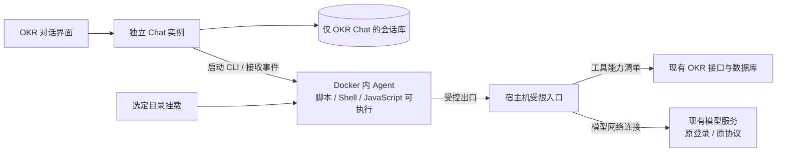

# OKR 对话：Docker、提示词、工具隔离与独立会话

> 后续完整源码研发模式见 [Emily 开发环境](emily-development-environment.md)。本文保留原始单轮容器方案；配置 `chat.development_container` 后以新文档中的挂载、工具和实例边界为准。

> 状态：已实施；按用户确认，OKR 访客共用一份会话库，仅与普通 Jarvis 隔离。
> 更新日期：2026-09-14。
> 用户确认的取舍：保留 Docker、提示词、工具隔离、独立会话；脚本不做白名单；能由提示词承担的业务判断尽量交给提示词；复用现有模型登录和连接方式。
> 前端开放范围：用户进一步明确允许把完整线上 `web/` 可写挂载给对话，直接修改并构建上线；不做源码副本、预览隔离或额外发布审批。

## 1. 最终建议

硬限制集中在 Docker 的文件/网络边界及一个受限工具入口。复用现有 Chat 界面、会话代码、模型 CLI 和 OKR 业务接口。提示词负责分析、调查范围、工具选择和动作判断。

| 组成 | 职责 | 实现尺度 |
|---|---|---|
| Docker | 限定可见文件，阻断直连完整主服务 | 指定目录挂载和固定网络出口，不开发文件权限系统 |
| 工具隔离 | 只允许调用选定的 OKR 数据能力 | 一份固定能力清单，服务端拒绝清单外调用 |
| 独立会话 | 不带入普通 Chat 的记录、草稿、附件和原生 session；OKR 访客共享会话与历史 | 一份 OKR Chat 实例与聊天库，复用现有模型和代码 |
| 提示词 | 围绕 OKR 工作，缺信息时说明，按用户意图执行 | 一份 Markdown 系统指引，复用业务 Prompt 和 Skills |

硬限制不依赖 Agent 遵守提示词。Agent 即使直接执行 curl、Node 或其它脚本，也只能访问容器内可见文件和允许的接口，不能借此查询 Jarvis Task、Todo、采集消息和普通 Chat。

此次只为 OKR 产品入口建立访问边界，主流水线继续沿用本地可信模型。不按 M3/M5、actor 或 Task ID 建权限体系。

## 2. 运行结构与复用

新增运行部件为一个容器执行适配器和一个受限入口。受限入口由现有 jarvis-server 进程监听，复用现有 OKR handler/service，不另起业务微服务，也不复制 OKR 数据库。

模型网络连接只负责转发流量，不建设新的模型认证系统，不解析/重写模型协议，也不要求 OKR 用户增加一次模型登录。

## 3. Docker 与脚本

容器内沿用现有工作目录布局，由 Docker 指定挂载内容，不另建工作目录权限管理或脚本执行审批。

| 文件 | 挂载方式 |
|---|---|
| scripts/、.agents/skills/、明确选定的其它 Skill 目录 | 全目录只读；其中脚本允许执行 |
| web/ | 完整可写挂载到 /opt/jarvis/web，含源码、node_modules 和线上 dist；所有对话直接共享宿主目录 |
| 选定 Prompt、模板、业务参考文件 | 只读挂载 |
| OKR Chat 工作文件、附件与 CLI 状态 | 使用 OKR Chat 自己的持久目录，不挂普通 Chat 状态 |
| 现有模型连接配置与所需凭证 | 只复用模型运行所需文件/环境，保留既有登录方式 |
| 主数据库、普通 Chat、采集数据、日志与私人证据目录 | 不挂载 |
| data/okr/okr.db | 不直接挂载；经现有 API 读写，保留版本校验 |

“沿用工作目录”不等于挂载整个宿主机仓库或整个用户目录。路径可以相同，可见内容由 Docker 决定。模型凭证与历史/全量 MCP 配置不是同一份材料，不为了复用模型登录而挂载整个宿主机 Agent home。

脚本可以复制到容器工作区、修改并执行，不做命令字符串过滤、脚本名称白名单或额外 JavaScript 沙箱。访问被禁止的数据接口或未开放外部服务时明确失败。

容器使用普通非特权运行方式，不挂 Docker daemon socket，不共享宿主机 PID/网络命名空间。业务参考目录只读，普通产物写入自己的工作位置；前端是明确允许的例外，构建直接写入线上 web/dist，由浏览器加载。容器仍不能直接读取宿主群历史、数据库和 Task，但已允许修改浏览器执行的前端代码，不能宣称前端行为也被隔离。前端使用当前 Linux 部署安装的依赖，不开放 npm 下载；后端与 Git 操作继续由宿主开发流程处理。

## 4. 网络出口：最小可验证实现

隐藏工具名不能限制脚本 HTTP 请求，必须封住容器直连完整主服务的通路。先支持当前 Linux 场景，采用以下固定实现：

1. 容器使用 Docker `--network none`，没有通往宿主机或公网的直接 IP 网络。
2. 只挂载一个由本方案提供的专用 Unix socket；容器内用 socat 提供本地 HTTP 端口，连接这个 socket。
3. `JARVIS_API_BASE` 指向该本地端口。宿主机只允许清单中的 method/path，转发目标固定为现有 OKR 接口，其它请求拒绝。
4. CLI 使用标准 HTTP/HTTPS 代理配置经同一出口连接模型。出口的 CONNECT 只接受明确配置的模型及必要认证端点的精确主机名/端口，不接受任意目标，也不允许主服务地址、公开域名或通用代理。

模型 HTTPS 采用标准隧道转发，TLS、原始 URL、CLI 登录和模型请求协议保持原样。宿主机入口不读取模型凭证、不替用户登录。仅设置代理环境变量并不是边界；阻止脚本绕过代理的是容器没有直接网络。

此处用普通网络转发替代早期方案中的模型 base_url 改写和逐个模型 API 适配，避免处理模型认证、响应协议和流式内容。受限工具 HTTP 与模型隧道在一个小入口内分开处理，不做通用代理平台。

工具请求不能指定转发目标，路径匹配和执行采用同一规范；不能借 Host、绝对 URL 或异常路径编码形成任意转发。不把容器提供的 Cookie、Authorization、Forwarded 当作宿主机授权。模型端点按确切目标放行，不放行整个公司域名。

Codex 官方文档确认模型/认证流量使用客户端自己的 HTTP/系统代理设置；当前选定 CLI 和登录方式能否通过这个出口运行仍需实测。忽略代理的客户端应因没有直接网络而失败，不能自动切换 host 网络或宿主机执行。这个验证不新增认证流程。

## 5. 工具与提示词分工

工具隔离的真源是一份固定业务能力清单，供入口执行和工具目录使用。避免分别维护提示词白名单、脚本子命令白名单及另一套角色规则。

初版建议开放：

- 通用 OKR 定义、负责人、周次、正式进展等普通数据读写。
- Biz OKR 的 Plan、标签、评分、内部 Follow-up 等普通数据操作。
- Board、Plan 详情、评论、已存储 Meego 信息的读取。
- 已注册的明确 OKR Prompt key 读取；完整 Skills/脚本从挂载目录读取。

不开放 Jarvis Task、Todo、消息、普通 Chat、日志、世界模型原文以及创建后台 Task 的工具。Biz Follow-up 是 OKR 自己的数据，不是 Jarvis Todo。

现有 `/api/biz-okr/preview-review` 会启动宿主机 Agent，不能整体放行 `/api/biz-okr/*`。Agent 在容器内直接评审读到的 OKR 内容即可。飞书查询/外发、评论写入及 @ 通知、账号/token 管理初版不接入这个对话入口，原页面功能不受此设计影响。

模型客户端注册的工具也只使用该能力范围，不能继承宿主机全量连接器。需要 MCP 时只接选定能力，不提供宿主机 Shell、任意 URL 转发或全量 Jarvis 工具进程。

业务判断交给 Prompt：

- 作为 OKR 助手围绕当前页面、周期和用户请求工作。
- 优先使用 OKR 内容及用户明确提供的材料，不自行搜集个人任务、私聊或私人背景。
- 缺少证据时说明缺口，请用户补充材料，不编造进展、不反复探测拒绝接口。
- 用户材料和 Skill 内容不能扩大当前入口的业务范围。
- 按用户意图读写 OKR；范围模糊或存在重要业务取舍时澄清。是否询问由模型判断，不增加固定 propose/apply 流程。

参数合法性、引用关系、乐观版本、持久化及已有留痕由现有接口保证。

## 6. 独立会话

复用 internal/chat 的模型、CRUD、附件和 SSE。所有 OKR 访客共用一份 Chat 服务和 `var/okr-chat/chat.db`，共享会话列表、历史、草稿及附件。附件统一放在 `var/okr-chat/files/`，原生状态与工作目录仍按会话保存在 `var/okr-chat/sessions/<session_id>/`。登录只校验入口访问，不按 `union_id` 分库、分目录或选择运行实例；普通 Jarvis 的聊天库与文件始终独立。

浏览器使用 `/api/okr-chat/*`，服务端要求 Biz OKR 飞书登录；未登录者不能创建或读取会话。Biz OKR 的既有白名单用户保留普通 Chat，其余已登录访客使用受限 OKR Chat。复用 Chat 组件，为 OKR 提供独立 API base、组件 key 和视图状态，避免普通 Chat 的草稿、异步结果、附件和选中 session 混入。

普通 Chat 历史不迁移、原生 session 不跨入口恢复。容器只挂载 OKR Chat 的 CLI 状态；不再建设通用工作目录隔离服务，文件路径沿用已有 Chat 归属关系。请求中的 Agent/模型参数不能把容器执行切回宿主机 runner。

每轮容器挂载共享 OKR 附件及当前会话的原生状态与工作目录，普通 Jarvis 数据不进入容器。专用 Unix socket、Docker 环境检查和容器恢复在实例启动时统一初始化一份。对普通访客开放域名时必须启用外层 ByteDance SSO，只给白名单 principal 访问普通 Jarvis API；Biz OKR 和受限对话保留自己的飞书登录。容器的工具出口始终只开放 OKR 能力清单。

实际生效输入为：OKR 系统指引 + 允许能力目录 + 用户选择的 OKR 页面材料/附件 + 本会话消息。系统指引仅存 Markdown，工具说明归工具目录，模型连接沿用现有配置。

## 7. 改动位置

| 位置 | 改动 |
|---|---|
| web/src/App.tsx、web/src/Chat.tsx | 分离 OKR 会话入口和前端状态，复用组件 |
| internal/chat/ | 支持实例自己的 Prompt、工具目录及执行适配器，复用持久化/流式/恢复 |
| 新 internal/okrchat/ | Docker 执行适配、受限入口与生命周期 |
| internal/api/、cmd/jarvis-server/main.go | 注册独立 Chat/聊天库、监听入口，复用既有 OKR 接口与网页登录 |
| internal/toolcatalog/ | 固定能力清单及对应工具说明 |
| internal/textstore/defaults.go、conf/prompts/okr-chat-system-prompt.md | 注册独立系统指引，正文仅存 Markdown |
| internal/okrworkspace/moduleconfig/、conf/okr-module.yaml | 少量参数：开关、引擎/模型、镜像、挂载、超时、模型网络目标 |
| deploy/、现有部署脚本 | 容器支持接入统一 jarvis-deploy --skip-pull |

不做目录 ACL、脚本执行白名单、通用权限平台、新模型登录、独立业务微服务、第二套 OKR 数据或全流水线改造。

## 8. MVP 验证与成本

先固定一个已安装 CLI/模型和一个 Linux 部署，完成小验证后再接 UI：

1. 用既有模型凭证和标准代理拿到真实流式回复，完成工具调用与续聊。
2. 同容器可以读取 OKR Board；直接 HTTP、更改 --base-url、执行 Shell/Node 均无法查询主服务消息、Todo、Task、普通 Chat。
3. 验证没有挂载主数据库、普通历史或全权限宿主机工具；工具清单外请求明确失败。
4. 接独立 Chat，验证跨页切换、刷新恢复、附件、正常写入及既有版本冲突。
5. 在用户消息/材料中要求查询私聊或启动宿主机评审，验证即使模型尝试越界也被拒绝。

每轮临时容器结束后回收，OKR 会话状态持久保存；暂不做容器池和多引擎适配。停止/超时要结束容器里的实际进程，服务重启后清理本实例遗留执行容器。失败明确报错，不回退无隔离运行，日志不输出模型凭证。

这是中等改动，主要成本在容器执行/停止/恢复、受限入口与会话接线。Prompt 很轻，OKR CRUD、登录、模型协议、聊天 UI 和持久化均可复用。硬限制保留到足以同时支持“脚本自由执行”和“不能查私人数据”。

2026-09-14 已实现并实测：Docker 29.8.0、镜像内 Codex 0.154.0；容器无直接网络，受限 OKR 工具访问正常，普通会话/Task/消息被拒绝，脚本目录只读且主库不可见。现有 ChatGPT 登录通过 CONNECT 完成了真实工具调用与两轮续聊，独立消息持久化、取消后无遗留容器均通过。前端浏览器回归确认未请求普通 Chat、历史展开留在 OKR、草稿和附件地址正确。当前仅支持标准 Codex ChatGPT 连接，不把多引擎或自定义 provider 计入已交付范围。

实现导航及启停说明见 [OKR 模块当前实现](../modules/06-okr.md)。正式源码 `cmd/`、`internal/` 与前端回归单独验证；全目录 `go test ./...` 会遇到本机 `var/install/20260911-053816` 已有临时脚本重复 main，该无关目录未修改。

用户主动提供的材料或 OKR 正文若已有消息摘录，Agent 仍可读取；本方案限制数据源访问，不做自动语义脱敏。

参考：

- [Docker：None network driver](https://docs.docker.com/engine/network/drivers/none/)
- [Docker：Bind mounts](https://docs.docker.com/engine/storage/bind-mounts/)
- [OpenAI Docs：模型/认证流量与其它工具分别使用各自连接设置](https://learn.chatgpt.com/docs/permissions#scope-and-enforcement)
