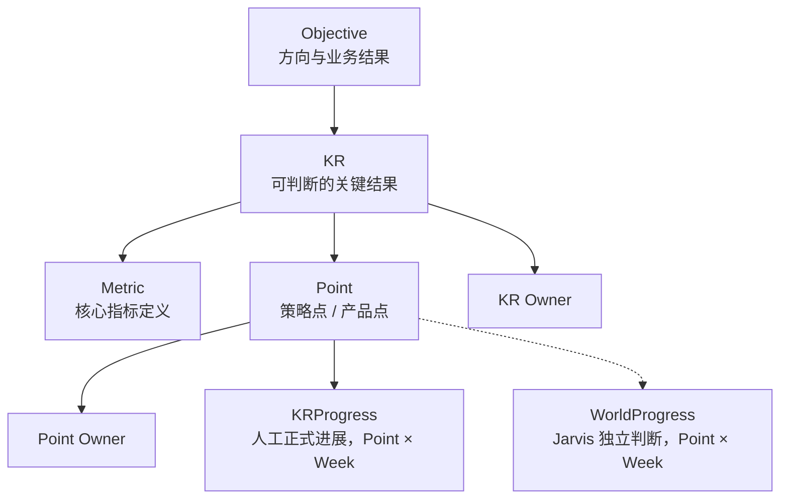
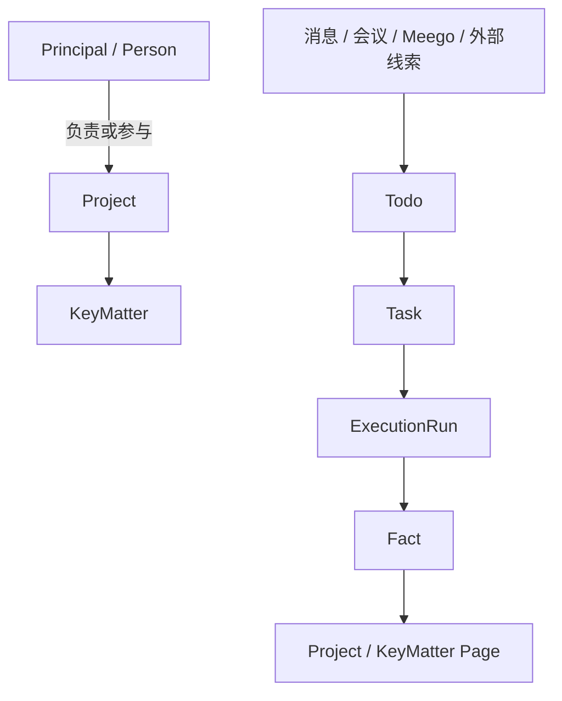
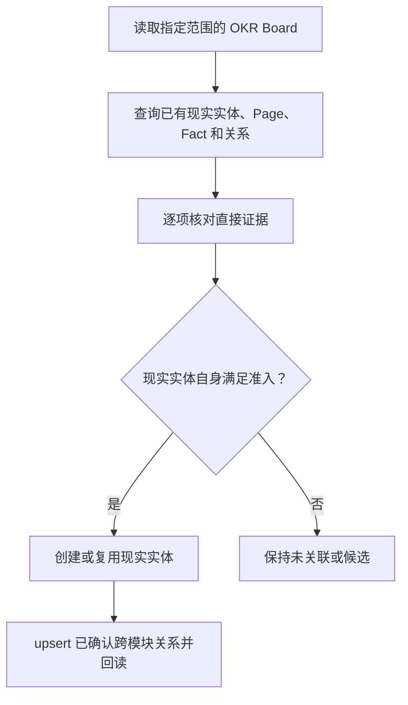
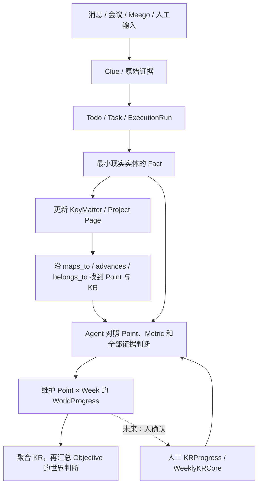
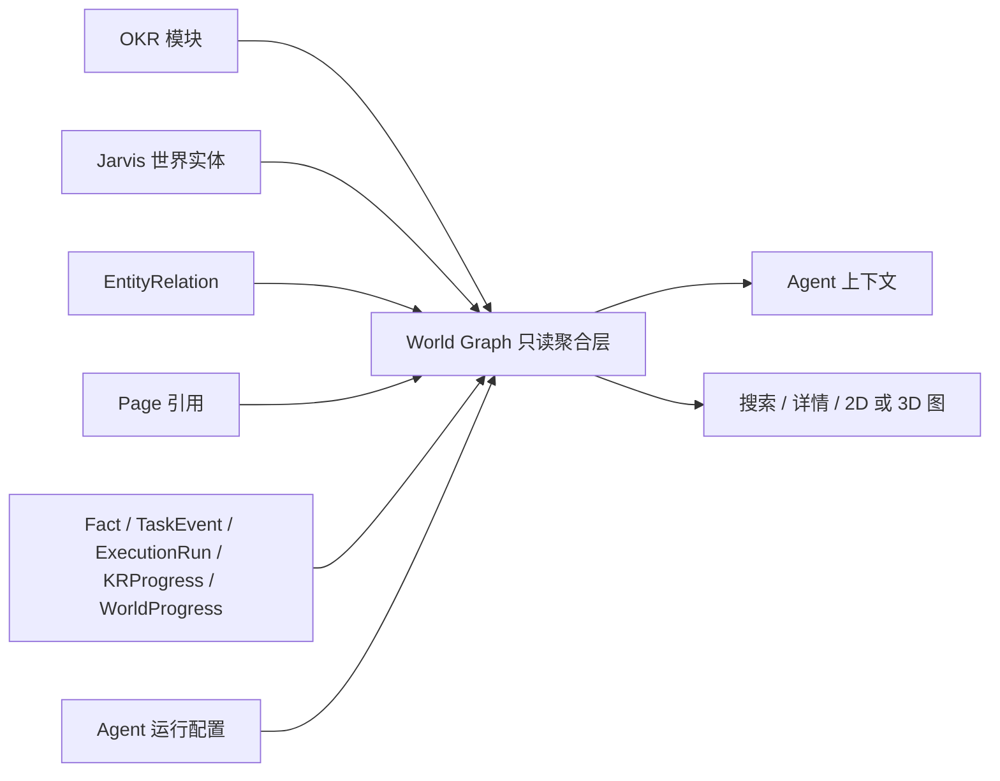

# OKR 与 Jarvis 世界模型整合方案

> Status: obsolete
> Authority: non-normative
> Last verified: 2026-09-06 @ a7f58a3
> Superseded by: ../design-okr-plugin-and-biz-okr.md
> Scope: OKR 内置业务插件、稳定定义、周进展、Jarvis 世界实体、跨模块关系、统一读取与可视化

## 1. 决策摘要

OKR 与 Jarvis 不合并成一套大表，也不互相复制业务状态。最终采用“领域真源 + 稀疏语义桥 + 可重建读取层”的联邦式世界模型：

> **OKR 管“我们承诺实现什么”，Jarvis 世界模型管“现实中谁正通过什么项目、事项和行动推进它”；两者通过少量、有证据的强关系连接，再由 World Graph 只读聚合层组成一张完整世界图。**

最终结构是：

```text
多个领域真源
  + 统一实体引用
  + 稀疏跨模块 EntityRelation
  + Page / Fact / TaskEvent / ExecutionRun / WorldProgress
  + 只读 World Graph
  = 可查询、可追溯、可展示的业务世界模型
```

关键决定如下：

1. Objective、KR、Metric、Point、Owner 和 Point 周进展继续由 OKR/周报模块拥有。
2. Principal、Person、Project、KeyMatter、Group、Resource、Todo、Task、Fact 和 Page 继续由 Jarvis 核心拥有。
3. 模块已有外键或关联表表达的关系，只在读取时派生，不复制进 `entity_relation`。
4. `entity_relation` 只保存没有共同外键、又确实需要程序查询的跨模块强关系。
5. Page 中的 `[名称](type:id)` 永远只是叙述性引用，不自动产生 Owner、归属、依赖或推进关系。
6. Task 是一次执行，不是 OKR 层级；不为每个 O、KR 或 Point 自动建立常驻 Task。
7. Task 或 KeyMatter 完成不机械等于 KR 达成；事实先沉淀到现实实体，再由 Agent 对照 OKR 定义形成独立的 WorldProgress。
8. World Graph 是可重建的只读索引，不是第二套事实数据库，也不提供万能写接口。
9. 当前阶段 OKR 定义、标签和每周进展均由人维护；Agent 只读取、映射和维护 Jarvis 世界状态。
10. 短期内明确保留两种进展：人维护的正式 `KRProgress`，以及 Jarvis 自动维护的 `WorldProgress`；未来 Agent 经人确认后可把 WorldProgress 转写到原有 `KRProgress`。
11. OKR 以“随 Jarvis 编译、运行时可开关”的内置业务插件交付；关闭插件不删除数据，也不影响 Jarvis 核心世界模型。

### 1.1 当前阶段与未来阶段

当前产品边界是：

```text
人写 OKR 定义 / 标签 / 周进展
                 │
                 │ 只读
                 ▼
Jarvis 识别实体、建立关系、维护 Fact / Page / WorldProgress、组成 World Graph
```

未来才增加反向的受控回填：

```text
Jarvis Fact / Page / Task 结果
                 │
                 ▼
Agent 更新某个 Point 在某一周的 WorldProgress
                 │
                 ▼
生成可回填的周报候选，等待人确认
                 │
                 ▼
确认后写入原有 KRProgress，source=agent
```

这叫“双向数据流”，但不是把同一份数据双向同步。正式汇报和 Jarvis 判断本来就是两个不同语义：无论由人还是未来由 Agent 创建，正式 OKR 数据始终只有 OKR/周报模块这一份真源；Jarvis 只拥有自己的世界进展判断。

### 1.2 是否要把 OKR 实体拆出去

结论是：**不把任何 OKR 产品实体物理拆到 Jarvis 核心。**

| 对象 | 是否拆出 | 原因 |
|---|---|---|
| Objective / KR | 否 | 是正式目标定义，必须留在 OKR 模块 |
| Metric | 否 | 是 KR 衡量口径，不是通用世界实体 |
| Point | 否 | 是 OKR 的策略/产品拆解，不等于现实事项 |
| KROwner / PointOwner | 否 | 是 OKR 内部正式负责人真源 |
| KRProgress / WeeklyKRCore | 否 | 是人维护的正式周报内容，未来 AI 回填也复用原入口 |
| WorldProgress | 新增在 Jarvis | 是 Agent 基于现实证据对 OKR 的独立进展判断，不是正式周报 |
| Project / KeyMatter | 本来就在 Jarvis | 表示跨来源、长期存在的现实项目和事项 |
| Fact / Page / Task | 本来就在 Jarvis | 由 Agent 持续维护现实证据、当前认知和行动 |
| EntityRelation | 本来就在 Jarvis | 只保存两个领域之间的强语义桥 |

一个 Point 可以在 World Graph 中以 `okr_point:<id>` 节点出现，但节点数据实时来自 OKR 模块，不需要在核心库创建影子记录。如果现实中确实存在一个需要长期跟踪的事项，Jarvis 另建 KeyMatter，再用 `maps_to` 连接：

```text
OKR Point：完成重点客户试点
       maps_to
Jarvis KeyMatter：重点客户试点落地
```

这两个对象不是一份数据的复制品：Point 表达目标拆解，KeyMatter 表达现实状态。不能为了让 AI 可维护，就机械地为每个 Point 创建一个 KeyMatter；是否形成长期事项由世界建模 Agent 根据现实证据判断。

更准确地说，需要拆开的是“定义”和“现实承接”，不是把数据库实体搬家：

| OKR 中的对象 | 在 Jarvis 中的表达 | 是否创建 Jarvis 实体 | AI 当前维护什么 |
|---|---|---|---|
| Objective | 只读虚拟节点 | 否 | 不修改，只用于理解方向 |
| KR | 只读虚拟节点，并连接 Project | 否 | 维护 KR 与现实项目的映射证据 |
| Metric | KR 属性，必要时作为只读子节点 | 否 | 读取衡量口径，不修改定义 |
| Point | 只读虚拟节点，可映射 KeyMatter | 否 | 维护映射；不自动创建一一对应事项 |
| Owner | 解析为 Principal/Person | 仅在有稳定身份且世界中确需该人物时创建 Person | 维护人物当前事实，不改 OKR Owner |
| KRProgress | 人工汇报的周次事件 | 否 | 当前只读；可作为世界判断的一项证据 |
| WeeklyKRCore | 周次状态/事件 | 否 | 当前只读；为现实判断提供指标证据 |
| WorldProgress | Jarvis 对同一 OKR Point 的周次评估 | 是，存于 Jarvis 世界状态 | AI 基于 Fact/Page/Task 等证据自动维护 |
| Project | 现实承接对象 | 已是 Jarvis 实体 | AI 可维护 Page、Fact 和关系 |
| KeyMatter | 现实执行事项 | 已是 Jarvis 实体 | AI 可维护当前状态、历史事实和关系 |

因此，真正交给 AI 自动维护的是 Jarvis 侧的 Project、KeyMatter、Fact、Page、Relation、Task 和 WorldProgress，而不是把 OKR 表拆一半给 AI。

### 1.3 当前实现需要收口的差距

仓库现有机制已经有大部分原子能力，但运行规则还没有完全符合上述阶段边界：

- `okr-agent-principles` 当前允许 Agent 维护 KR 标签；按本方案当前阶段应改为只读和提出建议，标签仍由人保存。
- `okr-agent-orchestrator` 已经能调用标签和周进展写工具；工具可以保留供未来使用，但当前固定行动和 Prompt 不应授权自动写入。
- `weekly-report-progress-sync` 当前主要读取 Meego/消息并写 Jarvis Fact/Page，尚未把人填写的 KRProgress/WeeklyKRCore 作为只读来源送入世界模型。
- Jarvis 已实现 WorldProgress 核心存储、主体/周期查询、create/CAS update API 和 `jarvis-tools` 原子命令；当前写入适配器只接受已启用周报模块中真实存在的 `okr_point`。
- 后端已有 `source`、`needs_review` 和进展级 version，但普通周报 UI 尚未形成完整的 AI 候选确认流程，所以当前不能把 `needs_review=true` 直接当成成熟草稿箱。

这些差距应在语义所有者处修正：行为边界改 Prompt/Skill，幂等和版本继续由现有 API 保证；不要删除未来有用的原子工具，也不要在 API 中按调用者类型硬编码“AI 禁止写”。

### 1.4 OKR 作为可开关的内置业务插件

结论是：**好做，并且当前实现已经具备大部分插件生命周期；需要的是收拢边界，不是重写 OKR。**

仓库目前有两种容易混淆的扩展机制：

- `internal/plugin` 管 Codebase、Meego、Oncall 这类外部线索采集器，只负责授权、调度、Skill 门禁和向通用 Clue 流水线投递，不拥有业务表和产品页面；
- `internal/appmodule` 管 OKR、周报这类带领域数据、API 和页面的内置产品模块，已经控制迁移、路由、前端入口、Skill 和 ScheduledTask 是否生效。

OKR 属于第二类。产品上可以统一称为“插件”，但实现上不能把 OKR 塞进当前只支持采集器的 `internal/plugin`，否则会破坏它“不拥有业务模型”的边界。建议把 OKR 定义为 **built-in business plugin（内置业务插件）**：代码随 Jarvis 编译发布，运行时可以启停；MVP 不加载任意远端 Go/JavaScript，也不建设插件市场。

推荐的产品结构是一个顶层 OKR 插件，加一个可选的周报子能力：

```text
Jarvis 核心
├── Person / Project / KeyMatter / Page / Fact / Task
├── EntityRelation / WorldProgress / World Graph
├── 通用 Agent、Skill、Prompt、工具和调度框架
└── 内置业务插件
    └── OKR
        ├── OKR 管理（必选）
        ├── 周报（可选，依赖 OKR 管理）
        ├── OKR / 周报 API 与 UI
        ├── OKR Skills、Prompts、Tools
        └── World Graph Provider
```

用户关闭顶层 OKR 插件时，应连带关闭周报子能力。用户也可以只打开 OKR 管理、关闭周报；不能关闭 OKR 管理却单独打开周报。当前 `weekly-report requires okr` 的依赖关系正好可以继续复用。

#### 插件清单与代码注册

插件清单由代码拥有，配置文件只保存开关，不从 YAML 路径动态执行代码。一个 OKR 插件定义至少声明：

```text
id: okr
kind: business
requires: []
features: [okr, weekly-report]
entity_types: [okr_objective, okr_kr, okr_metric, okr_point, okr_progress]
skills: [okr-agent-orchestrator, okr-world-projector, weekly-report-progress-sync, weekly-report-reminder]
routes: [/api/okr/*, /api/weekly-report/*]
ui_entry: okr
```

这只是代码注册元数据，不是让配置文件决定 import、命令或任意路由。`conf/modules.yaml` 继续只保存已知插件及子能力的启用状态。

当前只有一个真实业务插件，不必先设计庞大的通用 SDK。第一步只把散落在 `cmd/jarvis-server/main.go` 和 `internal/api.Dependencies` 中的 OKR 初始化收进一个明确的 OKR 模块装配包；等第二个业务插件出现并验证相同生命周期后，再抽取稳定的通用 `BusinessPlugin` 接口。

#### 开关必须覆盖完整生命周期

关闭 OKR 后，不只是隐藏菜单，而是同时满足：

- 不打开或迁移 OKR 数据库；
- 不加载 OKR 专属配置和身份；
- 不注册 `/api/okr/*`、`/api/weekly-report/*` 和静态资源；
- 不显示 OKR 前端入口；
- 不向 Agent 暴露 OKR/周报 Skills、业务 Prompts 和工具说明；
- 带 OKR/周报模块标记的 ScheduledTask 安全空跑；
- World Graph 不注册 OKR provider，不解析或展开 `okr_*` 节点；
- 不删除 OKR 数据、已有跨模块关系或 WorldProgress，重新启用后可以恢复。

直接请求已关闭插件拥有的对象时返回“模块未启用”；从其它实体展开图时，读取层过滤当前无法解析的插件节点和边，避免出现半个幽灵节点。底层历史关系继续保留，不因关闭开关而做破坏性清理。

#### WorldProgress 为什么仍属于核心

`WorldProgress` 不应放进 OKR 插件数据库。它表达的是 Jarvis 对任意可引用主体在某个周期的状态判断，OKR 只是首个消费者。核心只保存开放的 `subject_type + subject_id + period_key`；OKR 插件启用时注册 `okr_point` resolver 和展示逻辑，关闭后相关 WorldProgress 暂停更新并隐藏。这样核心不导入 OKR 数据模型，未来项目里程碑、客户事项或其它业务插件也能复用同一状态能力。

这里要区分“存储能力”和“业务生产者”：通用 WorldProgress 存储、CAS 和查询属于核心；如何读取 Point、Metric 和人工周报并生成 `okr_point` 的判断，属于 OKR 插件的周报子能力。关闭 `weekly-report` 后停止创建和刷新 OKR WorldProgress；关闭顶层 `okr` 后还要停止解析这些主体。历史行继续保留，直到插件重新启用或用户单独执行明确的数据清理。

#### World Graph 的插件接口

World Graph 核心只理解统一 DTO 和引用，不理解 Objective、KR、Point。OKR 插件提供一个只读 provider：

```text
Resolve(ref)     // 把 okr_kr:*、okr_point:* 解析为 WorldNode
Expand(ref)      // 返回 OKR 原生层级、Owner 和周进展
Timeline(ref)    // 返回人工 KRProgress 等模块事件
Search(query)    // 搜索可见的 OKR 对象
```

`EntityRelation` 仍由核心保存，因为它连接多个插件和核心实体；OKR provider 只贡献模块内部原生边及节点解析。关闭插件时 provider 不注册，核心图谱仍能完整服务 Project、KeyMatter、Person、Fact 和 Task。

## 2. 目标与非目标

### 2.1 目标

这套方案需要同时回答五类问题：

- 一个 Objective 下面有哪些 KR、指标、策略点和产品点？
- 一个 KR 由哪些现实项目和关键事项承接？
- 一个人负责或参与哪些目标、项目和事项？
- 一项 Task、一次 Agent 执行或一条外部证据，最终推动了什么？
- 当前状态为何成立，过去发生了什么，证据在哪里？

它还需要满足：

- OKR 模块可独立启停和演进；
- OKR 关闭后，核心世界模型和其它插件仍能独立启动、查询和执行；
- Jarvis 核心不依赖 OKR 领域模型；
- Agent 能从摘要逐步下钻到关系、事件和原始证据；
- 前端能以列表、详情、二维或三维图展示同一份语义；
- 投影失败不回滚业务写入，重跑可以恢复。

### 2.2 非目标

本方案不做以下事情：

- 不建万能的 `entity(id, type, properties)` 表替代领域模型；
- 不在 Jarvis 核心复制 Objective、KR 或周进展；
- 不引入图数据库作为新的真源；
- 不按标题相似度自动合并或绑定实体；
- 不把每条消息、每次模型会话都升级成长期实体；
- 不让关系图直接绕过领域 API 修改业务数据；
- MVP 不实现任意历史时点的整图回放；
- MVP 不建设多 Agent 身份、权限和生命周期系统。

## 3. 语义所有权

先确定谁负责一条语义，再决定它存在哪里。

| 语义 | 唯一真源 | 世界图中的表现 | 写入口 |
|---|---|---|---|
| Objective、KR 的正式定义 | OKR 模块 | OKR 节点及原生层级边 | OKR API / 模块工具 |
| Metric、Point、标签 | OKR 模块 | KR 子节点及属性 | OKR API / 模块工具 |
| KR、Point 负责人定义 | `KROwner`、`PointOwner` | OKR 原生责任边 | OKR API |
| Owner 到现实人物的投影 | `EntityRelation owned_by` | 可查询的 Principal/Person 强关系 | `create-relation` |
| Point 某周人工正式进展 | `KRProgress` | 时间事件与 Point 的人工填报状态 | 周报 API / 工具 |
| Principal、Person | Jarvis 核心 | 人物节点 | 通用实体工具/API |
| Project、KeyMatter、Group、Resource | Jarvis 核心 | 现实世界节点及原生边 | 通用实体工具/API |
| Todo、Task、ExecutionRun | Jarvis 执行链路 | 行动和执行节点/事件 | Task 流水线 |
| 当前长期认知 | 实体 Page | 节点摘要 | `update-page` |
| 发生过的客观变化 | Fact | 时间线事件 | `append-fact` |
| Jarvis 对 OKR 的当前进展判断 | WorldProgress | 与人工周进展并列的世界进展 | 世界进展工具/API |
| Task 状态变化 | TaskEvent | 时间线事件 | Task runtime |
| 跨模块强关系 | EntityRelation | 有证据的语义边 | `create-relation` |
| 正文中提到某实体 | Page Markdown 引用 | 弱引用边 | `update-page` |
| 完整图与时间线 | 无独立真源 | World Graph 动态聚合 | 只读 |

任何写操作都回到语义所有者：改 KR 用 OKR API，改现实认知用 Page/Fact，建跨模块关系用 Relation API，执行行动用 Task 流水线。World Graph 不成为新的写入所有者。

## 4. 两条主轴与一座桥

### 4.1 OKR 定义轴



各层含义：

- Objective：季度方向或业务结果，不承担现实执行状态。
- KR：可判断是否达成的结果，连接目标定义和现实交付。
- Metric：KR 的衡量口径；当前模型是文本、信号灯及附件，不假设存在统一数值公式。
- Point：KR 下的策略拆解或产品拆解，是定义结构，不是 Task。
- Owner：KR 和 Point 各自独立的负责人关系。
- KRProgress：当前实现挂在 `PointID + Week` 上，记录某个 Point 的周进展，不是直接挂在 KR 上的状态。
- WorldProgress：Jarvis 基于现实世界证据形成的独立进展判断，逻辑上也挂在同一个 Point 和周次上，但存于 Jarvis，不属于 OKR 产品真源。

Objective 和 KR 的上层状态首先是读取聚合结果。除非 OKR 模块以后明确增加正式字段，否则不得在世界模型里另存一份 Objective/KR 状态。

### 4.2 Jarvis 现实执行轴



各层含义：

- Project：长期项目背景和边界。
- KeyMatter：需要持续记住和复查，但不是一次动作的现实事项。
- Todo：从证据中提取的行动线索。
- Task：一次可执行工作，可完成、失败、等待或被替代。
- ExecutionRun：某次 Agent 执行尝试。
- Fact：发生过什么以及证据来自哪里。
- Page：对实体“现在是什么状态”的压缩认知。

### 4.3 跨模块语义桥

MVP 首先支持两类主桥：

```text
OKR Point    --maps_to-----> KeyMatter
KeyMatter    --advances----> OKR KR
```

必要时也可建立：

```text
Project      --advances----> OKR KR
OKR KR       --belongs_to--> Project        // 仅在确有稳定归属时
Person       --participates_in--> Project / KeyMatter
Project      --depends_on--> Project / KeyMatter
```

其中：

- `belongs_to` 表示稳定的结构归属；它不是 KR 到 Project 的默认桥，只有业务本身明确把 KR 归入某项目时才建立。
- `maps_to` 表示两个领域对象之间的明确对应：这个 OKR Point 对应哪个现实 KeyMatter。
- `advances` 表示现实贡献：某 Project/KeyMatter 的结果实际推进了某个 KR。

`belongs_to` 和 `advances` 不能合并。一个 KR 属于某项目，不代表项目中的任何活动都实际推进了 KR；一个跨项目事项也可能推进不属于该项目的 KR。

## 5. 统一实体引用

### 5.1 规范格式

面向人和 Agent 的引用统一使用已经确定的 Markdown 格式：

```markdown
[Bax AM 助手](project:48)
[产品负责人](person:12)
[提升企业场景使用率](okr_kr:kr_7f82)
[完成重点客户试点](okr_point:point_18)
```

底层稳定引用统一表示为：

```text
<type>:<stable_id>
```

例如：

```text
principal:1
person:12
project:48
key_matter:71
task:390
fact:882
okr_objective:o_2026q3_01
okr_kr:kr_7f82
okr_metric:metric_31
okr_point:point_18
okr_progress:progress_42
```

显示名称不是身份。人优先由 open_id/union_id 解析，项目依赖稳定项目 ID 或明确代号，OKR 对象使用模块稳定 ID；标题相似只能产生候选，不能确认同一实体。

### 5.2 当前实现与缺口

当前 Page 引用解析只支持以下数字 ID：

```text
principal person project key_matter group resource task todo fact
```

因此 `[Bax AM 助手](project:48)` 已经可用，而 `okr_objective:*`、`okr_kr:*`、`okr_metric:*`、`okr_point:*` 仍是本方案需要补充的能力。OKR ID 是字符串，不能继续复用当前只接受 `uint64` 的 Reference 结构。

实现时应扩展统一引用解析和存在性校验，但不把 OKR 数据复制进核心数据库。校验通过模块读取接口或一个只读 Entity Resolver 完成；模块关闭或目标不存在时 fail-fast，不把伪造引用写进 Page。

## 6. 关系的四种来源

世界图中的边来自四个不同来源，不能混写。

### 6.1 原生关系：从领域表派生

这些关系已有权威字段或关联表，不写 `entity_relation`：

| 图上关系 | 权威来源 |
|---|---|
| KR `belongs_to` Objective | `KR.ObjectiveID` |
| Metric `belongs_to` KR | `KRMetric.KRID` |
| Point `belongs_to` KR | `KRPoint.KRID` |
| KR `owned_by` Principal/Person | `KROwner`，读取时解析身份 |
| Point `owned_by` Principal/Person | `PointOwner`，读取时解析身份 |
| KeyMatter `belongs_to` Project | `KeyMatter.ProjectID` |
| Group `belongs_to` Project | `Group.ProjectID` |
| Todo `belongs_to` Project/Group | `Todo.ProjectID` / `GroupID` |
| Task `belongs_to` Project | `Task.ProjectID` |
| Task `derived_from` Todo | `Task.TodoID` |
| ExecutionRun 属于 Task | ExecutionRun 的 Task 关联 |

从反向浏览时，读取层生成 `contains`、`owns`、`produces` 等反向显示，不再落一条反向数据。

### 6.2 强关系：EntityRelation

只有同时满足以下条件才写入：

1. 关系跨模块或没有原生字段；
2. 需要被程序查询、过滤、导航或展示；
3. 有足够证据确认；
4. 关系代表当前仍成立的认知，而不是正文中偶然提到。

典型关系：

```text
okr_kr:kr_7f82       belongs_to  project:48
okr_point:point_18   maps_to     key_matter:71
key_matter:71        advances    okr_kr:kr_7f82
person:12            participates_in project:48
```

进展证据不逐条复制到 `entity_relation`：WorldProgress 通过自己的 `subject_*` 和
`evidence.refs` 指向 Point、Fact、Task 与人工进展，World Graph 在读取时派生这些边。
只有未来某条正式 KRProgress 确实由 WorldProgress 回填产生时，才保存一条需要跨模块
反查的来源关系：

```text
okr_progress:agent_progress_9 derived_from world_progress:42
```

人工独立填写的 KRProgress 不伪造来源关系，普通正文引用仍留在 Page。

当前 `EntityRelation` 已有足够的最小骨架：

```text
source_type / source_id
relation_type
target_type / target_id
evidence
confidence
confirmed_at
```

唯一键是五元组：

```text
(source_type, source_id, relation_type, target_type, target_id)
```

同一关系重跑时 upsert 证据，不生成重复边。

建议 evidence 至少包含：

```json
{
  "definition": "该 KR 的主要现实交付归属项目",
  "basis": "OKR 正文明确使用项目代号，且已有项目资料一致",
  "source": "okr-world-projector",
  "source_ref": "okr_kr:kr_7f82",
  "observed_at": "2026-09-06T10:00:00Z"
}
```

`evidence` 保持宽松 JSON；上面是建议内容，不应变成严格业务 DTO。

### 6.3 弱关系：Page Markdown 引用

例如：

```markdown
当前由 [产品负责人](person:12) 推进，主要讨论空间是
[OKR 核心群](group:8)，对应项目为
[Bax AM 助手](project:48)。
```

它只表达“这篇当前状态说明提到了这些实体”。它可以生成 backlink 或图上的淡色虚线，但不能自动解释成：

- `owned_by`；
- `belongs_to`；
- `depends_on`；
- `advances`。

强关系和弱关系不是两种 Markdown 写法。Markdown 永远只是引用；强语义来自原生字段或 EntityRelation。

### 6.4 事件关系：读取时投影

Fact、TaskEvent、ExecutionRun 和 KRProgress 是带时间的 occurrence，可以在图和时间线中表现为事件节点。WorldProgress 则是按周期保存的 Jarvis 当前判断，属于状态快照而不是原子事件；界面可以按 `assessed_at` 把它放到时间轴上，但不能把它和 Fact 混为一类。MVP 不把这些对象重新复制进一张统一事件表：WorldProgress 自身是 Jarvis 新增的状态真源，而 `WorldEvent` 仍然只是其它事件真源的统一读取视图。

例如读取时可以形成：

```text
world_event:task_event:1042
  actor       agent:primary
  subject     task:390
  affected    project:48
  occurred_at 2026-09-05T10:30:00Z
```

这个 `WorldEvent` 是视图，不是持久化模型。底层真源仍是各自的事件记录。

## 7. 核心关系词汇

数据库只保存左侧规范方向；右侧是以目标为根浏览时生成的反向显示。

| 规范方向 | 反向显示 | 用途 | 示例 |
|---|---|---|---|
| `belongs_to` | `contains` | 稳定归属、组成 | KeyMatter belongs_to Project |
| `owned_by` | `owns` | 正式负责人 | KR owned_by Person |
| `participates_in` | `has_participant` | 非 Owner 的稳定参与 | Person participates_in Project |
| `depends_on` | `required_by` | 前置依赖 | KeyMatter depends_on Resource |
| `advances` | `advanced_by` | 实际推进结果 | KeyMatter advances KR |
| `maps_to` | `mapped_from` | 跨模块明确映射 | Point maps_to KeyMatter |
| `derived_from` | `produces` | 来源与派生产物 | Task derived_from Todo |

`relation_type` 继续使用开放 token，不改成数据库 enum。Agent 优先使用以上七组；只有现有关系无法准确表达，而且新关系确实需要程序查询时，才能新增 token，并在 evidence 中解释定义、适用对象和依据。

关系方向的规则是：

- 只持久化规范方向，不同时保存互为反向的两条边；
- API 可根据查询根生成反向视图；
- 不因为界面希望从左往右画，就改变持久化语义；
- 同一对实体可以有不同语义的边，例如 `belongs_to` 与 `advances` 可以同时成立。

## 8. 身份解析：Principal、Person 与 Agent

### 8.1 Principal 与 Person

Principal 是业务世界的决策中心，不复制成普通 Person。解析 OKR Owner 时：

1. Owner 的 open_id/union_id 与当前 Principal 身份一致时，投影到 `principal:1`；
2. 否则按稳定身份解析到已有 Person；
3. 尚无 Person 时，仅在这个人对 principal 的长期世界确有独立建模价值、身份也可核实时创建 Person；
4. 只有存在跨层反查需求和直接证据时才写 `owned_by` EntityRelation，evidence 保存 `owner_open_id`。

Owner 原生字段仍是责任定义真源，可以直接随 OKR 节点展示；`owned_by` 只是可选的现实人物关系，不是第二份可编辑 Owner。没有 Person 或跨层关系是合法状态，读取图不得因此合成虚假的现实人物。

### 8.2 Jarvis Agent

MVP 可以在 World Graph 读取层提供虚拟节点：

```text
agent:primary
```

它不是 Person，也不需要新增 `agent` 表。关系从现有真源派生：

```text
agent:primary executes Task       // 由 ExecutionRun / TaskEvent 派生
agent:primary serves Principal    // 由运行配置派生
```

这些关系暂不写入 EntityRelation。只有未来出现多个长期 Agent，并且系统确实需要查询它们的权限、生命周期和职责时，才评估 `agent_profile`。每次模型 Session 永远不成为长期 Agent 实体。

## 9. WorldProgress 与四条数据流

### 9.1 为什么需要 WorldProgress

短期内需要同时存在两种进展，因为它们描述的不是同一个事实：

| 进展 | 含义 | 作者 | 真源 | 是否正式周报 |
|---|---|---|---|---|
| `KRProgress` | 人选择对外汇报的本周进展 | 人，未来也可由 AI 经确认写入 | OKR/周报模块 | 是 |
| `WorldProgress` | Jarvis 根据可见现实证据形成的当前判断 | Jarvis Agent | Jarvis 世界模型 | 否 |

两者允许不一致。例如，人尚未填写本周进展时，WorldProgress 已经可以根据 Task、Fact 和会议材料判断“客户 A 已验收”；反过来，人写了“整体顺利”，Jarvis 也可以根据阻塞任务判断“证据显示存在延期风险”。界面应把差异展示出来，而不是静默互相覆盖。

#### KeyMatter 不能替代 WorldProgress

`KeyMatter` 是 WorldProgress 的现实基础，但两者不是同一种对象：

| 对象 | 回答的问题 | 粒度 | 是否依赖 OKR |
|---|---|---|---|
| Point | 目标被拆成了什么 | OKR 定义项 | 是 |
| KeyMatter | 现实中有哪些事项值得持续跟踪 | 长期现实事项 | 否 |
| Fact | 现实中具体发生了什么 | 单次客观变化 | 否 |
| Page | 某个现实实体现在是什么状态 | 实体当前认知 | 否 |
| KRProgress | 人正式汇报了什么 | Point × Week 下的一条或多条填报 | 是 |
| WorldProgress | Jarvis 对照目标后如何判断当前进展 | Point × Week 的最新评估快照 | 是，但存储由 Jarvis 世界层拥有 |

例如三个 KeyMatter 可以共同承接一个 Point：

```text
Point：完成 3 家重点客户试点
  maps_to → KeyMatter：客户 A 试点
  maps_to → KeyMatter：客户 B 试点
  maps_to → KeyMatter：客户 C 试点
```

也可能一个 KeyMatter 同时推进多个 Point。因此不能为每个 Point 机械创建一个 KeyMatter，也不能直接把 `KeyMatter.Status` 复制为 Point 进展。KeyMatter 保存每件现实事项自身的状态；WorldProgress 才负责读取一个或多个现实事项、Metric 和时间窗口，形成对目标的综合判断。

现有载体不能准确替代 WorldProgress：

- Page 表示 Project/KeyMatter 等长期实体的当前状态，没有 `OKR Point × 周次` 这一查询键；
- Fact 表示单条客观发生，不负责综合判断；
- KRProgress 是人的正式汇报，不能被 Jarvis 内部判断覆盖；
- Task/Chat 输出是一次执行结果，不适合长期查询和周次对比。

因此增加一个薄的 `world_progress` 结构是合理的。它不是第二套 OKR，只是对外部 OKR 实体的一份世界状态评估。建议字段为：

```text
id              uint64
subject_type    string       // MVP 只写 okr_point，保持开放
subject_id      string       // OKR 模块稳定 Point ID
period_key      string       // 例如 2026-W36
signal          string       // unknown/green/yellow/red，供颜色和筛选
summary         text         // 截至当前的综合判断，完整自然语言
evidence        json         // 宽松的 fact/task/resource/progress 引用和覆盖说明
version         int32        // CAS
assessed_at     timestamp    // Jarvis 形成或改变本次判断的时间
evidence_until  timestamp    // 本次判断实际覆盖到的证据截止时间
created_at      timestamp
updated_at      timestamp
```

程序真正消费的结构字段只有主体、周次、版本和时间；进展内容与证据保持自然语言/宽松 JSON。唯一键为：

```text
(subject_type, subject_id, period_key)
```

`subject_id` 不建立到 OKR 数据库的物理外键，因为两者位于不同领域库，且 OKR 插件可以关闭。写入 `subject_type=okr_point` 时，由当前启用的 OKR Entity Resolver 校验 Point 存在；插件关闭时拒绝新建或更新该类 WorldProgress。如果 Point 以后被删除，历史 WorldProgress 不级联删除，读取时标记主体当前不可解析并从普通业务视图隐藏，留给明确的数据治理动作处理。

首版只为 `okr_point` 保存 WorldProgress，与人工周报的填写粒度一致；KR 和 Objective 的世界进展在读取时由 Point WorldProgress、Metric 和证据聚合，不再多存两级汇总。后续如果出现独立、不可由 Point 聚合的 KR 判断，再依据真实消费需求扩展。

WorldProgress 的示例：

```json
{
  "id": 42,
  "subject_type": "okr_point",
  "subject_id": "point_18",
  "period_key": "2026-W36",
  "signal": "yellow",
  "summary": "已完成 1/3 家试点验收，另有 1 家进入灰度；客户 C 尚未启动，当前存在延期风险。",
  "evidence": {
    "refs": ["fact:882", "task:390", "okr_progress:human_progress_42"],
    "coverage": "截至 2026-09-06，覆盖客户 A/B，客户 C 无直接证据"
  },
  "version": 3,
  "assessed_at": "2026-09-06T10:05:00Z",
  "evidence_until": "2026-09-06T10:00:00Z"
}
```

`summary` 同时表达“当前做到哪里、最近变化、风险与缺口”，但不复制每条原始事实；证据通过引用下钻。建议自然语言正文保持以下语义顺序，但不拆成数据库固定字段：

```markdown
当前：截至本周累计完成 1/3 家试点，客户 B 正在灰度。
本周变化：客户 A 于 9 月 5 日完成验收，客户 B 开始灰度。
风险与缺口：客户 C 尚无启动证据，按当前节奏存在延期风险。
下一观察点：确认客户 C 排期，并观察客户 B 灰度指标。
```

“当前”回答累计处境，“本周变化”回答这个周期新增了什么。两者必须能由 evidence 下钻验证；下一观察点是 Agent 的判断，不自动创建 Task。World Graph 可投影：

```text
world_progress:42 belongs_to okr_point:point_18
world_progress:42 derived_from fact:882
world_progress:42 derived_from task:390
```

这些边都可从 `world_progress.subject_*` 和 `evidence.refs` 动态派生，不必把每条证据再次写入 EntityRelation。只有将 WorldProgress 转写为正式 KRProgress 这类需要跨模块反查的来源关系，才保存 `okr_progress:<id> derived_from world_progress:<id>`。

`evidence` 整体保持宽松 JSON，但 `refs` 是读取层唯一依赖的最小约定：如果提供，必须是合法的稳定实体引用数组；其余 `coverage`、`basis`、`source_run_ref`、缺失信息和判断理由均允许自然扩展。当前垂直切片校验引用语法，并对 WorldProgress 主体执行真实 Point 存在性校验；证据引用的逐类型存在性校验应随统一 Entity Resolver 落地，不能在核心服务里硬编码一套与 Page/World Graph 分叉的解析器。

建议提供最小原子接口和工具：

```text
GET /api/world-progress?subject_type=okr_point&subject_id=...&period_key=...
GET /api/world-progress/:id
POST /api/world-progress               // 创建；同主体同周期已存在则返回冲突
PUT /api/world-progress/:id            // 带 expected_version 的 CAS 更新
jarvis-tools get-world-progress
jarvis-tools create-world-progress
jarvis-tools update-world-progress
```

Agent 必须先按主体和周期读取：不存在时创建，存在时带 `expected_version` 更新；创建遇到唯一键冲突或更新遇到版本冲突，都重新读取现状并重新判断。这样沿用现有 Progress 的明确 create/update 和 CAS 风格，不提供会暗中覆盖新内容的无条件 upsert。

首版保存的是每个 Point/周次的**最新判断快照**：

- 新证据足以改变判断时，CAS 更新同一行并递增 version；
- 只有重复看到相同事实时不写入、不刷新 `assessed_at`；
- 暂时查不到新证据不等于进展倒退，也不清空已有判断；
- `assessed_at` 表示 Jarvis 形成判断的时间，`evidence_until` 表示证据覆盖截止时间；界面根据后者和当前时间提示“判断可能过期”，不把 `stale` 固化成数据库状态；
- 本次判断来自哪个执行，可放入 `evidence.source_run_ref`，写后必须回读；
- 首版不建修订历史表。若以后需要还原“某天当时的 AI 判断”，再增加 append-only `world_progress_revision`，不能把旧判断伪装成 Fact。

### 9.2 两种进展怎样并列展示

同一个 Point、同一个周次展示两栏，不选一个覆盖另一个：

| 人工填报 | Jarvis 判断 |
|---|---|
| 来源：`KRProgress` | 来源：`WorldProgress` |
| 人主动选择的汇报口径 | Agent 基于可见证据的综合判断 |
| 可以为空 | 有足够证据时自动维护 |
| 正式周报内容 | 内部认知，不直接对外 |
| 人工编辑时间 | `assessed_at` 和证据覆盖范围 |

例如：

```text
人工填报
状态：进行中
内容：客户 A 已验收，整体按计划推进。

Jarvis 判断
状态：有风险
内容：客户 A 已验收，客户 B 灰度中；客户 C 尚未启动，按当前节奏存在延期风险。
证据：fact:882、task:390；截至 2026-09-06。
```

界面可以提示“尚未填报”“Jarvis 有更新”“判断存在差异”或“基本一致”，但首版不把这些提示保存成固定状态枚举。它们由是否存在两侧记录、更新时间和语义比较动态得出。人可以从 WorldProgress 生成候选，但确认前人工栏不变化。

两侧按相同业务键对齐，而不是默认互建关系：

```text
人工侧：  KRProgress.PointID  + KRProgress.Week
世界侧：  WorldProgress.SubjectID + WorldProgress.PeriodKey
共同键：  okr_point:<point_id> + <week>
```

人工侧同一个 Point/周次允许有零到多条进展记录，世界侧同一个 Point/周次最多只有一条最新综合快照。因此二者是“同一业务格子中的两种视角”，不是记录级一一对应。读取层先按共同键归组，再把人工记录集合和 WorldProgress 并列展示。只有未来某条正式 KRProgress 确实由 WorldProgress 回填产生时，才记录 `okr_progress:<id> derived_from world_progress:<id>`；人工独立填写的内容不伪造这种来源关系。

### 9.3 人工维护 OKR 与周报

当前阶段，以下内容仍全部通过现有 OKR/周报页面由人维护：

- Objective、KR 标题和层级；
- KR 标签、优先级和业务分类；
- Metric 定义；
- 策略点、产品点及其负责人；
- 每周核心数据、Point 周进展、评分、评论和跟进事项。

Jarvis 不拦截保存、不参与同事务双写，也不因世界投影失败阻止人填写。现有 OKR 与周报页面、表结构和写接口保持不动。

### 9.4 OKR 稳定定义进入 Jarvis

Agent 通过模块 API 读取正式定义，把 O、KR、Metric、Point 作为只读虚拟节点暴露给 World Graph；只有跨模块强关系进入 EntityRelation。该过程不修改 OKR，也不复制模块节点。

### 9.5 人工周进展进入 Jarvis

人填写的 `KRProgress` 和 `WeeklyKRCore` 也是世界中已经发生的业务事实，但不需要逐条复制成新的 Fact 才能被图谱读取：

- World Graph 可直接把它们投影为带周次的事件；
- Agent 可读取它们，辅助更新相关 Project/KeyMatter Page；
- 只有其中包含值得跨来源长期保留的客观变化时，才向最小现实实体追加 Fact；
- 对同一来源重复处理必须幂等，不能每次巡检都产生一条相同 Fact；
- “本周进展顺利”之类主观总结不能直接覆盖 Project/KeyMatter 的现实状态。

这条流向解决的是：人已经在 OKR 中写过的信息，也能成为 Jarvis 理解现实世界的证据。

`weekly-report-progress-sync` 直接把人工进展作为本轮只读输入，与现实证据一起判断 WorldProgress；不默认把每条人工进展再投递成 Clue。只有人工进展里出现一个尚未被 Jarvis 采集、又值得进入通用证据流的独立外部事实时，才使用稳定来源键投递原始 Clue。这样避免“人工周报 → Clue → 再读回人工周报”的无意义回环，也不为 OKR 增加专用 Go 流水线。

### 9.6 未来由 Jarvis 回填周进展

未来 Agent 自动填写正式周进展时，不新增 OKR 影子表，也不先修改 Point/KR 定义。它以 WorldProgress 为候选来源，采用“生成候选、确认后写入”：

1. 读取当前已开启周、Point、所属 KR、Metric 和已有进展；
2. 沿 `maps_to`、`belongs_to`、`advances` 找到相关 Project/KeyMatter；
3. 读取 Page、Fact、Task 结果和原始证据；
4. 读取并更新“某 Point、某周”的 WorldProgress；
5. 从 WorldProgress 生成面向人的正式周报候选；
6. 人确认内容和目标 Point；
7. 使用稳定进展 ID 调用现有 `create-progress`，设置 `source=agent`；
8. 写后回读；若已有同 ID 或版本冲突，重新读取并重新判断，不覆盖人的新内容。

第一版建议仅允许 AI **补空白**，不自动改写任何人工进展：

```text
该 Point 本周没有进展
  -> AI 生成候选，确认后创建正式条目

该 Point 本周已有人工进展
  -> AI 只给补充建议，不直接更新或另建重复条目
```

稳定 ID 可按来源目标生成，例如：

```text
agent-progress:<week>:<point_id>
```

当前数据库 ID 长度上限为 64，具体编码实现时应使用可读前缀加稳定短哈希。幂等 ID 只解决重复创建；更新仍必须使用进展自身的 `version`。

WorldProgress 本身就是持久化的 Jarvis 判断，但它不是 OKR 页面里的草稿记录。后端当前已有 `source` 和 `needs_review`，普通周报页面却尚未把它们实现成完整的“AI 候选—人工确认”产品流程，填写统计也没有明确排除待确认内容。因此第一版不把 `needs_review=true` 直接当正式页面内草稿；确认之前，正式 `KRProgress` 仍不变化。若以后要在周报页内提前显示候选，可以直接展示关联的 WorldProgress，或补齐待确认 KRProgress 的确认/拒绝和统计语义。

再往后，只有用户明确启用“Agent 自动维护周报”后，Agent 才可以直接创建或更新正式进展。即使如此也只调用周报模块现有原子 API，默认不自动改写 `source=manual` 的人工记录。AI 能写某个领域的数据，不意味着该数据需要搬到 AI 所属的数据库。

### 9.7 防回环规则

双向数据流必须避免“AI 写回 OKR 后又被 Jarvis 当作新外部事实重复吸收”：

- 投影稳定结构时忽略周进展；
- 从周报向世界模型沉淀时保留 `progress_id`、`week`、`source` 等来源信息作为幂等依据；
- `source=agent` 的周进展可显示在 World Graph 时间线，但默认不再次生成等价 Fact；
- 如果人工修改了 AI 候选，只有新增的客观内容才沉淀为 Fact；
- Relation、Fact 和 Progress 各自使用自己的幂等键与版本，不能共享一个“同步状态”。

### 9.8 WorldProgress 的生成与更新协议

MVP 不新增监听每一种来源的 Go 分支，也不要求每条 Fact 写入时同步计算 Progress。由 `weekly-report` 子能力拥有一个普通 ScheduledTask，调用 `weekly-report-progress-sync` 完成周期评估：

1. 读取当前开放周和未闭环 Point；
2. 读取该 Point、所属 KR、Metric 与人工 KRProgress；
3. 沿已确认关系找到 Project、KeyMatter 及其 Page；
4. 读取当前周期内相关 Fact、TaskEvent、ExecutionRun 和必要原始证据；
5. 对比已有 WorldProgress 的 `assessed_at`、`version` 和证据范围；
6. 证据足以形成或改变判断时，以 CAS 创建或更新；
7. 写后回读，报告已更新、未变化、证据不足和映射缺失的 Point。

这仍是 Agent-first 流程：代码只提供时间触发、查询、CAS、唯一键和模块门禁；哪些材料相关、是否足以改变判断、状态和摘要如何表达，由 Agent 根据 Point、Metric 和证据判断。

更新遵守以下停止条件：

- 没有 Point 到现实实体的可靠映射，且其它直接证据也不足时，不创建猜测性 WorldProgress；
- 没有新证据时不改版本，也不把旧判断刷新成“刚刚评估”；
- 仅 Task 完成、KeyMatter 关闭或人工状态变化，不能机械级联为 Point/KR 达成；
- 有冲突证据时在 summary/evidence 中保留冲突，不挑一条覆盖另一条；
- CAS 冲突时重新读取全部现状再判断，不盲目重试旧内容。

历史周默认保持当周最后一次判断，不因新一周开始而重写；只有补录了属于历史周的新证据，或用户明确要求重算该周时，Agent 才重新评估历史行。

这项 ScheduledTask 的 `context_snapshot.module` 标记为 `weekly-report`，因此子能力关闭时由现有统一模块门禁安全空跑，不产生 Task。未来若接入事件触发，也只能触发同一个 Agent 评估动作，不能另建一条来源专用同步链路。

## 10. 稳定结构投影

`okr-world-projector` 是 OKR 与 Jarvis 现实世界之间的调查型语义桥。它应保持独立、可重跑和异步，不参与 OKR 保存事务，也不承担把每个 OKR 节点物化成现实实体的职责。

### 10.1 输入

- 已启用 OKR 模块中的 Objective、KR、Metric、Point、Owner；
- 负责人 open_id/union_id；
- Jarvis 中已有的 Principal、Person、Project、KeyMatter、Group、Resource、Page、Fact 和关系。

它不读取周进展，不创建常驻 Task 表示 OKR 节点。OKR 定义证明目标、拆解和 Owner 存在，但不能单独证明现实 Project、KeyMatter 或 Person 存在；标题相似也不能把它误并到语义不同的已有现实实体。没有合适现实承接时保持未关联。

### 10.2 处理



投影顺序建议为：

1. 读取用户指定范围内的 Objective、KR、Point、Metric 和 Owner；
2. 从已有关系、稳定 ID/URL、Page、Fact 或外部证据查找现实候选；
3. 只有现实实体本身需要长期维护时才创建或复用；
4. 只有对应、推进、依赖或现实人物关系有直接依据时才写 EntityRelation；
5. 写入后回读；无充分证据的节点保持未关联或候选，不算失败。

### 10.3 稀疏 Ontology 口径

- 删除 `delivered_by`；现实贡献与承接分别使用 `advances` 和 `maps_to`。
- Objective→KR→Point 和 Owner 由 OKR 原生结构直接展示，不复制到 EntityRelation。
- `maps_to`、`advances`、`owned_by` 等只保存有证据、需要跨模块查询的现实关系。
- 未关联、证据不足或不存在独立现实实体都是可被如实报告的正常结果。
- 不为视觉完整度创建 Project、KeyMatter、Person，也不合成虚假的现实节点。

不要保留错误投影，再在 World Graph 读取层写过滤器掩盖；应直接修改拥有投影语义的 Skill 和实际关系。

### 10.4 关系变化

当前 EntityRelation 表示“现在确认成立的关系”：

- 新证据支持同一五元组：upsert evidence、confidence、confirmed_at；
- 明确证据证明关系不再成立：删除当前边，并把变化及依据追加为相关 Project/KeyMatter 的 Fact；
- 只是暂时无法再次查到：不得自动删除；
- 投影失败：保留原关系并明确报告，不回滚 OKR。

MVP 不支持按历史时点恢复关系图。如果以后出现真实的“关系时光机”需求，再增加 append-only `relation_assertion`，而不是让当前表同时承担快照和历史。

## 11. 现实进展回流

### 11.1 总体闭环

以下从 WorldProgress 写回正式 KRProgress 的最后一步属于未来能力；本方案近期目标运行到 Jarvis WorldProgress，并与人工周进展并列展示。当前已实现 WorldProgress 存储、API 和 Agent 原子工具，自动生成流程与双栏产品展示仍待后续阶段实现。



这里必须区分“世界模型回写”和“OKR 正式进展写入”。

### 11.2 第一步：事实归到最小现实实体

Task 完成或外部状态变化后，优先把客观变化记录到 KeyMatter；找不到合适 KeyMatter 时才落到 Project。

例如：

```text
Fact(key_matter:71): 2026-09-06，客户 A 已完成首轮试点验收。
```

随后更新 KeyMatter Page：

```markdown
# 重点客户试点落地

当前完成 2/3 家客户试点。客户 A 已验收，客户 B 灰度中，客户 C 尚未启动。

对应 [Bax AM 助手](project:48)。
```

Fact 回答“发生过什么”，Page 回答“现在是什么”。

### 11.3 第二步：Agent 形成并维护 WorldProgress

Agent 读取：

- Point 和所属 KR 的正式定义；
- Metric 文本与信号灯；
- Point/KeyMatter、KR/Project 的确认关系；
- 最新 Fact 和 Page；
- 相关 Task/ExecutionRun 结果；
- 当前周已有 KRProgress。

然后针对具体 Point 形成 WorldProgress，例如：

```text
状态：in_progress
进展：已完成 2/3 家重点客户试点；客户 C 尚未启动，存在延期风险。
证据：客户 A 验收记录、客户 B 灰度状态、KeyMatter 当前页。
```

Agent 把判断写入 Jarvis 的 WorldProgress；这一步不修改人工周报。

### 11.4 第三步：未来把 WorldProgress 回填为正式进展

未来用户确认回填后，正式写入仍走周报模块自己的 Point Progress API，并遵守版本控制；世界模型不能直接改 OKR 数据库。若需要机器可查询的来源链，确认写入成功后再建立 `okr_progress:<id> derived_from world_progress:<id>`，并回读关系。

回填是 WorldProgress 的一个出口，不是它存在的前提。即使用户不回填，WorldProgress 也继续作为 Jarvis 独立判断存在。

### 11.5 第四步：KR 与 Objective 向上汇总

当前 OKR 结构没有直接挂在 KR 上的独立进展真源；现有 `KRProgress` 挂在 Point 上。Jarvis 侧同样只持久化 Point 粒度的 WorldProgress。KR 的人工进展视图由其各 Point 的 KRProgress 和 WeeklyKRCore 聚合；KR 的世界进展视图由各 Point 的 WorldProgress、Metric 和证据聚合。Objective 再分别从各 KR 汇总，不能把两种口径提前揉成一个字段。

允许机械计算的是明确、稳定的量化口径；语义完成度仍由 Agent 判断。以下推断一律禁止：

```text
Task done          => Point done
KeyMatter closed   => Point done
所有 Point done    => KR 必然达成
所有 KR 变绿       => Objective 必然达成
```

一个动作完成只证明动作完成；是否产生业务结果，必须看 Fact、Metric 和上下文证据。

### 11.6 三个独立行动，不混成一条隐式链路

稳定结构和动态进展必须分开：

| 行动 | 读取 | 写入 | 不做什么 |
|---|---|---|---|
| OKR 稳定结构投影 | O/KR/Metric/Point/Owner、世界实体 | EntityRelation | 不读周进展、不建 Task |
| 现实进展沉淀 | 消息、Meego、人工周进展、Task、Fact、Page | Clue、Fact、Page、WorldProgress | 不修改 OKR 定义和正式周进展 |
| OKR 周进展回填（未来能力） | WorldProgress、Point/KR 定义、人工已有内容 | 经人确认后的 Point KRProgress | 不机械级联、不覆盖人工内容 |

现有 `weekly-report-progress-sync` 的固定职责是只读外部系统并把进展写回世界模型；增加 WorldProgress 属于这项职责的自然扩展，但它仍不得写正式 KRProgress。若启用“自动回填 OKR 周进展”，应由 OKR/周报模块拥有的 Prompt/Agent 行动单独完成，不能暗中扩大该 Skill 的副作用。

## 12. World Graph 只读聚合层

### 12.1 定位

新增一个简单的 `internal/worldgraph` 读取层：



它只组装和查询，不保存 `world_node`、`world_edge` 或 `world_event`。服务重建、缓存丢失或前端切换展示方式，都不影响领域真源。

### 12.2 最小读取模型

```ts
interface WorldNode {
  ref: string
  kind: string
  label: string
  source: string
  summary?: string
  state?: Record<string, unknown>
  attributes?: Record<string, unknown>
  updated_at?: string
}

interface WorldEdge {
  from: string
  to: string
  relation: string
  origin: 'native' | 'relation' | 'reference' | 'derived'
  evidence?: Record<string, unknown>
  confidence?: number
  confirmed_at?: string
}

interface WorldEvent {
  ref: string
  subject_refs: string[]
  actor_ref?: string
  occurred_at: string
  description: string
  evidence_refs?: string[]
}
```

这是“稳定小外壳 + 宽松语义字段”的读取 DTO，不是新的持久化 schema。

`WorldProgress` 是这里唯一新增的持久化状态；它作为 `WorldNode`，或作为 Point 节点上的独立世界状态暴露，不投影成 `WorldEvent`。`assessed_at` 只是这份判断的评估时刻，不等于发生了一条客观事件。若未来确实要回看每次判断如何变化，再新增 append-only 的进展修订记录；首版不为此增加历史表，也不增加通用 world node/event 表。

### 12.3 API

建议按 MVP 顺序提供：

```text
GET /api/world/node?ref=project:48
GET /api/world/graph?root=project:48&depth=1
GET /api/world/timeline?ref=project:48&from=...&until=...
GET /api/world/search?q=...
```

其中 `graph` 首版最重要。程序层只限制机器边界，例如合法 ref、最大 depth、节点/边数量和分页；不在 Go 中硬编码“哪个 KR 最重要”之类语义判断。

### 12.4 组装与去重

读取顺序：

1. 解析 root EntityRef；
2. 从所属领域读取节点；
3. 投影原生结构边；
4. 读取与节点相连的 EntityRelation；
5. 按需解析 Page backlinks 为弱边；
6. 按需加载时间窗内的事件；
7. 从查询根生成反向显示；
8. 按 `(from, relation, to, origin)` 去重并返回来源。

如果同一语义同时出现在原生字段和 EntityRelation，原生关系是权威来源，聚合层不展示重复边；更根本的修复是停止错误投影，而不是长期依靠去重掩盖双真源。

### 12.5 写入边界

World Graph 不提供通用 POST/PUT：

- 改 OKR：OKR API；
- 改 Project/KeyMatter 当前认知：Page API；
- 记录变化：Fact API；
- 建跨模块关系：Relation API；
- 更新 Jarvis 周期判断：WorldProgress API；
- 推进行动：Task API；
- 修改 Agent 配置：运行配置。

图上的编辑动作只能导航到对应领域操作，不能直接改一个万能 JSON 节点。

## 13. 图形展示

同一份 World Graph 可以支持列表、详情、二维和三维展示。建议视觉语义保持稳定：

| 内容 | 建议表现 |
|---|---|
| OKR 原生层级 | 普通实线，按 O/KR/Point 分层 |
| Jarvis 原生结构 | 普通实线，按 Project/KeyMatter/Task 分层 |
| EntityRelation | 高亮实线，可打开 evidence |
| Page 引用 | 淡色虚线 |
| Fact/Event | 时间点、时间轴或可折叠卫星节点 |
| 未确认候选 | 不进入正式图；单独进入审阅列表 |
| 反向关系 | 根据当前浏览根即时显示，不额外落库 |

交互建议：

- 点击节点展开一层，不默认加载整个世界；
- 可按“目标、现实执行、人、证据、事件”筛选；
- 点击强关系查看 evidence、confidence 和 confirmed_at；
- 点击弱引用回到原 Page 上下文；
- 用时间范围切换事件层，而不是把所有历史同时铺在图上。

这符合渐进式披露：先看当前局部世界，再按需下钻。

## 14. 完整示例

假设 OKR 为：

```text
Objective：提升 Bax AM 的企业市场竞争力
  └── KR：完成 3 家重点客户试点并达到 30% 活跃使用率
       ├── Metric：试点客户数 3
       ├── Metric：活跃使用率达到 30%
       └── Point：完成重点客户试点
```

现实世界中：

```text
[Bax AM 助手](project:48)
  └── KeyMatter：重点客户试点落地
       ├── Task：完成客户 A 接入
       ├── Task：完成客户 B 灰度
       └── Fact：客户 A 已通过验收
```

完整图由以下来源拼成：

```text
KR belongs_to Objective                 // OKR 原生字段
Metric belongs_to KR                    // OKR 原生字段
Point belongs_to KR                     // OKR 原生字段
KR owned_by Person                      // 可选 EntityRelation，仅在现实人物和跨层关系已确认时

Objective maps_to Project               // EntityRelation
KR maps_to KeyMatter                    // EntityRelation
Point advances KeyMatter                // EntityRelation；独立事项可 maps_to
Point owned_by Person                   // 可选 EntityRelation，仅在现实人物和跨层关系已确认时

KeyMatter belongs_to Project            // Jarvis 原生字段
Task belongs_to Project                 // Jarvis 原生字段
Task derived_from Todo                  // Jarvis 原生字段
Agent executes Task                     // ExecutionRun 动态派生
Fact subject KeyMatter                  // 从 Fact.subject 动态关联
WorldProgress belongs_to Point          // 从 WorldProgress.subject 动态派生
WorldProgress derived_from Fact/Task    // 从 evidence.refs 动态派生
```

真正的进展闭环是：

```text
Task 完成客户 A 接入
  ↓
Fact：客户 A 已通过验收
  ↓
KeyMatter Page：当前完成 1/3
  ↓
沿 Point maps_to KeyMatter 找到 OKR Point
  ↓
Agent 对照 Point、KR、Metric 和全部证据
  ↓
维护该 Point 本周 WorldProgress
  ↓
与人工 KRProgress 并列展示差异
  ↓
未来经人确认后回填正式 KRProgress
  ↓
KR / Objective 分别汇总人工口径与世界判断
```

Task 的 `done` 不会直接把 Point 标成 `done`；只有客户验收这个现实结果，才构成试点进展证据。

## 15. 分阶段落地

### 阶段 0：冻结人工产品边界并收敛关系语义

- 保持现有 OKR 管理、标签和周报填写页面及业务数据结构不动；
- 将现有 `appmodule` 明确为内置业务插件生命周期，不把 OKR 并入只服务外部采集器的 `internal/plugin`；
- 将 OKR 作为顶层插件、周报作为依赖 OKR 的可选子能力；关闭 OKR 时一并停用周报；
- 把散落在主进程中的 OKR 配置、数据库、迁移、服务、路由和静态资源装配收进 OKR 自己的模块装配边界；首版不抽象动态插件 SDK；
- 收紧 `okr-agent-principles` 和相关业务 Prompt：当前 OKR 定义、标签和正式 KRProgress 只读，Agent 可以维护 Jarvis WorldProgress，但对 OKR 只输出建议；
- 修改 `okr-world-projector`：只调查并写入有证据的 Objective/KR/Point 到现实实体关系，不以覆盖率创建实体；
- Owner 由 OKR 原生结构直接展示；只有现实人物和跨层查询需求已经确认时，才写可选的 `owned_by`；
- 把七组核心关系及使用条件写入 Skill/设计真源；
- 保留开放 relation token，不加数据库 enum；
- 旧 `delivered_by` 数据若实际存在，应单独审阅语义后再迁移为 `advances` 或确有归属含义的 `belongs_to`，不能机械改名，也不能由读取层永久兼容。

验收：人工 OKR/周报功能行为不变；关闭 OKR 并重启后不打开模块库、不注册模块路由/页面、不暴露模块 Skill/Prompt、不执行模块调度，核心世界模型仍可使用；重新启用后原数据恢复。重复运行投影幂等，不会生成 `delivered_by` 或重复 Owner 边。

### 阶段 1：统一引用与实体解析

- 把当前 Reference 从只支持数字 ID 扩展为稳定字符串 ID；
- 新增 `okr_objective`、`okr_kr`、`okr_metric`、`okr_point`；
- 通过只读 resolver 校验模块实体存在；
- 保持 `[名称](type:id)` 语法不变；
- 模块未启用或目标不存在时 fail-fast。

验收：Page 可安全保存并回读 OKR 引用，伪造 ID 被拒绝。

### 阶段 2：稀疏现实关系投影

- 世界地图从 OKR Board 完整生成 Objective→KR→Point 原生骨架；
- Agent 调查 OKR 节点与 Project、KeyMatter、Person、Group、Resource 的现实关系；
- 现实实体必须满足自身长期建模准入，不能只为补齐 OKR 图创建；
- 只有已确认关系写入 EntityRelation，并带 evidence、confidence、confirmed_at；
- 关系写后回读，证据不足、无需映射和未确认候选如实保留。

验收：相同输入重跑幂等；原生层级不重复写入；新增实体均有独立现实意义；所有新增关系有证据；未关联不会被强行补齐。

### 阶段 3：WorldProgress 与人工周进展进入世界模型（进行中）

- 已新增薄的 WorldProgress 存储，以及按 `subject + period` 查询、create、CAS update 工具；
- 扩展现有现实进展沉淀 Skill，只读扫描人工 KRProgress/WeeklyKRCore；
- 人工 KRProgress/WeeklyKRCore 默认直接作为只读判断输入，不为每条记录重复投递通用 clue；只有其中包含尚未进入 Jarvis、且值得进入通用证据流的独立外部事实时，才以稳定外部键投递；
- 只把有长期价值的客观变化沉淀为 Project/KeyMatter Fact 和 Page；
- Agent 对照 OKR 定义、人工周进展和现实证据维护 Point WorldProgress；
- KR/Objective 分别聚合人工口径和世界判断，不新增重复状态字段。

验收：同一 Point/周次有一条可持续更新、可追溯证据的 WorldProgress；人工进展可以在 Jarvis 中检索和比较；重复扫描不会重复写 Fact；Jarvis 不修改任何 OKR/周报记录。

### 阶段 4：World Graph MVP

- 新建 `internal/worldgraph` 只读聚合包；
- 实现 node 和 graph 两个首要 API；
- 合并 OKR 原生边、Jarvis 原生边、EntityRelation 和 Page 引用；
- 将 Fact、TaskEvent、ExecutionRun、KRProgress 投影为 WorldEvent，将 WorldProgress 作为独立状态节点或 Point 的世界状态；
- 读取时生成反向显示；
- 设置 depth、节点数和边数上限；
- 前端同时展示“人工填报”和“Jarvis 判断”，并提供差异视图；
- 前端图先实现局部展开和关系证据面板。

验收：以 Project、KR、Person 或 KeyMatter 为根，都能走到另一条轴；同一 Point 的两种进展不会静默覆盖；禁用图功能不影响任何领域写入。

### 阶段 5：AI 候选与受控回填

- 新增由 OKR/周报模块拥有的“生成周进展候选”业务 Prompt；
- 以 WorldProgress 生成候选，不直接进入正式填写统计；
- 人确认后调用现有 `create-progress`/`update-progress`；
- 写入 `source=agent`，使用稳定 ID、进展自身 version 和写后回读；
- 默认只补空白，不自动改写人工进展；
- 若以后在页面内持久化候选，再补齐 `needs_review` 的 UI 与统计语义。

验收：AI 建议在确认前不改变正式周报；确认后只生成一条可回读、可追踪来源的 Point 周进展。

### 阶段 6：按真实需求扩展

只有出现真实需求后再评估：

- append-only 关系断言与历史时光机；
- 多 Agent 的 `agent_profile`；
- 图索引缓存或外部图数据库；
- 关系人工审阅工作台；
- 更复杂的路径查询和影响分析。

这些都不是当前 MVP 的前置条件。

## 16. 预期修改位置

实施时按语义所有权修改，而不是从 UI 报错点反推：

| 能力 | 所有者/主要位置 |
|---|---|
| 业务插件启停、依赖和运行时门禁 | `internal/appmodule/`、`conf/modules.yaml`；产品上统一展示为插件 |
| OKR 插件启动装配 | 新增独立 OKR 模块装配包，收拢当前 `cmd/jarvis-server/main.go` 中的模块初始化 |
| OKR 插件领域数据 | `internal/okrworkspace/` 与独立 `data/okr/okr.db` |
| OKR 插件 API 与前端入口 | OKR 模块路由包、`web/src/okr/`、`web/src/modules/registry.tsx` |
| OKR 插件 Prompt/Skill/Tool 门禁 | 模块标记与统一启用判断；关闭时不进入 Agent 可用目录 |
| OKR World Graph provider | OKR 插件提供只读 Resolve/Expand/Timeline/Search，核心只消费统一 DTO |
| OKR 投影判断 | `.agents/skills/okr-world-projector/SKILL.md` |
| WorldProgress 持久化硬边界 | 新增核心通用 domain/store/service 与原子工具，不依赖 OKR 包 |
| 人工周进展进入世界模型、维护 WorldProgress | `.agents/skills/weekly-report-progress-sync/SKILL.md` 与其业务 Prompt |
| 未来 AI 周进展候选与回填 | 新增 OKR/周报业务 Prompt，由 `okr-agent-orchestrator` 编排现有原子工具 |
| 关系持久化硬边界 | `internal/background/relation.go`、`internal/domain/models.go` |
| Markdown 引用解析与校验 | `internal/background/reference.go` |
| 图聚合 | 新增 `internal/worldgraph/` |
| 图 API | `internal/api/` 与路由注册 |
| 图展示 | `web/` 中独立世界图页面/组件 |
| 当前架构说明 | `docs/00-overview.md`，仅在实现完成后更新 |
| OKR 与世界模型稳定边界 | `docs/design-okr-world-model.md`，仅在实现完成后更新 |

不要在 Go 中写“标题包含 Bax 就绑定项目”之类业务判断；Go 只负责引用合法性、查询边界、幂等、版本和持久化。映射语义归 Skill 和 Agent。

## 17. 验收标准

### 17.1 所有权与数据一致性

- OKR 是可开关的内置业务插件，不是 Jarvis 核心启动的必需依赖；
- 关闭 OKR 后不加载其数据库、路由、页面、Prompt、Skill、调度或 World Graph provider，历史数据不被删除；
- 重新启用 OKR 后，原有模块数据、关系和 WorldProgress 可以重新解析并展示；
- OKR 模块中只有一份 Objective/KR/Point/Owner/正式 Progress 真源；
- Jarvis 核心中没有第二套 OKR 表或 JSON 镜像；
- 当前阶段 OKR 定义、标签和正式 KRProgress 仍完全由人维护；
- World Graph 中的 OKR 节点来自模块只读投影，不要求复制实体；
- Jarvis 只新增一份有独立语义的 WorldProgress，不复制人工 KRProgress；
- Objective→KR→Point 原生层级和 Owner 没有重复写入 EntityRelation；现实人物关系仅在确有跨层查询需求时保存；
- World Graph 可全部从领域真源重建；
- 所有写动作都能追溯到明确领域 API。

### 17.2 关系

- 数据库只持久化规范方向，反向边只在读取时生成；
- 所有跨模块边有 evidence，重复写入是 upsert；
- 标题相似不能把 OKR 误并到不同语义的已有实体；没有合适现实承接时保持未关联；
- Summary 中出现一个引用不会自动产生 EntityRelation；
- 未识别关系仍可展示原 token，但核心 Agent 默认使用七组关系。

### 17.3 进展闭环

- 原始证据、Fact、Page、WorldProgress、人工 KRProgress 可以逐层追溯；
- KeyMatter 只表达现实事项，不能直接冒充 WorldProgress；Point 与 KeyMatter 不要求一一对应；
- 同一 Point/周次最多一条 WorldProgress 最新快照，人工 KRProgress 则可有多条，两者按业务键归组而非记录级强配对；
- 没有新证据不刷新 WorldProgress，证据不足或关系未确认时不生成猜测性判断；
- Task done 不会自动改变 Point/KR/Objective；
- KR 可以分别展示人工进展聚合与 WorldProgress 聚合，不把两者静默合并；
- 投影或回流失败不回滚业务真源，下一轮可以重跑；
- 人工周进展进入世界模型与 AI 回填是两个独立行动；
- AI 候选在确认前不计入正式周报，确认后的写入才调用周报模块 API；
- 自动写周进展的副作用属于 OKR/周报模块行动，并与只读巡检明确分离。

### 17.4 展示

- Project 可向上看到相关 KR/Objective，向下看到 KeyMatter/Task/Fact；
- KR 可看到定义、Owner、所属 Project、现实推进事项和证据；
- Person 可看到负责与参与的目标、项目和事项；
- 强边、弱引用、原生边和事件在界面上可区分；
- 默认只展开局部图，避免把全世界一次性塞入前端或 Agent 上下文。

## 18. 最终边界

这套设计中的“统一”不是统一成一张数据库表，而是统一以下五件事：

1. **统一插件生命周期**：OKR 的数据、API、页面、Prompt、Skill、调度和图谱 provider 由同一开关控制；
2. **统一引用**：所有对象都可以用 `[名称](type:id)` 被可靠指向；
3. **统一关系语义**：原生边、强关系、弱引用和事件各有边界；
4. **统一读取**：World Graph 能从多个真源重建完整局部世界；
5. **统一闭环**：现实证据先形成 Jarvis WorldProgress；未来只有经确认，才转写为正式 OKR 进展。

因此，OKR 可以继续独立负责拆解、负责人和周进展，Jarvis 也可以继续独立负责现实世界、行动和长期记忆；两者不会互相污染，却能在同一张图里形成从目标到现实、再从现实回到目标的完整闭环。
