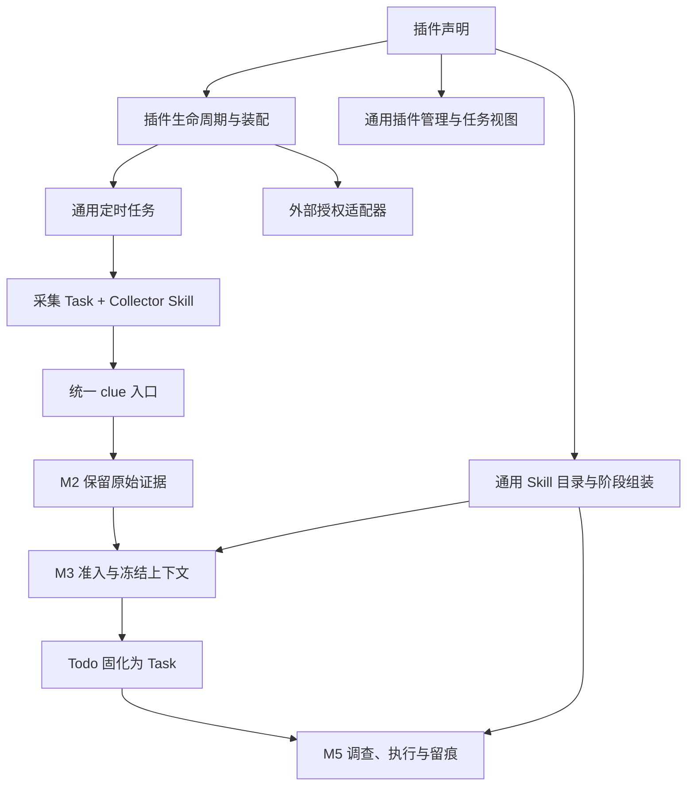

# Jarvis 插件扩展与解耦规范

> Status: proposal
> Authority: non-normative proposal；现行约束仍以 AGENTS.md 为准
> Last verified: 2026-09-10 @ 1681280 + 当时工作区改动

目标：完成下述基础改造后，新增一个复用已有工具和授权方式的普通插件，只需增加一份插件声明和对应 Skill，不再修改核心流水线、公共页面或数据库结构。

本文交付接入规范和改造建议，没有实现文件加载器、通用插件表单或授权适配器拆分。现有能力见 [插件系统](../plugin-system.md)，架构原则见 [AGENTS.md](../../AGENTS.md) 和 [当前架构](../00-overview.md)。这里的“插件”指 Jarvis 的外围采集与业务能力单元。

分支、commit、MR 拆分与验证的配套讨论见 [代码提交与评审方案](code-submission-plan.md)。

## 1. 当前实现与耦合点

现有四个插件是 Codebase、Meego、Oncall 和“我的交办”。前三个使用定时 Task 调用采集 Skill；“我的交办”把两个 Skill 正文分别注入 M3、M5。它们已经复用同一条 Todo → Task → M5 链路，值得保留。

| 耦合点 | 当前证据 | 目标归属 |
|---|---|---|
| 插件清单写在 Go 中 | [catalog.go](../../internal/plugin/catalog.go) 的 `BuiltinRegistry()` 包含四个插件的名称、默认值、Skill 和授权提供者 | 文件声明；Registry 只负责加载、索引和机械校验 |
| Skill 归属与阶段绑定分散 | Manifest 声明所属 Skill；[conf/skills.yaml](../../conf/skills.yaml) 另存阶段、启用与 inline 设置 | 插件 Skill 的绑定集中到插件声明，删除原配置中的重复项 |
| 业务配置与默认值进入公共页面 | [Plugins.tsx](../../web/src/Plugins.tsx) 的 `lookbackPlugins`、Oncall 分支和重复默认值 | 声明贡献字段说明；公共页面按字段类型渲染 |
| 授权协议集中在一个实现里 | [auth.go](../../internal/plugin/auth.go) 按 provider 分支执行和解析；IM 探测还带有 `oncall` 查询词 | 外部系统授权适配器；生命周期只调用统一探测、开始、完成操作 |
| 插件名称进入导航与任务页面 | [App.tsx](../../web/src/App.tsx)、[Tasks.tsx](../../web/src/Tasks.tsx)、[ScheduledTasks.tsx](../../web/src/ScheduledTasks.tsx) 传递 `delegationsEnabled` | 通用任务视图声明；业务展示放在插件自己的组件中 |
| 业务字段进入通用列表投影 | [list_projection.go](../../internal/execute/list_projection.go) 专门保留 `annotation.delegation`；[taskPresentation.ts](../../web/src/tasks/taskPresentation.ts) 和 [TaskDetailModal.tsx](../../web/src/tasks/TaskDetailModal.tsx) 解读交办字段 | 通用列表展示共有进展；插件细节按需读取完整 Task 后由插件组件解释 |

`internal/plugin` 使用通用调度器、HTTP 层调用插件服务、主入口装配这些依赖，属于必要组合。需要消除的是公共模块对具体插件名称、外部业务字段和规则的认识。

## 2. 职责与依赖方向



| 层 | 负责 | 不承接 |
|---|---|---|
| 插件声明 | 身份、说明、Skill 绑定、采集计划参数、默认配置、展示贡献 | 业务判断正文、可执行流程脚本 |
| 插件 Skill | 来源查询、证据保留、领域识别、执行步骤及停止条件 | 第二套调度器、状态机或审批尺度 |
| 插件生命周期 | 启停、配置 revision、调度绑定、可用性、状态展示 | 外部工单/MR 的状态解释 |
| 外部适配器 | CLI/API 调用差异、结构化授权协议解析 | “值得处理吗”“应该重试多久”等业务判断 |
| Skill 服务 | 发现正文、按阶段组装目录或 inline 正文 | 按插件名称分叉或复制 Skill 正文 |
| 核心流水线 | 证据、幂等、上下文冻结、通用 Task、执行和留痕 | 插件私有字段、私有状态和来源专用路径 |
| 展示层 | 通用启停、配置、运行记录、任务过滤；插件组件解释业务细节 | 决定任务执行方式、审批和准入 |

依赖从插件外围指向通用能力；M2、M3、M5 不反向依赖插件实现。保留现有 `Scheduler`、`skill.Availability` 这类小接口，不为每个插件创建 Service/Repository/Controller 全家桶。

## 3. 插件声明：建议的最小形式

继续使用仓库内文件，先支持启动时加载。沿用 `.agents/skills/` 的标准发现位置，不引入包市场、热加载、依赖解析或动态代码执行框架。

```text
conf/plugins/<plugin-id>.yaml          # 新增：该插件的唯一声明
.agents/skills/<skill-name>/SKILL.md    # 继续使用：唯一行为正文
.agents/skills/<skill-name>/scripts/   # 可选：来源工具适配
web/src/plugins/<plugin-id>/           # 可选：确需独立展示的组件
```

下例是**待实现的文件格式**，当前程序不能直接读取。使用现有 Codebase 说明迁移后的写法：

```yaml
id: codebase
name: Codebase
description: 采集与你相关、在配置范围内有更新的开放 MR。
kind: collector
source: codebase
collector_skill: codebase-clue-collector
provider: bytedcli-session
permissions:
  - bytedcli:codebase.read
interval_minutes: 30
skills:
  - name: codebase-clue-collector
    stages: [execute]
    inline: false
default_config:
  lookback_days: 3
config_fields:
  - key: lookback_days
    label: 更新时间范围（天）
    type: integer
    min: 1
    help: 只采集最近这些天内有更新的开放 MR。
```

能力插件的声明保留 `kind: capability`、身份和 `skills`，省略采集 source、collector、provider 和周期。例如“我的交办”绑定 `my-delegations-extract` 至 `extract`、`my-delegations-execute` 至 `execute`，两者均 `inline: true`。暂时保留现有两种 kind；没有真实需求时不再设计其它类型。

声明字段只覆盖实际消费点：

| 字段组 | 消费者及约束 |
|---|---|
| `id`、名称、说明 | Registry 索引、安装状态关联和界面；ID 稳定且唯一 |
| `kind`、采集参数 | 生命周期创建通用 ScheduledTask；采集 source 唯一；周期为正数 |
| `provider` | 授权适配器查找；同一种授权方式可供多个插件复用 |
| `skills` | Skill 服务的阶段绑定和正文读取；名称唯一归属，文件存在且非空 |
| `default_config` | 生命周期生成有效配置；宽松 JSON 对象 |
| `config_fields` | 通用表单标签、控件类型和输入校验；首批只覆盖现有整数、字符串列表 |
| `permissions` | 面向用户的外部能力说明；不是 Agent 权限或工具白名单 |

Collector 的入口 Skill 必须在同一份 `skills` 中声明 execute 绑定。新加载器应将 source 与统一 clue 入口的命名限制一起校验，发现重复 ID/source/Skill、未知 provider 或缺失文件时明确报错。

`config_fields` 只描述可编辑字段，不是模型输出 schema。未列出的配置键仍原样保留，不能设成只允许已知字段。默认值只写 `default_config`；表单和 Skill 消费有效配置，去掉前端与 Skill 中重复的默认值。

插件 Skill 的阶段绑定迁入声明后，`conf/skills.yaml` 只管理非插件 Skill。两处声明同一个 Skill 时直接报错，不设置“谁覆盖谁”。插件开关作为这些绑定的总开关，不再复制一份按 Skill 开启的状态。

## 4. 配置、启停与历史

以下区分当前行为和目标要求，不能用文件格式替代生命周期处理。

- **配置**：当前 `plugin_installation` 保存 `enabled`、`revision`、宽松 `config` 和调度关联。先沿用，不新增插件业务表。Manifest/Skill 文件保存声明和行为；外部登录凭据仍由相应 CLI 管理。
- **配置替换**：当前非空存储配置整体替代默认配置，`{}` 表示使用默认配置，不做逐键深合并。当前 PATCH 的 `config` 也是整体替换，调用方应带上需要保留的未知键。扩展时应显式呈现这项语义，避免前后端各自合并。
- **启用**：默认关闭。采集插件授权可用后复用一个采集计划；未授权可保留“开启、待授权”。能力插件只激活 Skill 绑定，不制造空采集任务。
- **停用**：停止该插件后续周期采集，并停止在新组装的 prompt 中贡献 Skill；已有线索、Todo、Task、等待续跑和执行记录保留，任务处置仍走通用 Task 操作。已经运行的 Agent 或保留的 Session 不会因移除目录而遗忘已有正文。
- **权限含义**：当前 Skill API 会随插件停用隐藏正文入口，这是产品可用性行为，不是本机 Agent 安全隔离；不据此限制 Shell、工具或跨 Task 操作。
- **移除文件**：当前没有自动卸载协议。先停用并确认其采集计划已关闭，再移除声明和专属 Skill；不能把删文件当成停止任务，也不删除历史业务数据。
- **改名与升级**：显示名称可变，ID/source 尽量保持。变更 ID/source 会影响安装关联或幂等身份，必须给出显式迁移步骤。新增配置键时同时验证已有非空配置，不能假设新增默认值会自动合入。

目标加载器需要在启动时核对已有安装与采集计划：按启用和授权结果同步计划；安装记录指向缺失声明时报告具体 ID 和计划，不能静默遗留采集。该启动核对不是现有能力。

多步写入继续顺序执行、失败即报错，重跑时从已持久化的关联恢复。创建计划与保存关联之间失败时必须能定位孤立计划；不能盲目再建一份，也不为此引入事务或插件私有恢复状态。插件停止采集不应停止该插件过去生成的业务 Task 的等待计划。

## 5. Skill 与最终有效输入

当前装配链路已经有合适的扩展点：

1. [main.go](../../cmd/jarvis-server/main.go) 构造 Registry、插件服务、Skill 服务，调用 `SetAvailability(pluginService)`。
2. [skill.go](../../internal/skill/skill.go) 合并文件元数据和阶段配置，再结合插件 enabled 决定目录贡献。
3. M3 的 [worker.go](../../internal/extract/worker.go) 读取 extract rules、Skills、shared memory 和系统提示词；[prompt.go](../../internal/extract/prompt.go) 组装工具目录、可信指令和业务上下文。
4. M5 的 [agent_executor.go](../../internal/execute/agent_executor.go) 读取 execute rules、Skills、shared memory、系统提示词和审批策略；[prompt.go](../../internal/execute/prompt.go) 加上 Task 上下文、人工补充与历史入口。
5. 助手显示名称由现有 `internal/agentidentity` 装饰器渲染；插件正文继续使用 `{{AGENT_NAME}}`，不写死本机名称。

改造只替换插件绑定的生产者，继续通过同一个 `Catalog(stage)` 消费，不能为某个插件再拼第二段 prompt。

| 阶段 | 插件生效内容 | 验收边界 |
|---|---|---|
| M3 | 属于 extract 的目录摘要，或明确声明 inline 的领域识别正文 | 只补准入证据；没有 M5 深入执行、催办或审批流程 |
| M5 | 属于 execute 的目录摘要或 inline 正文，加当前 Task 的冻结证据 | Skill 说明自身适用范围；具体动作仍服从任务上下文和统一审批策略 |
| proactive / factengine | 当前不通过这条 M3/M5 Skill 目录自动注入 | 不能声称“开启插件后所有阶段都激活”；有真实需要再检查各自装配入口 |

普通操作 Skill 按需读取；只有需要每轮参与识别的短规则才 inline。通用阶段规则仍在 `conf/rules/m3.md`、`m5.md`，阶段角色仍在系统提示词，工具手册仍在 toolcatalog；插件不得复制或覆盖它们。

不要把 `action_type` 当程序路由。Skill 可解释 `delegated_followup` 等开放值，展示可按它过滤；Go 不因此改变执行、等待或请示路径。Skill 对其它插件能力的需要应描述成可用工具与证据需求，不读取对方的私有存储或要求固定安装顺序。

## 6. 采集插件的证据契约

采集 Skill 必须说明查询范围、分页终止、身份、原文保存和幂等键构造。采集结束即停止，不在同一采集 Task 内完成评审、催办或深度调查。

投递只使用现有 `jarvis-tools append-clue` / `POST /api/clues`，字段约束以 [clue.go](../../internal/capture/clue.go) 为准：

- `source` 是稳定来源名，当前格式为小写 snake_case，最长 32 字符；不是 Go 枚举。
- `external_id` 标识同一事实版本，同版本重投不新增，后续真实更新使用新键。当前完整 `clue:<source>:<external_id>` 最长 64 字节，必要时散列稳定身份与版本，原始标识仍留正文。
- `title`、发生时间与原始 `content` 保留事实；正文允许自然语言或原始 JSON，不复制外部系统 DTO 到核心层。
- 相同幂等键不会覆盖原文。不能只使用对象 ID 导致后续更新被吞，也不能用本轮时间或随机数制造重复。
- 失败保留完整外部错误及已有成功进展，不伪造成业务线索；业务等待和重试由执行 Agent 结合证据决定。
- 事实进入 M3 后由现有机制冻结到 `Todo.content` 和 `Task.source_payload`，插件不得再建立一份下游替代快照。

## 7. 授权与 UI 的扩展约定

**授权按外部协议复用。** 将现有 `Probe / Begin / Complete` 对应的小接口与 provider 注册保留在外围，具体 CLI 参数和返回格式拆到适配实现。新增插件复用 provider 时只引用名字；确实出现新授权协议时，允许增加一个适配实现和一处装配，不改生命周期和流水线。暂不增加 Manifest 任意授权脚本执行协议。

只根据工具明确的结构化授权结果更新授权状态；“工单未完成”“会议没有录制”等业务含义仍在 Skill。现有 `lark-cli-im` 探测中的 Oncall 查询词应随适配拆分移出通用授权职责。未知 provider、依赖不可用、登录失败都应能在插件状态中定位。

**基础 UI 按声明生成。** 管理列表只处理通用启停、授权和状态，配置与运行详情放插件二级页。`config_fields` 生成简单表单；插件页面不再按 `item.id` 添加分支，也不再复制默认值。复杂字段暂用明确的 JSON 配置编辑，不为每个需求建设表单语言。

**业务视图复用 Task。** 建议增加最小的任务视图贡献，仅含视图 ID、标题及已有 `action_type` 过滤值；这些字段只由导航和任务查询消费。保留“全部任务”入口，停用插件后历史 Task 仍可查。

“我的交办”迁移时，公共列表使用已有标题、进展、状态、时间和详情入口；负责人等业务细节由 `web/src/plugins/my-delegations/` 组件读取完整 Task 后解释。删除 `list_projection.go` 对 delegation 的专用投影，不换成新的插件字段分支。需要保留专用卡片时，使用一个显式前端组件注册点，不能把业务判断继续散落在 App、Tasks、ScheduledTasks、详情弹窗和公共格式化函数中。

这种定制 UI 仍需前端构建，是普通声明式插件之外的扩展成本；不承诺任意业务页面都零代码接入。不为定制展示修改模型输出必填字段或增加业务表。

## 8. 新增插件的操作步骤

### 当前版本可执行的接入

1. 判断是外部采集还是复用已有证据的阶段能力；仅需要一次性操作步骤时，直接新增 Skill，无需包装成插件。
2. 增加 `.agents/skills/<name>/SKILL.md`，写清职责、工具、输入、完整证据、停止条件和验证方式。
3. 在 `conf/skills.yaml` 注册阶段与 inline；在 `BuiltinRegistry()` 注册 Manifest。当前尚不能靠新增 YAML 插件声明完成注册。
4. 优先复用已有 provider；当前 collector 必须填写 provider，不能宣称已经支持无授权采集器。
5. 宽松配置可通过现有 `/api/plugins/:plugin_id` PATCH 设置，同时提供 `enabled` 和 `expected_revision`。要提供新配置表单，应先推进通用表单改造，不继续添加插件名称分支。
6. 核对最终 M3/M5 prompt、采集幂等、停用和历史保留；同步插件说明与必要验证记录。

### 基础解耦完成后的标准接入

1. 增加 `conf/plugins/<id>.yaml` 和对应 Skill；使用已有工具/provider/通用表单时不改 Go、公共 React 页面或数据表。
2. 校验身份唯一性、Skill 文件、阶段绑定和声明；默认不启用。
3. 验证一次事实采集或能力识别，再验证重投、失败、停用、重新启用及 Task 历史可读。
4. 附上“改动文件 + 启用后的有效输入 + 测试证据”。如果仍需修改 M2/M3/M5 语义代码，先重新检查职责归属。

## 9. 改造顺序与验收

| 顺序 | 自洽改造范围 | 完成标准 |
|---|---|---|
| 1 | Manifest 文件加载 + 插件 Skill 绑定合并；迁移四个内置声明，删除 Go 内置清单及重复 Skill 配置 | 添加测试插件只增加声明与 Skill；原有插件的目录/inline 组合保持一致 |
| 2 | 服务提供配置字段描述 + 公共表单；移除 `lookbackPlugins`、Oncall 页面分支和重复默认值 | 新增一个现有类型配置字段，无需修改公共前端；未知 config 键读写不丢 |
| 3 | 将授权 provider 拆成协议适配器，在一个入口装配 | 复用 provider 不改授权代码；新增 provider 不改插件生命周期 |
| 4 | 声明式任务视图 + 交办专属组件；同步移除执行列表和公共页面里的业务分支 | 新业务类型不改通用列表投影；“我的交办”原文、进展与详情仍可读 |
| 5 | 对四个插件验证启动核对、停用、恢复和失败后的重跑 | 不产生重复采集计划，不遗留运行中的孤立采集计划，既有业务任务照常可查 |

实现涉及 Registry、Skill 组装、API 和前端的跨模块变更，应按上述范围逐项确认实施。更小的过渡方案是继续用当前 Go 注册表接入、先禁止增加新的业务分支；它能控制耦合增长，但不能达到“新增插件不改宿主代码”。本次仅交付规范。

实施时至少提供以下有行为意义的验证，不以逐行复刻实现的测试代替：

- 重复 ID/source/Skill、缺失正文和未知 provider 明确失败；多个插件启用时阶段规则不串用。
- 开关切换前后的完整 M3/M5 prompt 可核对，inline 正文没有重复；不把 M5 跟进规则带入 M3。
- 同一事实版本重投不新增，后续版本可进入统一链路；原始内容和 Task 冻结证据完整。
- 关闭插件后停止未来采集和新 prompt 贡献，正在执行与等待中的业务 Task 不被自动取消。
- 有效配置与 UI 一致，默认值只有一个来源，未知业务键仍可往返保存。
- 重启、配置保存失败和调度关联失败后能定位并恢复既有计划；已有 Task、ExecutionRun、TaskEvent 保留。

最终验收问题：**再接入一个使用已有授权的来源时，是否只需提交插件声明与 Skill，就能启用、采集、查看运行记录并进入原有任务链路？** 若仍需在公共模块增加插件名称判断，解耦尚未完成。
