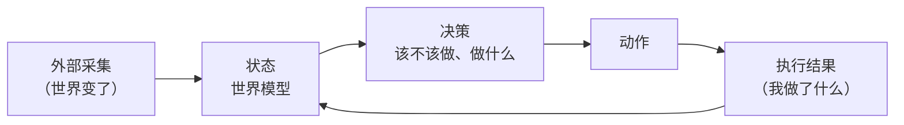

# 项目目标

> **文档维护原则**
>
> 1. 本文档只描述**目标、愿景，以及模糊的实现方向**，不写具体详细的方案。需要落地细节时另开设计文档。
> 2. 本文档**不记录进度和现状**。已完成什么、还缺什么、当前差距，都不写在这里。
>
> 判断一段内容该不该留在本文：它会随着开发推进而过期吗？会，就不属于这里。

## 一句话

Jarvis 是服务于 principal 的**主动式任务数字分身**：持续获取工作上下文，判断哪些事值得推进，使用工具把事情做完，并把结果沉淀回可复用的世界状态。

飞书是当前主要场景，但流水线不为飞书或任何单一来源开专用判断链路。目标是让 Jarvis 的决策内核保持来源无关，**不是建设一个通用 Agent 平台**。

## 为什么要抽象

场景和内核混在一起时，采集、决策、执行、沉淀共用一套代码，场景细节会渗进判断逻辑，最该长期打磨的核心决策部分反而最难改。

抽象的目的是把**判断协议独立出来**：邮件、工单、代码仓库、日程等新来源通过外围 Skill、定时任务或连接器接入统一线索入口，不为每个来源复制一套判断和执行流程。

## 内核：内核本身就是一个 Agent

内核不是一堆模块的集合，它**本身就是一个 agent**。一个 agent 只有两样东西：

- **状态**——世界模型。Agent 对外部世界的全部认知，是它唯一的记忆，也是一切判断的依据。
- **决策**——快慢思考。看着状态，回答「现在该不该做点什么、做什么」。

由此推出三件事：

**状态只有一份，写入有两个来源。** 从外部采集来的是新事实，执行完沉淀回来的也是新事实。**采集和沉淀是同一类操作**——都是在改写 agent 对世界的认知，区别只在事实产生于外部还是产生于 agent 自己的动作。

**闭环必须真的闭上。** 沉淀了但取不回来，等于没沉淀；决策时拿不到历史认知，agent 每一轮都在从零推断，做过多少次都不会变聪明。

**决策不在 Go 代码里按来源分叉。** 它以统一上下文快照为起点，并可通过 `jarvis-tools`、`lark-cli`、`bytedcli`、`git` 等通用工具查证外部世界。查询结果作为新证据参与判断；内核不需要知道“会议来源走哪条专用链路”，但模型必须能主动核实真实状态。

## 分层原则：内核干净，外围可脏

| 层 | 职责 | 洁癖要求 |
|---|---|---|
| 采集层 | 从外部世界获取事实 | 来源差异留在外围 Skill、定时任务和连接器；事实统一进入 M2 |
| **决策内核** | 世界建模 + 判断 + 沉淀 | **必须独立、简洁、通用、自洽** |
| 执行与后处理层 | 把事做完、写回外部世界 | **允许杂乱**。工具多、分支多是正常的 |

只有一个地方要求干净，就是判断层。理由是它是需要长期迭代的地方——采集和执行可以靠堆适配解决，判断质量只能靠反复打磨，而**只有保持简洁才迭代得动**。

## 四项能力

1. **对外部世界建模**：人、事、物（资源）、进度。
2. **决定做什么事**：从纷杂输入中判断哪些值得做。
3. **把事做完**：选择手段、调用工具、处理等待和授权，直到有结果。
4. **沉淀**：思考过程和执行过程都能留下来，供后续复用。

这四项落在内核的两样东西上：建模和沉淀都是**维护状态**，决定和做事都是**决策**。

## 世界模型的设计要求

世界模型不是一张静态的实体表，它有三个必须成立的性质：

**1. 分层：稳定背景与增量变化分开**

- **背景画像**：长期稳定的事实（这个人是谁、这个项目在做什么）。
- **动作产生的变化**：每一次执行、每一次交互带来的增量。
- 两者不能混成一坨，否则背景会被高频噪声淹没。

**2. 时效性：事实会变更、会过期**

同一个事实在不同时间可能被推翻。世界模型必须能表达「这条曾经成立，现在被替代了」和「这条已经过期，不该再作为依据」，而不是只保留最新覆盖值。

**3. 渐进式披露：像人一样先看摘要，再按需详查**

一次性把全部世界状态塞进上下文既装不下也没必要。默认只给描述性摘要，agent 判断需要细节时再发起查询。

**为此需要一批世界模型的增删改查 Agent 工具**，让模型自己按需读取和维护世界模型，而不是由程序预先决定塞什么进去。

## 快慢思考

决策分两层，区别不在粒度，在**可逆性**：

- **快思考——要不要做**：只读、无副作用、判错了重来即可。因此可以放心让模型自主。
- **慢思考——具体怎么做**：调查、选择动作，并针对即将发生的具体副作用判断是否需要授权；无需审批时直接做到真实完成，需要审批时才停在 `awaiting_approval`。

## 判定标准

抽象是否成功，用三条检验：

1. **核心协议不按来源分叉**。来源差异通过证据、Skill 和工具表达，不在 Todo→Task→执行链路里增加专用状态、表或分支。
2. **接入新来源只改外围**。新增 `source`、Skill/定时任务或连接器，通过统一入口投递事实，不改核心流水线。
3. **闭环真的闭上**。上一次执行的结果和学到的经验，能实际影响下一次决策——可验证，不是设计上写着而已。
