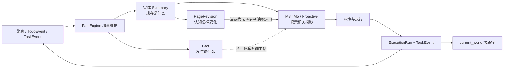

# TODO 5｜世界观进入完整闭环：加载逻辑、关系与引用

> 核对范围：`feat/entity-summary-pages` 分支，2026-08-19。以下正文只陈述章节与当前仓库能互相印证的行为；“尚未闭合”处明确标出，不把 proposed 设计写成已实现能力。

## 可直接替换占位区的最终中文文案

### 世界观不是一次性塞满，而是“先投影、再下钻”

世界模型进入下一轮判断时，不会把数据库、群历史、文档和代码一次性灌进提示词。Jarvis 采用两级读取：运行开始只装载能支持当前职责的短投影；只有某条投影影响决策、存在冲突或需要核验原话时，才沿主体、时间和资源定位继续下钻。

M3 的启动投影围绕当前会话构造：Principal 的当前 `summary`，当前绑定项目的完整 `summary`，来源群的公告与 `summary`，本轮发言参与者的 `summary`，会话内关联资源，以及其他未归档项目的名称、角色、状态和优先级。历史 Fact 不展开，只给当前群和绑定项目“今日 / 近 7 天”的条数；行动状态也只给最近相关 Task 的标题、状态、进展摘要和时间，以及未闭环 Todo 的编号、动作类型、标题和状态。M3 据此完成准入、归属和去重；不足时再查详情，而不是提前完成执行阶段的调查。

M3 接纳线索时，会把当时的 Principal、项目、群、交办人、参与者、消息、会话和资源固化成 `context_snapshot`。最近 Task 和开放 Todo 不进入快照，因为它们会继续变化。M5 每次运行开始同时拿到两份用途不同的背景：一份是这个冻结快照，用来回答“当时为什么接纳”；另一份是实时 `current_world`，包含最近有进展的 20 个 Task（包括 `done` 和 `failed`）与最近 20 条开放 Todo，用来回答“现在是否已经有人做过、是否仍需继续”。当前实体页不会被无差别全部预载；当项目、人物、群或关键事项的现状会影响动作时，M5 用 `get-page` 读取该实体最新整页。

Proactive 的启动输入更轻：系统提示词、共享记忆、工具目录、当前时间和时区。它不预载整套世界，而是先通过索引和列表发现值得巡视的对象，再按需读取；没有值得行动的事项就返回 `NOTHING`。

### 何时继续下钻

| 触发条件 | 下钻对象 | 当前读取方式与停止条件 |
|---|---|---|
| Summary 足以判断当前状态 | 不下钻 | 直接决策；不要为了“更完整”继续拉材料 |
| 页面结论需要历史依据，或需确认某状态何时变化 | Fact | 先按 `subject_type + subject_id + 时间窗` 查询；拿到足够解释当前问题的事实后停止 |
| 需要判断“我们的认知何时、为何被改写” | PageRevision | 语义上只用于认知变更审计，不能当现实证据。当前分支只会写入 `page_revision`，尚无供 Agent 查询的 API/CLI，因此这条下钻链目前未闭合 |
| 需要核验谁在何时说了什么、上下文是否改变语义 | 群消息 | 先按群、发送者、关键词、时间窗查询本地已采集消息；大段线程交给只读子 Agent，只回传结论和消息出处 |
| 线索里出现附件、文档引用或会议材料 | 文档/资源 | 先查 captured resource 摘要，命中后再取单个资源正文；飞书对象确需最新内容时再用对应 Skill / `lark-cli` |
| 任务涉及实现、回归或提交是否已发生 | 代码资源 | 先定位项目/资源页中的仓库线索，再用 `git` 或 `bytedcli` 查具体文件、提交、分支、MR；不要把整个仓库内容放进主上下文 |
| Task/Todo 摘要显示可能重复、失败或等待 | Task/Todo 详情 | 先列表收窄到群或项目，再读取单个对象；Task 的完整 prompt 与 run output 默认不加载，只有确需复盘时显式展开 |

这套加载策略的关键不是“少读”，而是让每次读取都有问题、有范围、有停止条件：先看 Summary 和 brief，命中后才看 Fact 或对象详情；先看资源索引，命中后才读正文；大量群聊、文档或代码扫描交给子 Agent，主 Agent 只接收带可核验出处的结论。

### 如何控制上下文体积

实体 `summary` 是可整体读写的长期事实页，每页硬上限 8000 个 Unicode 字符；超过上限必须先合并旧明细、改成引用或删除已不重要内容，不能截断。Task 的跨轮 `progress_summary` 上限为 1000 字符，因为它会进入以后每个 Task 的 `current_world`。M3 不再默认展开 Fact，只注入计数；其他项目只注入元数据，不注入全部 Summary。M3 总提示词超过 `max_chars` 时，按当前实现先移除旧的 context 消息，全部移除仍超限就直接报错，不静默截断。FactEngine 对一次世界维护材料使用 80 万字符粗预算：超限时按来源共同缩小行数，但不截断单条材料；装不下的来源不推进游标，留到下一轮。

因此当前抗膨胀有四道边界：实体页 8000 字符、Task 摘要 1000 字符、Fact 默认只给计数、原始大材料按需或委派加载。需要注意，M3 的资源 `extracted_text` 和参与者 Summary 仍会进入会话投影；若它们使提示词在移除历史消息后仍超限，当前行为是 fail-fast，而不是继续裁剪世界数据。

### 关系如何表达、调整与去重

关系分成两类。能被程序确定并用于查询的关系继续放在结构化字段里，例如 `feishu_group.project_id`、`todo.group_id`、`todo.project_id`、`task.todo_id` 和 `task.project_id`。其余职责、协作、影响和依据写在实体 `summary` 的自然语言中，并用 Markdown 实体链接指向目标，例如 `[Agent Runtime](project:45)` 或 `[接入会议纪要](task:393)`。

`relation_fact` 已被废弃；页内引用是当前语义关系的表达。写页时系统会解析引用、对同一 `type:id` 的出链结果去重，并逐个验证目标真实存在；编造 ID 会导致整页写入失败。反链不是另一份真源，而是对六类实体 Summary 做即时查询得到。关系变化时，Agent 基于最新整页删除过期表述、改写关系并保留必要的改判说明；写入必须携带刚读取到的 `updated_at`，若发生并发冲突则返回当前全文，重新合并后再写，避免覆盖别人刚完成的调整。

这里的“去重”有明确边界：解析结果会去掉同页内重复的相同目标引用，结构化外键也只有一个权威字段；但系统没有自动判断两段不同自然语言是否表达同一关系，也不会自动合并两张页面上的语义重复。语义去重仍靠维护 Agent 读取整页后改写，而不是靠隐藏的图谱边表。

### 事实、来源、时间与推断

`summary` 回答“现在是什么”，允许被新证据就地改写；`Fact` 回答“发生过什么”，按 `occurred_at` 保存业务发生时间，并另有 `created_at` 表示何时被系统记录；`PageRevision` 保存整页改写前的旧文本与 `changed_at`，回答“我们的认知何时被改过”。三者不能混用：旧版页面不是现实事件，不能作为 Fact 给自己作证。

当前 `Fact` 结构含 `source_kind` 与 `source_id`，但两者仍是可选字段；当前工具链也没有保证每条来源指针都能沿 ID 取回原始材料。仓库中的“fact 降级为证据索引”文档提出了强制可解析来源、给材料增加 `ref`、新增 `get-message --id` 等方案，但这些符号只出现在 proposed 文档，没有出现在当前实现中。因此，现阶段可以说 Fact 保留了来源字段和双时间语义，不能说“每条事实已经具备可闭环点击的原始引用”。这是引用闭环尚未完成的第二个缺口。

推断同样没有独立表、置信度字段或 `inference` 类型。当前边界由行为协议维持：M5 必须区分原始事实、推断和待验证假设；只有亲自核实的稳定现状才能改实体页，过程性猜测留在本轮 `summary` / `progress_summary`，不能伪装成 Fact。若新证据推翻旧结论，页面应明确写“此前认为 X，某日改判为 Y”，同时把真实发生的事件写入 Fact，把旧页面留在 PageRevision。也就是说，当前是“用载体和措辞区分事实与推断”，尚不是“由 Schema 强制区分”。

### 执行结果怎样回到模型

闭环有一条快路径和一条慢路径。快路径中，M5 的结构化结果会写入 `ExecutionRun`、Task 的 `execution_result` / `summary`，并追加 `TaskEvent`；下一次 M5 运行会通过 `previous_runs` 看到本 Task 已做过什么，其他 Task 会通过实时 `current_world` 看到它的最新状态与进展摘要，从而避免重复动作。

慢路径中，FactEngine 按游标消费新增消息、TodoEvent 和 TaskEvent；TaskEvent 材料还会带关联 ExecutionRun 的最终 `summary`、`output`、`effects`、错误与完成时间。它把一批增量材料交给一次世界维护 Agent，由 Agent 先读实体索引和受影响的完整页面，再改写 Summary、追加必要 Fact，并写后读回。只有整次 Agent 会话成功，来源游标才推进；失败则保留游标供下轮重放，重放时依靠现值查询和整页更新避免重复。于是一次执行的结果先改变 Task 的实时状态，随后沉淀为实体当前认知与历史事实；未来的 M3、M5 和 Proactive 再读取这些变化，形成“感知—维护—投影—决策—执行—验证—再感知”的闭环。

### 一个具体调试任务的逐步加载例子

以“排查 `agent-runtime` 网关偶发 502，确认是否与最近发布有关”为例。下面使用 `T`、`P`、`G` 表示运行时查到的真实 Task、Project、Group ID，不预造数据库记录。

1. **M3 接收线索。** 启动投影包含 Principal Summary、群 `G` 的公告与 Summary、群绑定项目 `P` 的 Summary、发言人的 Summary、最近相关 Task brief、开放 Todo brief，以及 `G/P` 的 Fact 条数。若最近 Task 已显示同一 502 已处理，M3 读取该 Task 详情核对后停止重复建单；否则建立 Todo，并冻结当时消息、参与者、项目和资源。
2. **M5 开始 Task `T`。** 先读冻结 `execution_context`，确认最初原话和当时项目归属；再读 `current_world`。若其中已有另一个 `done` Task 提到同一故障，先 `get-task` 核验其结果是否满足当前目标，而不是直接重跑排障。
3. **读取当前实体页。** 调用 `get-page project:P`，只读取 Agent Runtime 当前整页。页面若已写明“502 已由某次发布修复”，这只是当前结论；由于本轮又出现新错误，需要继续核验，而不是照页作答。
4. **按时间下钻。** 以项目 `P` 和故障发生日查询 Fact，只取能定位发布、阻塞或修复变化的时间窗。若 Fact 仍不足，再按群 `G`、关键词 `502` 和相邻时间窗查本地消息，核对原话与线程上下文。
5. **定位代码证据。** 从项目页或资源索引定位真实仓库，再查最近发布对应的 commit、分支、MR 和相关网关代码；先看变更范围和日志指向的文件，不扫描整个仓库。若群消息、发布记录、日志/代码是三条可并行调查线，则派只读子 Agent 分别调查，只回传结论、消息/commit/文件路径。
6. **区分事实与假设。** “发布后首次出现 502”“回滚后错误率下降”是有时间和来源的事实；“连接池改动可能是根因”在复现或代码证据闭合前只是假设，留在 Task 进展中，不写成 Fact，也不把项目页改成确定结论。
7. **执行并验证。** 完成修复或回滚后，不以“命令成功”作为完成；继续检查错误率、复现结果或发布状态，确认目标状态真实成立。将成功动作登记到 `effects`，把本轮做了什么写入 `summary`，把整个 Task 已定结论、悬而未决项和下一步整体重写进 `progress_summary`。
8. **回写世界。** TaskEvent 与关联 ExecutionRun 被 FactEngine 消费。若已确认根因和修复状态，世界维护 Agent 更新项目 `P` 的当前页，并按真实发生时间追加必要 Fact；旧页自动进入 PageRevision。下一轮 M5 会先在 `current_world` 看到 Task `T` 已完成，M3 也会看到更新后的项目 Summary 和 Fact 计数，从而不再把同一 502 当成全新问题。

## 建议配图 / 流程

建议使用一张主流程图，不再增加第二张概念图：

图旁建议保留一个三层小表：

| 层 | 回答的问题 | 变更方式 | 是否默认进入上下文 |
|---|---|---|---|
| Summary | 现在是什么 | 整页改写，CAS，8000 字符上限 | 仅与当前职责相关的实体投影 |
| Fact | 发生过什么、何时发生 | 只追加，含 `occurred_at` / `created_at` | 不展开，只给计数；按需查询 |
| PageRevision | 我们的认知何时被改写 | Summary 更新前保存旧全文 | 否；当前无 Agent 查询入口 |

## 代码证据路径

| 结论 | 代码 / 文档证据 |
|---|---|
| M3 启动投影的组成、Fact 只给计数 | `internal/extract/prompt.go:117-131, 134-263`；`internal/extract/worker.go:246-298` |
| Principal、项目、群、参与者 Summary 的读取范围 | `internal/extract/pipeline_store.go:103-164, 262-305, 363-412, 441-495` |
| 冻结快照不包含最近 Task / 开放 Todo | `internal/extract/snapshot.go:13-44` |
| M5 实时加载 20 个最近 Task 与 20 个开放 Todo | `internal/execute/currentworld.go:11-129` |
| 冻结背景、实时世界和实体页各自职责 | `conf/prompts/m5-system-prompt.md:7-33` |
| Summary 8000 字符上限 | `internal/background/types.go:28-57` |
| Task Summary 1000 字符上限 | `internal/execute/store.go:35-50`；`conf/prompts/m5-system-prompt.md:129-137` |
| M3 超限删除旧 context 消息并 fail-fast | `internal/extract/prompt.go:77-114, 283-289` |
| FactEngine 80 万字符粗装箱、成功后推进游标 | `internal/factengine/worker.go:99-169, 172-194`；配置语义见 `docs/design-world-context-progressive.md:120-152` |
| 页内引用解析、目标校验、反链 | `internal/background/reference.go:14-183` |
| 整页更新、CAS、旧页归档与 Fact 计数 | `internal/background/page.go:134-178, 263-287` |
| PageRevision 与 Fact 分表 | `internal/domain/progress.go:32-93` |
| relation_fact 废弃、确定性关系保留外键 | `docs/design-temporal-relations-and-progress.md:14-38`；仓库仅余“旧命令应不存在”的测试：`internal/toolcatalog/jarvis_tools_cli_test.go:374` |
| Agent 的渐进式工具目录 | `internal/toolcatalog/catalog.go:31-44` |
| FactEngine 消费 TaskEvent 与 ExecutionRun 最终结果 | `internal/factengine/store.go:273-328, 357-436` |
| 世界维护的改页优先、写后读回、NOTHING | `conf/prompts/fact-extract-system-prompt.md:7-40` |
| 执行完成必须验证真实结果；大素材交给子 Agent | `conf/prompts/m5-system-prompt.md:37-55, 81-93` |
| Fact 来源强引用与 `get-message --id` 尚属 proposed、未落地 | `docs/design-fact-as-evidence-index.md:1-5, 91-187, 210-273`；当前 `internal/domain/progress.go:62-66` 仍允许来源为空，仓库实现中不存在 `factSourceModel` / `MATERIAL_REFS` / `GetToolMessage` |
| 章节中的闭环定位 | `docs/summery/jarvis-worldview/chapter.md:37-53` |
