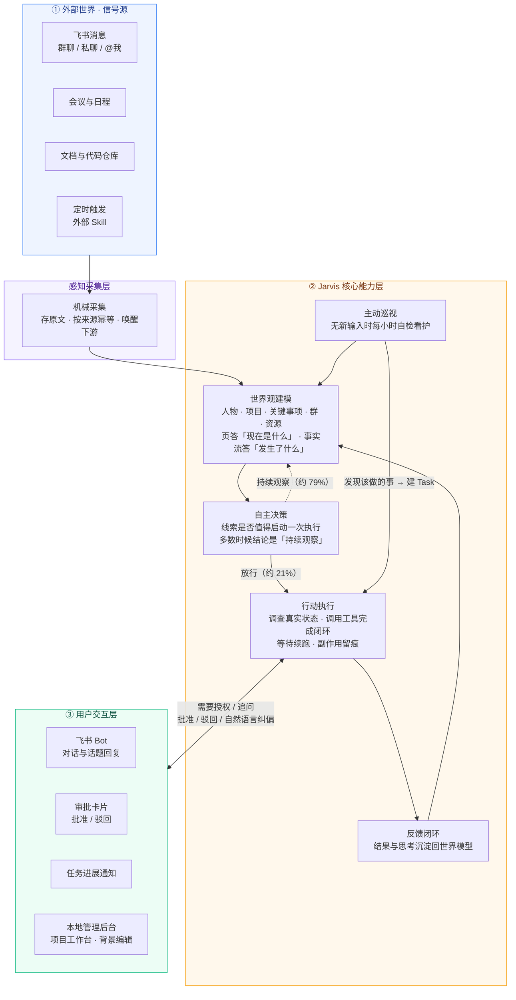

# 产品全景

Jarvis 是一个运行在本地 Mac 可信环境中的**主动式任务数字分身**，服务于单个 principal。它要解决的问题很具体：一个同时参与多个项目的研发负责人，每天被飞书群聊、私聊、会议、文档和代码仓库的信息淹没，而真正需要推进的事往往藏在自然语言讨论里，既不会变成工单，也不会有人专门下单。现有 Agent 的输入端都是「人给了一个目标」，Jarvis 的输入端却是「世界变了」——没有人下达指令，系统必须自己从纷杂变化中回答「现在该不该做点什么、做什么」。这一差别把它和长程任务控制面、团队级研发 Agent 区分开：后两者解决的是「怎么把人派的活跑完」，Jarvis 解决的是「目标从哪来」。

围绕这个定位，Jarvis 的内核收敛为四项能力。**对外部世界建模**：为本人、人物、项目、关键事项、群和资源六类实体各维护一页长期事实，整体读写、有硬上限、超限必须压缩；页答「现在是什么」，事实流答「发生了什么」，默认上下文只给计数、明细按需下钻。**决定做什么事**：采集层只做机械动作（存原文、幂等、唤醒下游），不写任何语义 `if`；准入层只调查到足以判断「值不值得启动一次执行」，证据够了立刻停，输出只有放行和持续观察两档——真实运行里约 79% 的线索停在持续观察，这不是漏做，而是主动式系统的常态。**把事做完**：执行 Agent 持有完整冻结背景和全部语义判断权，主动用工具查证真实状态、选择动作、处理等待与续跑，而不是照本宣科地执行上游计划。**沉淀**：执行结果和调查结论写回世界模型，闭环必须真的闭上——沉淀了但取不回来，等于没沉淀。

「主动式」不止体现在有输入时的克制，更体现在没有输入时的自检。一个独立的巡视 Agent 每小时醒来一轮，只带心跳块和工具目录，不推送任何世界状态，全靠自己读取世界模型、看护未闭环工作、核对非终态任务是否合理；调查后没有值得推进的事，就以 `NOTHING` 收尾，并且默认每轮最多新建一个任务。因为分身有代表权——它在群里说话代表的是 principal 本人——越界约束必须落在代码里而不是靠提示词自觉：审批不按动作类型分流（改注释和删库都是「改代码」），而由执行 Agent 看着即将产生的具体副作用自己决定是否停下来请示，人通过飞书卡片做不可歧义的批准或驳回，自然语言回复只作为补充信息、绝不构成授权；任何对外副作用一律原样留痕。两周真实运行中它主动请示了 61 次、被驳回 12 次——这个驳回数正是这道护栏不是装饰的证据。新来源的接入成本因此极低：一个新的 `source` 值加一份 Skill，通过统一线索入口投递事实，不需要新增任何 Go 专用流水线。
