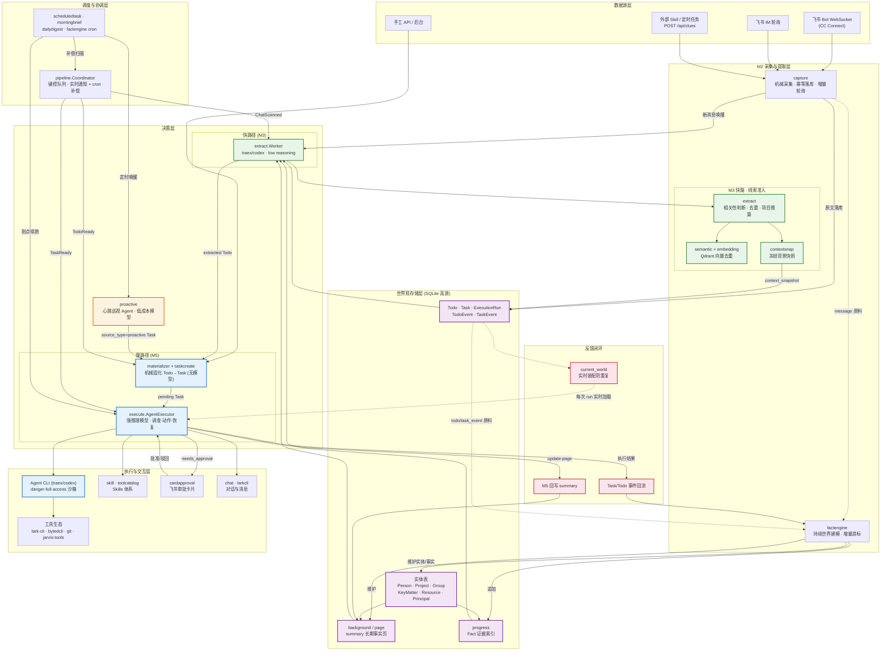

# 技术全景架构

Jarvis 是一个用 Go 编写的单用户主动式 AI Agent 系统。它的核心命题是：让 Agent 不再被动等待指令，而是持续感知外部世界、自主判断什么值得做、果断执行并从结果中学习。整个系统围绕三条数据流构建——**世界采集与建模**、**快慢双脑决策**、**执行与反馈闭环**——由一个统一的管道协调器串联，所有持久状态以 SQLite 为真源。

## 端到端数据流

外部事件通过三条路径进入系统：飞书 Bot 长连接（CC Connect）接收私聊和 @ 消息，飞书 IM 增量轮询补偿未被长连接覆盖的群聊，外部 Skill 和定时任务通过 `/api/clues` 投递原始线索。M2 采集层（`internal/capture`）只做机械工作——按 `message_id` 幂等落库原文、来源和资源引用，不解释语义、不判断价值。采集成功后通过 `ScanObserver` 接口唤醒下游 M3，同时各阶段的 cron 补偿扫描保证崩溃后不丢工作。

M3 线索初判层（`internal/extract`）是系统的"快脑"。它以 chat 为并发隔离单位，加载新消息和预组装的世界背景（Principal、群、项目、参与者、未闭环 Todo 摘要），调用 Agent CLI（默认 traex/codex，可选 model API）做一次轻量准入判断：这条线索是否与 principal 相关、是否已有人在做、是否需要行动。它负责精确去重、向量语义去重（Qdrant）、项目归属推算，并在做出结论的瞬间冻结一份 `context_snapshot`——包含完整背景和 `resolution` 推算轨迹。M3 的产出只有两种状态：`extracted`（存在需要行动的线索）或 `observing`（值得保留但暂不需要行动）。它不制定执行方案、不选择副作用、不做审批判断。

`extracted` 的 Todo 经过一个**无模型的机械固化步骤**（`internal/execute/materializer` + `internal/taskcreate`）创建 `pending` Task，复用 Todo ID/version 乐观锁保证幂等。这一步故意不引入任何语义判断——它只是把准入结论翻译成可执行单元。Task 携带完整的 `source_payload`（M3 的 extraction result）和冻结的 `background`（context_snapshot），下游不做投影或裁剪。

M5 深度决策与执行层（`internal/execute`）是系统的"慢脑"，使用强推理模型。执行 Agent 读取四类上下文：冻结的背景快照（准入时世界是什么样）、每次 run 开始时实时装配的 `current_world`（最近 20 个 Task 和 20 条未闭环 Todo 摘要，专门防重复）、人工 supplements、以及最近运行记录。M5 先核验线索是否因新事实已完成或失效，准入仍成立时才调查真实目标并执行。它通过沙箱化的 Agent CLI 调用 `lark-cli`、`bytedcli`、`git` 和 `jarvis-tools` 等工具完成真实工作。执行结果映射为五种 outcome：`completed`、`observing`、`waiting`（绑定定时任务到期续跑）、`needs_human`（principal 回复后续跑同一 Session）、`failed`。当模型判断即将产生需要审核的副作用时，Task 进入 `awaiting_approval`，通过飞书审批卡片（`internal/cardapproval`）等待人工确认，批准后进入 fresh apply run。

## 世界观存储与持续建模

世界观不是一张静态配置表，而是一个持续演进的活体模型。`internal/factengine` 运行在主关键路径之外，以独立游标消费 `message`、`todo_event`、`task_event` 三种原料流，将增量材料合成一个世界变化批次，只启动一次低成本 Agent 会话。Agent 通过通用 CRUD 工具直接维护六类实体——PrincipalProfile、Person、Project、Group、KeyMatter、ManagedResource——以及它们之间的关系和 Fact。Go 侧只负责材料投影、游标管理和粗粒度字符预算（80 万字符），不按来源或实体类型编排语义写入。

每个实体有一个 `summary` 页（`internal/background/page`）承载长期事实，整体读写、有 8000 字上限、写入时 CAS 防覆盖。实体间关系用页内 Markdown 引用表达，写入时校验目标存在。`summary` 回答"现在是什么"，`fact` 表回答"发生了什么"——fact 已重新定位为带主体标签的证据索引，每条必须携带指向原始材料的指针，需要细节时沿指针取原文。这种"写读同构"的设计让 Agent 写下认知时能预演读取者看到什么，从根本上抑制了知识重复和上下文膨胀。

## 心跳调度与主动巡视

`internal/proactive` 实现了系统的"心跳"——一个由独立 cron 唤醒的低成本 Agent（DeepSeek-V4-Pro），启动延迟 120 秒后运行第一轮，此后每小时一轮，同一时刻最多一轮。它不是另一条 M3，而是站在流水线上方观察全局：读取 Principal 职责与偏好、活跃项目、未闭环 Todo/Task、临期 KeyMatter，必要时通过工具多跳查证，发现跨多条证据才显现的机会、时间流逝带来的变化、或已失速的任务。只有同时满足"有具体价值、why now 可解释、下一步边界清楚、不存在等价事项"时才创建普通 Task，交由同一个强 M5 执行。`NOTHING` 是正常且常见的高质量结果。巡视 Agent 不直接执行外部动作，不发消息、不改代码——所有外部后果统一走 Task 执行链路和审批策略。

## 管道协调与可靠性

`internal/pipeline.Coordinator` 是整个系统的实时推进中枢。它接收持久化提交后的轻量通知，按键合并队列：M2 新消息唤醒 M3，M3 新 extracted Todo 唤醒机械固化，固化创建 Task 后唤醒 M5。内存队列只加速不承担真源——SQLite 的状态、水位线和乐观锁才是崩溃恢复的依据。各阶段 cron 扫描持久化状态，补偿漏通知和崩溃后的工作。M3 以 `chat_id` 为并发隔离键，同一 chat 串行、不同 chat 并行；耗时的 Agent/工具调查在数据库操作之外并行，SQLite 保持单连接串行短读写。

`internal/scheduledtask` 负责到点物化 Task 和恢复 waiting 状态的 Session；`internal/morningbrief` 生成晨间简报；`internal/dailydigest` 独立采集原始源生成日报。这些调度器共享同一套 cron 模式和 `SkipIfStillRunning` 语义，互不阻塞。

## 配置、提示词与工具生态

系统坚持"文件化配置是唯一正文真源"：系统 prompts 在 `conf/prompts/*.md` 注册于 `internal/textstore`，工作 rules 在 `conf/rules/m3.md` 和 `m5.md` 分阶段读取，Skills 在 `.agents/skills/` 定义并由 `internal/skill` 加载，共享记忆在 `data/shared-memory.md` 作为可信指令块注入。`internal/toolcatalog` 维护工具能力目录，提示词只约束角色与行为，不复制工具手册。`scripts/jarvis-tools` 是 Agent 的自查 CLI——提供实体查询、Todo/Task 下钻、页面读写、事实检索等子命令，输出严格 JSON，让 Agent 在需要细节时按需调查而非预加载全部上下文。`internal/workrule` 和 `internal/prompttemplate` 分别管理阶段规则和提示词模板版本，`internal/agentconfig` 支持按阶段独立配置模型、超时和推理强度。

## 技术架构图

图中绿色为快路径（M3 轻量准入），蓝色为慢路径（M5 深度执行），橙色为主动心跳巡视，紫色为世界观存储，粉色为反馈闭环。实线表示主数据流，虚线表示原料供给和运行时上下文加载。所有阶段的实时通知和崩溃恢复由 `pipeline.Coordinator` 统一协调，SQLite 状态和乐观锁是最终一致性的唯一保障。
