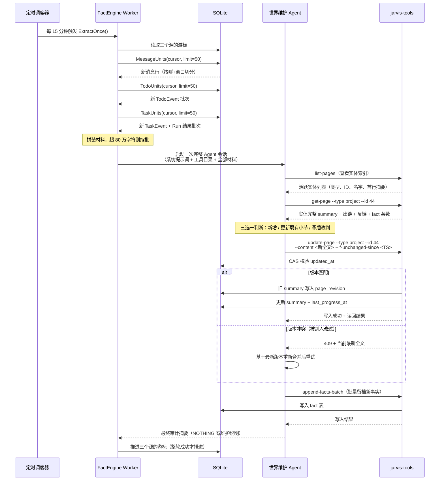
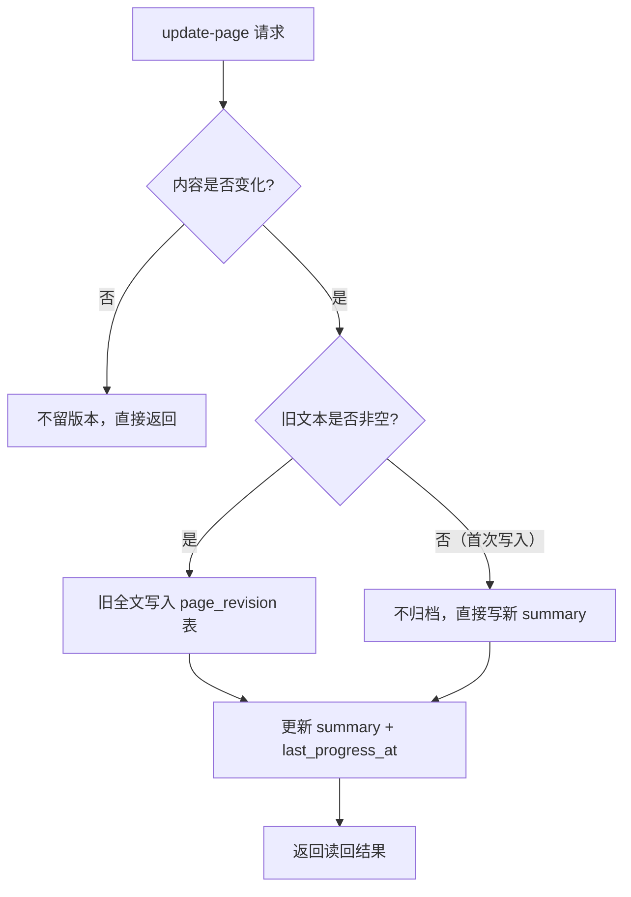

# 1.1 Jarvis 怎么维护自己的世界观

世界观不是一张建好就不动的静态资料库。Jarvis 的世界模型是一份**被持续增量更新的活认知**——每隔一段时间，系统会把这段时间新发生的事情收集起来，交给一个专门的"世界维护 Agent"，由它判断哪些事情值得记住、影响了哪些实体、该怎么改写这些实体当前的认知。这一节讲清楚这件事是怎么被驱动的、原材料从哪来、一条消息经历了哪些步骤才变成世界观的一部分，以及旧版本是怎么被归档的。

---

## 一、驱动机制：一个跑在关键路径之外的定时任务

世界观维护不是在每次收到消息时同步触发的。它由一个独立的定时任务驱动，配置在 `conf/config.yaml` 中：

```yaml
factengine:
  enabled: true
  schedule: "@every 15m"
  batch_limit: 50
  max_material_chars: 800000
  window_gap_minutes: 30
  window_max_messages: 40
```

每 15 分钟，`factengine` 调度器会唤醒一次世界维护 Agent。这个调度有三个关键设计：

1. **跑在关键路径之外。** M2 采集、M3 提取、M5 执行都不会等待世界观维护完成。消息该采集就采集，任务该执行就执行；世界观维护慢了或失败了，不影响主链路。
2. **轮次不重叠。** 调度器使用 `cron.SkipIfStillRunning`——如果上一轮还没跑完（比如材料特别多、Agent 思考了很久），下一轮会被跳过而不是并发启动。这保证了两个 Agent 不会同时争抢同一个实体的写入权。
3. **游标只在整轮成功后推进。** 每个数据源都有一个"读到哪了"的水位标记（存在 `fact_source_cursor` 表里）。只有当整轮 Agent 会话（读材料、判断、改页、追加事实）全部成功完成后，游标才会向前推进。如果中途失败，游标不动，下一轮会重新处理同一批材料。这意味着失败最多浪费一次重试，不会丢数据。

除了 factengine 这个主力维护者，系统里还有另外两个角色也会写世界观：
- **M5 执行器**：执行完一个 Task 后，如果掌握了某个实体的最新状态，可以直接更新该实体的 `summary`。
- **Proactive 巡视 Agent**（每小时一次）：在看护尚未闭环的工作时，如果发现明确、可验证的变化，也可以顺手维护内部世界模型。

这三者写同一个 `summary` 时通过乐观锁（CAS）保证不互相覆盖，而不是通过分布式锁串行化。

---

## 二、数据原料：三类增量事件

世界观维护 Agent 不直接连飞书、不扫代码仓库。它只读管道上游已经落盘到 SQLite 的三类事件流：

| 数据源 | 采集方式 | 游标表 | 材料形态 | 产生什么样的认知 |
|---|---|---|---|---|
| **消息（message）** | M2 capture 每 15 秒轮询飞书 API，拉取所有标记为 `related_group` 且 `include_in_memory` 的群和私聊新消息，落盘到 `message` 表 | `fact_source_cursor` 中 `source='message'`，记录最后消费的 `message.id` | 按群切分、再按 30 分钟静默间隔切成对话窗口，每窗口最多 40 条消息。包含发送者、时间、回复链、群绑定的项目等上下文 | 谁说了什么决定、承诺、进展、阻塞；项目状态变化；新出现的关键事项和资源链接 |
| **Todo 事件（todo_event）** | M3 从消息中提取出行动线索后，写入 `todo` 表并追加 `todo_event` 记录状态变化（created → extracted → materialized 等） | `source='todo'`，记录最后消费的 `todo_event.id` | 按自然日分批，包含事件本身（状态跃迁）+ Todo 当前结果（标题、状态、提取结论、项目推算轨迹） | M3 对消息的判断结果被系统确认了什么、线索是否被接纳、项目归属推算结论 |
| **Task 事件（task_event）** | M5 执行 Task 时，每次状态变化（pending → executing → done/failed 等）追加 `task_event`，并关联对应的 `execution_run` | `source='task'`，记录最后消费的 `task_event.id` | 按自然日分批，包含事件 + Task 当前结果 + 关联执行轮次的最终产物（summary、output、effects、错误信息） | 真正做完了什么、验证结果如何、什么被阻塞或失败了、执行中发现的新事实 |

需要特别注意消息源的一个启动策略：**首次运行从当前时刻开始，不回溯历史。** 消息源的 `StartAtPresent: true` 意味着服务第一次启动时，游标会直接播种到当前最大消息 ID，之前的历史消息不会被重新处理。这是一个有意的设计决策——避免服务刚上线就把几个月的历史消息全部灌给 Agent。

Todo 和 Task 事件源没有这个设置，它们从头开始消费，因为它们的事件流本身就是系统上线后才产生的。

---

## 三、更新流水线：从一条消息到世界观更新

下面是完整的数据流。我们用一个 sequence diagram 展示从定时触发到游标推进的全过程：



### 逐步拆解

#### 第 1 步：读游标，拉增量

Worker 从 `fact_source_cursor` 表读出三个源各自的 `last_id`，然后分别调用对应的 `Units` 函数：

- `MessageUnits`：查 `message` 表中 `id > cursor` 的行，JOIN `feishu_group` 和 `project` 表拿到群名、绑定项目等信息，然后按 `chat_id` 分组、按 30 分钟静默间隔切成对话窗口。
- `TodoUnits`：查 `todo_event` 表中 `id > cursor` 的行，预加载关联的 `Todo`，把事件和 Todo 当前结果组装成 JSON 材料，按自然日分批。
- `TaskUnits`：查 `task_event` 表中 `id > cursor` 的行，预加载关联的 `Task` 和 `ExecutionRun`，把事件、Task 结果、执行轮次产物组装成 JSON，按自然日分批。

每个材料单元（`SourceUnit`）都带四个部分：
- **Source**：材料来源（message / todo / task）
- **Context**：宽松背景描述（群名、时间窗口、已知关联项目、参与者列表及对应 person ID）
- **Known Entities**：Go 层能机械解析出的实体提示（群 ID、发送者对应的 person ID、绑定的项目 ID）——这是提示不是白名单，Agent 可以推断出更好的归属
- **Body**：材料正文（消息原文或 JSON 事件结果）

#### 第 2 步：粗粒度装箱

Worker 把所有材料单元拼成一个大 prompt。如果总字符数超过 `max_material_chars`（80 万字符），它会自动缩小每源的行数上限（从 50 减半到 25、再减半到 12……），直到装得下。装不下的源不会截断单条材料，而是整源留在游标后面等下一轮。这保证 Agent 收到的材料总是完整的单元，不会读到半条消息。

#### 第 3 步：Agent 判断影响哪些实体

Agent 拿到材料后，第一件事是调用 `list-pages` 看实体索引——所有活跃项目、关键人物、未闭环关键事项、活跃群和资源的列表，每行包含类型、ID、名字和 summary 首行（一句话说明"这是什么"）。Agent 据此判断本轮材料涉及哪些实体。

这一步不是靠关键词匹配。Agent 会阅读材料内容，结合已知实体的索引行，做出语义判断。比如一条消息说"网关 502 修好了"，Agent 会判断这影响"Agent Runtime"项目，即使消息里没有出现项目全称。

#### 第 4 步：读现有 Summary

确定受影响的实体后，Agent 逐个调用 `get-page --type <type> --id <id>` 读取该实体的**完整 summary**。返回内容包括：
- summary 全文
- 当前字符数和上限（8000 字符）
- `updated_at`（供后续 CAS 用）
- 出链列表（页内引用了哪些其他实体）
- 反链列表（哪些其他实体的页面引用了它）
- 该实体的 fact 条数（只给数字不给内容，需要细节时再下钻）

系统提示词明确要求：**不要只凭索引行或记忆中的旧印象改写**，必须读完整页。

#### 第 5 步：语义分流——三选一

对页里每一处相关内容，Agent 做三选一判断：

| 判断 | 动作 | 典型场景 |
|---|---|---|
| **新增事实** | 在页中新增一节或补充一句结论 | 群里第一次提到某个新项目方向；某个 Task 刚完成了一项交付 |
| **更新既有小节** | 改写已有内容使其反映最新状态 | 项目从"开发中"变为"灰度中"；某人的角色发生了变化 |
| **矛盾改判** | 改写该节，并在正文留一句"此前认为 X，某日改判为 Y" | 之前判断某个方案可行，新消息证明有阻塞；之前认定的负责人换了 |

第三种情况是设计重点：**不静默覆盖，也不把两条矛盾结论并列留给下一个读者猜。** Agent 必须明确写出改判轨迹，让读页面的人知道认知是怎么演变的。

如果材料没有带来新认知、已有世界状态已经准确，Agent 什么都不写，最终回复 `NOTHING`。这是正常结果——不是每一轮都有值得记录的变化。

#### 第 6 步：写回整页（带 CAS）

Agent 调用 `update-page` 写回整页，必须携带读取时拿到的 `updated_at`（通过 `--if-unchanged-since` 参数）。服务端按严格顺序执行：

1. **校验上限**：summary 不能超过 8000 Unicode 字符。超限时返回错误，指导 Agent 先压缩（合并旧明细为一句结论、把某节改成对 fact 的引用、或删除已不重要的内容），不能截断后半段充数。
2. **校验引用**：解析页内所有 Markdown 链接（如 `[Agent Runtime](project:45)`），逐个查目标实体是否存在。编造不存在的 ID 会导致整次写入被拒绝。
3. **CAS 比对**：将传入的 `if_unchanged_since` 与数据库当前 `updated_at` 做精确比较。不匹配返回 409，响应体带当前全文，让 Agent 基于最新版本重新合并后重试。
4. **归档旧版**：如果内容确实变了，先把旧全文写入 `page_revision` 表，再更新 `summary` 和 `last_progress_at`。内容没变则不留版本记录，也不推进 `last_progress_at`。

写后 Agent 必须立即读回（get-page）确认真实结果，不能只凭工具返回的成功信号。

#### 第 7 步：批量追加 Fact

改完页后，Agent 调用 `append-facts-batch` 把本轮新认知作为事实流留档。每条 Fact 需要表达已发生的决定、交付、进展、阻塞、承诺、方向变化或被推翻的前提，并带 `subject_type`、`subject_id`、`description`（一句话锚点）和 `occurred_at`（业务发生时间，不是写入时间）。

系统提示词强调：**改写 page 是必做动作，append fact 是附带。** 页回答"现在是什么"，事实流回答"发生了什么"。不能只追加事实却让页停留在过时结论上。

#### 第 8 步：推进游标

Agent 会话成功返回后，Worker 把三个源的游标推进到本轮消费的最大 ID，并记录 `last_occurred_at`（本轮材料中最晚的业务时间）。`AdvanceCursor` 使用 `MAX(last_id, excluded.last_id)` 语义，拒绝游标倒退——即使一轮的结果因某种原因延迟到达，也不会覆盖已经被后续轮次推进的水位。

---

## 四、语义分流的具体类型

虽然系统提示词把判断概括为"三选一"，但在实际维护中，Agent 处理的语义变化可以细分为以下几类。这些分类不体现在代码的枚举里——Go 层不解析 Agent 的语义意图——它们是提示词层面的行为约定：

| 更新类型 | 对 Summary 的操作 | 对 Fact 的操作 | 例子 |
|---|---|---|---|
| **新增认知** | 页中新增一节或一句结论 | 追加一条 Fact | 群里宣布启动一个新项目；某人刚入职加入团队 |
| **状态推进** | 改写状态描述 | 追加一条 Fact 记录变化 | 项目从"未上线"变为"已上线"；Task 从 doing 变为 done |
| **细节补充** | 在既有小节补充细节或链接 | 可能追加 Fact | 项目页补充仓库地址；某人补充了其负责的模块 |
| **矛盾改判** | 改写并留改判说明 | 追加 Fact 记录推翻事件 | 之前认为方案 A 可行，现在证明有阻塞需换方案 B |
| **关系建立** | 在页内添加指向其他实体的 Markdown 链接 | 可能追加 Fact | 项目页链接到新发现的关键事项；群页链接到绑定项目 |
| **压缩整合** | 合并旧明细为一句结论，把细节推给 Fact | 不新增 Fact（已有） | 一周的零散进展合并为"本周完成灰度"；过时细节删除 |
| **归档/失效** | 标记实体为非活跃或删除过期内容 | 追加 Fact 记录归档 | 项目标记为 archived；关键事项闭环 |
| **无变化** | 不写 | 不写 | 材料是日常闲聊、重复确认或无长期价值的信息 |

所有这些操作都走同一个 `update-page` 入口——系统不按类型分不同的写入 API。Agent 的价值正在于判断"这是什么类型的变化"和"该怎么改写"，而不是机械地执行预定义的字段更新。

---

## 五、版本归档：PageRevision 机制

### 为什么需要归档

Summary 页面按设计是**有损的**。它有 8000 字符上限，Agent 在压缩时会主动扔掉细节——把一周的零散对话合并成一句结论，把某个决策的完整讨论替换为一个 Fact 引用，删除已经不重要的历史背景。这些被扔掉的内容可能在未来某个时刻有价值（比如需要追溯"我们当时为什么这么决定"），所以需要一个地方保存被改写前的旧版。

这就是 `page_revision` 表的职责。

### 表结构

```go
type PageRevision struct {
    ID        uint64    // 自增主键
    PageType  string    // 实体类型：project / person / key_matter / group / resource / principal
    PageID    uint64    // 实体 ID
    OldText   string    // 改写前的完整 summary 全文（永不截断）
    ChangedAt time.Time // 改写时间
}
```

### 归档流程

在 `update-page` 的执行序列中，归档发生在 CAS 校验通过之后、写入新 summary 之前：



几个关键细节：

- **保存的是完整旧文本，不是 diff。** 因为 Summary 本身就是自然语言文档，diff 在语义层面没有意义；保存全文让任何历史版本都可以独立阅读。
- **内容不变不留版本。** 如果 Agent 提交的内容和当前完全一致（比如重放时重新写入了相同结论），不产生 revision 记录，也不推进 `last_progress_at`。
- **首次写入不归档。** 旧文本为空字符串时没有归档价值。
- **归档是同步事务的一部分。** 如果归档写入失败，整个更新失败，不会出现"新内容写了但旧版丢了"的情况。

### 为什么旧 Summary 不能当 Fact

这是一个经过实测踩坑得出的设计决策。早期版本中，页面修订记录曾经借住在 `fact` 表里，用 `source_kind='page_revision'` 标记。这导致了一个严重问题：

> 事实表的消费者（M3 上下文、前端时间线、Agent 下钻查询）需要在每个读取点都记得排除 `page_revision` 类型的记录。四个消费者里三个记得了，第四个忘了——而它正是世界维护 Agent 唯一的下钻入口。于是上一轮写进页面的结论以"事实"身份回到同一个 Agent 面前，成为支持同一结论的证据。如果判断错了，系统会自己给自己作证。

修复方式不是"在第四个读取点补上过滤"，而是让不合格的东西一开始就不进 `fact` 表。`page_revision` 被迁到独立小表，语义彻底分开：

| 载体 | 回答的问题 | 可变性 | 读者 |
|---|---|---|---|
| **Summary** | 现在是什么 | 就地改写，有上限 | M3、M5、Proactive 做决策时读 |
| **Fact** | 世界发生了什么 | 只追加，不可变 | 需要历史依据时按主体和时间下钻 |
| **PageRevision** | 我们自己的笔记是怎么被改的 | 只追加，不可变 | 认知变更审计（当前尚无 Agent 读取入口） |

旧版 Summary 是"我们曾经怎么认为"，不是"世界上发生了什么"。它不能作为证据使用，因为它本身就是二手认知——把它当 Fact 会让系统陷入自证循环。

### 怎么查历史版本

当前分支中，`page_revision` 表只在 `update-page` 时写入，尚未提供供 Agent 查询的 API 或 CLI 命令。可以通过直接查询数据库查看某个实体的认知演变历史：

```sql
SELECT changed_at, old_text
FROM page_revision
WHERE page_type = 'project' AND page_id = 44
ORDER BY changed_at DESC;
```

未来如果有真实的审计需求（比如"三周前我们对这个项目的判断是什么"），可以在工具层增加查询入口，但当前设计选择先确认有人真的会看，而不是提前构建。

---

## 六、两个具体例子

### 例子 1：项目从"没上线"到"上线了"

**场景**：2026-08-19 下午 3 点，"公会 Agent 基建"项目群（chat_id=`oc_abc123`，绑定 project ID=44）里，技术负责人唐建科发了一条消息：

> @节节 网关灰度跑完了，刚才全量切了，线上观察半小时没问题就算正式上线。你那边文档记得更新。

让我们跟着这条消息走完世界观更新的全流程。

**① M2 采集（15 秒内）**

capture 的 scan job 在下次轮询时从飞书拉到这条消息，写入 `message` 表：

```
id: 4609
message_id: om_xyz789
chat_id: oc_abc123
sender_open_id: ou_tang123
sender_name: 唐建科
content: "@节节 网关灰度跑完了，刚才全量切了，线上观察半小时没问题就算正式上线。你那边文档记得更新。"
create_time: 1755588000000  (2026-08-19 15:20 CST)
```

同时，capture 从消息中解析出 @提及、URL 等资源引用，写入 `resource` 表（如果有）。

**② M3 提取（10 分钟内或实时触发）**

pipeline coordinator 收到新消息通知，唤醒 M3 提取 Worker。M3 读取该群最近上下文和项目背景，判断这条消息包含一个行动线索（"文档记得更新"），创建一个 Todo 并固化背景快照。同时，M3 可能会更新对项目状态的判断——但 M3 的职责是提取线索，不是维护世界观；它不会直接改 project summary。

**③ FactEngine 世界维护（15 分钟整点）**

15:30，factengine 定时任务触发。Worker 读游标发现 `message` 源有新消息（id 从 4608 到 4609），`todo_event` 源也有新事件（M3 刚创建的 Todo），`task_event` 源本轮无新事件。

Worker 把消息 4609 按群和时间窗口组装成一个 `SourceUnit`：

```
MATERIAL_SOURCE: message
MATERIAL_KEY: oc_abc123:4609-4609
MATERIAL_OCCURRED_AT: 2026-08-19T15:20:00+08:00

CONTEXT:
conversation: chat_id=oc_abc123 name="公会 Agent 基建" mode=group
window: 2026-08-19T15:20:00+08:00 .. 2026-08-19T15:20:00+08:00
known_association: project/44 name="公会 Agent 基建"
participant: open_id=ou_tang123 person_id=12 name="唐建科" sender_type=user

KNOWN_ENTITIES:
[
  {"subject_type":"group","subject_id":7,"name":"公会 Agent 基建"},
  {"subject_type":"person","subject_id":12,"name":"唐建科"},
  {"subject_type":"project","subject_id":44,"name":"公会 Agent 基建"}
]

MATERIAL:
message_id=om_xyz789 time=2026-08-19T15:20:00+08:00 sender_open_id=ou_tang123 sender_name="唐建科" sender_type=user message_type=text render_ok=true
    @节节 网关灰度跑完了，刚才全量切了，线上观察半小时没问题就算正式上线。你那边文档记得更新。
```

Todo 事件也被组装成 JSON 材料，包含 Todo 的标题（"更新网关上线文档"）、状态（extracted）、提取结论和项目推算结果（project_id=44，method=group_bound，confidence=高）。

**④ Agent 阅读材料并判断**

Agent 启动会话，先调用 `list-pages` 看索引。在项目列表里看到：

```
project/44  公会 Agent 基建  公会 Agent 的基础设施层，含网关、调度和上下文管道。  422 chars  last_progress: 2026-08-11
```

Agent 判断这条消息直接影响 project:44，调用 `get-page --type project --id 44` 读取完整页。当前 summary 中有一节写着：

```markdown
## 当前状态
开发中，网关模块灰度中。全量上线时间待定，唐建科负责灰度推进。
```

**⑤ 语义分流判断**

Agent 判断这是**状态推进**：项目从"灰度中"变为"已全量切换，待观察确认"。它改写该节：

```markdown
## 当前状态
2026-08-19 网关全量切换上线，唐建科宣布线上观察半小时后正式确认。
此前 08-11 判断为"灰度中，全量时间待定"，今日因全量切流改判。
```

同时，Agent 注意到消息中"你那边文档记得更新"是对 principal 的行动要求，但这已经被 M3 提取为 Todo，不需要在项目页中重复记录。

**⑥ CAS 写入**

Agent 调用：

```
update-page --type project --id 44 \
  --content "<改写后的完整 summary>" \
  --if-unchanged-since "2026-08-11T10:30:00Z"
```

服务端校验：
- 字符数 480 < 8000 ✓
- 页内引用 `[唐建科](person:12)` 存在 ✓
- `updated_at` 匹配（没有其他人改过）✓
- 旧文本（422 字符）写入 `page_revision` 表
- 新 summary 写入 `project` 表，`last_progress_at` 更新为 2026-08-19T15:30:00Z

**⑦ 追加 Fact**

Agent 调用 `append-facts-batch`，写入一条 Fact：

```json
{
  "subject_type": "project",
  "subject_id": 44,
  "description": "唐建科 08-19 在项目群宣布网关全量切流，线上观察半小时后正式上线",
  "occurred_at": "2026-08-19T15:20:00+08:00",
  "source_kind": "message",
  "source_id": 4609
}
```

注意 `occurred_at` 是消息发送时间（15:20），不是 Fact 写入时间（15:30）。这样 Fact 在时间线上落在事情发生的那天，而不是系统处理它的那天。

**⑧ 游标推进，闭环完成**

Worker 收到 Agent 的成功回复（"更新了项目 44 的状态为已上线，追加 1 条事实"），把 message 游标从 4608 推进到 4609，todo 游标推进到最新事件 ID。

下一次 M3 或 M5 需要判断"公会 Agent 基建现在什么状态"时，读取 project:44 的 summary 就会直接看到"已全量上线"，不需要重新翻聊天记录。而如果有人想追溯"什么时候上的线、谁说的"，可以通过 Fact 的 source 指针回到原始消息。

---

### 例子 2：群里扔了一个项目地址

**场景**：2026-08-19 晚上 8 点，一个没有绑定任何项目的技术讨论群（chat_id=`oc_def456`，group ID=15）里，同事李明发了一条消息：

> 这个是 Agent Runtime 的仓库 https://code.byted.org/ai/agent-runtime ，你们后面读 loop 代码直接看这个

这个群没有绑定项目，Go 层的机械投影无法直接给出 project_id。Agent 需要经过提取和推断来判断这是哪个项目的地址。

**① M2 采集**

消息落盘。capture 的 `extractResourceRefs` 从消息中正则提取出 URL，识别为 code.byted.org 上的链接，写入 `resource` 表（type=link），并记录 `source_message_id`。

但此时还没有人知道这个 URL 对应哪个项目。

**② FactEngine 拿到材料**

Worker 查询消息时，因为群 15 没有绑定项目，JOIN project 表返回空。`SourceUnit` 的 Context 里没有 `known_association`，Known Entities 里只有群和发送者（如果李明在 person 表里有记录）：

```
MATERIAL_SOURCE: message
MATERIAL_KEY: oc_def456:4712-4712
MATERIAL_OCCURRED_AT: 2026-08-19T20:00:00+08:00

CONTEXT:
conversation: chat_id=oc_def456 name="技术闲聊" mode=group
window: 2026-08-19T20:00:00+08:00 .. 2026-08-19T20:00:00+08:00
participant: open_id=ou_li456 person_id=28 name="李明" sender_type=user

KNOWN_ENTITIES:
[
  {"subject_type":"group","subject_id":15,"name":"技术闲聊"},
  {"subject_type":"person","subject_id":28,"name":"李明"}
]

MATERIAL:
message_id=om_def789 time=2026-08-19T20:00:00+08:00 sender_open_id=ou_li456 sender_name="李明" sender_type=user message_type=text render_ok=true
    这个是 Agent Runtime 的仓库 https://code.byted.org/ai/agent-runtime ，你们后面读 loop 代码直接看这个
```

**③ Agent 推断项目归属**

Agent 阅读材料后，需要判断"Agent Runtime"对应系统里的哪个项目。它有几条推理路径：

1. **查实体索引**：调用 `list-pages --type project`，在项目列表中发现：
   ```
   project/45  Agent Runtime  Agent 执行循环与工具调度运行时。  77 chars
   ```
   名字精确匹配"Agent Runtime"。

2. **读项目页确认**：调用 `get-page --type project --id 45`，读取当前 summary。页面可能已经写了项目的基本信息，但还没有仓库地址（因为设计文档明确说本轮先不填 repos，让 M3/M5 自行推算）。

3. **交叉验证**：Agent 注意到消息中提到"读 loop 代码"，而 project:45 的索引行是"Agent 执行循环与工具调度运行时"——"loop 代码"和"执行循环"语义吻合。URL 路径 `/ai/agent-runtime` 也与项目名一致。

4. **查群是否已绑定**：Agent 可以调用 `get-group --chat-id oc_def456` 确认群 15 的 `project_id` 确实为空。

综合判断：这条消息中的仓库地址属于 project:45（Agent Runtime）。

**④ 决定写入什么**

Agent 做以下判断：

- **项目页需要更新**：project:45 的 summary 应该补充仓库地址信息，方便后续 M5 执行"读 agent loop 代码"类任务时定位仓库。
- **群页需要更新吗？** 群 15 是"技术闲聊"群，不是项目专属群。仓库地址是在这个群里提到的，但不意味着这个群绑定了 Agent Runtime 项目。Agent 判断不在群 summary 中建立项目绑定关系（那是结构化外键，需要管理员在 UI 上操作），但可以在群 summary 中记录"群内曾讨论过 Agent Runtime 仓库地址"——如果这有长期价值的话。实际上这种一次性分享可能不值得写进群页。
- **是否需要创建 Resource？** capture 已经自动把 URL 存入了 `resource` 表（type=link）。Agent 可以判断是否需要创建一个人工维护的 `managed_resource` 记录来关联到 project:45，或者直接在项目 summary 中引用这个 URL。
- **是否需要 Fact？** 这条消息本身是一个信息分享，不是状态变化或决定。但"Agent Runtime 的仓库地址是 X"是一个值得记录的事实——不过它更适合写在项目 summary 里，而不是单独一条 Fact。Agent 可能选择不追加 Fact，因为仓库地址写入 summary 后，下钻 Fact 不会增加额外信息。

**⑤ 写入项目页**

Agent 改写 project:45 的 summary，在适当位置补充仓库信息：

```markdown
Agent Runtime：Agent 执行循环与工具调度运行时。

## 仓库
- 主仓库：https://code.byted.org/ai/agent-runtime （李明 08-19 在技术闲聊群分享）

## 当前状态
（...原有内容...）
```

调用 `update-page --type project --id 45`，携带读取时的 `updated_at`。服务端通过 CAS 校验，旧版归档到 `page_revision`，新 summary 写入。

**⑥ 这个信息怎么在未来发挥作用**

下次有人在群里说"去读一下 agent runtime 的 agent loop 代码"时：

1. M3 提取线索，推算项目归属。它可以通过 `jarvis-tools get-project --id 45` 或读取项目 summary 看到仓库地址。
2. M3 的 `resolution` 字段会记录推算轨迹，例如：
   ```json
   {
     "method": "project_hint",
     "project_id": 45,
     "project_name": "Agent Runtime",
     "repos_hint": "https://code.byted.org/ai/agent-runtime",
     "confidence": 0.9,
     "basis": "消息提到 agent runtime + agent loop；项目页已记录仓库地址"
   }
   ```
3. M5 执行 Task 时，从项目 summary 或 Todo 的 resolution 中拿到仓库地址，直接 clone 或定位代码，不需要再问人或搜索。

**⑦ 如果推断不确定怎么办？**

如果消息只说了"这个仓库你们看看"而没有提到项目名，Agent 可能无法确定归属。此时它有几个选择：

- **不写入**：材料不足，保持不变，不为补证据展开外部调查（系统提示词明确禁止原则上查询外部系统补证据）。
- **写入一个关键事项**：如果这个信息本身值得跟踪但归属不明，可以创建一个 `key_matter` 记录，在 summary 中描述"李明分享了一个仓库地址，待确认归属"。
- **追加 Fact 到群实体**：把"群里分享了一个仓库链接"作为关于群 15 的 Fact 记录，等未来有更多信息时再建立关联。

Agent 不会编造 project_id 强行关联——引用校验会拒绝不存在的 ID，但更重要的是，系统提示词要求材料不足时保持不变，而不是用猜测填充世界观。

---

## 小结

Jarvis 世界观维护的核心设计可以概括为三句话：

1. **定时批量，不在关键路径上。** 一个独立的 cron 每 15 分钟唤醒一次 Agent，读三类增量事件流，失败不推进游标，不重叠执行。
2. **页答现状，Fact 答历史，Revision 答认知演变。** 三层各有明确职责和不同的可变性——Summary 就地改写、Fact 只追加、PageRevision 只归档——不能混用。
3. **Agent 做语义判断，Go 做机械边界。** Go 负责游标、开窗、装箱、CAS、上限校验、引用校验这些确定性工作；"这影响了哪个实体""该新增还是改判""什么值得记住"全部交给 Agent 的语义理解，不提前用枚举和规则固化。

这套机制让世界观不是一张建好就不动的静态表，而是一份随着每个群消息、每次 Task 执行、每个状态变化持续生长和自我修正的活文档。
