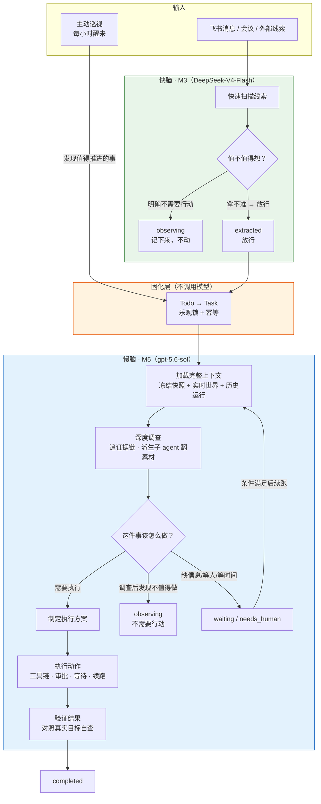

## 快慢脑：为什么 Agent 不能每次都深度思考

丹尼尔·卡尼曼在《思考，快与慢》里把人的认知分成两个系统。System 1 是直觉：快速、自动、不费脑力，你看到一张愤怒的脸立刻知道他在生气，不需要推理。System 2 是深度思考：缓慢、费力、需要主动调动，你算 17 × 24 的时候用的就是它。

这个二分法不是学术摆设。人不可能对每件事都启动 System 2——一天里你接收的绝大多信息都是 System 1 处理掉的：这句闲聊无关紧要、那个群在讨论已经有人负责的事、这条消息只是一个状态播报。只有 System 1 判断「这件事值得想」的时候，System 2 才会被调动起来。

Jarvis 的决策链路是同一个结构。

### 快脑：M3 线索初判

M3 是 Jarvis 的 System 1。它面对的输入是采集层存下来的原始消息——两周里有 4932 条。它的任务不是理解每条消息的全部含义，而是快速回答一个问题：**这件事值不值得启动一次深度执行？**

它用的是 `DeepSeek-V4-Flash`，一个轻量快速的模型。它的提示词开篇就把职责划得极硬：

> 你只负责根据提示词已经提供的消息和基础世界信息，快速识别值得处理或值得记住的线索，并判断它是否值得启动一次 M5 执行；你不负责调查和执行。

快脑有三个鲜明的特征。

**第一，高召回率，宁可多判不漏。** M3 的输出只有两档：`extracted`（放行给慢脑）和 `observing`（记下来但不动）。提示词里有一条兜底规则写得非常直白：

> 拿不准就写 extracted。判断不了属于哪一边时，一律 extracted 交给 M5 调查，不要写 observing。M5 有工具和上下文，它比你更有条件判断值不值得做。

这不是和稀泥，而是刻意的不对称设计。快脑误判一个不重要的东西为重要，代价是慢脑多花一次调查；快脑漏掉一个真正重要的东西，代价是事情没人管。前者可恢复，后者不可恢复。

**第二，调查边界极窄。** M3 默认不调用工具。它不查飞书历史、不读代码、不看 commit、不翻长文档。提示词原文：

> 默认不调用工具，不读取共享记忆，不查询飞书历史、日志、代码、commit、MR、长文档或外部系统。只有现有信息相互矛盾，而且一次简单只读查询就能决定"是否重复"或"是否需要 principal/Jarvis 介入"时，才做一次最短查询；否则保留不确定性并交给 M5。

> 一旦能够选择 extracted、observing 或不输出，立即停止调查并结束。M3 不查日志、不定位代码、不制定执行方案、不执行动作、不判断审批。

快脑的判断力来自它拿到的上下文——principal 的背景、所属项目、群信息、参与者、已有 Todo 和近期 Task 的摘要——而不是来自主动调查。它是一个「看一眼就知道大概」的系统，不是一个「查清楚再说话」的系统。

**第三，输出是线索，不是方案。** M3 产出的 Todo 包含一个开放的 `payload` 字段，自然语言写的准入简报：相关性、未闭环状态、已核验证据、准入依据、不确定性。它不生成执行计划，不指定动作，不判断审批。固化层把 Todo 机械地变成 Task 的过程中不调用任何模型——没有「二次确认」，没有「再判断一下」。判断权完整地移交给下一个阶段。

### 慢脑：M5 深度决策

M5 是 Jarvis 的 System 2。它用的是 `gpt-5.6-sol`，当前最强的模型。它面对的输入不是一条消息，而是一个被冻结的完整世界快照：线索来源时的上下文、M3 的完整抽取结果、实时装配的当前世界状态（最近 20 个 Task 和 20 条未闭环 Todo）、历史执行记录、principal 在执行期追加的指示。

慢脑的职责和快脑完全不同。它要回答的不是「值不值得想」，而是：

- 这件事的真实目标到底是什么？线索里说的可能只是表象。
- 当前事实是什么？需要沿消息、线程、文档、代码、数据表追证据链。
- 怎么做？选择什么动作、什么顺序、什么工具。
- 做到什么程度算完成？什么只是中间步骤（比如申请权限不等于事情做完）。
- 哪些动作需要审批？哪些可以直接执行？
- 什么时候该停？完成了、该等待、该问人、还是调查后发现根本不值得做。

M5 的提示词开篇就把这个角色定义清楚了：

> 上游只做了准入初筛，理解真实目标、调查事实、选择动作、执行并验证结果都由你负责：你的职责不是照抄上游计划，而是站在我的角度把值得做的事推进到有结果。

它有完整的工具链：`lark-cli` 读写飞书、`bytedcli` 查内部系统、`git` 操作代码、`jarvis-tools` 管理任务和世界模型。它可以派生子 agent 去翻大量素材（拉整段群聊、扫多篇文档、遍历 git log），只把结论收回来，避免原始材料稀释自己的判断。它可以挂起自己等一个时间点、停下来等人回复、或者在执行副作用前提交审批提案。

它的输出也丰富得多：`completed`、`observing`、`waiting`、`needs_human`、`failed`，加上可选的审批提案、对外消息、副作用台账和跨轮次进展总结。

### 两阶段过滤的设计哲学

快脑和慢脑之间的分工不是「一个粗筛一个精筛」那么简单。它们回答的是两个本质不同的问题：

```
快脑（M3）：这件事值不值得想？
慢脑（M5）：这件事该怎么做？
```

这个区分有一个重要的推论：**慢脑可以推翻快脑的判断，但快脑不能替慢脑做决定。**

M5 调查之后完全可以得出结论：这件事虽然被放行了，但其实已经有人做了、前提不成立、或者产不出价值，然后以 `observing` 收尾。402 个任务里有 107 个是这么结束的，占 27%。这不是快脑的失败，而是两阶段设计的正常运转——快脑负责不漏，慢脑负责不瞎做。

反过来，M3 绝对不做的事是：制定执行方案、判断具体动作的风险、决定审批策略。这些判断需要完整上下文和深度推理，交给一个只看了几条消息的轻量模型做，质量天花板会被写死在准入层。

两阶段之间还有一个不调用模型的固化步骤。放行的 Todo 通过乐观锁和幂等键机械地变成 Task，不做任何语义判断。这一步刻意没有包装成「确认闸门」——因为中间每加一道只看得到部分信息却有否决权的环节，产生的错误都最难排查。

### 为什么这样设计有效

**成本控制。** 4932 条消息经过快脑过滤后只有 253 条进入慢脑，放行率 21%。如果每条消息都用最强模型做深度推理，成本是现在的近 20 倍，而且绝大多数推理是浪费——79% 的线索正确处理方式就是「记下来，不动」。快脑用 `DeepSeek-V4-Flash` 处理全部输入，慢脑的 `gpt-5.6-sol` 只花在真正值得想的事情上。

**延迟控制。** M3 是消息到达后近乎实时触发的，轻量模型响应快，不会让线索堆积。M5 是异步执行的，可以花几分钟甚至更长时间调查和执行，不阻塞后续消息的准入判断。两条链路在 pipeline 里有独立的 worker 池和并发控制。

**噪音过滤。** 主动式 Agent 最大的风险不是做不完事，而是被迫为每个输入制造一件工作。快脑的 `observing` 档位和慢脑的 `observing` 终态给了系统两个合法的「不动」出口。79% 的线索停在快脑的「持续观察」，27% 进入慢脑的任务最终也以「不需要行动」收尾——这些不是漏做，是系统正确地识别了无事可做。

**决策质量。** 判断质量取决于判断力和上下文的匹配度。M3 的判断力有限，但它只需要做二元准入判断，而且有「拿不准就放行」的兜底；M5 的判断力最强，它拿到的是完整的冻结快照加上实时世界状态，做的是需要深度推理的复杂决策。每个阶段拿到的上下文和被要求做出的判断是匹配的。

主动巡视 Agent 是这个结构的第三个参与者。它每小时醒来，用 `DeepSeek-V4-Pro`（介于快脑和慢脑之间的模型）扫描世界模型，看护未闭环事项、发现跨线索的机会。但它同样不直接执行——发现值得做的事就创建普通 Task，交给慢脑。它的硬边界和 M3 一样：不发消息、不改代码、不做外部副作用。不是自己的判断层级，就不越权。

### 决策流程



这张图里最值得注意的不是流程有多复杂，而是它有多克制。快脑不调查、不方案、不执行；固化层不判断、不确认、不二次筛选；慢脑不重复准入的价值判断，拿到放行的线索直接进入深度调查。每个阶段只做自己这一层该做的事，然后把判断权完整地交给下一层。

人的认知也是这样工作的：你走在路上不会对每个声音都启动深度思考，System 1 先过滤，只有异常的声音才会让你停下来转头看。但一旦你决定要看清楚，System 2 会调动全部注意力去识别、判断、决定下一步。Jarvis 的快慢脑不是对人脑的粗糙模仿，而是把同一个认知分工原理变成了可以运行的系统。
