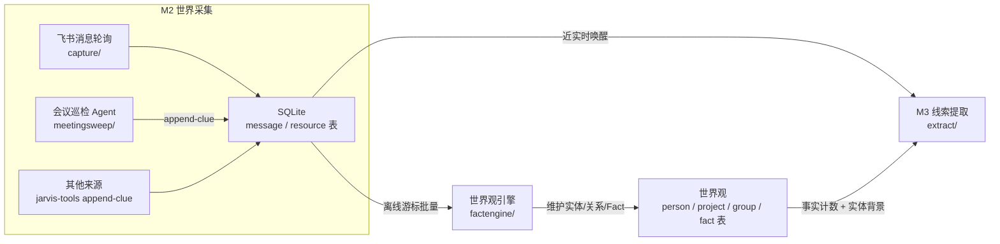
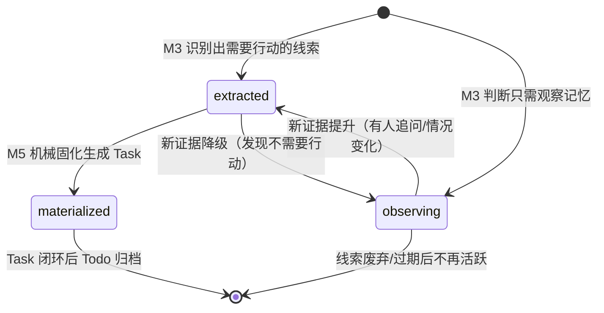
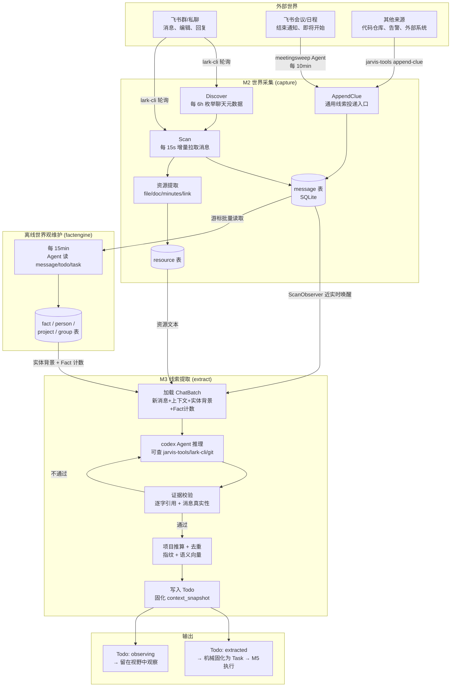

# M2 世界采集 → M3 线索生成 Todo

在快慢脑的分工里，慢脑负责"想清楚"，而流水线的第一步是让 Agent **看见世界**。M2 就是 Jarvis 的感官层——它不判断、不分类、不做结论，只负责把外部世界发生的事原样采集进来，写成中立证据；M3 则在证据之上做第一次轻量判断：哪些变化"可能需要行动"，把它们固化成待确认项（Todo）。

---

## 一、M2：世界采集

M2 的核心原则是**只做机械采集，不做语义判断**。它把原始事实（消息全文、会议元数据、定时巡检结果等）落进 SQLite，不按长度截断、不用字符串匹配猜语义、不为某个来源开专用链路。所有来源走同一套协议：存进 `message` 表 → 按幂等键去重 → 推进水位线 → 唤醒 M3。

### 1.1 数据源全景

Jarvis 当前接入的世界数据来源分为两类：**飞书会话直采**和**通用线索投递**。

| 数据源 | 触发方式 | 采集频率/时机 | 采集内容 | 代码入口 |
|--------|---------|-------------|---------|---------|
| 飞书群消息（group/topic） | 定时轮询 | 每 15 秒扫描所有 related 群 | 群内新消息（含话题回复、编辑后的消息） | `capture/service.go: ScanChat` |
| 飞书私聊（p2p，内部真人） | 定时轮询 | 每 15 秒；discover 自动开启最活跃前 N 个 | 一对一聊天消息 | `capture/service.go: persistDiscoveredChats` |
| 群/话题发现 | 定时轮询 | 每 6 小时全量枚举 | 聊天元数据（名称、公告、群主、外部标记） | `capture/service.go: DiscoverChats` |
| Principal 活跃群发现 | 定时轮询 | 随 scan 一起执行 | 搜索"我"在哪些群发过言，自动纳入监听 | `capture/principal_activity.go` |
| 会议结束/即将开始 | Agent 定时巡检 | 每 10 分钟 | 最近结束的会议 + 未来 24 小时待参加会议，逐场投递线索 | `meetingsweep/worker.go` |
| 消息中的资源引用 | 采集时顺带提取 | 随消息落库 | 文件 key、图片 key、文档链接、妙记链接、URL | `capture/resources.go` |
| 每日个人/群总结 | 定时任务 | 每天 19:00 | 当天消息 + git log，生成 Markdown 总结 | `dailydigest/service.go` |
| 晨间作战简报 | 定时任务 | 工作日 08:30 | 跨源取证后生成当日优先级简报 | `morningbrief/worker.go` |
| 任意外部事实（扩展入口） | Agent 主动调用 | 随时 | 通过 `jarvis-tools append-clue` 投递结构化线索 | `capture/clue.go: AppendClue` |

### 1.2 两种采集模式

#### 实时事件驱动（近实时轮询）

飞书没有向 Jarvis 推送消息的 webhook，因此 M2 采用**高频轮询 + 水位线增量**的方式模拟实时：

1. **Discover（发现）**：每 6 小时调一次 `lark-cli im +chat-list`，枚举 Principal 可见的全部聊天，把元数据 upsert 进 `feishu_group` 表。新发现的群从"当前时刻"起步，不回溯历史。内部真人私聊按活跃度自动开启监听（上限可配，默认 30 个），服务号/机器人私聊排除。

2. **Scan（扫描）**：每 15 秒遍历所有 `related_group=true` 的聊天，按各自的 `checkpoint.high_water_create_time` 增量拉取新消息。群和话题用 `lark-cli im +messages-search` 按消息创建时间搜索（能捕获旧话题下的新回复），私聊用 `+chat-messages-list` 按时间正序翻页。

3. **消息落库**：每条消息以 `message_id` 为幂等键 upsert。已编辑消息在 `update_time` 更新时覆盖内容。群系统消息（入退群、设置变更等）用占位 sender `__system__` 保留，不丢弃。

4. **资源提取**：落库消息时，正则扫描内容中的 `file_key`、`img_key`、文档 URL（`/docx/`、`/wiki/`）、妙记 URL（`/minutes/`）和普通链接，写入 `resource` 表，但**不下载内容**——下载和解读是下游的事。

5. **唤醒 M3**：一个聊天的消息和 checkpoint 提交成功后，如果有新消息插入，M2 通过 `ScanObserver` 接口（实现在 `pipeline/coordinator.go`）立即把该 chatID 推入 M3 队列，实现近实时处理。

#### 定时巡检（线索投递）

会议、日程这类事件不会产生聊天消息，没有东西能唤醒 M3。Jarvis 的做法是写一个**轻量 Agent 定时巡检**，让它自己去外部世界找事实，再通过统一入口投递成线索：

- **会议清扫（meetingsweep）**：每 10 分钟跑一轮 codex Agent。它读取 Skill 指示，用 `lark-cli` 搜索最近结束的会议和未来 24 小时的日程，逐场调用 `jarvis-tools append-clue --source feishu_meeting` 投递客观线索（会议标题、时间、参会人、妙记 token）。它**不做分析、不写总结、不判断要不要行动**——那是 M3/M5 的工作。

- **通用线索入口**：`POST /api/clues` 是所有非消息来源的唯一入口。任何 Agent（包括 M5 执行期自己发现的新事实）都可以调用 `jarvis-tools append-clue`，传入 `source`（如 `feishu_meeting`、`code_repo`、`custom_alert`）、`external_id`（幂等键）、`title`、`content`、`occurred_at`。M2 收到后做三件机械动作：
  1. 创建或复用一个 `chat_mode='clue'` 的虚拟频道 `clue:<source>`；
  2. 把线索包装成一条 `sender_type='system'` 的特殊消息存入 `message` 表；
  3. 立即唤醒 M3，和普通消息走同一条提取链路。

这种设计意味着**接入新数据源不需要写新的 Go 模块**——只需一个新的 `source` 值加一份 Skill 提示词。

### 1.3 采集后的数据走向：原始证据 → 世界观

消息和线索落库后，有两条并行的下游路径：



**关键路径（M2 → M3）**：消息落库后立即唤醒 M3，M3 只看这段时间窗口内的新消息，延迟在秒级。

**离线世界观维护（factengine）**：每 15 分钟跑一轮独立的 Agent 会话，从 `message`、`todo`、`task` 三张表按游标读取新增材料，让 Agent 通过 Jarvis 工具自主决定是否更新人物档案、项目状态、群关系和长期 Fact。它跑在关键路径之外——一轮失败只损失一次重试，不阻塞采集和执行。M3 提取时会查询世界观里的 Fact 计数（"这个群今天有几条事实""近 7 天有几条"）和实体背景（principal 是谁、leader 是谁、群绑定了哪个项目），帮助模型做归属判断。

---

## 二、M3：线索生成 Todo

M3 是决策流水线的第一道筛选。它的输入是 M2 采集的原始对话和线索，输出是一组结构化的 **Todo（待确认项）**。Todo 不是 Task——它不代表"这件事一定要做"，而是"这件事**可能**需要关注，值得进入下一步确认"。

### 2.1 什么是"线索"

在 Jarvis 的术语里，**线索（Candidate）** 是 M3 从一段对话中识别出的"可能需要行动"的信号。它必须满足三个硬条件：

1. **有原文证据**：每条线索必须引用至少一条本轮的 `[new]` 消息，且 `source_quote` 必须是消息原文的逐字连续片段（exact contiguous substring），不得改写、拼接或凭印象编造。引用消息 ID 必须真实存在于该聊天中。
2. **有明确作用对象（target）**：target 是去重指纹的组成部分，描述"这件事是关于什么的"。空 target 的线索没有稳定身份，会被拒绝。
3. **有动作类型（action_type）**：标识线索的性质，如 `investigate`（排查问题）、`code_change`（代码变更）、`schedule_meeting`（安排会议）、`reply_message`（回复消息）、`summary_post`（发总结）、`doc_write`（写文档）、`notify_principal`（通知本人）等。这是一个**开放集合**，模型可以输出新的 snake_case 类型，下游不枚举。

一条线索的完整结构（代码中对应 `extract.Candidate`）：

```json
{
  "action_type": "investigate",
  "status": "extracted",
  "title": "排查 agent-runtime 网关偶发 502",
  "target": "agent-runtime 网关 502",
  "project_hint": "agent-runtime",
  "source_message_ids": ["om_x1"],
  "source_quote": "今天线上又出现 502 了，麻烦帮忙看一下",
  "payload": "张伟在群里直接点名让我排查，目前只知道偶发、未定位到具体服务……"
}
```

### 2.2 M3 的初判过程

M3 的判断**不是规则引擎，而是 Agent 推理**。codex 作为完整 Agent 运行在本地可信环境中（`danger-full-access` + 联网），它的工作流程是：

1. **加载上下文**：Go 层从 SQLite 组装一个 `ChatBatch`，包含：
   - 本轮新消息（`[new]` 标记）+ 前 20 条上下文消息（120 分钟窗口内）
   - 群信息（名称、公告、绑定项目）和参与者档案（角色、是否 leader、人物摘要）
   - Principal 背景（我是谁、我的部门、我的直属 leader 是谁）
   - 已绑定项目详情 + 其他项目精简列表（供归属参考）
   - 相关资源（文件、文档、妙记及其提取文本）
   - 世界观 Fact 计数（今日/近 7 天该群和项目的事实条数）
   - 未闭环 Todo 列表和最近有进展的 Task（防重复）

2. **Agent 推理与工具调用**：codex 阅读对话后，可以用 `jarvis-tools` 查询更详细的信息（项目列表、群详情、人物关系、principal 背景、历史消息），也可以直接跑 `lark-cli`、`bytedcli`、`git` 查飞书侧和代码侧信息。它自己决定需不需要查、查什么——Go 层不预塞结果，也不限制查询路径。

3. **输出候选线索**：Agent 的最后一条消息必须是一个严格的 JSON 对象，包含零到多条 Candidate。如果对话里没有值得留下的信号，输出 `{"candidates": []}`。

4. **证据校验与自纠正**：Go 层对每条候选做硬校验：
   - 引用的消息 ID 是否真实存在；
   - 是否至少引用了一条本轮 `[new]` 消息；
   - `source_quote` 是否能在被引用的新消息中逐字找到（做了弯引号折叠和空白归一化）。

   校验失败时，如果是模型能自己改对的问题（引用改写、ID 拼造、没有新证据），系统会把中文反馈和被引用消息的原文追加到提示词后，让模型**重新抽取一次**（最多 1 次重试）。传输错误、超时等不可自纠正问题则 fail-fast。

5. **项目推算**：每条线索的 `project_id` 按优先级确定——群绑定项目最高优先，其次解析模型输出的 `project_hint`（按项目 code/name 精确匹配）。推算轨迹写入 `resolution` 字段（方法、项目 ID、置信度、依据），让人和执行者都能看到"为什么判成这个项目"。

6. **去重**：去重分两层：
   - **精确去重**：指纹 = SHA256(`action_type` + `project_id` + 归一化 `target`)。指纹相同的线索合并到同一条 Todo，累加证据消息、更新最后证据时间。
   - **语义去重**：把候选的语义文本（action_type + title + payload + target）向量化后存入 Qdrant，与同项目下的活跃 Todo 做相似度检索。超过阈值（默认 0.85）的候选合并到已有 Todo，不新建。

### 2.3 Todo 是什么：待确认项，不是任务

Todo 的定位是**"这件事可能需要关注"的记录**，而不是"这件事已经确定要执行"的任务。它有两个 M3 可写的状态：

| 状态 | 含义 | 后续 |
|------|------|------|
| `extracted` | 需要行动——有人交办了、有问题要排查、有承诺要兑现 | 进入机械固化，生成 Task 交给 M5 执行 |
| `observing` | 值得记住但暂不需要行动——别人负责的事、时间约束、背景信息 | 留在 Todo 表中可见，不生成 Task；新证据可以把它提升为 `extracted` |

这个区分至关重要：M3 不替 Principal 决定"做不做"，它只决定"值不值得进入视野"。`observing` 的线索不会产生执行动作，但会参与未来的上下文和去重——当同一件事出现新证据时（比如"数据集周五冻结"之后有人问"你样本交了吗"），它可以被重新评估并提升为 `extracted`。

每条 Todo 在创建时还会固化两份关键数据：

- **`context_snapshot`（背景快照）**：生成 Todo 时的完整上下文冻结——principal 背景、群信息（含公告）、项目信息、交办人、引用消息原文、相关记忆。这份快照随 Todo 落库，之后机械固化成 Task 时直接复用，保证全链路同一份上下文，不重复查库。
- **`extraction_result`（抽取结论原文）**：M3 吐出的完整 Candidate JSON，随 Task 固化，供 M5 执行时整块复用。

### 2.4 Todo 的生命周期



- **创建**：M3 从新消息中识别出线索，通过证据校验、项目推算和去重后写入 `todo` 表，同时记录 `todo_event` 事件流（actor=m3）。
- **证据更新**：同一条线索在后续对话中再次出现时，Todo 的 `revision` 递增、证据消息合并、`last_evidence_at` 更新、背景快照刷新。状态可以在 `extracted` 和 `observing` 之间翻转——但一旦已 `materialized`（生成了 Task），M3 不再回改状态，避免重复创建 Task。
- **升级为 Task**：状态为 `extracted` 的 Todo 由 M5 的 materializer 机械固化成 Task，Todo 状态变为 `materialized`。这一步**不调用模型**，直接读取 Todo 的 `context_snapshot` 和 `extraction_result` 组装 Task。
- **废弃**：`observing` 状态的线索长期没有新证据时自然沉底，不再出现在活跃列表中。M3 不主动删除 Todo，保留完整历史。

---

## 三、M2 → M3 完整数据流



### 关键设计要点

1. **M2 不做判断**。采集层只存原文、推进水位、唤醒下游。"这条消息重不重要""这场会议要不要跟进"全部交给 M3 的模型结合上下文判断。这避免了在 Go 代码里堆积 `if strings.Contains(err, "permission")` 这类脆弱的语义猜测。

2. **统一证据流**。不管来源是飞书消息、会议巡检还是未来的代码仓库事件，最终都写成 `message` 表里的一行，走同一条 M3 提取链路。新数据源只需要一个新的 `source` 标识和一份 Skill，不需要新表、新枚举、新分支。

3. **证据纪律严格**。M3 产出的每条 Todo 必须有逐字原文引用，且必须来自本轮新消息。这保证了 Todo 的可追溯性——任何人都能回到原始消息验证"这件事是不是真的说过"。模型偶尔会改写引用或拼造 ID，系统给一次自纠正机会而不是直接丢弃整轮结果。

4. **上下文只组装一次**。M3 在生成 Todo 时就把完整背景快照固化进去，下游机械固化成 Task 时直接复用，M5 执行时也读同一份。这避免了"建 Task 时才临时查库、结果漂移"的问题。

5. **近实时 + 定时补偿双保险**。正常情况下 M2 每 15 秒扫描一次，新消息秒级唤醒 M3。如果进程崩溃或唤醒丢失，M3 还有每 10 分钟的 reconcile 定时任务，通过水位线找出所有未处理的聊天重新提取。SQLite 里的水位线才是真正的恢复源，内存队列只是加速器。
