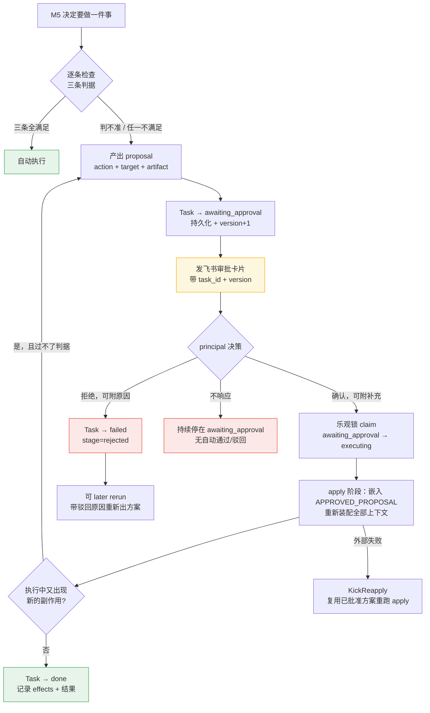

## 审批策略：让 Agent 知道什么时候该停下来问人

M5 决定了「要做一件事」，并不等于这件事就立刻发生。主动式 Agent 最大的风险不是它判断错——判断错了可以重跑；而是它在没人盯着的时候，把一条发出去就收不回的消息、一个 push 到主干的提交、一次取消掉的会议，悄无声息地做完了。所以 Jarvis 在「决策」和「执行」之间插了一道闸门：**审批策略**。

这道闸门不是写死在代码里的 `if action_type == "send_message" then approve`。它是一份 Agent 在运行时读到的、可由 principal 在后台直接编辑的 Markdown 策略文档（`conf/prompts/m5-approval-policy.md`，登记为 `m5_approval_policy`），在每次 execute、apply、以及 Session 恢复时通过 `BEGIN_APPROVAL_POLICY ... END_APPROVAL_POLICY` 块注入提示词。**判定权交给模型，判定标准交给人。**

### 三条判据：按后果分级，不按动作名分类

审批策略的开篇写得很硬：

> 要不要先请示我，取决于这个动作造成什么后果，不取决于它属于哪一类动作——包括改代码；不要按 `action_type` 分流。

同一个动作可能落在闸门两边：新建一份只有自己能看到的文档直接做，把它分享进群就要审批；在本地分支改代码直接做，push 主干、提 MR、merge 就要审批。看后果，不看动作叫什么名字。

具体判据是三条同时成立才放行：

1. **无人被触达**：除 principal 之外，没有人会因为它收到消息、看到内容或被要求做事。
2. **不动共享状态**：不改变别人正在依赖的东西——主干代码、已发出的消息和文档、日历、工单、线上配置和数据。
3. **可自行撤销**：出了问题 Agent 自己能回退，回退后不留下别人已经看到的痕迹。

三条里任何一条不满足，Agent 就必须停下来，产出一份 `proposal`（动作、作用对象、完整产物），把 Task 状态从 `executing` 切到 `awaiting_approval`，然后发审批卡片。一个计划里只要有一步不满足，整个计划先审批。**判不准的，一律按需要审批处理**——这是和 M3 高召回率一致的不对称设计：多问一次的代价远小于漏问一次。

这套判据把操作自然地分成了几个层级：

| 层级 | 情形 | 处理方式 |
|------|------|----------|
| **自动执行** | 三条判据全部满足的只读调查、本地分析、仅自己可见的草稿、本地分支、给 principal 本人发私聊、写 Jarvis 自己的内部账本（投递线索、追加共享记忆、定时触发、`yield-until`） | Agent 直接做完，不打断人 |
| **意图豁免（自动执行）** | 群里主动 @Jarvis 交办的活、principal 明确指定位置要求回复的消息、CR 里 @ 了 principal 的 review | 直接做完。豁免的是「把这件事做完」本身，不包含顺手向别的人或群扩散 |
| **审批后执行** | 对外发消息/评论/邮件/通知；修改、删除、覆盖别人依赖的文件或数据；push 主干、提 MR、merge；创建/修改/取消会议、任务、日历；分享或发布文档；触发有外部副作用的命令、接口或工作流 | 停下出 proposal，发卡片等人拍板 |
| **高风险从严** | 删除、对外通信、生产环境变更这类不可逆操作 | 同样走审批卡片，但 proposal 必须包含完整文案或完整变更内容（artifact 截断到 1200 字，完整内容进任务详情），principal 在卡片上看到的就是将要发生的事，确认按钮还会再弹一次「确认执行？」 |

值得注意的是，「意图豁免」是策略里明确列出的例外条款，而不是一个模糊的「用户主动发起所以宽松」。@Jarvis 的请求之所以可以直接做，是因为 principal 已经在那个会话里用 at 这个动作表达了明确意图——但豁免边界被刻意收窄：「不包含顺手向别的人或群扩散」。也就是说，Agent 不能因为「是你让我处理这个群的消息」就顺便把结论发到另一个群。

### 审批的载体：一张会回到同一会话的飞书卡片

审批不是一封邮件、不是一条待办、不是一个要登录后台才能点的链接。它是一张直接发到 principal 飞书私聊的消息卡片，由 `internal/cardapproval/notifier.go` 构造。卡片长这样：

- 橙色标题「需要你拍板：{任务标题}」，副标题是任务编号；
- 正文分块展示「要做的事」「作用对象」「待执行内容」，以及 Agent 给出的「判断」（为什么它认为该这么做）；
- 三个按钮横排：**确认**（主色，带二次确认弹窗）、**拒绝**（红色危险态）、**查看详情**（打开任务详情页）；
- 如果 Agent 在 proposal 里标记了 `needs_followup`（执行前还需要 principal 补充点什么），卡片会变成一个表单：多一个输入框，principal 可以填补充说明或驳回原因，再点确认或拒绝。

卡片上每一次回调都带 `task_id` 和 **version**（乐观锁版本号），并做了三重校验：

1. **操作者鉴权**：只有卡片配置的 principal open_id 能点，群里其他人点了直接拒绝；
2. **动作鉴权**：只接受 `approve` / `reject`，且必须是按钮点击；
3. **版本绑定**：卡片是为某个 Task 的某个 version 创建的，如果 Task 在这期间被 rerun、被别处改过，版本对不上就通过乐观锁失败，提示「这条审批已经处理过了」，而不会让一张旧卡片错误地落地一个新方案。

卡片发送本身也带幂等键 `jarvis-approval-{taskID}-v{version}`，保证通知重发不会产生重复卡片。

### 批准之后：恢复上下文，而不是从头再来

点「确认」之后发生的事，是整个设计里最容易被忽略但最关键的部分。

`KickApprove` 同步地把 Task 从 `awaiting_approval` 原子地 claim 成 `executing`（带乐观锁），然后在后台 goroutine 里跑 apply 阶段。apply 不是重新理解任务、重新调查、重新做方案——它把已经批准的 proposal（action、target、完整 artifact）原样嵌进一条新的提示词 `APPROVED_PROPOSAL=...`，告诉 Codex「这份方案已经获批，忠实落地，不要再改主意」。

虽然因为 `codex exec --ephemeral` 的限制，apply 阶段不能直接 resume 最初那次执行的 Session（它是一次新的 Codex 调用），但所有上下文都被重新装配齐全：M3 冻结的世界快照、历史 run 摘要、共享记忆、工作规则、技能目录、当前世界状态、以及 principal 在卡片表单里填的补充说明（作为高优先级 `ExecutionSupplement` 注入，标记来源「委托人」，可修正或替换上游线索）。所以 Agent 不会失忆，只是「拿着签字的方案去执行」。

如果 principal 在确认前填了补充说明，Handler 会先调 `Supplement` 把补充追加到 Task 上（version 因此 +1），再用新版本号调 `KickApprove`——补充和批准是一个原子的用户动作，但在存储上是两步，顺序保证补充一定进了 apply 的提示词。

apply 阶段本身仍然带着同一份审批策略运行。这是刻意的：**落地一个已批准的方案，过程中可能冒出第二个需要审批的副作用**。比如 principal 批准了「把这篇总结发到群里」，Agent 落地时发现需要先把文档分享给群里某个没有权限的人——这第二个动作同样过三条判据，不满足就再次把 Task 停在 `awaiting_approval`，发第二张卡片。`routeRun` 的注释把这个设计意图写得很清楚：如果 apply 不能再次停车，批准按钮就可能对一个悄悄变形的方案生效。

如果 apply 阶段因为外部原因失败了（网络抖动、接口报错），principal 不需要重新审批一遍：`KickReapply` 会从 run 历史里恢复**上一次已批准的 proposal**，直接重跑 apply，不重启初始执行、不重新要审批。如果根本没有已批准的 proposal（Task 从没经过审批），它会快速失败，提示应该用 rerun。

### 拒绝、超时与异常

**拒绝**不是把 Task 删掉，而是把它标记为 `failed`，`execution_result.stage = "rejected"`，并记下驳回原因。UI 上显示的是「你驳回了这个方案」而不是「Codex 执行失败」——这两种失败的语义完全不同。被驳回的 Task 可以 later rerun，让 Agent 带着驳回原因重新调查、产出一份新的 proposal。

**超时**在 Jarvis 里不存在自动动作。Task 停在 `awaiting_approval` 就是停在那里，没有「24 小时未响应自动通过」或「自动驳回」。这是一个明确的安全选择：审批闸门的默认态是「不动」，而不是「假装人同意了」。状态持久化在数据库里，进程重启不丢；审批卡片的发送是持久化之后的一个副作用，卡片丢了有定时对账（reconciliation）作为恢复路径，可以重新通知，但 Task 的真相永远以存储为准，不以卡片是否送达为准。代码里 `notifyAwaitingApproval` 的注释写得很直白：「Persistence is the truth; notification is a subsequent side effect. There is deliberately no polling or alternate send path.」

异常情况也有兜底：

- **重复点击 / 旧卡片点击**：乐观锁 + version 校验，第二次点击返回「这条审批已经处理过了」，不会重复执行；
- **批准时发现 Task 已经被改过**：`ErrVersionConflict` 直接报错，不落地；
- **apply 阶段进程崩溃**：stale sweep 会把卡在 `executing` 超过阈值的僵尸 Task 找出来标记失败，不会让一个「正在批准中」的 Task 永远挂着；
- **通知发送失败**：不影响 Task 状态，principal 仍可在后台任务列表里看到待审批项并操作。

### 策略可配置：改一个文件就改了 Agent 的行为边界

审批策略不是代码里的常量。它是 `textstore` 登记的一个可编辑文档，后台管理界面可以直接改，保存后下一次执行就生效。工作规则（`workrule`，按 M3/M5 阶段分文件）也是一样的机制。这意味着 principal 可以：

- 随场景调整：比如在一次大型活动期间把「对外发消息」临时收紧到必须逐条审批，活动结束后放松；
- 按自己的风险偏好演化：用了一段时间发现「申请会议权限自动执行」这条总让自己不放心，可以删掉这条豁免，它就回到需要审批的范畴；
- 让策略和团队约定同步：代码 review 流程变了，改一下 CR 相关的豁免条款即可，不需要发版。

策略文档和系统提示词、工作规则是三个独立的可编辑块，运行时由 `prompttemplate.Render` 拼成最终提示词。这种分离不是形式主义——系统提示词定义「你是谁」，工作规则定义「你怎么干活」，审批策略定义「你做到哪一步必须停下来问我」，三者可以各自演化、各自审计。

### 整体流程

### 这道闸门的设计哲学

审批策略的本质，是在「自动化效率」和「可控性」之间划一条可演化的线。它有几个刻意的取舍：

**判定权在模型，判据在人。** 代码不维护「哪些动作要审批」的列表——那种列表永远滞后于真实世界。模型理解「把文档分享进群」和「新建私有草稿」的区别，比任何正则规则都准；但模型的判断必须锚定在一份人写的、可读的、可改的策略上，而不是它自己的直觉。

**默认态是不动。** 判不准就审批，审批不响应就停着，拒绝就是拒绝。系统没有任何一条路径会在人没明确点头的情况下让一个外部副作用发生。这让「把事情交给 Agent」变得可托付——你知道它最坏的情况是卡住等你，而不是自作主张。

**审批是会话的一部分，不是流程的中断。** 卡片回到同一个飞书会话，批准后回到同一个 Task 的同一条上下文链路，补充说明直接注入后续提示词。人不需要理解 Agent 的内部状态，只需要看卡片上「要做的事、作用对象、待执行内容」，拍板，然后 Agent 接着干。审批没有把人机协作切成两半，它是协作里一个自然的停顿。
